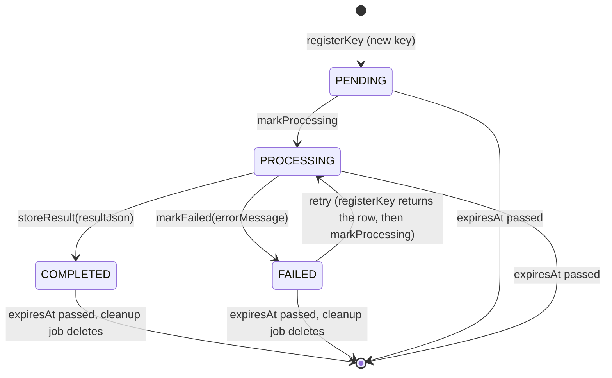

# Upload Idempotency — wpmanager

#doc #explanation #ref-wpmanager #architecture #persistence

**Project:** `wpmanager/` · **Stack:** Spring Boot 3.4.1, Java 21 · **Index:** [[Docs/wpmanager/wpmanager-Index]]

## Summary

Uploads are de-duplicated by content. The controller uses the file's SHA-256 checksum as the **idempotency
key**; `IdempotentUploadService` wraps the real upload in a small state machine kept by `IdempotencyManager`:
a key is registered as `PENDING`, marked `PROCESSING`, and ends `COMPLETED` (with the serialized result) or
`FAILED` (with the error message). A repeat request for a completed key gets the stored result back without
touching storage; a repeat while the first is still running gets HTTP 409. Keys live in the
`idempotency_key` table for 24 hours, with an in-memory map in front of it for keys that are in flight, and an
hourly job deletes expired keys.

## Why It Is Built This Way

The vault note that introduced it names two problems: a client retrying after a network timeout uploads the
same version twice, and two concurrent requests race
(`wpmanager/wpManagerDocs/Docs/Upload Idempotency System.md:32-95`,
`wpmanager/wpManagerDocs/Bugs/done/Implement Idempotency for Upload Operations.md`). A content-based key was
chosen so clients need no coordination ("Transparent", "Deterministic")
(`wpmanager/wpManagerDocs/Docs/Upload Idempotency System.md:440-462`). The map in front of the table is meant
as a fast path for active uploads; the table is meant to survive restarts and to protect against races across
instances through its unique index (`wpmanager/wpManagerDocs/Docs/Upload Idempotency System.md:464-494`).

## How It Works

### State machine



`UploadStatus` has exactly these four values
(`wpmanager/src/main/java/com/wpmanager/shared/idempotency/UploadStatus.java:3-8`). The guards:

| Call | Allowed from | Rejected with |
|---|---|---|
| `registerKey` on an existing key | `COMPLETED`, `FAILED` (returns the row) | `PROCESSING` or `PENDING` → `DuplicateUploadException` (`wpmanager/src/main/java/com/wpmanager/shared/idempotency/IdempotencyManager.java:116-161`) |
| `markProcessing` | `PENDING`, `FAILED` | `COMPLETED`, `PROCESSING` → `IllegalStateException` (`wpmanager/src/main/java/com/wpmanager/shared/idempotency/IdempotencyManager.java:178-221`) |
| `storeResult` | `PROCESSING` | anything else → `IllegalStateException` (`wpmanager/src/main/java/com/wpmanager/shared/idempotency/IdempotencyManager.java:294-362`) |
| `markFailed` | `PROCESSING` | anything else → `IllegalStateException`; empty message → `IllegalArgumentException` (`wpmanager/src/main/java/com/wpmanager/shared/idempotency/IdempotencyManager.java:380-433`) |

Each of these methods is its own `@Transactional` unit; the controller that calls the wrapper is not
transactional, so each state change commits on its own.

### The wrapper

```java
// wpmanager/src/main/java/com/wpmanager/shared/idempotency/IdempotentUploadService.java:79-115 (comments and blank lines trimmed)
Optional<DownloadableDTO> cached = idempotencyManager.getResult(idempotencyKey);
if (cached.isPresent()) {
    logger.info("Returning cached result for idempotency key: {}", idempotencyKey);
    return cached.get();
}
logger.debug("Registering new idempotency key: {}", idempotencyKey);
IdempotencyKeyEntity keyEntity = idempotencyManager.registerKey(
    idempotencyKey,
    entityType,
    entityId
);
try {
    idempotencyManager.markProcessing(idempotencyKey);
    logger.info("Processing upload for key: {}", idempotencyKey);
    DownloadableDTO result = uploadOperation.get();
    idempotencyManager.storeResult(idempotencyKey, result);
    logger.info("Upload completed successfully for key: {}", idempotencyKey);
    return result;
} catch (Exception e) {
    String msg = "Upload failed for key: " + idempotencyKey + ", error: " + e.getMessage();
    logger.error(msg);
    idempotencyManager.markFailed(idempotencyKey, e.getMessage());
    if (e.getCause() instanceof InvalidInsertDetails)
        throw new InvalidInsertDetails(msg);
    throw new IllegalStateException("Something goes wrong processing key: " + idempotencyKey); // Re-throw to preserve exception type
}
```

The upload is passed as a `ThrowingSupplier<DownloadableDTO>`, a `Supplier` whose `get()` may throw checked
exceptions (`wpmanager/src/main/java/com/wpmanager/shared/functional/ThrowingSupplier.java:12-21`), so the
lambda `() -> service.upload(form)` can throw `InvalidInsertDetails` and `FailUpload` directly. The error path
tests `e.getCause()`, not `e` itself: a directly thrown `InvalidInsertDetails` has no cause, so it leaves as
`IllegalStateException`, which `GlobalExceptionHandler` maps to 500
(`wpmanager/src/main/java/com/wpmanager/exceptions/GlobalExceptionHandler.java:107-120`).

### Key derivation

The key is the SHA-256 of the uploaded bytes, computed in the controller
(`wpmanager/src/main/java/com/wpmanager/models/downloads/plugin/PluginController.java:53-54`). The target
plugin id and version are stored on the row as `entityType`/`entityId`
(`wpmanager/src/main/java/com/wpmanager/shared/idempotency/IdempotencyManager.java:76-84`) but are not part of the
key, and `getResult` does not compare them (`wpmanager/src/main/java/com/wpmanager/shared/idempotency/IdempotencyManager.java:454-502`).

### Hybrid cache: when each store is consulted

| Operation | In-memory `activeUploads` | Database |
|---|---|---|
| `getResult` (fast path) | not used | read |
| `registerKey` | read first; written for new keys and for PENDING/PROCESSING rows found in the DB | read, then insert |
| `markProcessing` | written | read and update |
| `storeResult`, `markFailed` | entry removed | read and update |
| `IdempotencyKeyCleanup` | entry removed for each expired DB key | expired rows deleted |

Source: `wpmanager/src/main/java/com/wpmanager/shared/idempotency/IdempotencyManager.java:24`,
`wpmanager/src/main/java/com/wpmanager/shared/idempotency/IdempotencyManager.java:51-94`. The map is a
`ConcurrentHashMap` field of a singleton, so it is per JVM.

### Result replay

On `storeResult` the `DownloadableDTO` is serialized with the Boot-managed `ObjectMapper` into the
`result_json` TEXT column; `getResult` deserializes it for `COMPLETED` keys and returns empty for anything else
or on a parse error (`wpmanager/src/main/java/com/wpmanager/shared/idempotency/IdempotencyManager.java:335-361`,
`wpmanager/src/main/java/com/wpmanager/shared/idempotency/IdempotencyManager.java:486-501`).

### Table, TTL and cleanup

The entity has a unique index on `key_value` and an index on `expires_at`
(`wpmanager/src/main/java/com/wpmanager/shared/idempotency/IdempotencyKeyEntity.java:12-16`). `expiresAt` is
set to now + 24 h at registration (`wpmanager/src/main/java/com/wpmanager/shared/idempotency/IdempotencyManager.java:83`)
and not refreshed on later transitions. `IdempotencyKeyCleanup` runs with `fixedDelay = 3600000` (hourly,
first run at start-up), loads expired keys, removes them from the map, and bulk-deletes them in one transaction
(`wpmanager/src/main/java/com/wpmanager/schedule/IdempotencyKeyCleanup.java:50-77`).

### `DuplicateUploadException` contract

A runtime exception carrying the key and the blocking status
(`wpmanager/src/main/java/com/wpmanager/exceptions/DuplicateUploadException.java:6-18`), mapped to 409 with the
standard `ErrorHTTPRes` body (`wpmanager/src/main/java/com/wpmanager/exceptions/GlobalExceptionHandler.java:92-105`).
Clients see only the message; the status and key fields are not serialized into the response.

## Key Components

| Component | Path | Responsibility |
|---|---|---|
| Wrapper | `wpmanager/src/main/java/com/wpmanager/shared/idempotency/IdempotentUploadService.java` | Orchestrates check → register → process → store/fail |
| State keeper | `wpmanager/src/main/java/com/wpmanager/shared/idempotency/IdempotencyManager.java` | Transitions, cache, result (de)serialization |
| Record | `wpmanager/src/main/java/com/wpmanager/shared/idempotency/IdempotencyKeyEntity.java` | Key, status, result, error, TTL |
| Statuses | `wpmanager/src/main/java/com/wpmanager/shared/idempotency/UploadStatus.java` | PENDING, PROCESSING, COMPLETED, FAILED |
| Cleanup job | `wpmanager/src/main/java/com/wpmanager/schedule/IdempotencyKeyCleanup.java` | Hourly expiry |
| Checked supplier | `wpmanager/src/main/java/com/wpmanager/shared/functional/ThrowingSupplier.java` | Lets the lambda throw checked exceptions |

## Conventions and Rules

- Wrap every upload endpoint; pass the entity type string (`"plugin"`, `"theme"`) and the parent id.
- Do not call `IdempotencyManager` transitions directly from feature code; the wrapper owns the sequence.
- A `FAILED` key may be retried with the same file; a `COMPLETED` key replays its result for 24 hours.

## How to Replicate

1. Create `UploadStatus`, `IdempotencyKeyEntity` (unique key index, expiry index, `result_json` TEXT) and
   `IdempotencyKeyRepository` with the expiry query and `@Modifying` delete.
2. Create `IdempotencyManager` with `registerKey`, `markProcessing`, `storeResult`, `markFailed`, `getResult`
   and the transition guards in the table above.
3. Create `ThrowingSupplier<T>` and `IdempotentUploadService.uploadWithIdempotency(key, type, id, supplier)`.
4. Create `DuplicateUploadException` and map it to 409.
5. Add a `@Scheduled` cleanup job.
6. Derive the key from the request's identity, not only the file; see the review's target pattern.

## Known Limitations

- Every failure inside the upload becomes 500
  ([[Docs/wpmanager/Reviews/04-Idempotency-Review#WP-R04-01|WP-R04-01]]).
- The key ignores the target plugin and version
  ([[Docs/wpmanager/Reviews/04-Idempotency-Review#WP-R04-02|WP-R04-02]]).
- A crash while in flight blocks retries for a day
  ([[Docs/wpmanager/Reviews/04-Idempotency-Review#WP-R04-03|WP-R04-03]]); single-node assumptions
  ([[Docs/wpmanager/Reviews/04-Idempotency-Review#WP-R04-04|WP-R04-04]]).

## Related Documents

- [[Docs/wpmanager/Explanations/07-Upload-Pipeline]]
- [[Docs/wpmanager/Reviews/04-Idempotency-Review]]
- [[Docs/wpmanager/Explanations/11-Error-Handling]]
