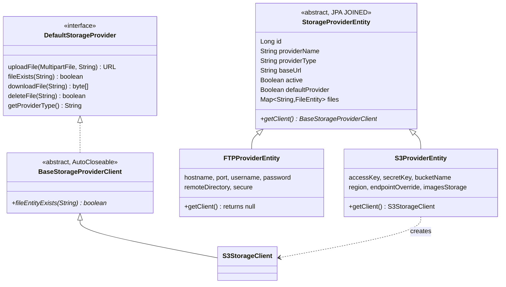
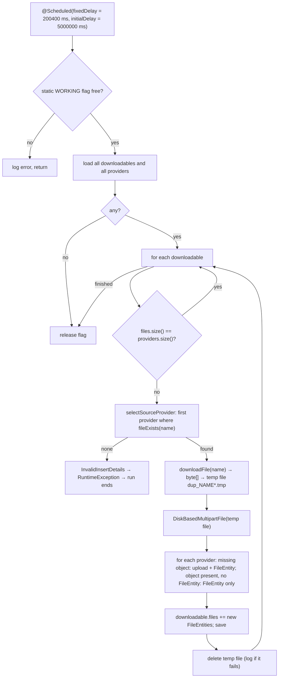

# Storage Providers and Replication — wpmanager

#doc #explanation #ref-wpmanager #architecture

**Project:** `wpmanager/` · **Stack:** Spring Boot 3.4.1, Java 21 · **Index:** [[Docs/wpmanager/wpmanager-Index]]

## Summary

Storage is modeled as a JPA entity hierarchy whose rows are **storage providers** (an S3-compatible bucket,
or an FTP server) and whose abstract `getClient()` returns an adapter for that provider. One provider is the
**default provider**: uploads go to it synchronously. A scheduled job, `FileDuplicator`, then copies every
version to every other provider (**replication**) by downloading it from a provider that has it, writing it
to a temporary file, and uploading it where it is missing. The only working adapter is `S3StorageClient`,
which uses the AWS SDK v2 and reaches Wasabi and other S3-compatible services through `endpointOverride`. The
FTP provider is an entity whose `getClient()` returns `null`.

## Why It Is Built This Way

The vault explains the multi-provider strategy as redundancy across S3-compatible services, with a single
synchronous upload target to keep request latency bounded and asynchronous copies for the rest
(`wpmanager/wpManagerDocs/Docs/File Upload Process.md:90-122`,
`wpmanager/wpManagerDocs/Docs/File Upload Process.md:486-500`). `BaseStorageProviderClient`'s Javadoc states
the adapter intent: "Concrete implementations, such as FTPProviderService or S3ProviderService, should extend
this class" (`wpmanager/src/main/java/com/wpmanager/models/storage/storageProvider/BaseStorageProviderClient.java:8-19`).
The class `FileDuplicator` explains why it streams through disk: "When the files are large, keeping the entire
content in memory can be problematic" (`wpmanager/src/main/java/com/wpmanager/schedule/FileDuplicator.java:27-33`).

## How It Works

### Provider hierarchy and the `getClient()` seam

Sources: `wpmanager/src/main/java/com/wpmanager/models/storage/storageProvider/StorageProviderEntity.java:21-67`,
`wpmanager/src/main/java/com/wpmanager/models/storage/s3/S3ProviderEntity.java:27-70`,
`wpmanager/src/main/java/com/wpmanager/models/storage/ftp/FTPProviderEntity.java:28-76`,
`wpmanager/src/main/java/com/wpmanager/models/storage/storageProvider/DefaultStorageProvider.java:9-52`,
`wpmanager/src/main/java/com/wpmanager/models/storage/storageProvider/BaseStorageProviderClient.java:19-87`.
Every call to `getClient()` builds a new client, and with it a new SDK `S3Client`
(`wpmanager/src/main/java/com/wpmanager/models/storage/s3/S3StorageClient.java:39-43`). Callers close it in
`deleteRequest` and `FileDuplicator.getURL` (try-with-resources) and do not close it elsewhere.

### Default provider selection

`S3ProviderService.insert` makes the first provider ever created the default (and the image store); a later
provider submitted with `defaultProvider = true` takes the flag from all current defaults
(`wpmanager/src/main/java/com/wpmanager/models/storage/s3/S3ProviderService.java:42-62`). The upload manager
picks `findFirstByDefaultProviderTrue()`
(`wpmanager/src/main/java/com/wpmanager/models/storage/storageProviderManager/StorageProviderManager.java:90-99`).
The provider's `baseUrl` is set to its `endpointOverride` on insert
(`wpmanager/src/main/java/com/wpmanager/models/storage/s3/S3ProviderService.java:43`).

### `S3StorageClient` operations

| Operation | SDK call | Notes |
|---|---|---|
| construct | `S3Client.builder().credentialsProvider(static).region(...).endpointOverride(...)` | `endpointOverride` is how Wasabi works (`wpmanager/src/main/java/com/wpmanager/models/storage/s3/S3StorageClient.java:45-61`) |
| `uploadFile(file, name)` | `putObject` with `RequestBody.fromInputStream(..., size)` | key = name; returns `endpoint/name` or the AWS virtual-host URL (`wpmanager/src/main/java/com/wpmanager/models/storage/s3/S3StorageClient.java:63-84`, `wpmanager/src/main/java/com/wpmanager/models/storage/s3/S3StorageClient.java:157-172`) |
| `fileExists(name)` | `headObject` | `NoSuchKeyException` → false; any other error → false (`wpmanager/src/main/java/com/wpmanager/models/storage/s3/S3StorageClient.java:86-102`) |
| `downloadFile(name)` | `getObjectAsBytes` | whole object in a `byte[]`; key recovered by parsing `baseUrl + "/" + name` as a URL (`wpmanager/src/main/java/com/wpmanager/models/storage/s3/S3StorageClient.java:104-123`) |
| `deleteFile(name)` | `deleteObject` | same URL-parsing key; errors → false (`wpmanager/src/main/java/com/wpmanager/models/storage/s3/S3StorageClient.java:125-144`) |
| `fileEntityExists(signature)` | none | looks in the entity's `files` map (`wpmanager/src/main/java/com/wpmanager/models/storage/s3/S3StorageClient.java:146-149`) |

Before `uploadFile`, `fileExists`, `downloadFile` and URL construction, `validateConfiguration()` checks the
four required fields and calls `headBucket`; an `S3Exception` becomes `IllegalStateException("Bucket does not
exist or is not accessible")` (`wpmanager/src/main/java/com/wpmanager/models/storage/s3/S3StorageClient.java:180-194`).
No retry, timeout or HTTP client settings are configured, so the SDK defaults apply.

### Replication (`FileDuplicator`)

Sources: `wpmanager/src/main/java/com/wpmanager/schedule/FileDuplicator.java:41-219`. The schedule means the first
run happens about 83 minutes after start-up and later runs start about 3 minutes 20 seconds after the previous
one ends. The static `AtomicBoolean` prevents overlapping runs in one JVM
(`wpmanager/src/main/java/com/wpmanager/schedule/FileDuplicator.java:41`,
`wpmanager/src/main/java/com/wpmanager/schedule/FileDuplicator.java:53-56`). `DiskBasedMultipartFile` adapts a
`java.io.File` to Spring's `MultipartFile` so the same `uploadFile` method serves both request uploads and
replication (`wpmanager/src/main/java/com/wpmanager/shared/tools/DiskBasedMultipartFile.java:11-82`). The job is not
transactional; each `save` commits on its own.

### Deletion across providers

`StorageProviderManager.deleteAllFilesFromDownloadable` removes the file rows through `FileService` and then
asks every provider to delete the object if it exists, logging (not throwing) per-provider failures
(`wpmanager/src/main/java/com/wpmanager/models/storage/storageProviderManager/StorageProviderManager.java:161-220`).

### Debug controller

`S3FileUploadController` at `/tests3` uploads to, deletes from and downloads from the first S3 provider, and
checks whether a downloadable's object exists in a given provider
(`wpmanager/src/main/java/com/wpmanager/models/storage/s3/S3FileUploadController.java:26-161`). It has no
authorization annotation.

## Key Components

| Component | Path | Responsibility |
|---|---|---|
| Provider root | `wpmanager/src/main/java/com/wpmanager/models/storage/storageProvider/StorageProviderEntity.java` | Config + client factory |
| Client contract | `wpmanager/src/main/java/com/wpmanager/models/storage/storageProvider/DefaultStorageProvider.java` | Upload, exists, download, delete |
| S3 adapter | `wpmanager/src/main/java/com/wpmanager/models/storage/s3/S3StorageClient.java` | AWS SDK v2 calls |
| Provider admin | `wpmanager/src/main/java/com/wpmanager/models/storage/s3/S3ProviderService.java` | Create provider, default flag |
| Upload manager | `wpmanager/src/main/java/com/wpmanager/models/storage/storageProviderManager/StorageProviderManager.java` | Upload/compensate/delete across providers |
| Replication job | `wpmanager/src/main/java/com/wpmanager/schedule/FileDuplicator.java` | Copy versions to every provider |
| Disk multipart | `wpmanager/src/main/java/com/wpmanager/shared/tools/DiskBasedMultipartFile.java` | `File` as `MultipartFile` |

## Conventions and Rules

- A new provider type is a `StorageProviderEntity` subclass plus a `BaseStorageProviderClient` subclass
  returned from `getClient()`.
- Object keys are version names (`<parent>_<version>`), identical in every provider.
- Only one provider carries `defaultProvider = true`; `S3ProviderService.insert` maintains it.
- Callers that obtain a client should close it (`BaseStorageProviderClient` is `AutoCloseable`).

## How to Replicate

1. Create `DefaultStorageProvider`, `BaseStorageProviderClient` (implements it and `AutoCloseable`) and the
   abstract `StorageProviderEntity` with `getClient()`.
2. Create `S3ProviderEntity` and `S3StorageClient` with the SDK calls above, `endpointOverride` support and
   `close()`.
3. Create `S3ProviderService.insert` with the default-provider rule.
4. Create `StorageProviderManager` with upload-to-default, compensation and delete-everywhere.
5. Create `DiskBasedMultipartFile` and a `@Scheduled` replication job; enable scheduling on the application
   class.

## Known Limitations

- Clients are created per call and mostly not closed
  ([[Docs/wpmanager/Reviews/05-Storage-Integration-Review#WP-R05-01|WP-R05-01]]).
- One unreplicable version stops every replication run
  ([[Docs/wpmanager/Reviews/05-Storage-Integration-Review#WP-R05-02|WP-R05-02]]).
- `headBucket` per call, whole-object buffering, the entity-hosted seam with a `null` FTP adapter, and
  scheduling issues ([[Docs/wpmanager/Reviews/05-Storage-Integration-Review]], WP-R05-03 to WP-R05-07).
- `/tests3/*` is anonymous ([[Docs/wpmanager/Reviews/01-Security-Review#WP-R01-02|WP-R01-02]]); provider
  secrets are returned by `/s3` ([[Docs/wpmanager/Reviews/01-Security-Review#WP-R01-04|WP-R01-04]]).

## Related Documents

- [[Docs/wpmanager/Explanations/07-Upload-Pipeline]]
- [[Docs/wpmanager/Explanations/05-Domain-Model-and-Persistence]]
- [[Docs/wpmanager/Reviews/05-Storage-Integration-Review]]
