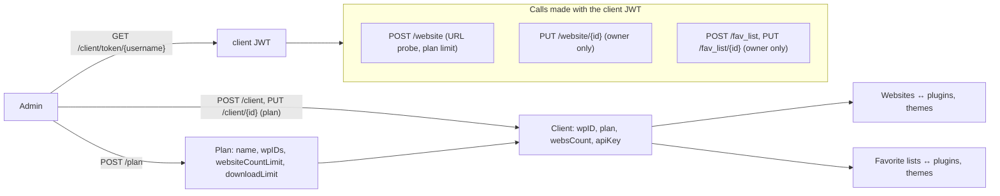

# Customer Domain — wpmanager

#doc #explanation #ref-wpmanager #architecture

**Project:** `wpmanager/` · **Stack:** Spring Boot 3.4.1, Java 21 · **Index:** [[Docs/wpmanager/wpmanager-Index]]

## Summary

The `hq` area models who consumes the catalog. A **client** is a user with a WordPress account id (`wpID`), an
optional **plan**, a set of **websites** and named **favorite lists** of plugins and themes. A plan lists the
WordPress product ids (`wpIDs`) it grants and caps the number of websites and downloads. Admins create
clients and plans; clients create their own websites and favorite lists, and the services scope those two to
the calling client. No endpoint yet lets a client download a file or checks a plan's `wpIDs` or download limit.

## Why It Is Built This Way

The shape follows a subscription model: the plan is the unit of entitlement (`wpIDs`, website and download
limits) and the client is the account holder. `wpID` values are unique across plans, so one product id
belongs to at most one plan (`wpmanager/src/main/java/com/wpmanager/models/hq/plan/PlanService.java:55-62`).
Website insert probes the URL, which suggests that later features were meant to talk to the site (the entity
has `connected`, `pendingUpdates`, auto-update flags), but no such feature exists
(`wpmanager/src/main/java/com/wpmanager/models/hq/website/WebsiteEntity.java:36-61`).

## How It Works

### Clients

- Admin-only insert validates names, e-mail, `wpID` and username, checks uniqueness of username, e-mail and
  `wpID`, sets role `CLIENT` and a derived password
  (`wpmanager/src/main/java/com/wpmanager/models/hq/client/ClientService.java:62-117`).
- Admin-only update changes e-mail, username, `wpID`, names and plan, and recomputes the password if the
  e-mail or `wpID` changed (`wpmanager/src/main/java/com/wpmanager/models/hq/client/ClientService.java:119-239`).
  The plan change keeps both sides of the plan ↔ clients relation in sync and rejects a "client already in new
  plan" state as a misconfiguration.
- `getOne` initialises the plan's `wpIDs` before mapping
  (`wpmanager/src/main/java/com/wpmanager/models/hq/client/ClientService.java:49-60`).
- `apiKey`, `apiRateLimit` and `websCount` are columns that no code sets
  (`wpmanager/src/main/java/com/wpmanager/models/hq/client/ClientEntity.java:28-35`).

### Plans

Admin-only insert requires a name and at least one `wpID`, and rejects names or ids already used; update
diffs the `wpIDs` set; delete refuses plans that still have clients
(`wpmanager/src/main/java/com/wpmanager/models/hq/plan/PlanService.java:32-136`).

### Websites and URL probing

A client adds a website by sending a bare domain. `WebsiteService.insert`:

1. loads the calling client through `AuthUserUtil` and requires a plan whose `websiteCountLimit` is above the
   client's current website count (`wpmanager/src/main/java/com/wpmanager/models/hq/website/WebsiteService.java:55-69`);
2. calls `URLValidator.validate(domain)` (`wpmanager/src/main/java/com/wpmanager/models/hq/website/WebsiteService.java:70-74`);
3. rejects existing URL, name or domain, fills defaults, saves, and adds the website to the client
   (`wpmanager/src/main/java/com/wpmanager/models/hq/website/WebsiteService.java:75-110`).

`URLValidator` accepts only a domain-shaped string (no scheme, letters-only TLD), then sends `HEAD
https://<domain>` with 5-second timeouts and redirects followed. A valid certificate returns
`https://<domain>`; a handshake failure returns `https://<domain>-` (with a trailing hyphen); a refused
connection or timeout falls back to `HEAD http://<domain>`; anything else is invalid
(`wpmanager/src/main/java/com/wpmanager/shared/tools/URLValidator.java:18-146`). The website's
`sslCertificate` flag is set when the returned string contains `https`
(`wpmanager/src/main/java/com/wpmanager/models/hq/website/WebsiteService.java:79`).

`WebsiteMapper.toEntity` fills `url` from the form's `name`, which the service has just set to the raw domain
(`wpmanager/src/main/java/com/wpmanager/models/hq/website/WebsiteMapper.java:85-89`,
`wpmanager/src/main/java/com/wpmanager/models/hq/website/WebsiteService.java:80-81`). The update only renames the
website, after an ownership check (`wpmanager/src/main/java/com/wpmanager/models/hq/website/WebsiteService.java:113-144`).

### Favorite lists

Insert rejects a list name the caller already uses (case-insensitive) and attaches the list to the caller
through the `client_favorite_list` join table. Update accepts `pluginsToAppend`, `pluginsToRemove`,
`themesToAppend`, `themesToRemove`, fails if any id does not exist, and recomputes `count`
(`wpmanager/src/main/java/com/wpmanager/models/hq/favoriteList/FavoriteListService.java:64-196`).
`ClientEntity` also has `favoritePlugins` and `favoriteThemes` collections that no service uses
(`wpmanager/src/main/java/com/wpmanager/models/hq/client/ClientEntity.java:48-56`).

### Ownership rules

| Resource | Insert | Update | Get / list / delete |
|---|---|---|---|
| Client | ADMIN | ADMIN | inherited: any authenticated user |
| Plan | ADMIN | ADMIN | read: any authenticated user; delete: ADMIN |
| Website | calling client (plan limit) | owner only | inherited: any authenticated user, any website |
| Favorite list | calling client | owner only | inherited: any authenticated user, any list |

## Key Components

| Component | Path | Responsibility |
|---|---|---|
| Client service | `wpmanager/src/main/java/com/wpmanager/models/hq/client/ClientService.java` | Client lifecycle, plan changes, token minting |
| Plan service | `wpmanager/src/main/java/com/wpmanager/models/hq/plan/PlanService.java` | Plans and `wpIDs` |
| Website service | `wpmanager/src/main/java/com/wpmanager/models/hq/website/WebsiteService.java` | Client websites, plan limit |
| Favorite lists | `wpmanager/src/main/java/com/wpmanager/models/hq/favoriteList/FavoriteListService.java` | Client lists |
| URL probe | `wpmanager/src/main/java/com/wpmanager/shared/tools/URLValidator.java` | Domain check and reachability |
| Caller lookup | `wpmanager/src/main/java/com/wpmanager/shared/tools/AuthUserUtil.java` | Current client |

## Conventions and Rules

- Client-owned resources take the owner from `AuthUserUtil`, never from the request body (the form's `client`
  field is ignored on website insert).
- Both sides of client ↔ plan and client ↔ website are updated in the service.
- Entitlement limits are checked in the service that creates the limited resource.

## How to Replicate

1. Create `PlanEntity` with an `@ElementCollection` of product ids and limit columns, and `PlanService` with
   uniqueness of names and ids.
2. Create `ClientEntity extends BaseUserEntity` with the product id and a `@ManyToOne` plan.
3. For every client-owned resource, resolve the caller with `AuthUserUtil` in `insert` and `update`, and
   override `getOne`, `getAll` and `delete` with the same ownership check (wpmanager does not).
4. Validate external URLs through a dedicated component, with timeouts, before storing them.

## Known Limitations

- Inherited reads and deletes skip ownership
  ([[Docs/wpmanager/Reviews/01-Security-Review#WP-R01-03|WP-R01-03]]); URL probing is an SSRF surface
  ([[Docs/wpmanager/Reviews/01-Security-Review#WP-R01-12|WP-R01-12]]).
- Website URL handling issues ([[Docs/wpmanager/Reviews/07-Service-Design-Review#WP-R07-09|WP-R07-09]]) and
  mapper bugs ([[Docs/wpmanager/Reviews/07-Service-Design-Review#WP-R07-07|WP-R07-07]]).
- Null-pointer paths in client code ([[Docs/wpmanager/Reviews/07-Service-Design-Review#WP-R07-08|WP-R07-08]]).
- Favorites modeled as one-to-many ([[Docs/wpmanager/Reviews/06-Domain-Model-and-Persistence-Review#WP-R06-06|WP-R06-06]])
  and unused API fields ([[Docs/wpmanager/Reviews/06-Domain-Model-and-Persistence-Review#WP-R06-08|WP-R06-08]]).

## Related Documents

- [[Docs/wpmanager/Explanations/06-Authentication-and-Authorization]]
- [[Docs/wpmanager/Explanations/05-Domain-Model-and-Persistence]]
- [[Docs/wpmanager/Reviews/07-Service-Design-Review]]
