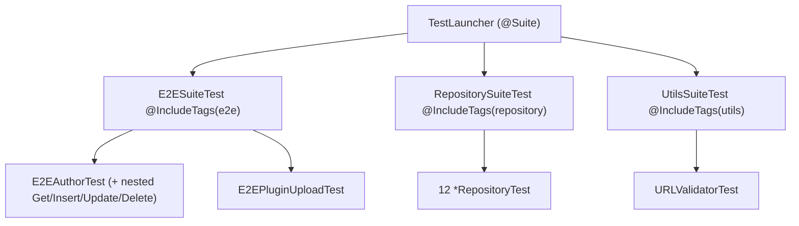

# Testing Strategy — wpmanager

#doc #explanation #ref-wpmanager #testing

**Project:** `wpmanager/` · **Stack:** Spring Boot 3.4.1, Java 21 · **Index:** [[Docs/wpmanager/wpmanager-Index]]

## Summary

wpmanager has 16 test classes with about 250 test executions in three layers: twelve `@DataJpaTest`
repository test classes on H2, two full-context MockMvc "E2E" classes that authenticate with real JWTs, and one
utility test that probes real websites over the network. Tests are grouped by JUnit tags (`repository`,
`e2e`, `utils`) and run through a suite launcher. The deepest coverage is the author module (68 E2E tests,
including authorization); the upload, idempotency, storage and replication code has no test that exercises
it. There are no unit tests with mocks.

## Why It Is Built This Way

The tag suites let the authors run one layer at a time (`wpmanager/test.sh:1`,
`wpmanager/src/test/java/com/wpmanager/suites/RepositorySuiteTest.java:5-11`). The E2E tests mint real tokens
through the application's own `JwtTokenService` instead of `@WithMockUser`, so the JWT filter and method
security run exactly as in production
(`wpmanager/src/test/java/com/wpmanager/testUtils/TestAuthenticationHelper.java:79-88`). The repository tests
document the entity relations (cascades, join tables, derived queries) one module at a time.

## How It Works

### Inventory

| Layer | Classes | Tests (latest report) | Tag | Example |
|---|---|---|---|---|
| Repository (`@DataJpaTest`, H2) | 12 | 142 | `repository` | `wpmanager/src/test/java/com/wpmanager/models/plugin/PluginRepositoryTest.java:23-25` |
| Full context + MockMvc | 2 | 68 (author) + 2 (upload, not in the report) | `e2e` | `wpmanager/src/test/java/com/wpmanager/models/author/E2EAuthorTest.java:32-37` |
| Utility, real network | 1 | 36 executions | `utils` | `wpmanager/src/test/java/com/wpmanager/utils/URLValidatorTest.java:20-40` |
| Context smoke test | 1 | 1 (not in any suite) | none | `wpmanager/src/test/java/com/wpmanager/WpmanagerApplicationTests.java:6-13` |

Repository test classes: author, client, downloadable, favoriteList, file, plan, plugin, pluginCategory,
s3, theme, themeCategory, website (`wpmanager/src/test/java/com/wpmanager/models`).

### Tags and suites

Each suite selects the whole `com.wpmanager` package, excludes the `suites` package and class names matching
`.*Suite*`, and filters by tag (`wpmanager/src/test/java/com/wpmanager/suites/E2ESuiteTest.java:5-11`). Surefire
excludes `*SuiteTest.java` from the default run (`wpmanager/pom.xml:173-175`). E2E nested classes carry extra
tags (`Get`, `Insert`, `Update`, `Delete`) for finer selection
(`wpmanager/src/test/java/com/wpmanager/models/author/E2EAuthorTest.java:115-118`).

### `TestAuthenticationHelper`

A test-source `@Component` that persists one admin and one client through the `EntityManager` and mints a
`Bearer` token for each with the production `JwtTokenService`
(`wpmanager/src/test/java/com/wpmanager/testUtils/TestAuthenticationHelper.java:18-92`). E2E tests call
`initializeMockUsers()` and send `authH.getAdminToken()` or `getClientToken()` in the `Authorization` header,
and also call endpoints with no header. The author suite checks 401 for anonymous calls and 403 for a CLIENT
token on admin operations (`wpmanager/src/test/java/com/wpmanager/models/author/E2EAuthorTest.java:120-132`,
`wpmanager/src/test/java/com/wpmanager/models/author/E2EAuthorTest.java:382-401`). `E2EAuthorTest` is
`@Transactional`, so each test rolls back.

### H2 test profile

`@ActiveProfiles("test")` loads `application-test.properties`: H2 in MySQL mode, `create-drop`, fixed secrets
(`wpmanager/src/main/resources/application-test.properties:4-25`). The file lives in `src/main`, not `src/test`.

### `E2EPluginUploadTest`

Despite its name, the test saves two S3 provider rows (with real cloud credentials, `<redacted>`) and a demo
plugin, then asserts that two providers exist; it never calls `/plugin/upload` or any storage API
(`wpmanager/src/test/java/com/wpmanager/models/plugin/E2EPluginUploadTest.java:53-170`). Two ZIP fixtures exist
but no test reads them (`wpmanager/src/test/resources/test-files`).

### `URLValidatorTest`

Constructs `URLValidator` directly and calls real domains (for example `wikipedia.org`, `google.com`) and
third-party sites chosen for their certificate state
(`wpmanager/src/test/java/com/wpmanager/utils/URLValidatorTest.java:28-40`,
`wpmanager/src/test/java/com/wpmanager/utils/URLValidatorTest.java:146-155`). Results depend on the network and
on those sites' current configuration.

### Latest recorded run

`wpmanager/target/surefire-reports` holds reports dated 2025-10-29: all repository, author E2E and URL
validator tests passed with no failures or errors. There is no report for `E2EPluginUploadTest` or
`WpmanagerApplicationTests`, so neither ran in the recorded launch. The reports were not regenerated for this
analysis.

## Key Components

| Component | Path | Responsibility |
|---|---|---|
| Suite launcher | `wpmanager/src/test/java/com/wpmanager/TestLauncher.java` | Runs all three suites |
| Tag suites | `wpmanager/src/test/java/com/wpmanager/suites` | Select tests by tag |
| Token helper | `wpmanager/src/test/java/com/wpmanager/testUtils/TestAuthenticationHelper.java` | Seed users, mint real JWTs |
| Author E2E | `wpmanager/src/test/java/com/wpmanager/models/author/E2EAuthorTest.java` | CRUD + authorization through HTTP |
| Repository tests | `wpmanager/src/test/java/com/wpmanager/models` | Mappings and derived queries |
| Test fixtures | `wpmanager/src/test/resources/test-files` | Two plugin ZIPs |

## Conventions and Rules

- One tag per test class: `repository`, `e2e` or `utils`; nested classes may add operation tags.
- E2E tests go through MockMvc with a real `Authorization: Bearer` header from `TestAuthenticationHelper`.
- Repository tests are `@DataJpaTest` + `@ActiveProfiles("test")`.
- Arrange/Act/Assert comments structure each test.

## How to Replicate

1. Add `junit-platform-suite-engine`; create `TestLauncher` and one `<Layer>SuiteTest` per tag.
2. Create `TestAuthenticationHelper` that persists users and mints tokens with the production token service.
3. For each module write a `@DataJpaTest` class and an E2E class with nested `Get/Insert/Update/Delete`
   classes, each covering anonymous (401), wrong role (403) and allowed calls.
4. Put the test profile in `src/test/resources`.
5. Add service-level tests with mocked storage for upload, idempotency and replication (wpmanager has none).

## Known Limitations

- Authorization is tested for the author module only
  ([[Docs/wpmanager/Reviews/10-Testing-Review#WP-R10-01|WP-R10-01]]).
- Upload, idempotency, storage and replication are untested
  ([[Docs/wpmanager/Reviews/10-Testing-Review#WP-R10-02|WP-R10-02]]).
- No unit tests ([[Docs/wpmanager/Reviews/10-Testing-Review#WP-R10-03|WP-R10-03]]), network-dependent tests
  ([[Docs/wpmanager/Reviews/10-Testing-Review#WP-R10-04|WP-R10-04]]), a MySQL-bound smoke test
  ([[Docs/wpmanager/Reviews/10-Testing-Review#WP-R10-05|WP-R10-05]]).

## Related Documents

- [[Docs/wpmanager/Reviews/10-Testing-Review]]
- [[Docs/wpmanager/Explanations/02-Build-Tooling-and-Dependencies]]
- [[Docs/backend/Explanations/10-Testing-Strategy]]
