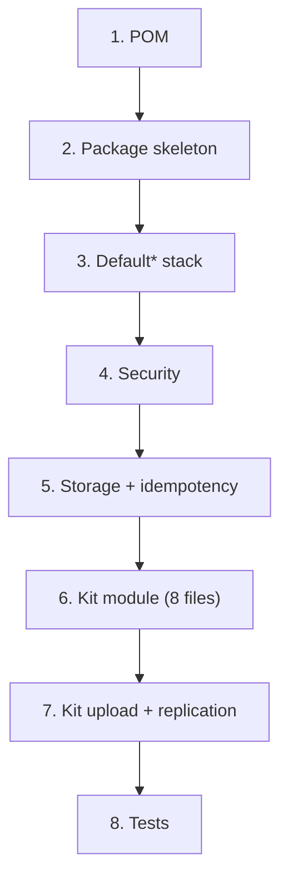

# Recipe: Build a Project This Way — wpmanager

#doc #explanation #ref-wpmanager #architecture

**Project:** `wpmanager/` · **Stack:** Spring Boot 3.4.1, Java 21 · **Index:** [[Docs/wpmanager/wpmanager-Index]]

## Summary

This recipe rebuilds the wpmanager architecture from scratch and then adds a **new downloadable type** — a
"kit" (a bundle sold like a plugin) — end to end: the eight-file module, the upload endpoint, idempotency,
storage and replication, and tests. It follows the project as written so the patterns are recognisable, and
flags with `⚠️ Review` every step that copies a pattern the reviews found harmful, with the better
alternative. The one idea: every piece you add plugs into the generic CRUD stack and the shared upload
machinery; nothing is built from zero per type.

## Why It Is Built This Way

The recipe mirrors how the code is organised: generic infrastructure in `shared/`, security in
`configuration/`, storage in `models/storage/`, and one package per entity
([[Docs/wpmanager/Explanations/03-Package-Structure-and-Module-Anatomy]]). The "kit" example is not invented
from nothing: the downloadable delete check already accepts a `"kit"` parent type
(`wpmanager/src/main/java/com/wpmanager/models/files/downloadable/DownloadableService.java:46`).

## How It Works



### 1. POM essentials

Only what the code uses (compare `wpmanager/pom.xml:34-163`):

```xml
<parent>
  <groupId>org.springframework.boot</groupId>
  <artifactId>spring-boot-starter-parent</artifactId>
  <version>3.4.1</version>
</parent>
<properties><java.version>21</java.version></properties>
<dependencies>
  <!-- web, data-jpa, security, validation starters; mysql-connector-j (runtime); lombok (optional) -->
  <!-- io.jsonwebtoken: jjwt-api 0.12.5; jjwt-impl + jjwt-jackson (runtime) -->
  <!-- software.amazon.awssdk:s3 (prefer importing software.amazon.awssdk:bom) -->
  <!-- test: spring-boot-starter-test, spring-security-test, h2, junit-platform-suite-engine -->
</dependencies>
```

> ⚠️ Review: do not copy the batch, JDBC, web-services, webflux, websocket or Data REST starters
> ([[Docs/wpmanager/Reviews/09-Build-Dependencies-and-Configuration-Review#WP-R09-01|WP-R09-01]],
> [[Docs/wpmanager/Reviews/01-Security-Review#WP-R01-05|WP-R01-05]]).

### 2. Package skeleton

```text
com.example.repo
├── configuration/{security, filter, bootstrap}
├── constant/ApplicationConstants.java
├── exceptions/                      (domain exceptions + GlobalExceptionHandler)
├── models/
│   ├── downloads/<type>/            (catalog: plugin, theme, kit, author, categories)
│   ├── files/{downloadable, file}   (versions and stored copies)
│   ├── hq/{admin, client, plan, website, favoriteList}
│   └── storage/{storageProvider, s3, storageProviderManager}
├── schedule/                        (replication, idempotency cleanup)
└── shared/{defaultImplements, defaultInterfaces, idempotency, functional, models/baseUser, securityUser, tools}
```

### 3. The Default* stack

Create the four generic types exactly as in [[Docs/wpmanager/Explanations/04-Generic-CRUD-Framework]]
(`wpmanager/src/main/java/com/wpmanager/shared/defaultImplements/DefaultServiceImplements.java:16-73`).

> ⚠️ Review: make `update` abstract or mapper-driven instead of the no-op, and default the base methods to
> `hasRole('ADMIN')` rather than `isAuthenticated()`
> ([[Docs/wpmanager/Reviews/02-CRUD-Framework-and-API-Design-Review#WP-R02-01|WP-R02-01]],
> [[Docs/wpmanager/Reviews/01-Security-Review#WP-R01-03|WP-R01-03]]).

### 4. Security wiring

Copy `SecurityConfig`, `SecurityController`, `JwtTokenService`, `JWTTokenValidatorFilter`, `SecurityUser`,
`SecurityUserServiceImpl` and `AuthUserUtil` ([[Docs/wpmanager/Explanations/06-Authentication-and-Authorization]]).

> ⚠️ Review: wpmanager has **no URL-level authorization** and enables method security from three services. Put
> `@EnableMethodSecurity` on `SecurityConfig` and add `authorizeHttpRequests(...)` ending in
> `anyRequest().authenticated()` ([[Docs/wpmanager/Reviews/01-Security-Review#WP-R01-01|WP-R01-01]],
> [[Docs/wpmanager/Reviews/01-Security-Review#WP-R01-11|WP-R01-11]]). Do not add a JWT secret fallback
> ([[Docs/wpmanager/Reviews/01-Security-Review#WP-R01-07|WP-R01-07]]).

### 5. Storage and idempotency

Copy `models/storage/**`, `schedule/FileDuplicator`, `shared/tools/{ChecksumUtils, FileSigner, UploadValidator,
DiskBasedMultipartFile}` and `shared/idempotency/**` with `ThrowingSupplier`
([[Docs/wpmanager/Explanations/09-Storage-Providers-and-Replication]],
[[Docs/wpmanager/Explanations/08-Upload-Idempotency]]).

> ⚠️ Review: `getClient()` builds a new `S3Client` per call and most callers never close it. Cache one client
> per provider in a Spring bean ([[Docs/wpmanager/Reviews/05-Storage-Integration-Review#WP-R05-01|WP-R05-01]]).
> Do not copy the `/tests3` controller ([[Docs/wpmanager/Reviews/01-Security-Review#WP-R01-02|WP-R01-02]]).

### 6. A new downloadable type: the kit module (eight files)

`models/downloads/kit/KitEntity.java` — modeled on `PluginEntity`
(`wpmanager/src/main/java/com/wpmanager/models/downloads/plugin/PluginEntity.java:15-87`):

```java
@Table(name = "kit") @Entity
@Getter @Setter @Builder @NoArgsConstructor @AllArgsConstructor
public class KitEntity {
    @Id @GeneratedValue(strategy = GenerationType.IDENTITY) private Long id;
    @Column(name = "name", unique = true) private String name;
    @Column(name = "description") private String description;
    @Column(name = "created") private Date created;
    @Column(name = "last_update") private Date lastUpdate;
    @ManyToOne @JoinColumn(name = "author_id") private AuthorEntity author;
    @OneToMany @JoinColumn(name = "kit_id") private Set<DownloadableEntity> downloadables;
    @Override public boolean equals(Object o) { return o instanceof KitEntity k && Objects.equals(id, k.id); }
    @Override public int hashCode() { return Objects.hash(id); }
}
```

`KitRepository.java`:

```java
public interface KitRepository extends DefaultRepository<KitEntity, Long> {
    Optional<KitEntity> findByName(String name);
}
```

`KitForm.java`, `KitDTO.java`, `KitMiniDTO.java` — Lombok `@Data @Builder` classes: the form carries `name`,
`description`, `author` (id); the DTO adds `id`, dates, `AuthorMiniDTO author` and
`Set<DownloadableMiniDTO> downloadables`; the mini DTO is flat.

`KitMapper.java`:

```java
@Component
public class KitMapper implements DefaultMapper<KitDTO, KitMiniDTO, KitForm, KitEntity> {
    private final AuthorMapper authorMapper;
    private final DownloadableMapper downloadableMapper;
    @Lazy
    public KitMapper(AuthorMapper authorMapper, DownloadableMapper downloadableMapper) { … }
    public KitDTO toDTO(KitEntity e) { … downloadables mapped with downloadableMapper::toSmallDTO … }
    public KitMiniDTO toSmallDTO(KitEntity e) { … }
    public KitEntity toEntity(KitForm f) { return KitEntity.builder().name(f.getName()).description(f.getDescription()).build(); }
}
```

`KitService.java`:

```java
@Service
public class KitService extends DefaultServiceImplements<KitDTO, KitMiniDTO, KitForm, KitEntity, Long> {
    @Override @PreAuthorize("hasRole('ADMIN')")
    public KitMiniDTO insert(KitForm form) throws ItemNotFoundException, ItemAlreadyExist, InvalidInsertDetails {
        // null checks, uniqueness by name, link author on both sides, set dates, save
    }
    @Override @PreAuthorize("hasRole('ADMIN')")
    public KitDTO update(Long id, KitForm form) throws ItemNotFoundException, InvalidInsertDetails { … }
    @Override @PreAuthorize("hasRole('ADMIN')")
    public KitDTO delete(Long id) throws ItemNotFoundException, InvalidDeleteOperation { … }
}
```

`KitController.java`:

```java
@RestController
@RequestMapping("/kit")
public class KitController extends DefaultController<KitDTO, KitMiniDTO, KitForm, Long> {
    private final KitService service;
    private final IdempotentUploadService idempotentUploadService;
    private final ChecksumUtils checksumUtils;
    public KitController(KitService s, IdempotentUploadService i, ChecksumUtils c) { super(s); … }
}
```

> ⚠️ Review: this is the third copy of the plugin module. Prefer one product abstraction (a `ProductEntity`
> hierarchy or a `type` column) with one upload service
> ([[Docs/wpmanager/Reviews/07-Service-Design-Review#WP-R07-03|WP-R07-03]]). In `delete`, iterate over a copy of
> `downloadables` ([[Docs/wpmanager/Reviews/07-Service-Design-Review#WP-R07-02|WP-R07-02]]), and add the `"kit"`
> branch to `DownloadableService.deleteDownloadable`.

### 7. Upload endpoint, idempotency, storage and replication

Controller method, as in `wpmanager/src/main/java/com/wpmanager/models/downloads/plugin/PluginController.java:45-73`:

```java
@PostMapping("/upload")
@PreAuthorize("hasRole('ADMIN')")
public ResponseEntity<DownloadableDTO> upload(@RequestParam MultipartFile file,
                                              @RequestParam String version,
                                              @RequestParam Long kit) throws InvalidInsertDetails, ItemNotFoundException {
    String key = checksumUtils.calculateChecksum(file);
    KitUploadForm form = KitUploadForm.builder().file(file).version(version).kit(kit).build();
    return ResponseEntity.ok(idempotentUploadService.uploadWithIdempotency(key, "kit", kit, () -> service.upload(form)));
}
```

> ⚠️ Review: the checksum alone is not a safe key — the same ZIP for another kit or version replays the old
> result. Include type, parent id and version in the key
> ([[Docs/wpmanager/Reviews/04-Idempotency-Review#WP-R04-02|WP-R04-02]]), and fix the wrapper so validation
> errors keep their status ([[Docs/wpmanager/Reviews/04-Idempotency-Review#WP-R04-01|WP-R04-01]]).

Service method, following `PluginService.upload`
(`wpmanager/src/main/java/com/wpmanager/models/downloads/plugin/PluginService.java:158-207`) — **save the version
before calling the manager**, which is the step `ThemeService` misses:

```java
@PreAuthorize("hasRole('ADMIN')")
public DownloadableDTO upload(KitUploadForm form) throws InvalidInsertDetails, FailUpload {
    // null checks; uploadValidator.validateUpload(file); checksum; load kit
    // name = kit.getName() + "_" + version; reject if downloadableRepository.findByNameAndVersion(...) exists
    // signature = fileSigner.sign(checksum + name)
    DownloadableEntity saved = downloadableRepository.save(DownloadableEntity.builder()…build());
    DownloadableEntity withFile = storageProviderManager.uploadFileToDefaultProvider(saved.getId(), form.getFile());
    kit.getDownloadables().add(withFile);
    kitRepository.save(kit);
    return downloadableMapper.toDTO(withFile);
}
```

> ⚠️ Review: wpmanager puts `@Transactional(rollbackFor = InvalidInsertDetails.class)` on this method, which
> holds a database connection during the network upload and commits a file-less version when the provider
> fails. Upload outside any transaction, then persist in a short `TransactionTemplate` that rolls back on every
> exception, compensating on failure
> ([[Docs/wpmanager/Reviews/03-Upload-Transactions-and-Consistency-Review#WP-R03-01|WP-R03-01]],
> [[Docs/wpmanager/Reviews/03-Upload-Transactions-and-Consistency-Review#WP-R03-02|WP-R03-02]]).

Replication needs no kit-specific code: `FileDuplicator` iterates every `DownloadableEntity`, whatever its
parent (`wpmanager/src/main/java/com/wpmanager/schedule/FileDuplicator.java:59-72`).

> ⚠️ Review: make replication skip versions with no source copy instead of aborting the run
> ([[Docs/wpmanager/Reviews/05-Storage-Integration-Review#WP-R05-02|WP-R05-02]]).

### 8. Tests per layer

- `models/kit/KitRepositoryTest` — `@DataJpaTest @ActiveProfiles("test") @Tag("repository")`, as
  `wpmanager/src/test/java/com/wpmanager/models/plugin/PluginRepositoryTest.java:23-25`.
- `models/kit/E2EKitTest` — `@SpringBootTest @AutoConfigureMockMvc @ActiveProfiles("test") @Transactional
  @Tag("e2e")`, nested `Get/Insert/Update/Delete/Upload` classes, each with anonymous (401), CLIENT (403) and
  ADMIN cases using `TestAuthenticationHelper`, as `wpmanager/src/test/java/com/wpmanager/models/author/E2EAuthorTest.java:32-37`.
- Upload tests against an S3 emulator (MinIO via Testcontainers); never real credentials
  ([[Docs/wpmanager/Reviews/10-Testing-Review#WP-R10-02|WP-R10-02]],
  [[Docs/wpmanager/Reviews/01-Security-Review#WP-R01-06|WP-R01-06]]).

## Key Components

| Component | Path | Responsibility |
|---|---|---|
| Module template | `wpmanager/src/main/java/com/wpmanager/models/downloads/plugin` | The eight files plus upload form |
| Upload machinery | `wpmanager/src/main/java/com/wpmanager/shared/idempotency`, `wpmanager/src/main/java/com/wpmanager/models/storage/storageProviderManager` | Idempotent upload to the default provider |
| Replication | `wpmanager/src/main/java/com/wpmanager/schedule/FileDuplicator.java` | Copies every version to every provider |
| Test templates | `wpmanager/src/test/java/com/wpmanager/models/author/E2EAuthorTest.java`, `wpmanager/src/test/java/com/wpmanager/testUtils/TestAuthenticationHelper.java` | E2E with real tokens |

## Conventions and Rules

- A new downloadable type = one eight-file module + an upload form + an upload endpoint through
  `IdempotentUploadService` + a `@OneToMany @JoinColumn(name = "<type>_id")` to `DownloadableEntity`.
- Always save the version row before calling `StorageProviderManager`.
- Add the type's name to the downloadable delete switch.
- Every service override carries its own `@PreAuthorize`.

## How to Replicate

1. Steps 1–5 once per project.
2. Steps 6–8 once per downloadable type.
3. Apply every `⚠️ Review` alternative; they are the difference between copying wpmanager and improving on it.

## Known Limitations

- The recipe inherits the generic stack's limits
  ([[Docs/wpmanager/Reviews/02-CRUD-Framework-and-API-Design-Review#WP-R02-06|WP-R02-06]]) and, unless the review
  alternatives are applied, the upload, idempotency and storage issues listed in
  [[Docs/wpmanager/Reviews/00-Review-Summary]].

## Related Documents

- [[Docs/wpmanager/wpmanager-Index]]
- [[Docs/wpmanager/Explanations/07-Upload-Pipeline]]
- [[Docs/wpmanager/Reviews/00-Review-Summary]]
- [[Docs/backend/Explanations/11-Recipe-Build-a-Project-This-Way]]
- [[Docs/BugTracker/Explanations/14-Recipe-Build-a-Project-This-Way]]
