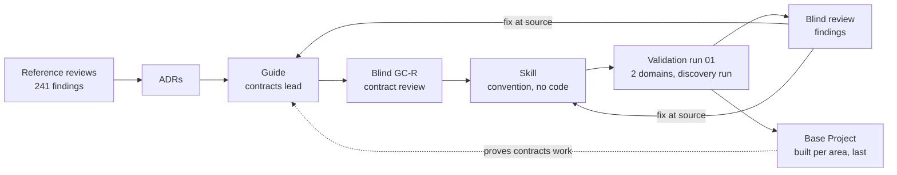
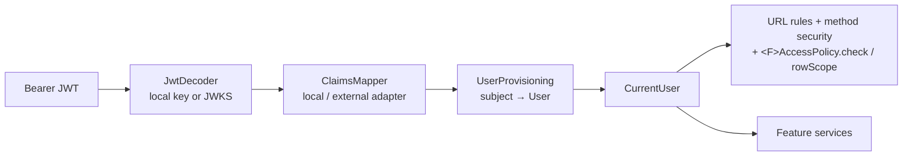

#high #new-feature

## Feature: Spring Boot Architecture Guide, Base Project and Skill

### Description

This Feature is the action plan that turns the Phase 1 analysis of the three **Reference Projects**
(`backend/`, `BugTracker/`, `wpmanager/`) into three deliverables, and proves them in a feedback loop:

1. **The Guide** — a version-agnostic architecture and design guide for future Spring Boot REST APIs, in
   `documentation/Docs/Guide/`. It keeps the recognisable shape of the reference projects (Feature Modules,
   a Generic CRUD Stack, a whitelist query engine, stateless JWT, an object-storage abstraction, idempotent
   uploads) but removes every design and implementation defect found in the 241 review findings. It defines
   *how the system is designed and how its modules talk to each other*, not full code.
2. **The Base Project** — a tested reference implementation (`base-project/`) of the shared **Platform
   Modules**: identity and access, errors, the CRUD base, the query engine, object storage, idempotency,
   configuration and architecture rules. It is built from the Guide and proves the convention is implementable
   and sound. It stays in the workspace: it is never shipped with the Skill and never a copy source.
3. **The Skill** — a rewritten `spring-boot-backend` skill (`spring-boot-skill/`): a project-agnostic
   convention expressed as pure markdown — rules, module **contracts** (interfaces, invariants, error modes)
   and pseudo-code snippets only. It ships no code artifacts and no Spring app, and project initialization is
   not its job. New projects implement the contracts fresh and look up current framework documentation for
   exact API syntax at execution time.

Then a **Validation Loop** uses the Skill to generate projects for two small domains the user defines, builds
and runs them, has them critiqued by a blind reviewer with the same method used on the reference projects,
and feeds every finding back into the Guide → Base Project → Skill until a strict exit gate is met.

This Feature supersedes the unfinished parts of [[Features/to-do/Spring-Boot-Skill-Creation]] (Task 4 and
Phases 2–3) and the skill design in [[Features/to-do/Agent-Project-Onboarding-First-Instructions]] and
[[Docs/Skill-Architecture]]. Those documents are left untouched until Step 6.4.

## Problem Statement

The user wants a repeatable way to start Spring Boot backends that are well designed from day one. The three
projects they built so far share one design that evolved over three generations (the **Lineage**
BugTracker → wpmanager → `backend/`). The shape of that design is good — predictable Feature Modules, cheap
CRUD, a strong query engine — but the implementation carried the same defects forward: no enforced
authorization in any of the three, a generic `update` that silently does nothing in all three, checked
exceptions, `ddl-auto=update` without migrations, ordinal roles, EAGER graphs, and almost no tests
([[Docs/backend/Reviews/00-Review-Summary]], [[Docs/BugTracker/Reviews/00-Review-Summary]],
[[Docs/wpmanager/Reviews/00-Review-Summary]]). Rated by area, the design sits near 6.5/10 and the
implementation near 3.5/10.

Copying any one project, or even the consensus of the three, would copy those defects, because consistency
across a lineage is not evidence of correctness. The user needs:

- one written, reviewable convention that says what to keep, what to change and why;
- a reference implementation where the risky shared design is worked out and tested once;
- a skill that applies the convention reliably;
- evidence — not opinion — that the convention produces good projects.

The user also knows two things will change: login will likely move from self-issued JWTs to an external
identity provider (Clerk or WorkOS), and file storage must work with S3-compatible services, other external
stores and a local filesystem. The design must absorb both without rewriting business code.

## User Stories

1. As the project owner, I want a single guide that states how every future Spring Boot backend is designed, so that I stop re-deciding architecture per project.
2. As the project owner, I want each guide rule to cite the reference finding or ADR that justifies it, so that I can see why a rule exists and challenge it with evidence.
3. As the project owner, I want the guide to keep the familiar shape of my projects, so that new projects feel like my previous ones.
4. As the project owner, I want the guide to depart from my projects wherever they were wrong, so that I do not inherit their defects.
5. As the project owner, I want every departure from the reference projects to be explicit, so that I know what is new and why.
6. As the project owner, I want the guide to be version-agnostic with a stated support floor — the
   currently OSS-supported Spring Boot generation, plus Java 21+ — so that it stays valid across Spring
   Boot upgrades and never endorses an end-of-support line.
7. As the project owner, I want version-specific details isolated in version notes, each marked as
   verified or unverified against a named line, so that an upgrade changes notes, not rules, and so that no
   note is presented as authoritative evidence that nothing tests.
8. As the project owner, I want each architectural decision recorded once as an ADR, so that guide documents link to decisions instead of re-arguing them.
9. As a backend developer, I want a clear package layout (`platform` vs `features`), so that I always know where new code goes.
10. As a backend developer, I want dependency rules between modules enforced by tests, so that the layout cannot silently erode.
11. As a backend developer, I want every Feature Module to have the same small set of files, so that features are cheap to add and easy to read.
12. As a backend developer, I want a generic CRUD base whose `update` really updates, so that I never ship the no-op update again.
13. As a backend developer, I want explicit service hooks (validate, apply relations, beforeDelete) plus one
    declared access policy, so that features customise behavior without overriding whole CRUD methods.
14. As a backend developer, I want to opt a feature out of the CRUD base, so that unusual features are not forced into a shape that does not fit.
15. As a backend developer, I want three DTO shapes (Request, Response, Summary) generated with MapStruct, so that mappers cannot silently skip fields.
16. As a backend developer, I want one unchecked domain exception hierarchy mapped to RFC 9457 `ProblemDetail`, so that errors are consistent and transactions roll back by default.
17. As an API consumer, I want correct status codes (`201` + `Location` on create, `204` on delete, `404`,
   `409`, `412`, `422`, `428`), so that I can rely on HTTP semantics.
18. As an API consumer, I want the same error shape for validation, domain, authentication and authorization errors, so that I parse errors one way.
19. As an API consumer, I want `GET /resources?page&size&sort` for simple listing, so that lists are cacheable and bookmarkable.
20. As an API consumer, I want `POST /resources/search` with rich filters, so that grid UIs can filter by multiple fields and operators.
21. As a security reviewer, I want filterable and sortable fields to be whitelisted per entity, so that sensitive columns cannot be probed.
22. As a security reviewer, I want query size and complexity bounded, so that a single request cannot exhaust the database.
23. As a security reviewer, I want deny-by-default URL rules plus method security, so that an unannotated endpoint is never anonymous.
24. As a security reviewer, I want row visibility enforced at query level for every inherited operation, so that
   `get`, `list`, `search`, `update` and `delete` never touch rows the caller may not see.
25. As a security reviewer, I want a route × role authorization test matrix, so that every endpoint's 401/403/2xx behavior is proven.
26. As a security reviewer, I want no secret literal or fallback default anywhere in source, tests or committed properties, so that the reference projects' leaks are not repeated.
27. As the project owner, I want our own JWT login now, so that projects work without an external identity provider.
28. As the project owner, I want to switch to Clerk or WorkOS later by removing one module and changing configuration, so that the migration does not touch business code.
29. As a backend developer, I want business code to see only a `CurrentUser` — received as an explicit
   parameter, including `CurrentUser.system()` for scheduled and bootstrap work — so that it never depends
   on how tokens are issued and no entry point runs without naming its actor.
30. As a backend developer, I want the local user record keyed by the token subject (`externalSubject` equals
    `sub` in both modes) and its lifecycle owned by one `UserDirectory` (create, disable, rebind), with
    provisioning on first request in external mode and an admin-created account before first login in local
    mode, so that the same model works with self-issued and external tokens.
31. As a backend developer, I want an object-storage port with S3-compatible and local-filesystem adapters, so that I can develop locally and deploy to any S3-compatible store.
32. As a backend developer, I want the active storage provider chosen by configuration, so that switching provider needs no code change.
33. As a backend developer, I want an upload coordinator that stores the file outside the transaction, persists in a short transaction and deletes the file if persistence fails, so that uploads never leave orphans or half-written rows.
34. As a backend developer, I want both storage adapters verified by one contract test suite, so that I can trust them to be interchangeable.
35. As the project owner, I want multi-provider replication documented as an optional extension, so that I can add wpmanager-style redundancy when a project needs it.
36. As an API consumer, I want to retry a non-repeatable POST with an `Idempotency-Key` and get the original result, so that network retries do not duplicate work.
37. As an API consumer, I want a reused key with a different request to be rejected, so that one upload never replays another's result.
38. As a backend developer, I want idempotency opt-in per endpoint, so that I pay for it only where it matters.
39. As a backend developer, I want PostgreSQL with Flyway migrations and `ddl-auto=validate`, so that the schema evolves safely.
40. As a backend developer, I want integration tests on real PostgreSQL (Testcontainers), so that tests exercise the production engine.
41. As a backend developer, I want typed, validated configuration that fails at start-up, so that a missing secret or bad setting is caught immediately.
42. As an operator, I want health indicators for the database and the storage provider, so that I can see when a dependency fails.
43. As an AI agent using the skill, I want the platform described as contracts (interfaces, invariants, error
   modes) that I implement against current framework documentation, so that every project gets the same design
   without shipping or copying version-pinned code.
44. As an AI agent using the skill, I want instructions for adding a Feature Module that cite Guide rule IDs, so that my output is traceable to the convention.
45. As an AI agent using the skill, I want to load only the instructions for the current task, so that my context stays small.
46. As the project owner, I want the skill tested by generating real projects for two different domains, so that it is not tuned to one example.
47. As the project owner, I want generated projects critiqued by a reviewer that does not know how they were generated, so that the critique is not self-grading.
48. As the project owner, I want validation findings in the same format and severity scale as the reference reviews, so that I can compare generations numerically.
49. As the project owner, I want the loop to stop at a clear gate (builds, all tests pass, starts on PostgreSQL, 0 Critical and 0 High, twice in a row, max 5 runs), so that it neither stops early nor runs forever.
50. As the project owner, I want each validation finding traced to the Guide rule, Base Project module or Skill file that caused it, so that the fix lands in the right place (for run 01 only `guide` and `skill` apply — the Base Project is built afterwards).
51. As the project owner, I want a traceability matrix from every Critical/High reference finding **plus every
   Moderate/Low finding raised by a security review** to the Guide rule that prevents it, so that I can prove
   the old defects are covered — including the 🟡 ones the severity-only scope would skip.
52. As a future maintainer, I want the glossary updated with the new terms, so that the Guide, the Skill and the reviews use one vocabulary.
53. As an API consumer, I want a single download contract that works the same on every storage provider —
    an authorized request yields a short-lived ticket that either redirects to the store or streams through
    the app — so that no project re-decides how files are served and every download passes the same
    authorization check before any bytes leave.

## Solution

The work proceeds **contract-first**: record decisions (ADRs), write the Guide's contract layer, gate it with a
blind design review, write the Skill against the gated contracts, prove the convention with generated projects,
and only then build the Base Project per area against the converged design — finalizing each Guide document's
prose against the code that implements it. Every finding is corrected at its source.



**Decisions already made with the user** (each becomes an ADR in Step 1.3):

| # | Decision | Chosen option | Main evidence |
|---|---|---|---|
| D1 | Source of truth | The Guide; reference projects are evidence, not authority; every departure cites a finding | Lineage copies defects (34 of 88 wpmanager findings shared with `backend/`) |
| D2 | Base Project vs Skill | The Skill is a code-free convention (rules, contracts, pseudo-code); projects implement the contracts fresh against current docs. The Base Project is the workspace reference implementation that proves the convention, never a shipped artifact | Shared platform design is where the Critical findings live; shipping pinned code would teach deprecated APIs (F11) |
| D3 | Version baseline | A **support policy**, not a pin: rules version-neutral; the floor is the currently OSS-supported Spring Boot generation (4.x as of 2026-10 — every Boot 3.x line is OSS-EOL); Java 21+; the Base Project pins exactly one line (the current GA at build time, decided at Task 9 under the policy); version notes are evidence-scoped | BT-R08-01 (EOL Boot 2.7), era gaps |
| D4 | Package layout | `<root>.platform.*` + `<root>.features.<feature>`; ArchUnit-enforced dependency rules | BE-R09-07, WP-R07-05 (`shared` imports features) |
| D5 | CRUD base | Keep, deepened: 3 DTO shapes, real update, unchecked exceptions, hooks, opt-out | BE-R02-01/06/07, WP-R02-06, BT-R02-01/02 |
| D6 | Identity | Resource-server validation + `CurrentUser` seam + removable local token issuer; Clerk/WorkOS later by configuration | BE-R01-01/07/08, WP-R01-08/09 |
| D7 | User model | One `User` keyed by external subject, roles as enum strings, per-type profile data in features | BE-R03-03, BT-R01-06, WP-R06-01 |
| D8 | Multi-tenancy | Not in the Base Project; ownership checks only; tenancy is future work | User decision |
| D9 | Errors | Unchecked `DomainException` hierarchy → `ProblemDetail`; catch-all handler | BE-R05-01/03/04/06, BT-R07-01/02 |
| D10 | Database | PostgreSQL, Flyway, `ddl-auto=validate`, Testcontainers | BE-R03-04, BE-R08-05, BT-R03-09 |
| D11 | List API | `GET` paging/sorting + `POST /search` filters; one whitelist engine; own `PageResponse` | BE-R06-03/04, BE-R02-08, BT-R05-01/07 |
| D12 | Mapping | MapStruct with unmapped-target = error | BE-R04-03, WP-R07-07 |
| D13 | Storage | `ObjectStorage` port, S3-compatible + local-filesystem adapters, `UploadCoordinator`; replication optional (Guide only) | WP-R03-01/02/03, WP-R05-01/05 |
| D14 | Idempotency | `IdempotencyGuard` in the Base Project, opt-in per endpoint, client `Idempotency-Key` | WP-R04-01…05 |
| D15 | Validation loop | Two user-defined domains; strict gate; blind reviewer; max 5 runs | User decision |
| D16 | Decisions record | ADRs in `documentation/ADRs/` | User decision |
| D17 | Guide format | `Docs/Guide/`, rule IDs `G<NN>-<MM>`, validator-checked | User decision |
| D18 | Skill | Rewritten from scratch after the Guide exists and its contracts pass the blind `GC-R` gate (amended by F8/F10: the former "and Base Project exist" clause is dropped) | User decision |

### Scope

**In scope**

- ADR system initialisation and ADRs for D1–D18.
- Glossary additions for the new vocabulary.
- The Guide (conventions, 16 documents, traceability matrix) and a validator extension for it.
- The Base Project with all Platform Modules, one sample Feature Module and the agreed tests.
- The rewritten Skill.
- The Validation Loop with two user-defined domains, review documents and fixes at source.
- Final release: Base Project v1, Skill migration per [[Docs/Skill-Directory-Convention]], memory bank update,
  retirement of superseded documents (with approval).

**Out of scope**

- Multi-tenancy (D8) — the Guide names the extension point only: `RowScope` composition.
- A concrete Clerk or WorkOS integration — the Guide defines the migration path and the Base Project proves
  it with a second token-verification configuration (a fake JWKS issuer in tests).
- Building multi-provider replication — the Guide specifies it as an optional extension.
- Deployment, containers for production, CI/CD (per `documentation/Memory/brief.md`). Docker is used only as
  a test dependency (Testcontainers).
- Any change to the three reference projects (read-only inputs).

### Affected Systems / Modules

- [[Memory/brief]] — **user-owned**; its constraint "patterns must be grounded in the actual code found in the
  three projects, not invented" conflicts with D1. The user updates it (Step 1.1).
- [[Memory/known-issues]] — the rule "a pattern that only appears in one project needs stronger justification"
  is replaced by "every rule cites a finding or ADR".
- [[Memory/architecture]], [[Memory/tech]], [[Memory/context]], [[Memory/progress]] — updated at the end of
  each Task.
- `documentation/doc-config.json` — gains `"adrs": "ADRs"` and the ADR status list.
- `documentation/ADRs/` — new; `ADR-index.md` plus ADRs 0001–0018.
- [[Glossary/Glossary]] — new terms (Step 1.4).
- `documentation/Docs/Guide/` — new; the Guide.
- [[Docs/Analysis-Doc-Conventions]] — reused as the format for validation-run reviews; unchanged.
- `scripts/validate-analysis-docs.py` and `scripts/tests/` — extended with a `guide` target and a
  `validation` target.
- `base-project/` — new Spring Boot project at the repository root.
- `spring-boot-skill/` — current `skill.md` and `references/phase-0-onboarding.md` replaced (D18).
- `validation-runs/` — new, git-ignored; generated projects per run and domain. Cleaned after each run's
  review and its **evidence pack** are committed (F12).
- `documentation/Docs/Validation/` — new; review documents per run and domain, each with an `evidence/`
  subtree holding frozen copies of every cited file (F12).
- [[Docs/Skill-Architecture]], [[Features/to-do/Agent-Project-Onboarding-First-Instructions]],
  [[Features/to-do/Spring-Boot-Skill-Creation]] — superseded; retired only in Step 6.4 with approval.
- Evidence sources (read-only): [[Docs/backend/backend-Index]], [[Docs/BugTracker/BugTracker-Index]],
  [[Docs/wpmanager/wpmanager-Index]] and their review summaries.

### Impact Analysis

- **No runtime system exists yet**, so nothing breaks. The impact is on the workspace's plan and documents.
- The project brief's "grounded, not invented" rule is relaxed into "grounded or corrected, always cited".
  Without that change, D1, D5, D6, D11 and D13 contradict the brief.
- The phase-based skill design and its finished Phase 0 are discarded (D18). Useful ideas (repository-first
  reasoning, onboarding before generation, progressive disclosure) may return through the new skill's ADR, but
  nothing is carried over by default.
- The Base Project becomes a maintained artifact. Every later Guide change must also be reflected there;
  the traceability rules below keep that manageable.
- Stable finding IDs from Phase 1 become citations in the Guide, so the analysis documents must keep their
  IDs stable (they already do by convention).

### Risk Assessment

- **Drift between Guide, Base Project and Skill.** Three artifacts that describe one design will diverge.
  Mitigation: the Guide is the only place rules are stated; the Base Project cites rule IDs in class-level
  Javadoc of Platform Modules; Skill files cite rule IDs; the validator checks rule-ID references resolve.
  The F8/F10 order reduces the drift surface: the contract layer is written and gated once (Step 2.6), the
  Skill cites it, and each Guide document's prose is finalized against the built code (Step 3.7) instead of
  being written twice.
  Because the Base Project is never shipped or copied, drift degrades only its role as evidence, not the code
  generated from the Skill.
- **The CRUD base stays shallow.** wpmanager overrode 29 of 60 base methods (WP-R02-06). Mitigation: an
  explicit depth acceptance criterion measured in every validation run (override rate of `create`/`update`
  below 50% across generated features); if it fails twice, ADR-0005 is revisited.
- **Overfitting to the validation domains.** Mitigation: two different domains and a coverage checklist.
- **Self-grading bias.** Mitigation: the reviewer runs in a fresh agent context with only the generated
  project, the Guide and the review conventions — not the Skill or the generation transcript. **Reviewer
  sensitivity (F15)** is handled separately: a one-time blind calibration on `backend/`'s known Criticals
  (answer key banned from the context) proves the instrument can recognize defects, and every run's
  **rule-coverage ledger** makes absence of findings a cited, validator-checked claim rather than a silent
  pass.
- **Docker availability.** Testcontainers (PostgreSQL, MinIO) needs a Docker daemon; `backend/` already had a
  test that failed outside Docker (BE-R08-03). Mitigation: document the requirement in the Base Project README
  and fail fast with a clear message.
- **External identity providers differ.** Clerk and WorkOS put roles and organisations in different claims.
  Mitigation: a `ClaimsMapper` port with one adapter per provider; the Base Project includes the local adapter
  and a test adapter for a generic external issuer.
- **`UserDirectory.rebindSubject` is a privileged operation** — a wrong binding is account takeover or data
  grafting. Mitigation: admin-only and audited, 409 on an already-bound subject under the unique constraint,
  never auto-link on matching e-mail, and a Base Project test that rebinds a local user and asserts business
  rows and roles survive. Leftover local subjects must be rebound or explicitly retired before the module is
  deleted.
- **Local token issuer is security-sensitive code.** Mitigation: keep it minimal (login, refresh, logout),
  use framework primitives, asymmetric keys from configuration, hashed rotating refresh tokens, and test it.
- **Secrets.** The reference projects committed secrets; the owner accepted leaving those, but nothing new may
  contain a literal secret or a fallback default ([[Memory/known-issues]], "Patterns to avoid").
- **Cost of the loop.** Each run generates, builds, tests and reviews two projects. The hard cap of five runs
  bounds it.

---

## Implementation Architecture

Design rules for this section follow the `solid-deep-design` skill: every Platform Module has one
responsibility, a small interface (1–4 entry points), a seam only where at least two adapters exist
(production + test counts), and passes the deletion test. Interfaces below are design sketches in Java-like
notation, not final code.

### Changes Required

#### 1. Project brief, ADR system and glossary
**Purpose:** Remove the contradiction between the brief and D1, and give every decision a permanent,
linkable record before any guide text is written.
**Changes:**
- The user rewrites the brief's constraint to: *"Patterns are grounded in the three reference projects and
  corrected where the reviews found them wrong; every rule cites a finding ID or an ADR."*
- Add `"adrs": "ADRs"` to `documentation/doc-config.json` directories and
  `"adrs": ["proposed", "accepted", "deprecated", "superseded"]` to statuses; create
  `documentation/ADRs/ADR-index.md`.
- ADRs (Nygard format, status `accepted` once the user approves):

| ADR | Title | From |
|---|---|---|
| 0001 | Guide is the source of truth; references are evidence | D1 |
| 0002 | Platform modules are contracts the Skill states and projects implement fresh; the Base Project is the workspace reference implementation | D2 |
| 0003 | Version baseline as a support policy: floor = the currently OSS-supported Spring Boot generation; one tested line pinned at Base Project build time; evidence-scoped version notes; Java 21+ | D3 |
| 0004 | Package layout `platform` / `features` with enforced dependency rules | D4 |
| 0005 | Deepened generic CRUD base with hooks and three DTO shapes; `<F>AccessPolicy>` as the single authorization module | D5 |
| 0006 | Identity: resource-server validation, `CurrentUser` seam, removable local issuer owning `LocalCredential` and `RefreshToken` in its own migrations | D6 |
| 0007 | One `User` keyed by the token subject; roles as strings; `UserDirectory` as the single lifecycle contract with a rebindable subject binding | D7 |
| 0008 | No multi-tenancy in the Base Project | D8 |
| 0009 | Unchecked domain exceptions mapped to `ProblemDetail` | D9 |
| 0010 | PostgreSQL, Flyway and Testcontainers | D10 |
| 0011 | List API: `GET` paging + `POST /search`; own page response | D11 |
| 0012 | MapStruct mapping with unmapped-target errors | D12 |
| 0013 | Object storage port, S3-compatible and local adapters, upload coordinator | D13 |
| 0014 | Idempotency guard, opt-in per endpoint | D14 |
| 0015 | Validation loop protocol and exit gate | D15 |
| 0016 | Guide document format and rule IDs | D16, D17 |
| 0017 | Skill architecture: code-free convention, contract-first, current-docs lookup for API syntax (written in Step 4.1) | D18 |

- Glossary terms (via the `glossary` CLI, with user confirmation): **Guide**, **Guide Rule**, **Rule ID**,
  **Platform Module**, **Base Project**, **Current User**, **Token Issuer**, **Claims Mapper**,
  **Object Storage**, **Upload Coordinator**, **Idempotency Guard**, **Query Profile**, **Validation Run**,
  **Validation Domain**, **Exit Gate**. Update **Feature Module**, **Generic CRUD Stack** and **DTO Tiers** to
  the new shapes (synonyms keep the old names findable).
**Links:** [[Memory/brief]], [[Glossary/Glossary]]

#### 2. Guide format and validator
**Purpose:** Make every rule addressable and machine-checked, so the Skill, the Base Project and later
reviews can cite rules by ID.
**Changes:**
- `documentation/Docs/Guide/Guide-Conventions.md` — layout (`Guide-Index.md`, `NN-Title-Words.md`), tags
  (`#doc #guide` + area tags from [[Docs/Analysis-Doc-Conventions]]), required headings per document:
  `Purpose`, `Design`, `Rules`, `Differs From the Reference Projects`, `Version Notes`, `Related Documents`.
- `Version Notes` entries are **evidence-scoped**: each is marked `verified on <line>` (citing a Base
  Project or Validation test, a finding ID, or a **version-tagged** documentation URL) or `not verified —
  current-docs lookup at execution time`. A cross-line claim ("3.x does X, 4.x does Y") is written only
  when both sides carry a `verified` mark. Rule text stays behavioural; class and API names live only in
  Version Notes (D3/F11).
- Rule block format:

```markdown
### G06-03
**Rule:** Every filterable or sortable field is declared once in the entity's Query Profile; anything not
declared is rejected with 400.
**Why:** Unlisted fields let clients probe sensitive columns (password hashes).
**Evidence:** BT-R05-07, BE-R06-05 · ADR-0011
**Differs from references:** BugTracker had no whitelist; `backend/` repeated the field name three times.
```

- Extend `scripts/validate-analysis-docs.py` with a `guide` target: heading order, unique rule IDs,
  every rule has Rule/Why/Evidence, every cited finding ID and ADR resolves, every Guide document is listed in
  `Guide-Index.md`, every `Version Notes` entry carries a `verified` / `not verified` marker and every
  `verified` marker cites a resolvable test, finding ID or version-tagged URL (the `not verified` count is
  reported in `Guide-Index.md`). Add unit tests in `scripts/tests/`.
- The blind contract design review (Step 2.6) writes its findings in the [[Docs/Analysis-Doc-Conventions]]
  review format with finding IDs `GC-R<NN>-<MM>` (`GC` = Guide contract), kept distinct from Guide rule IDs
  `G<NN>-<MM>`. Review documents live under `documentation/Docs/Guide/Reviews/`.
**Links:** [[Docs/Analysis-Doc-Conventions]]

#### 3. The Guide documents
**Purpose:** State the design. Each document describes modules, their responsibilities, their interfaces and
how they talk to each other; code appears only as short illustrative sketches.
**Changes:** `documentation/Docs/Guide/`:

| # | Document | Content |
|---|---|---|
| 01 | Principles-and-Baseline | Deep modules + SOLID as the design rules; the version **support policy** (floor = the currently OSS-supported Spring Boot generation; one tested line pinned at Base Project build time); what "version notes" mean and their evidence-scoped markers; how rules are cited |
| 02 | Project-Layout-and-Module-Boundaries | `platform` / `features`; allowed dependencies; cross-feature communication; ArchUnit rules |
| 03 | Feature-Module-Anatomy | The fixed file set and naming; when to opt out of the CRUD base |
| 04 | CRUD-Base-and-Service-Hooks | Base controller and service contract; hooks (validate, apply relations, beforeDelete); `<F>AccessPolicy` as the single authorization module (`check` + `rowScope`, deny-by-default, no `@PreAuthorize` in features); mandatory `RowScope` and row visibility; per-entry-point transactions (no class-level `@Transactional`); conditional writes (`ETag`/`If-Match`: stale → 412, missing → 428); server-assigned ids |
| 05 | API-Contract | Resource naming, `/api/v1` prefix, status codes, `Location`, `PageResponse`, strong `ETag` / `If-Match` conditional writes (412 stale, 428 missing, `*` unconditional), download ticket semantics (302 or stream; 404 invalid, 410 expired), OpenAPI |
| 06 | Query-Engine | Query Profile (field whitelist), `RowScope` (row visibility), request forms (`GET` / `POST /search`), operators, bounds, typing |
| 07 | Domain-Model-and-Persistence | Entities, the server-owned concurrency token on managed entities, `equals`/`hashCode`, LAZY by default, enums as strings, auditing (`createdBy`/`updatedBy` as string actor labels — the `system` sentinel for non-request work; filled from the entry-point actor, never an ambient read), constraints, Flyway |
| 08 | Identity-Authentication-and-Authorization | Current User seam, the `CurrentUser.system()` sentinel and the explicit-actor rule (every entry point names its actor; no `runAsSystem`, no ambient switch; system is an ordinary actor whose rules live in `<F>AccessPolicy>`; platform housekeeping confined to `platform.*` tables may not write feature rows), token verification, local issuer, the `externalSubject` = `sub` invariant, `UserDirectory` lifecycle (create / setStatus / rebindSubject), the credential-vs-account state split, one role writer per mode, provisioning rules per mode, brute-force protection (credential failure policy in `LocalCredential`; the `isAccountNonLocked()` override trap; uniform bad-vs-locked `ProblemDetail`; per-IP request throttling as declared deployment-layer ownership with password spraying named as residual risk), CORS (origins from typed config; the chain consumes the injected `CorsConfigurationSource`; fail-fast on wildcard+credentials; profile-aware defaults), the authorization ownership rule (URL = public/authenticated; `<F>AccessPolicy>` = all feature authorization; `@EnableMethodSecurity` = platform-only belt), deny-by-default at three layers, the `@PreAuthorize` ban in features, ownership, the migration runbook to Clerk/WorkOS |
| 09 | Errors-and-Validation | Exception hierarchy, `ProblemDetail` with one `type` URI per failure shape (409 state conflict vs 412 stale precondition vs 428 missing precondition; 404 invalid download ticket vs 410 expired), validation on requests, security errors in the same shape |
| 10 | Object-Storage-and-Uploads | Storage port and adapters, object keys, streaming, `UploadSource` and its expected content digest, Upload Coordinator with digest-verified streaming and its no-transaction (`NEVER`) contract, compensation, downloads (`DownloadTicket` capability token, one redemption controller, redirect-or-stream, header policy), optional replication extension |
| 11 | Idempotency | Keys, fingerprints (body hash for buffered requests; declared content digest for file/streaming requests, fail-closed), the two 422 meanings, states, leases, replay, cleanup, the spool fallback |
| 12 | Configuration-and-Secrets | Typed properties, fail-fast validation, profiles, no literal secrets (incl. the download-ticket signing secret and the CORS allowed-origins list: typed, env/profile-bound, no wildcard with credentials, fail-fast at start-up) |
| 13 | Testing-Strategy | Test layers, Testcontainers, contract tests, transaction-boundary tests, auth matrix, ArchUnit, what not to test |
| 14 | Observability-and-Operations | Health indicators, logging rules (parameterised, no personal data), SQL logging off by default |
| 15 | Recipe-Add-a-Feature | End-to-end walkthrough of adding one Feature Module |
| 16 | Traceability-Matrix | Every 🔴/🟠 reference finding **plus every 🟡/🟢 finding raised by a security-category review** (`BE-R01-*`, `WP-R01-*`, `BT-R01-*`) → Guide rule(s) that prevent it, or "N/A — reason" |

**Links:** [[Docs/backend/Reviews/00-Review-Summary]], [[Docs/BugTracker/Reviews/00-Review-Summary]],
[[Docs/wpmanager/Reviews/00-Review-Summary]]

#### 4. Module layout and communication (Guide 02, Base Project)
**Purpose:** One predictable place for everything and dependency directions that cannot erode.
**Changes:**

```
<root>/
├── platform/
│   ├── identity/        CurrentUser, token verification, claims mapping, user provisioning, UserDirectory
│   │   └── local/       Token Issuer + LocalCredential + RefreshToken (removable; own Flyway migrations)
│   ├── access/          URL rules, method security, access policies
│   ├── crud/            CRUD base controller + service + hooks
│   ├── query/           Query Profile + list engine + PageResponse
│   ├── errors/          DomainException hierarchy + ProblemDetail advice
│   ├── storage/         ObjectStorage port, adapters, UploadCoordinator, StoredFile
│   ├── idempotency/     IdempotencyGuard + @Idempotent
│   └── config/          typed properties, startup validation
└── features/
    └── <feature>/       one package per Feature Module
```

Dependency rules (ArchUnit tests in the Base Project):
- `platform` never imports `features`.
- `platform.identity.local` is imported by nothing outside itself (so it can be deleted).
- No `@PreAuthorize` / `@Secured` in `features.*` (feature authorization is declared in `<F>AccessPolicy>`).
- `CurrentUserProvider` is used only at the HTTP edge and in adapters (F17); service and feature code
  receive its `CurrentUser` as an explicit parameter — an entry point without an actor is unrepresentable.
- A feature reaches another feature only through that feature's `<F>Service`, never its repository or mapper.
  Side effects that the caller does not need to wait for use Spring application events published by the owner.
- JPA associations to another feature's entity are allowed; writes to it go through its service.
- Controllers never return or accept entities.

#### 5. Feature Module anatomy (Guide 03)
**Purpose:** Keep the reference projects' cheap-feature property with fewer, non-duplicated files.
**Changes:** `features/<feature>/`:

| File | Role |
|---|---|
| `<F>Controller` | Extends the CRUD base controller; route and extra endpoints only |
| `<F>Service` | Extends the CRUD base service; implements hooks |
| `<F>Repository` | Spring Data repository + predicate executor |
| `<F>` | JPA entity; carries the server-owned concurrency token (its only writer is the persistence layer) |
| `<F>Request` | Create/update input with Bean Validation; no `id`, no owner, no server-controlled fields |
| `<F>Response` | Detail output, includes `id`; also the create response |
| `<F>Summary` | List-row output |
| `<F>Mapper` | MapStruct: `toResponse`, `toSummary`, `toEntity`, `update(request, @MappingTarget entity)` |
| `<F>QueryProfile` | Whitelist of filterable/sortable fields |
| `<F>AccessPolicy` | The feature's **single authorization module**: `check(action, actor, entityOrNull)` and `rowScope(actor)` — role rules, entity-conditioned rules and the `RowScope` the base ANDs into every query |
| `V<n>__<feature>.sql` | Flyway migration (in `db/migration`) |

Replaces the reference projects' `DTO` / `MiniDTO` / `ListDTO` / `Form` quartet (BE-R02-06).

#### 6. CRUD base (`platform.crud`, Guide 04)
**Purpose:** Give every feature `get`, `list`, `search`, `create`, `update`, `delete` with correct semantics,
while features supply only their rules.
**Changes:** Interface sketch:

```java
abstract class CrudService<REQ, RES, SUM, E, ID> {
  RES get(ID id);                            // scoped: invisible row → 404
  PageResponse<SUM> list(ListRequest request);   // scoped: only visible rows
  PageResponse<SUM> search(ListRequest request); // scoped: only visible rows
  RES create(REQ request);
  RES update(ID id, REQ request);            // mapper.update(request, entity) — never a no-op
  void delete(ID id);                        // conditional: If-Match required, like update

  // hooks (protected, default no-op or default policy)
  protected void validateCreate(REQ request) {}
  protected void validateUpdate(REQ request, E current) {}
  protected void applyRelations(REQ request, E entity) {}   // resolve ids → entities, owner from CurrentUser
  protected void beforeDelete(E entity) {}                   // actor-independent delete guards
  // authorization is NOT a hook: the base calls policy.check(...) once per entry point
  // and policy.rowScope(user) for every query (see the RowScope bullet below)
```

- Constructor takes four collaborators: repository, mapper, Query Profile, `<F>AccessPolicy`.
- **`<F>AccessPolicy` is the feature's single authorization module.** Its contract is two methods —
  `check(Action action, CurrentUser actor, E entityOrNull)` and `rowScope(CurrentUser actor)` — answering one
  question, *who may do what to which rows*, behind one seam the base consults exactly once per entry point.
  `Action` covers the CRUD actions **plus `download`**, so a feature's download entry point is an ordinary
  entry point with no separate rule to remember (F13).
  Role rules, entity-conditioned rules and row visibility live together in that one file. **The old `authorize`
  hook is gone**: rules that depend on the caller go in `check`; actor-independent invariants ("a SUPERUSER row
  is never deletable") go in `beforeDelete` / `validate*`. The policy **denies when no rule matches** — there is
  no silent `isAuthenticated()` default (WP-R01-03).
- **Row visibility (`RowScope`) is mandatory and structural.** `rowScope(actor)` produces a technology-neutral
  `RowScope` (`ownedBy(ownerPath, user)`, `all()`, `system()`) and the base ANDs it into
  every `get`, `list`, `search`, `update` and `delete` query **before paging**, so page size, totals and page
  counts stay correct. There is no entry point that runs unscoped. Rows outside the scope read as `404`, not
  `403` — no existence leak. `RowScope` is the D8 tenancy extension point.
- **Writes are conditional (`ETag` / `If-Match`) and fail-closed.** Every entity the base manages carries a
  server-owned concurrency token (Guide 07) whose only writer is the persistence layer. `get`, `create` and
  `update` return it as a **strong `ETag`** (never `W/`); `update` and `delete` **require** it in `If-Match`.
  A stale tag → **412**; a missing tag → **428** (no write runs unconditionally unless the caller says so);
  `If-Match: *` is the explicit unconditional write. There is **no body version** — `<F>Request` keeps its
  "no `id`, no owner, no server-controlled fields" rule, and the mapper needs no version handling. The
  persistence-layer optimistic-lock failure maps to the **same 412**, so the compare/flush race shares one
  client-visible meaning. Check order: authenticate → `policy.check` (403) → scoped load (404) → precondition
  (412/428) → mutate — a row outside the scope never leaks existence through a 412. Bulk mutation of managed
  rows bypasses `@Version` and is banned outside the base (or ANDs the token into the predicate and checks
  affected rows).
- **Transactions are declared per entry point, not at class level.** `@Transactional` sits on the six base
  methods only (read-only for `get`/`list`/`search`); unchecked exceptions roll back by default. Feature-added
  service methods are therefore **non-transactional by default** and must declare `@Transactional` explicitly
  when they perform multiple writes. **This is a documented departure from the reference projects**, which put
  class-level `@Transactional` on the base service and thereby made it easy to run storage I/O inside a
  transaction (WP-R03-02). Guide 04 records the departure in "Differs From the Reference Projects" (US 5).
- The base controller maps: `GET /{id}` → 200, `GET` → 200 page, `POST /search` → 200 page, `POST` → 201 +
  `Location` + `RES`, `PUT /{id}` → 200, `DELETE /{id}` → 204. `GET /{id}`, `POST` and `PUT` return the strong
  `ETag`; `PUT` and `DELETE` require `If-Match` (stale → 412, missing → 428). Inputs carry `@Valid`.
- Features that do not fit implement a plain service and controller (opt-out), still using `platform.errors`,
  `platform.query` and `platform.access`.
- **Deletion test:** removing the base re-creates six endpoints, six service methods, transaction and
  authorization wiring in every feature — the module concentrates complexity. **Depth criterion:** across
  generated features, fewer than half override `create`/`update` wholesale.

#### 7. Query engine (`platform.query`, Guide 06)
**Purpose:** Safe ad-hoc filtering, sorting and paging behind one call.
**Changes:**
- Deep entry point: `PageResponse<SUM> ListQuery.run(QueryProfile<E> profile, RowScope scope, ListRequest request, Function<E,SUM> toSummary)`.
  The `RowScope` argument is **mandatory** — a scope-less query is unrepresentable — and is ANDed into the
  predicate before paging. `QueryProfile` whitelists *fields*; `RowScope` restricts *rows*; the two concerns
  never mix. The predicate technology stays an implementation detail behind the interface, so `RowScope` is
  technology-neutral and never exposes a JPA or QueryDSL type.
- `ListRequest` is one internal form parsed from either `GET` parameters (page, size, sort) or a
  `POST /search` body (filters with operator lists, OR within a field, AND across fields, multi-sort) —
  BugTracker's contract, `backend/`'s implementation.
- `QueryProfile<E>` declares each field once (name, path, type, operators, sortable), plus default sort,
  maximum page size, maximum filter count and maximum values per filter (BE-R06-04, BE-R06-05). Enum and
  collection fields are supported (BE-R06-02). Zone-less date-times are rejected, not silently UTC (BE-R06-06).
- Stateless; no per-request state on beans (BT-R05-01).
- `PageResponse<T>` is the owned wire format: `items`, `page`, `size`, `totalItems`, `totalPages` (BE-R02-08).
- The predicate technology (QueryDSL or JPA Criteria) is an implementation detail hidden behind the interface;
  the Guide records the choice in a version note.

#### 8. Identity and access (`platform.identity`, `platform.access`, Guide 08)
**Purpose:** Authenticate every request by validating a JWT, expose the caller as a `CurrentUser`, and
enforce authorization in two layers — without business code knowing who issued the token.
**Changes:**



- **Token verification:** the framework's resource-server `JwtDecoder` *is* the port; no custom port is
  added (deletion test). Two configurations selected by `app.identity.mode`:
  - `local` — decoder built from the Token Issuer's public key (`NimbusJwtDecoder.withPublicKey`); issuer and
    audience validated.
  - `external` — decoder from the provider's `jwk-set-uri` (Clerk, WorkOS); issuer and audience validated.
  Verified against Spring Security reference docs (resource server, "Trusting a Single Symmetric Key",
  "Configure JWT decoder from JWK Set", `JwtAuthenticationConverter`):
  https://docs.spring.io/spring-security/reference/7.0/servlet/oauth2/resource-server/jwt.html
- **`ClaimsMapper` (port, two adapters):** `IdentityClaims map(Jwt jwt)` → subject, e-mail, display name,
  roles. `LocalClaimsMapper` reads our claims; `ExternalClaimsMapper` is configured per provider (role claim
  path). A test adapter backs the external-issuer tests. Real seam: at least two adapters.
- **Identity invariant:** `User.externalSubject` **always equals the token `sub`**, in both modes. Local mode
  sets `sub` = `User.id` (as below); there is no `"local:"` prefix — namespacing is unnecessary because the
  `iss` claim is already validated by the decoder, and a prefix would force a forgettable mode-specific lookup
  step. `UserProvisioning.resolve` is therefore literally `findByExternalSubject(jwt.getSubject())` in both
  modes (US 30).
- **`User` is provider-neutral and owns account state, not credentials.** Its fields are `id`,
  `externalSubject` (unique), e-mail, display name, a roles mirror, and an app-level `status`
  (`ACTIVE`/`DISABLED`). Password hashes, the locked flag, the failed-attempt counter and `mustChangePassword`
  live in `LocalCredential`, and refresh tokens in `RefreshToken` — both owned by `platform.identity.local` in
  its own Flyway migrations. Deleting the module strands no columns and no local-mode concepts in `User`.
- **`User.status` is enforced on every request**, not only at login, and survives migration to an external
  provider (BE-R01-08): an app-level ban stays enforceable after Clerk/WorkOS owns authentication. Lockout is a
  local-credential concern and stays in `LocalCredential`.
- **`UserProvisioning`:** `User resolve(IdentityClaims claims)` — finds the local `User` by `externalSubject`
  (unique) or creates it on first request **in `external` mode only**; in `local` mode the user must exist
  before the first login, because login needs a stored password. It applies the role-sync policy (local mode:
  roles are ours; external mode: roles from claims) and enforces `User.status`. Replaces JOINED user
  hierarchies (D7); per-type data lives in feature entities that reference `User`.
- **`UserDirectory` (`platform.identity`, both modes) is the single lifecycle contract:** `create`,
  `setStatus`, `rebindSubject`. It is the only path for creating or changing user records; first-admin
  bootstrap and the local admin surface both compose it. `rebindSubject` makes US 28 true at the **data**
  level: migrating to Clerk/WorkOS is a runbook — export users and roles, create provider accounts,
  `rebindSubject` per user, retire unrebound users, delete `platform.identity.local`, set
  `app.identity.mode=external` — not a re-provisioning event that strands feature foreign keys keyed on
  `User.id`. It is admin-only and audited; it never auto-links on matching e-mail (409 on an already-bound
  subject).
- **One role writer per mode.** Local mode: the admin surface writes roles through `UserDirectory`. External
  mode: roles come from claims and `User.roles` is a read-only mirror. There is deliberately no
  both-modes role-assignment service — that would contradict the role-sync policy above and create a
  two-writers drift trap. `<F>AccessPolicy`, `RowScope` and the auth matrix are unaffected.
- **`CurrentUser`:** value object (`userId`, `subject`, `roles`) — the only identity type feature code may
  import. Tests substitute it.
  - **`CurrentUser.system()` is a first-class sentinel inside the same type** (`userId` = a reserved
    non-UUID literal `system`), so US 29 holds even for non-request work: business code never sees a second
    identity type and never reaches for the provider. `RowScope.system()` (F3) is its row-visibility twin.
  - **Every entry point names its actor explicitly — the sibling of "there is no entry point that runs
    unscoped" (F3).** The HTTP edge (controller, idempotency interceptor) resolves
    `CurrentUserProvider.current()` **once** and passes the actor down; a scheduled trigger, worker or
    bootstrap passes `CurrentUser.system()`; an operator "run now" passes the operator. This completes
    F7's already-explicit `check(Action, CurrentUser, E)` / `rowScope(actor)` parameters rather than adding
    to them. **There is no `runAsSystem` and no ambient context switch** — an entry point without an actor
    is unrepresentable. `CurrentUserProvider` is confined to the HTTP edge and adapters (ArchUnit rule),
    which also strengthens section 7's statelessness.
  - **System is an ordinary actor, not a superuser.** It flows through `check` / `rowScope` like any actor,
    and deny-by-default still holds: a feature with system work **declares narrow system rules in the same
    `<F>AccessPolicy>` file** as every other actor rule; a feature with none simply denies system. Platform
    housekeeping confined to `platform.*` tables (the idempotency cleanup, the replication outbox /
    `StoredFile` writes) is outside `<F>AccessPolicy>` jurisdiction by the existing layering rules and **may
    not write feature rows**.
  - **Auditing is total and cannot silently go blank (F17).** `createdBy` / `updatedBy` are the entry-point
    actor's `userId` **string labels** (the `system` sentinel for system work) filled from the mandatory
    parameter — not FKs to `User`, and never an ambient read that yields nothing in the job case.
- **Token Issuer (`platform.identity.local`, removable):** `POST /auth/login`, `POST /auth/refresh`,
  `POST /auth/logout`. Delegating password encoder (BCrypt default); short-lived access tokens signed with an
  asymmetric key pair from configuration (no literal, no fallback); opaque refresh tokens stored hashed and
  rotated; `sub` = user id, issuer and audience set (BE-R01-05/07). First admin created once through
  `UserDirectory` from configuration-provided credentials, never a literal (BE-R01-04). Account flags honoured
  (BE-R01-08).
  - **Brute-force protection is three owner-scoped contracts (F14).** (a) **Credential failure policy** —
    `LocalCredential`'s failed-attempt counter and temporary lockout (F6) is the app's single failure policy;
    `User.status` is the app-level ban. The `UserDetails` adapter **must override** `isAccountNonLocked()` /
    `isEnabled()` — they are `default` methods returning `true`, so an adapter that defines `getEnabled()`
    instead compiles fine and silently ignores the flags (the BE-R01-08 trap). (b) **One uniform
    `ProblemDetail` shape for bad credentials and a locked account** (Guide 09) — no account enumeration.
    (c) **Per-IP request throttling is deployment-layer ownership.** In-app per-IP counters are unsound under
    horizontal scaling, Spring Security ships no request-rate limiter, and the brief puts
    deployment/infrastructure out of scope; the Guide states the assumption and names **password spraying
    across many usernames** as an explicit residual risk, with an edge gateway/WAF as the completion path.
    The request throttle is deliberately **not** folded into `LocalCredential`: IP-keyed request state is not
    credential state and would break F6's deletable-module boundary.
- **CORS is one contract with one owner (F14, closes both halves of BE-R01-10).** Allowed origins come from a
  typed `@ConfigurationProperties` record (Guide 12) — never a literal, never hard-coded. The security chain
  consumes the **injected** `CorsConfigurationSource` parameter, never calls the bean method directly (the
  second BE-R01-10 defect: the reference chain called `corsConfigurationSource()` and ignored the injected
  source). Start-up **fails fast** on `allowedOrigins="*"` combined with `allowCredentials=true` — which is
  also Spring's own `CorsConfiguration` invariant. Profile-aware defaults: the `local` profile supplies
  `http://localhost:3000` so developer and Validation-Loop projects work out of the box; the production
  default is empty / same-origin. Dev defaults live **only** in the `local` profile and are never copied for
  secrets. A bean-override test asserts the chain honours the injected source, in addition to an
  origins-from-config test.
- **Local admin user management (inside `platform.identity.local`, dies with the module):** admin-only
  create, disable, assign roles, set password / `mustChangePassword`. In external mode those operations belong
  to the provider console, so the surface is deliberately limited to exactly this — anything more (MFA,
  sessions, password policy) would grow the module that must stay deletable. Multi-write identity work declares
  `@Transactional` explicitly (creating a user writes `User` + `LocalCredential`).
  **Migration to Clerk/WorkOS:** run the `UserDirectory` rebind runbook above, delete the package, set
  `app.identity.mode=external` plus issuer, audience, JWKS URI and role-claim path; no feature code changes.
- **Authorization (`platform.access`) — one owner per decision:**
  - **URL rules** (`authorizeHttpRequests`) separate **public from authenticated** routes only, with an
    explicit public-route list and `anyRequest().authenticated()` as the tail. The tail covers every route,
    including opt-out features and custom endpoints. The platform's **download redemption route** joins that
    public list as a **public-by-capability** exception: the HMAC ticket *is* the credential (the same model
    as an S3 presigned URL), and invalid/tampered/expired tickets fail with the pinned statuses below —
    never an existence leak (F13).
  - **`<F>AccessPolicy` owns all feature authorization** (role rules, entity-conditioned rules, `RowScope`) —
    see section 6. `@PreAuthorize` / `@Secured` are **banned in `features.*`** by an ArchUnit member rule: the
    six inherited base methods cannot carry per-feature role rules without overriding all six, and a forgotten
    annotation is fail-open. Opt-out features use the same `check`/`rowScope` at each entry point — one rule,
    no exceptions.
  - **Method security is enabled once** with `@EnableMethodSecurity` on the **security configuration class**
    (not on a service — WP-R01-01, BE-R01-01), as a **`platform`-only belt** (identity admin, the Token
    Issuer). It is never the feature role matrix, and its placement is what keeps it from being silently
    disabled when a `@Service` is deleted.
  - **Deny-by-default is structural at three layers:** the URL tail; the policy denies when no rule matches;
    and the base cannot construct without a policy collaborator, so an endpoint with no policy cannot exist.
  - Authentication and authorization failures produce the same `ProblemDetail` as other errors. No Spring Data
    REST (BE-R01-03, WP-R01-05).

#### 9. Errors and validation (`platform.errors`, Guide 09)
**Purpose:** One failure model from domain to wire.
**Changes:**
- `abstract class DomainException extends RuntimeException` carrying an `ErrorCode` (HTTP status, stable
  `type` URI, title). Built-in subclasses: `NotFound`, `Conflict`, `PreconditionFailed` (412),
  `PreconditionRequired` (428), `BusinessRuleViolation`, `Forbidden`. `Conflict` (409) is reserved for state
  conflicts (the idempotency in-flight lease, an already-bound `UserDirectory` subject) and never for stale
  writes; each failure shape gets its own `ProblemDetail` `type` URI (the F5 two-422s precedent).
- **Download-ticket statuses are pinned once (F13):** an unknown or tampered ticket reads as **404**, an
  expired ticket as **410 Gone**, and a ticket whose object has since been deleted as **404** — one uniform
  shape, so the redemption route never leaks existence through a distinguishable error.
- One `@RestControllerAdvice` extending `ResponseEntityExceptionHandler`: domain exceptions → their status;
  Bean Validation → 422 (or 400, decided in ADR-0009) with a field-error list; everything else → 500 with a
  generic detail and a correlation id, full error logged (BE-R05-03/04).
- The security entry point and access-denied handler reuse the same problem writer and Boot's
  `ObjectMapper` (BE-R05-02, BE-R09-08).
- Validation constraints live on `<F>Request`, not on entities (BE-R03-07).

#### 10. Object storage and uploads (`platform.storage`, Guide 10)
**Purpose:** Store and retrieve binary objects on any supported backend, and make "store a file and record
it" atomic from the caller's point of view.
**Changes:**

```java
interface ObjectStorage {                    // port — two production adapters + test use
  StoredObject put(ObjectKey key, InputStream content, ObjectMetadata metadata);
  InputStream open(ObjectKey key);           // streams; NotFound if absent
  boolean exists(ObjectKey key);
  void delete(ObjectKey key);                // idempotent
}
```

- **`S3CompatibleStorage`** — AWS SDK v2 client built once per configuration and reused (WP-R05-01),
  `endpointOverride` + path-style option for Wasabi, MinIO, R2 and others; timeouts configured; streaming
  and multipart for large objects (WP-R05-04); bucket checked once at start-up, not per call (WP-R05-03).
- **`LocalFileSystemStorage`** — root directory from configuration; keys normalised and confined to the root
  (path-traversal rejected); write to a temporary file then atomic move; checksum computed while streaming.
- Selection: `app.storage.provider=s3|local` with typed, validated properties per adapter; credentials only
  from the environment and never returned by any API (WP-R01-04).
- Extension point for other external stores (Azure Blob, GCS, FTP): a new adapter that passes the contract
  suite; no other change (OCP).
- **`ObjectKey`** — built by one function per feature (e.g. `<feature>/<ownerId>/<uuid>`), never parsed back
  from URLs (WP-R05-07).
- **`StoredFile`** — platform entity (key, provider, size, SHA-256, content type, created-at) that features
  reference.
- **`UploadSource`** — the caller-supplied input to `store`: a readable stream plus size and content type, and
  an **expected digest** computed by the client over the object's bytes (`sha-256:<hex>`). The digest is the
  content half of the idempotency fingerprint (section 11) and is mandatory for every upload request
  (fail-closed). For multipart uploads it travels **file-scoped** (a field on the file part or a dedicated form
  field); for raw-stream bodies a single pinned header is used (`X-Content-SHA256: sha-256:<hex>`, or RFC 9530
  `Repr-Digest`). RFC 9530 `Content-Digest` is deliberately **not** used: it hashes the whole message content
  (the multipart envelope), not the object, so it can never equal `StoredFile`'s SHA-256.
- **`UploadCoordinator`** — deep entry point:
  `<T> T store(UploadSource source, ObjectKey key, Function<StoredFile, T> persist)`.
  It validates size and type, streams to `ObjectStorage` with **no** database transaction open, then runs
  `persist` inside a short `TransactionTemplate` transaction that rolls back on any exception; if
  persistence fails it deletes the object (compensation) and emits a searchable alert log when compensation
  itself fails (WP-R03-01/02/03). Callers never write transaction or cleanup code.
  - **Digest verified while streaming.** `store` computes the SHA-256 during its single streaming pass — the
    same pass that fills `StoredFile`'s hash — and compares it with the expected digest, failing **422**
    (`content digest mismatch`) before the object is finalised (temp file + atomic move locally; abort the
    multipart upload on S3) and taking the compensation path so nothing is left behind. Exactly one hash pass
    end to end: the request body is never re-read (closes WP-R04-06; honors WP-R05-04).
  - **Enforced, not merely documented.** `store` is declared `@Transactional(propagation = NEVER)`, so a call
    made while a transaction is active fails immediately — before any storage I/O — instead of silently
    streaming inside it. This is framework-native fail-fast: the `NEVER` contract is part of the module's
    stated error mode, and it also covers hook misuse and inherited class-level transactions that static
    analysis cannot see (WP-R03-02). Upload entry points are therefore non-transactional service methods, and
    hooks never call `store`.
- **Downloads — one contract on every provider (`DownloadTicket`, F13).** The `UploadCoordinator` twin on the
  read path. A feature's download route is an **ordinary entry point**, so F7's rule covers it with nothing new
  to remember: scoped load of the owning entity (invisible row → **404**, F3) →
  `policy.check(Action.download, actor, entity)` (deny-by-default) →
  `DownloadTicket issue(StoredFile file, Duration ttl)` on `platform.storage`.
  - **The ticket is an HMAC capability token** (SHA-256, the wpmanager `FileSigner` *mechanism* — fail-fast
    secret validation at start-up — applied to a new use) over `storedFileId | key + expiry`. It is opaque:
    it **never exposes the `ObjectKey`** or any provider URL (WP-R05-07 class). The signing secret is bound
    from the environment through typed, validated configuration with **no default** (Guide 12, US 26); rotation
    semantics are stated as an error mode (outstanding links die on TTL, not on rotation). Note this is a
    **designed extension** of the FileSigner mechanism, not extracted code: wpmanager's `FileSigner` signs file
    integrity (`HMAC(checksum + name_version)`), not URLs.
  - **One platform redemption controller** (`GET .../files/download/{ticket}`) verifies the MAC and TTL, then
    **re-checks that the object still exists** (a use-time re-check a bare presigned URL structurally cannot
    perform), and only then serves: **302** to a short-lived presigned URL when the adapter can mint one
    (S3-compatible — the transfer stays client→S3 directly, so bandwidth is offloaded), or **stream** through
    `ObjectStorage.open()` when it cannot (local filesystem). The URL is treated as opaque by clients.
  - **The redemption route is public-by-capability** (section 8): the MAC *is* the credential. Invalid or
    tampered ticket → **404**; expired → **410 Gone**; deleted object → **404** — one uniform shape, constant-
    time signature comparison, no existence leak (Guide 09).
  - **Header policy is centralized in the redemption controller:** `X-Content-Type-Options: nosniff`,
    `Content-Disposition: attachment` by default, `inline` only for a safe-media allowlist (blocks
    user-content XSS on the app origin).
  - **Streaming follows F4's rule.** Redemption and any streaming download entry point are **non-transactional**
    and must never buffer a whole object as `byte[]` (WP-R05-08): stream `InputStream` /
    `StreamingResponseBody`. Downloads are read-only — never idempotency-guarded (F5) and never conditional
    (F9, no `If-Match`).
  - **Revocation story, stated once:** authorization is checked at **issue** time; the TTL is the exposure
    window. Optional actor-id binding in the ticket for fetch-based clients; `<a href>` / `` / PDF clients
    cannot attach a Bearer header, which is exactly why the ticket is a bearer capability.
- **Optional replication extension (Guide only):** a provider registry, a default provider, an outbox row per
  stored file on commit, a worker processing one item at a time with retries, backoff and per-item error
  isolation, and a health indicator (WP-R05-02, WP-R05-06).

#### 11. Idempotency (`platform.idempotency`, Guide 11)
**Purpose:** Make non-repeatable POSTs safe to retry.
**Changes:**
- Deep entry point: `<T> T IdempotencyGuard.execute(IdempotencyKey key, Fingerprint fingerprint, Class<T> type, Supplier<T> operation)`.
- Opt-in per endpoint with `@Idempotent` on the controller method; an interceptor reads the client
  `Idempotency-Key` header, scopes it by `CurrentUser`, builds the `Fingerprint` and calls the guard
  (WP-R04-02, WP-R04-06).
- **Fingerprint composition — the request body is never hashed.** Two forms by request shape:
  - **Buffered JSON requests:** `method + path + canonical non-file fields (the body hash)`, computed as today.
  - **File / streaming requests:** `method + path + canonical non-file fields + declared content digest`. The
    digest is client-computed over the object's bytes and mandatory (fail-closed: a file request with no digest
    is rejected 400/422 before the guard runs). Its format and channel are defined on `UploadSource` (section
    10); `UploadCoordinator` verifies it in its single streaming pass and 422s on mismatch. No interceptor or
    guard ever reads the request body, so large uploads stream exactly once (WP-R05-04).
  Consequence for US 37: a reused key with different file bytes yields a different digest, hence a different
  fingerprint, hence 422 — rejection stays server-side and provable.
- **Two distinct 422s**, with separate `ProblemDetail` types (Guide 09): *fingerprint mismatch* (same key,
  different request) and *content-digest mismatch* (declared digest ≠ stored bytes).
- States `IN_PROGRESS` (with `leaseUntil`) → `COMPLETED` (stored response) or `FAILED`. Same key + same
  fingerprint + completed → replay; same key + different fingerprint → 422; in progress with a live lease →
  409; expired lease → retry allowed (WP-R04-03).
- The original exception is rethrown after recording failure, so errors keep their status (WP-R04-01).
- Persistence only (unique index); no per-instance cache (WP-R04-04). A scheduled cleanup deletes expired rows.
- Uploads through `UploadCoordinator` are `@Idempotent` by default.
- **Documented fallback for clients that cannot compute a digest:** spool the upload to a temporary file once,
  compute the SHA-256 **in that same pass**, and hand the file to both the guard and the coordinator ("compute
  once, pass along" — never a second read, WP-R04-06). Explicitly a fallback, never a per-adapter default: upload
  behavior must not diverge between storage providers.

#### 12. Configuration, secrets and operations (`platform.config`, Guide 12 and 14)
**Purpose:** Fail at start-up, not at first use; no secret in the tree.
**Changes:**
- Typed `@ConfigurationProperties` records with `@Validated` per Platform Module; secrets bound from
  environment variables with no default values (BT-R01-03, WP-R01-07, BE-R01-11).
- Profiles: default (production-safe), `local` (developer); test configuration lives only in `src/test`
  (BE-R07-06). `ddl-auto=validate`; SQL logging off by default (BE-R07-05).
- Actuator health for the database and the active storage provider; parameterised logging; no personal data
  at `ERROR` (BE-R09-06).
- Lean POM: only the starters in use (BE-R07-01, WP-R09-01); no H2 (BE-R03-06).

#### 13. Base Project (`base-project/`, workspace reference implementation, built last)
**Purpose:** Prove that the design in sections 4 and 6–12 is implementable and sound, and be the reference the
Validation Loop's later runs compare against. Every new project implements the same contracts fresh — the Base
Project is never shipped with the Skill and is never a copy source. Under the F8/F10 order it is **built last**,
per area, against the converged contracts (Steps 3.1–3.7), and it is where each Guide document's prose is
finalized.
**Changes:** Spring Boot project (**the current GA line at build time, decided at Task 9 under ADR-0003's
support policy** — 4.1.x as of 2026-10-03; Java 21+; PostgreSQL; Flyway; MapStruct; Testcontainers for
PostgreSQL and MinIO; ArchUnit). Contains all Platform Modules, one sample
Feature Module used by the tests (for example `features/note` with an owner, a list and an attachment
upload), a README (prerequisites incl. Docker for tests, configuration variables, how to switch identity and
storage modes), and no literal secrets. Each Platform Module's class-level Javadoc cites its Guide rule IDs.
It is version-pinned by design: it is the Guide's **single tested line**, its API syntax is refreshed when
the project is upgraded, and it is the evidence behind every `verified on <line>` version note. The Guide's
rules and contracts stay version-neutral (F11).

#### 14. Skill (`spring-boot-skill/`, rewritten)
**Purpose:** Give an agent the project-agnostic convention for architecting, creating and editing Spring Boot
apps — rules, module contracts and pseudo-code. No code artifacts, no Spring app; project initialization is
not the Skill's job. The Skill is not Claude-Code-specific.
**Changes:** Designed in ADR-0017 after the Guide and the Base Project exist. Minimum capabilities:
- state the architecture and the module contracts (platform vs features, interfaces, invariants, error modes)
  and how the modules talk to each other;
- guide adding a Feature Module from an entity description (all files in section 5, migration, tests, access
  rules), implementing the contracts against **current framework documentation looked up at execution time** —
  never assuming API syntax;
- guide enabling an optional capability on a feature (upload + storage, idempotency);
- review a project against the Guide and report findings by rule ID.
Skill files cite Guide rule IDs instead of restating rules, and contain example code only as inline markdown
snippets (pseudo-code or illustrative fragments) — never executable code and never bundled project files.
Skill files stay in `spring-boot-skill/` until Step 6.3 ([[Docs/Skill-Directory-Convention]]).

#### 15. Validation Loop (`validation-runs/`, `documentation/Docs/Validation/`)
**Purpose:** Evidence that Guide + Base Project + Skill produce good projects.
**Changes:**
- The user defines two **Validation Domains** of 4–6 entities each. Together they must cover: one-to-many,
  many-to-many, user-owned resources, role-restricted endpoints, a filtered/sorted list, and a file upload
  with idempotency.
- Per run `NN` and domain `X`: the Skill generates `validation-runs/run-NN/<domain>/` (git-ignored); the
  agent builds it, runs all tests and starts it against PostgreSQL; a blind reviewer writes
  `documentation/Docs/Validation/Run-NN/<Domain>/` using [[Docs/Analysis-Doc-Conventions]] with finding IDs
  `V<NN><X>-R<NN>-<MM>` (e.g. `V01A-R02-03`) and a **Root cause** field: `guide` (rule ID), `base` (module),
  or `skill` (file). The `base` root-cause value is **unused in run 01**, because the Base Project does not
  exist until Phase 3; `guide` and `skill` are the true root causes for that run.
- **Evidence packs (F12) — the review is a sealed exhibit.** Before the review is validated, every cited
  file is copied **whole and unmodified** into
  `documentation/Docs/Validation/Run-NN/<Domain>/evidence/<project-relative-path>`, preserving line numbers
  1:1, and the review cites **only** those committed copies (`evidence/src/.../NoteService.java:42`). The
  `validation` validator target **rejects any citation into `validation-runs/`** — the guard fires while the
  run is still live, so a forgotten snapshot fails validation before cleanup can dangle a citation — and
  skips `evidence/` subtrees when classifying documents. Evidence files are **write-once/frozen** and
  committed with the review; only then is `validation-runs/` cleaned. Cross-run claims (run 03 citing run
  01's recurring defect) resolve to run 01's frozen evidence forever. Build/test/depth-criterion results are
  recorded in the run record with citations into the evidence pack.
- **Rule-coverage ledger (F15) — absence of findings becomes a falsifiable claim.** Every validation review
  carries one required section beyond the [[Docs/Analysis-Doc-Conventions]] template: a table of **every
  applicable Guide rule ID** `G<NN>-<MM>`, each row exactly one of `finding <V…ID>` or `checked — no finding`
  **with a frozen evidence-pack citation** (the same citation grammar F12 validates). The `validation`
  validator target diffs the ledger against the Guide's enumerated rule IDs and rejects an incomplete ledger,
  a duplicate or unknown rule ID, or a `checked` row whose evidence path does not resolve. The review's Scope
  declares which Guide documents apply; optional rules (for example the replication extension) are marked as
  such in the Guide. Via US 51's traceability matrix, "every applicable rule checked" transitively means
  every mapped reference-defect class is checked — deterministically, every run.
- **Reviewer calibration (F15) is a hard precondition of run 01.** Before Task 8 begins, Task 7 runs the
  reviewer prompt **blind** on `backend/` in a fresh context and requires it to report **at least** BE-R01-01,
  BE-R01-02, BE-R02-01 and to flag `@PreAuthorize` on a CRUD-based `<F>Service` (F7) as a finding — a
  **lower bound**, never an exact match (an exact-match rule would calibrate toward leniency). The answer key
  (`documentation/Docs/backend/Reviews/`) is **banned from the calibration context**. The result is recorded
  as a short calibration record and is Task 7's completion criterion; Task 8 must not start until it passes.
  If calibration fails, seeded defects in a **dedicated calibration fixture** are the named fallback — never
  seeded into run artifacts (a seeded defect would fail the Exit Gate's own "0 🔴 / 0 🟠" arithmetic and has
  no `Root cause` value).
- Each finding is fixed at its root cause, then the next run starts from a fresh generation.
- **Exit Gate:** a run passes when both domains build, all tests pass (including ArchUnit and the auth
  matrix), both start against PostgreSQL, the blind review reports 0 🔴 and 0 🟠 **and its rule-coverage
  ledger is complete (validator-checked, F15)**, and the CRUD depth criterion
  holds. The loop ends after two consecutive passing runs, or at run 5, when the user decides.

---

## Implementation Steps

> **Execution order (decided in F8/F10).** Phases run **1 → 2 → 4 → 5 → 3 → 6**. Phase 3 (the Base Project) is
> deliberately built **last**: the Guide's contracts lead, the Skill is written against them once they pass
> Step 2.6's blind `GC-R` review, run 01 of the Validation Loop proves the convention, and only then is
> `base-project/` built per area against the converged contracts. **Step numbers are stable identifiers and
> must not be renumbered when executing** — they are cited throughout the documentation. The Task Breakdown
> below is numbered 1–13 in execution order.

### Phase 1: Decisions and vocabulary
- [ ] **Step 1.1:** The user updates [[Memory/brief]]: (a) relax "grounded, not invented" into "grounded or
  corrected, always cited"; (b) replace "scaffolds new Spring Boot APIs" and "Claude Code skill (markdown prompt
  file)" with a project-agnostic convention skill that ships no code artifacts and does not initialize projects
  (user-owned file; the agent proposes wording only). [[Memory/known-issues]] "self-contained markdown" is
  already satisfied and needs no change.
- [ ] **Step 1.2:** Initialise the ADR system: add ADR directory and statuses to `documentation/doc-config.json`; create `documentation/ADRs/ADR-index.md`.
- [ ] **Step 1.3:** Write ADR-0001 … ADR-0016 from decisions D1–D17 with context, decision and consequences, each citing the reference finding IDs; user approves → `accepted`.
- [ ] **Step 1.4:** Add and update glossary terms listed in section 1 through the `glossary` CLI, with user confirmation.

### Phase 2: The Guide
- [ ] **Step 2.1:** Write `Docs/Guide/Guide-Conventions.md` and `Guide-Index.md`; extend the validator with the `guide` target and unit tests.
- [ ] **Step 2.2:** Write Guide 01–05 (principles, layout and boundaries, feature anatomy, CRUD base, API contract).
- [ ] **Step 2.3:** Write Guide 06–09 (query engine, domain and persistence, identity and access, errors and validation).
- [ ] **Step 2.4:** Write Guide 10–11 (object storage and uploads incl. the optional replication extension; idempotency).
- [ ] **Step 2.5:** Write Guide 12–15 (configuration and secrets, testing strategy, observability, recipe).
- [ ] **Step 2.6:** Write Guide 16 (traceability matrix): every 🔴/🟠 reference finding **plus every 🟡/🟢
  finding raised by a security-category review** (`BE-R01-*`, `WP-R01-*`, `BT-R01-*`) maps to a rule or a
  justified N/A (F14); validator passes; user reviews the Guide. Then run a **blind design review of the module
  contracts** (fresh agent context; [[Docs/Analysis-Doc-Conventions]] review format; finding IDs
  `GC-R<NN>-<MM>`; contracts judged on interfaces, invariants, error modes and cross-module interactions) and
  gate 0 🔴 / 0 🟠 before Phase 4 (the Skill) starts. **The Guide's contract layer is what is gated here**;
  each document's prose is finalized later, against the built Base Project (see Phase 3).

### Phase 4: The Skill  *(executes 3rd)*
- [ ] **Step 4.1:** Write ADR-0017 (skill architecture): capabilities, file layout, loading model, how the
  contracts are stated and how projects implement them, how it cites rule IDs, and the rule that API syntax is
  looked up from current framework documentation at execution time.
- [ ] **Step 4.2:** Replace `spring-boot-skill/` contents with the new skill per ADR-0017; add a smoke scenario (start project + add one feature) run manually by the user.

### Phase 5: Validation Loop  *(executes 4th)*
- [ ] **Step 5.1:** The user defines the two Validation Domains; the agent checks them against the coverage checklist and records them in `Docs/Validation/Validation-Domains.md` with ADR-0015's protocol and the `validation` validator target.
- [ ] **Step 5.2:** Run `NN`: generate both domains with the Skill, build, test, start on PostgreSQL, record results. **Run 01 is a planned discovery run** inside D15's five-run budget.
- [ ] **Step 5.3:** Run `NN`: blind review of both projects → review documents with root-cause fields.
- [ ] **Step 5.4:** Run `NN`: fix findings at their root cause (Guide → Skill; the `base` root-cause field is
  unused until the Base Project exists in Phase 3), update the traceability matrix, evaluate the Exit Gate;
  repeat Steps 5.2–5.4 until it passes twice or run 5 is reached. **If Phase 3 later records a Guide correction
  that changes a convention, the consecutive-pass count resets.**

### Phase 3: The Base Project  *(executes 5th — deliberately last; see the Execution Order note)*
- [ ] **Step 3.1:** Scaffold `base-project/` (build, PostgreSQL, Flyway, Testcontainers, MapStruct, ArchUnit), `platform.config` with fail-fast properties, ArchUnit dependency rules, `platform.errors` with its error-contract tests.
- [ ] **Step 3.2:** Implement `platform.identity` (decoder configurations, `ClaimsMapper` adapters,
  `UserProvisioning`, `UserDirectory` with `create`/`setStatus`/`rebindSubject`, `CurrentUser`) and
  `platform.access` (URL rules, method security); tests for both identity modes, including the
  `externalSubject` = `sub` invariant and `User.status` enforcement on every request.
- [ ] **Step 3.3:** Implement `platform.identity.local` (Token Issuer: login, refresh, logout;
  `LocalCredential` and `RefreshToken` in their own Flyway migrations; first-admin bootstrap through
  `UserDirectory`; admin-only user management: create, disable, assign roles, set password) with tests,
  including the subject-rebind migration runbook; ArchUnit rule that nothing imports it.
- [ ] **Step 3.4:** Implement `platform.query` and `platform.crud` with the sample Feature Module; query-engine
  tests, CRUD tests (update really updates; status codes; the conditional-write protocol: stale `If-Match` →
  412, missing → 428, `If-Match: *` → 2xx, the token bumps on write), route × role auth matrix, the
  `<F>AccessPolicy` contract (`check` deny-by-default, `rowScope`), the route-coverage test, and the ArchUnit
  rule banning `@PreAuthorize`/`@Secured` in `features.*`.
- [ ] **Step 3.5:** Implement `platform.storage` (port, S3-compatible and local adapters, `StoredFile`,
  `UploadSource` with its expected content digest, `UploadCoordinator` declared `@Transactional(propagation =
  NEVER)`, and the download side: `DownloadTicket` HMAC capability tokens with a fail-fast env-only signing
  secret, one redemption controller that verifies MAC + TTL, re-checks existence and then redirects to a
  short-lived presigned URL or streams, with pinned 404/410 statuses and centralized header policy) with the
  shared contract suite run against both adapters, compensation tests, the
  digest-mismatch-before-finalise test, the no-active-transaction contract test, the download ticket round-trip
  (issue → redeem → bytes), tamper → 404, expiry → 410, deleted-object → 404, and the no-transaction-during-
  streaming contract test.
- [ ] **Step 3.6:** Implement `platform.idempotency` with replay, conflict, fingerprint-mismatch (including a
  file-only content change under the same key → 422), content-digest-mismatch, missing-digest-fail-closed,
  lease-expiry and failure-rethrow tests; make the sample upload `@Idempotent`.
- [ ] **Step 3.7:** README, health indicators, secret scan of the tree. **Finalize each Guide document's prose
  per area against the built code** (Purpose/Design narrative, "Differs From the Reference Projects" (US 5),
  "Version Notes" (US 7) with their evidence-scoped `verified on <line>` / `not verified` markers) in
  dependency order — config/errors → identity/access → query/CRUD →
  storage/idempotency — keeping coupled contracts (`RowScope` across crud/query/access; the content digest
  across storage/idempotency) in the same slice they span; lift the `draft` marker on each document as it is
  finalized. Record any Guide corrections discovered while building (**fix the Guide first**, then the code;
  a convention change resets the Exit Gate pass count). Complete the **contract-conformance checklist**: every
  contract invariant from the Guide is backed by at least one test in the Base Project — including the
  transaction-boundary invariant (no database transaction open during storage I/O), the conditional-write
  invariant (a stale `If-Match` fails 412 and a missing one 428s before any write; no write runs
  unconditionally without `If-Match: *`) and the authorization invariants (no `@PreAuthorize` in `features.*`;
  a policy that matches no rule denies; a service without a policy cannot construct).

### Phase 6: Release
- [ ] **Step 6.1:** Tag Base Project v1; final Guide review; validator passes for `guide` and `validation`.
- [ ] **Step 6.2:** Update the memory bank (architecture, tech, known-issues, context, progress).
- [ ] **Step 6.3:** Migrate the Skill per [[Docs/Skill-Directory-Convention]] after the user signs off.
- [ ] **Step 6.4:** With user approval, retire superseded documents ([[Docs/Skill-Architecture]], [[Features/to-do/Agent-Project-Onboarding-First-Instructions]], [[Features/to-do/Spring-Boot-Skill-Creation]]).

---

## Potential Issues / Risks
- The ADR for the validation error status (400 vs 422 for Bean Validation failures) must be settled in
  ADR-0009 before Guide 09 is written; the two are not interchangeable once clients exist.
- Guide rules written before the Base Project exists will be wrong in places. Step 3.7 exists for that; the
  rule is "fix the Guide first".
- `POST /search` and `@Idempotent` both touch POST semantics; searches must never be idempotency-guarded.
- `UserProvisioning` on first request creates rows during a read; it must be race-safe (unique
  `externalSubject`, retry on conflict) and must not run inside the caller's read-only transaction.
- External providers may deliver roles via organisation membership rather than a flat claim; the
  `ClaimsMapper` contract must allow "no roles in token" plus a local role assignment.
- Streaming uploads bypass Spring's in-memory multipart limits differently per server configuration; size
  limits must be enforced by `UploadCoordinator`, not only by container settings.
- Local filesystem storage is single-node; the Guide must say so and point to the S3-compatible adapter for
  multi-instance deployments.
- **Password spraying is a named residual risk (F14).** The convention owns credential failure policy
  (`LocalCredential` lockout + `User.status` ban) but delegates per-IP request throttling to the deployment
  layer. The Guide states the assumption and names spraying across many usernames as residual exposure, with
  an edge gateway/WAF as the completion path. The matrix records it as *partial* coverage — never as fully
  covered.
- Deleting an entity that references a `StoredFile` leaves an object in storage unless the feature deletes it;
  the Guide must define object deletion after commit (and an optional orphan sweep).
- Generated validation projects consume disk space and Docker time; `validation-runs/` is git-ignored and is
  cleaned after each run's review and its evidence pack are committed (F12).
- Rule IDs must stay stable once the Skill cites them; renumbering requires a Guide changelog entry and a
  validator run over Skill files.

---

## Testing Decisions

- **What a good test is:** it exercises behavior through a module's public interface (HTTP endpoint, service
  method, port) and survives internal refactoring. No tests of private methods, no mocking of collaborators
  inside a module, no asserting on internal structure. Integration-style tests on real PostgreSQL are
  preferred for anything touching persistence; H2 is not used.
- **Modules tested in the Base Project** (all confirmed by the user):
  - **Identity and access:** route × role matrix (anonymous → 401, wrong role → 403, owner/other user,
    allowed role → 2xx) for every sample endpoint, run with real tokens in `local` mode and with a fake JWKS
    issuer in `external` mode; a `list returns only visible rows` case per feature (two users, overlapping
    pages — totals and page counts must reflect only visible rows); Token Issuer login, refresh rotation,
    logout and disabled-account behavior; the `externalSubject` = `sub` invariant in both modes;
    `UserDirectory` lifecycle (`create`, `setStatus`, `rebindSubject`) with 409 on an already-bound subject
    and no auto-link on matching e-mail; `User.status` enforced on every request in both modes; the
    subject-rebind migration runbook (rebind a local user to a provider subject and assert business rows and
    roles survive).
  - **Brute-force protection and CORS (F14):** the failed-attempt counter trips temporary lockout after the
    configured threshold and the locked account is rejected at login **because the `UserDetails` adapter
    overrides `isAccountNonLocked()`** (the default-`true` trap); bad-credentials and locked-account failures
    return the **same** `ProblemDetail` shape (no account enumeration); the chain consumes the **injected**
    `CorsConfigurationSource` (bean-override test) and reads allowed origins from typed configuration;
    preflight allows the configured origin and rejects a disallowed one; start-up fails fast on
    wildcard-plus-credentials; the dev origin exists **only** under the `local` profile. The deployment-layer
    request throttle is documented as an assumption and is **not** tested here (Guide 13/14: do not test
    deployment-layer throttles).
  - **System and scheduled work (F17):** a scheduled/worker entry point runs with `CurrentUser.system()` as
    an explicit parameter and stamps `createdBy` = `system` (never blank); `policy.check` / `rowScope` still
    run for it — an undeclared system action is **denied** (a "system denied where not declared" case per
    feature in the auth matrix), and `rowScope(systemActor)` yields `RowScope.system()`; platform housekeeping
    confined to `platform.*` tables cannot write feature rows; `CurrentUserProvider` is unreachable from
    service and feature code (ArchUnit).
  - **Object storage:** one contract test suite executed against `LocalFileSystemStorage` and
    `S3CompatibleStorage` (MinIO Testcontainer) — put/open/exists/delete, missing object, overwrite,
    path traversal (local), large object streaming; `UploadCoordinator` compensation (persist fails → object
    deleted; compensation fails → alert logged) and digest verification (declared digest ≠ streamed bytes →
    422 before the object is finalised, nothing stored). Transaction-boundary contract test: calling
    `UploadCoordinator.store` while a transaction is active fails immediately and performs no storage I/O.
  - **Downloads (F13):** ticket issue → redeem → bytes round-trip on both adapters; tampered ticket → 404;
    expired ticket → 410; ticket for a deleted object → 404; the ticket never contains the `ObjectKey`;
    `policy.check(Action.download, …)` runs before any ticket is issued (an invisible row yields 404 and no
    ticket); the redemption controller applies `nosniff` + `attachment` (and `inline` only on the allowlist);
    S3 redemption redirects (302) and local redemption streams; streaming is non-transactional and never
    buffers `byte[]`. Auth-matrix case: "download of an invisible row → 404" per feature.
  - **Query engine, CRUD base and errors:** whitelist rejection, typed parsing, bounds, sort and paging
    through `GET` and `POST /search`; CRUD status codes, `Location`, update applies every request field,
    server-assigned ids; the conditional-write protocol (stale `If-Match` → 412, missing → 428,
    `If-Match: *` → 2xx, current tag → 2xx with a bumped `ETag`, out-of-scope row → 404 before 412, denied →
    403 before 412, concurrent double-write → exactly one success, stale delete → 412); `ProblemDetail` shape
    for validation, domain, 401, 403, 404, 409, 412, 422, 428 and unexpected errors.
  - **Idempotency and architecture:** replay, in-flight conflict, fingerprint mismatch (including a file-only
    content change under the same key), content-digest mismatch, missing digest → fail-closed, the spool
    fallback hashing once, lease expiry, failure rethrow; ArchUnit rules for every dependency rule in
    section 4 **plus the `@PreAuthorize`/`@Secured` ban in `features.*`**; a **route-coverage test** asserting
    every route from `RequestMappingHandlerMapping` appears in the auth matrix; `check` deny-by-default (no
    matching rule → 403) and the policy-required-by-constructor invariant.
- **Validation runs:** generated projects must contain the same categories of tests for their features
  (auth matrix, CRUD, list, upload where present); the blind review checks their presence and quality.
- **Documentation tooling:** validator targets `guide` and `validation` get unit tests in `scripts/tests/`,
  following the existing 44 tests. The `validation` target extends the `CITATION` path prefixes beyond
  `backend|BugTracker|wpmanager` to cover `validation-runs/` (and later `base-project/`), **rejects any
  citation into `validation-runs/`** (evidence must live in the review's `evidence/` pack), skips
  `evidence/` subtrees when classifying documents (F12), and adds `check_rule_coverage()` — every validation
  review's rule-coverage ledger must list every applicable Guide rule ID exactly once, as `finding <V…ID>` or
  `checked — no finding` with a resolvable frozen-evidence citation (F15).
- **Prior art:**
  - `backend/`'s four-layer query-engine tests — unit, `@DataJpaTest`, service, MockMvc with exact error
    bodies (`backend/src/test/java/com/agentForgeBackend/shared/query`,
    `backend/src/test/java/com/agentForgeBackend/models/hq/admin/AdminControllerListEndpointTest.java`);
    see [[Docs/backend/Explanations/10-Testing-Strategy]].
  - wpmanager's real-token E2E authorization tests
    (`wpmanager/src/test/java/com/wpmanager/testUtils/TestAuthenticationHelper.java`,
    `wpmanager/src/test/java/com/wpmanager/models/author/E2EAuthorTest.java`); see
    [[Docs/wpmanager/Explanations/13-Testing-Strategy]].
  - The analysis validator tests in `scripts/tests/`.

---

## Task Breakdown

Tasks are numbered 1–13 in **execution order** (F8/F10). Step numbers inside them are stable identifiers and
are not renumbered.

### Task 1: Decisions, ADRs and glossary
- **Steps Covered:** Step 1.1, Step 1.2, Step 1.3, Step 1.4
- **Reason for Grouping:** All are decision records with no code; they must exist before any Guide text.
- **Planned Task File:** `Spring-Boot-Architecture-Guide-and-Base-Project-step-1-decisions-adrs-glossary.md`
- **Task Document Link:** [Add when the task document is created]

### Task 2: Guide format and validator
- **Steps Covered:** Step 2.1
- **Reason for Grouping:** Establishes the format and tooling every later Guide task reuses.
- **Planned Task File:** `Spring-Boot-Architecture-Guide-and-Base-Project-step-2-guide-format-validator.md`
- **Task Document Link:** [Add when the task document is created]

### Task 3: Guide — structure, CRUD and API
- **Steps Covered:** Step 2.2
- **Reason for Grouping:** Documents 01–05 define the skeleton every other document refers to.
- **Planned Task File:** `Spring-Boot-Architecture-Guide-and-Base-Project-step-3-guide-structure-crud-api.md`
- **Task Document Link:** [Add when the task document is created]

### Task 4: Guide — query, persistence, identity, errors
- **Steps Covered:** Step 2.3
- **Reason for Grouping:** High complexity; identity and access alone carry most Critical reference findings.
- **Planned Task File:** `Spring-Boot-Architecture-Guide-and-Base-Project-step-4-guide-query-persistence-identity-errors.md`
- **Task Document Link:** [Add when the task document is created]

### Task 5: Guide — storage, idempotency, operations, recipe, traceability, contract review
- **Steps Covered:** Step 2.4, Step 2.5, Step 2.6
- **Reason for Grouping:** Remaining contract documents, the matrix that verifies the whole Guide, and the
  blind contract design review that **gates the Skill** (Phase 4). Guide prose stays at `draft` until Task 12
  finalizes it against the built code.
- **Planned Task File:** `Spring-Boot-Architecture-Guide-and-Base-Project-step-5-guide-contracts-gate.md`
- **Task Document Link:** [Add when the task document is created]

### Task 6: Skill rewrite
- **Steps Covered:** Step 4.1, Step 4.2
- **Reason for Grouping:** The architecture ADR and the skill files are one design unit; written against the
  gated contracts (D18 as amended).
- **Planned Task File:** `Spring-Boot-Architecture-Guide-and-Base-Project-step-6-skill-rewrite.md`
- **Task Document Link:** [Add when the task document is created]

### Task 7: Validation domains, protocol and reviewer calibration
- **Steps Covered:** Step 5.1, plus the F15 reviewer-calibration belt
- **Reason for Grouping:** Needs user input; sets up every run. Authors the reviewer prompt and the
  rule-coverage ledger format, and therefore owns the **calibration that proves the prompt works** — a blind
  run on `backend/` requiring BE-R01-01/02, BE-R02-01 and the F7 `@PreAuthorize` case as a lower bound, with
  the answer key banned from the calibration context. The calibration record is this Task's completion
  criterion; Task 8 must not begin until it passes.
- **Planned Task File:** `Spring-Boot-Architecture-Guide-and-Base-Project-step-7-validation-domains.md`
- **Task Document Link:** [Add when the task document is created]

### Task 8: Validation run (repeatable)
- **Steps Covered:** Step 5.2, Step 5.3, Step 5.4
- **Reason for Grouping:** One run is one generate → review → fix cycle; one Task document per run
  (`...-step-8-validation-run-NN.md`). Run 01 is a planned discovery run; its findings fix at source
  (Guide → Skill). **Hard precondition (F15):** Task 7's reviewer calibration must have passed. Every run's
  review carries the rule-coverage ledger; a run whose ledger is incomplete cannot pass the Exit Gate.
- **Planned Task File:** `Spring-Boot-Architecture-Guide-and-Base-Project-step-8-validation-run-01.md`
- **Task Document Link:** [Add when the task document is created]

### Task 9: Base Project — scaffold, config, errors, architecture rules
- **Steps Covered:** Step 3.1
- **Reason for Grouping:** Foundation every other Platform Module builds on. Built **after** run 01, against
  the converged contracts.
- **Planned Task File:** `Spring-Boot-Architecture-Guide-and-Base-Project-step-9-base-scaffold-config-errors.md`
- **Task Document Link:** [Add when the task document is created]

### Task 10: Base Project — identity, access and Token Issuer
- **Steps Covered:** Step 3.2, Step 3.3
- **Reason for Grouping:** One security boundary; tested together through the auth matrix.
- **Planned Task File:** `Spring-Boot-Architecture-Guide-and-Base-Project-step-10-base-identity-access.md`
- **Task Document Link:** [Add when the task document is created]

### Task 11: Base Project — query engine, CRUD base, sample feature
- **Steps Covered:** Step 3.4
- **Reason for Grouping:** The CRUD base depends on the query engine; the sample feature exercises both.
- **Planned Task File:** `Spring-Boot-Architecture-Guide-and-Base-Project-step-11-base-query-crud.md`
- **Task Document Link:** [Add when the task document is created]

### Task 12: Base Project — storage, uploads, idempotency, finish and Guide prose finalization
- **Steps Covered:** Step 3.5, Step 3.6, Step 3.7
- **Reason for Grouping:** Uploads use both storage and idempotency (a coupled contract, kept in one slice);
  closes the Base Project with the contract-conformance checklist and finalizes every Guide document's prose
  per area against the built code.
- **Planned Task File:** `Spring-Boot-Architecture-Guide-and-Base-Project-step-12-base-storage-idempotency.md`
- **Task Document Link:** [Add when the task document is created]

### Task 13: Release and cleanup
- **Steps Covered:** Step 6.1, Step 6.2, Step 6.3, Step 6.4
- **Reason for Grouping:** Low complexity closing work that needs user sign-off.
- **Planned Task File:** `Spring-Boot-Architecture-Guide-and-Base-Project-step-13-release.md`
- **Task Document Link:** [Add when the task document is created]
