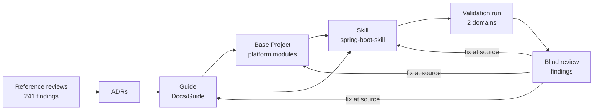
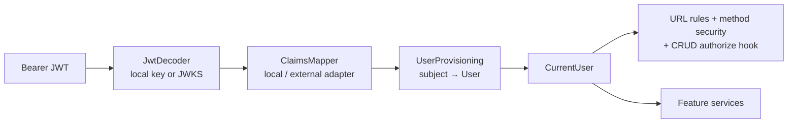

#high #new-feature

## Feature: Spring Boot Architecture Guide, Base Project and Skill

### Description

This Feature is the action plan that turns the Phase 1 analysis of the three **Reference Projects**
(`backend/`, `BugTracker/`, `wpmanager/`) into three deliverables, and proves them in a feedback loop:

1. **The Guide** — a version-agnostic architecture and design guide for future Spring Boot REST APIs, in
   `documentation/Docs/Guide/`. It keeps the recognisable shape of the reference projects (Feature Modules,
   a Generic CRUD Stack, a whitelist query engine, stateless JWT, an object-storage abstraction, idempotent
   uploads) but removes every design and implementation defect found in the 241 review findings. It defines
   *how the system is designed and how its modules talk to each other*, not full code.
2. **The Base Project** — a tested starter project (`base-project/`) that owns the shared **Platform
   Modules**: identity and access, errors, the CRUD base, the query engine, object storage, idempotency,
   configuration and architecture rules. It is built from the Guide.
3. **The Skill** — a rewritten `spring-boot-backend` skill (`spring-boot-skill/`) that starts a project from
   the Base Project and generates Feature Modules and optional modules on top of it, citing Guide rules.

Then a **Validation Loop** uses the Skill to generate projects for two small domains the user defines, builds
and runs them, has them critiqued by a blind reviewer with the same method used on the reference projects,
and feeds every finding back into the Guide → Base Project → Skill until a strict exit gate is met.

This Feature supersedes the unfinished parts of [[Features/to-do/Spring-Boot-Skill-Creation]] (Task 4 and
Phases 2–3) and the skill design in [[Features/to-do/Agent-Project-Onboarding-First-Instructions]] and
[[Docs/Skill-Architecture]]. Those documents are left untouched until Step 6.4.

## Problem Statement

The user wants a repeatable way to start Spring Boot backends that are well designed from day one. The three
projects they built so far share one design that evolved over three generations (the **Lineage**
BugTracker → wpmanager → `backend/`). The shape of that design is good — predictable Feature Modules, cheap
CRUD, a strong query engine — but the implementation carried the same defects forward: no enforced
authorization in any of the three, a generic `update` that silently does nothing in all three, checked
exceptions, `ddl-auto=update` without migrations, ordinal roles, EAGER graphs, and almost no tests
([[Docs/backend/Reviews/00-Review-Summary]], [[Docs/BugTracker/Reviews/00-Review-Summary]],
[[Docs/wpmanager/Reviews/00-Review-Summary]]). Rated by area, the design sits near 6.5/10 and the
implementation near 3.5/10.

Copying any one project, or even the consensus of the three, would copy those defects, because consistency
across a lineage is not evidence of correctness. The user needs:

- one written, reviewable convention that says what to keep, what to change and why;
- a starter project where the risky shared code is written and tested once;
- a skill that applies the convention reliably;
- evidence — not opinion — that the convention produces good projects.

The user also knows two things will change: login will likely move from self-issued JWTs to an external
identity provider (Clerk or WorkOS), and file storage must work with S3-compatible services, other external
stores and a local filesystem. The design must absorb both without rewriting business code.

## User Stories

1. As the project owner, I want a single guide that states how every future Spring Boot backend is designed, so that I stop re-deciding architecture per project.
2. As the project owner, I want each guide rule to cite the reference finding or ADR that justifies it, so that I can see why a rule exists and challenge it with evidence.
3. As the project owner, I want the guide to keep the familiar shape of my projects, so that new projects feel like my previous ones.
4. As the project owner, I want the guide to depart from my projects wherever they were wrong, so that I do not inherit their defects.
5. As the project owner, I want every departure from the reference projects to be explicit, so that I know what is new and why.
6. As the project owner, I want the guide to be version-agnostic with a stated minimum baseline (Spring Boot 3+, Java 21+), so that it stays valid across Spring Boot upgrades.
7. As the project owner, I want version-specific details isolated in version notes, so that an upgrade changes notes, not rules.
8. As the project owner, I want each architectural decision recorded once as an ADR, so that guide documents link to decisions instead of re-arguing them.
9. As a backend developer, I want a clear package layout (`platform` vs `features`), so that I always know where new code goes.
10. As a backend developer, I want dependency rules between modules enforced by tests, so that the layout cannot silently erode.
11. As a backend developer, I want every Feature Module to have the same small set of files, so that features are cheap to add and easy to read.
12. As a backend developer, I want a generic CRUD base whose `update` really updates, so that I never ship the no-op update again.
13. As a backend developer, I want explicit service hooks (validate, apply relations, authorize), so that features customise behavior without overriding whole CRUD methods.
14. As a backend developer, I want to opt a feature out of the CRUD base, so that unusual features are not forced into a shape that does not fit.
15. As a backend developer, I want three DTO shapes (Request, Response, Summary) generated with MapStruct, so that mappers cannot silently skip fields.
16. As a backend developer, I want one unchecked domain exception hierarchy mapped to RFC 9457 `ProblemDetail`, so that errors are consistent and transactions roll back by default.
17. As an API consumer, I want correct status codes (`201` + `Location` on create, `204` on delete, `404`, `409`, `422`), so that I can rely on HTTP semantics.
18. As an API consumer, I want the same error shape for validation, domain, authentication and authorization errors, so that I parse errors one way.
19. As an API consumer, I want `GET /resources?page&size&sort` for simple listing, so that lists are cacheable and bookmarkable.
20. As an API consumer, I want `POST /resources/search` with rich filters, so that grid UIs can filter by multiple fields and operators.
21. As a security reviewer, I want filterable and sortable fields to be whitelisted per entity, so that sensitive columns cannot be probed.
22. As a security reviewer, I want query size and complexity bounded, so that a single request cannot exhaust the database.
23. As a security reviewer, I want deny-by-default URL rules plus method security, so that an unannotated endpoint is never anonymous.
24. As a security reviewer, I want ownership checks in the CRUD base's authorize hook, so that inherited operations cannot touch other users' data.
25. As a security reviewer, I want a route × role authorization test matrix, so that every endpoint's 401/403/2xx behavior is proven.
26. As a security reviewer, I want no secret literal or fallback default anywhere in source, tests or committed properties, so that the reference projects' leaks are not repeated.
27. As the project owner, I want our own JWT login now, so that projects work without an external identity provider.
28. As the project owner, I want to switch to Clerk or WorkOS later by removing one module and changing configuration, so that the migration does not touch business code.
29. As a backend developer, I want business code to see only a `CurrentUser`, so that it never depends on how tokens are issued.
30. As a backend developer, I want the local user record keyed by the token subject and provisioned on first request, so that the same model works with self-issued and external tokens.
31. As a backend developer, I want an object-storage port with S3-compatible and local-filesystem adapters, so that I can develop locally and deploy to any S3-compatible store.
32. As a backend developer, I want the active storage provider chosen by configuration, so that switching provider needs no code change.
33. As a backend developer, I want an upload coordinator that stores the file outside the transaction, persists in a short transaction and deletes the file if persistence fails, so that uploads never leave orphans or half-written rows.
34. As a backend developer, I want both storage adapters verified by one contract test suite, so that I can trust them to be interchangeable.
35. As the project owner, I want multi-provider replication documented as an optional extension, so that I can add wpmanager-style redundancy when a project needs it.
36. As an API consumer, I want to retry a non-repeatable POST with an `Idempotency-Key` and get the original result, so that network retries do not duplicate work.
37. As an API consumer, I want a reused key with a different request to be rejected, so that one upload never replays another's result.
38. As a backend developer, I want idempotency opt-in per endpoint, so that I pay for it only where it matters.
39. As a backend developer, I want PostgreSQL with Flyway migrations and `ddl-auto=validate`, so that the schema evolves safely.
40. As a backend developer, I want integration tests on real PostgreSQL (Testcontainers), so that tests exercise the production engine.
41. As a backend developer, I want typed, validated configuration that fails at start-up, so that a missing secret or bad setting is caught immediately.
42. As an operator, I want health indicators for the database and the storage provider, so that I can see when a dependency fails.
43. As an AI agent using the skill, I want to start a project from the Base Project, so that the platform code is never regenerated.
44. As an AI agent using the skill, I want instructions for adding a Feature Module that cite Guide rule IDs, so that my output is traceable to the convention.
45. As an AI agent using the skill, I want to load only the instructions for the current task, so that my context stays small.
46. As the project owner, I want the skill tested by generating real projects for two different domains, so that it is not tuned to one example.
47. As the project owner, I want generated projects critiqued by a reviewer that does not know how they were generated, so that the critique is not self-grading.
48. As the project owner, I want validation findings in the same format and severity scale as the reference reviews, so that I can compare generations numerically.
49. As the project owner, I want the loop to stop at a clear gate (builds, all tests pass, starts on PostgreSQL, 0 Critical and 0 High, twice in a row, max 5 runs), so that it neither stops early nor runs forever.
50. As the project owner, I want each validation finding traced to the Guide rule, Base Project module or Skill file that caused it, so that the fix lands in the right place.
51. As the project owner, I want a traceability matrix from every Critical/High reference finding to the Guide rule that prevents it, so that I can prove the old defects are covered.
52. As a future maintainer, I want the glossary updated with the new terms, so that the Guide, the Skill and the reviews use one vocabulary.

## Solution

The work proceeds guide-first: record decisions (ADRs), write the Guide, build the Base Project from the
Guide, write the Skill against both, then validate everything with generated projects and correct the
source of each finding.



**Decisions already made with the user** (each becomes an ADR in Step 1.3):

| # | Decision | Chosen option | Main evidence |
|---|---|---|---|
| D1 | Source of truth | The Guide; reference projects are evidence, not authority; every departure cites a finding | Lineage copies defects (34 of 88 wpmanager findings shared with `backend/`) |
| D2 | Base Project vs Skill | Base Project owns the Platform Modules; the Skill generates Feature Modules and enables optional modules | Shared framework is where the Critical findings live |
| D3 | Version baseline | Spring Boot 3+, Java 21+; rules version-neutral; version notes per document | BT-R08-01 (EOL Boot 2.7), era gaps |
| D4 | Package layout | `<root>.platform.*` + `<root>.features.<feature>`; ArchUnit-enforced dependency rules | BE-R09-07, WP-R07-05 (`shared` imports features) |
| D5 | CRUD base | Keep, deepened: 3 DTO shapes, real update, unchecked exceptions, hooks, opt-out | BE-R02-01/06/07, WP-R02-06, BT-R02-01/02 |
| D6 | Identity | Resource-server validation + `CurrentUser` seam + removable local token issuer; Clerk/WorkOS later by configuration | BE-R01-01/07/08, WP-R01-08/09 |
| D7 | User model | One `User` keyed by external subject, roles as enum strings, per-type profile data in features | BE-R03-03, BT-R01-06, WP-R06-01 |
| D8 | Multi-tenancy | Not in the Base Project; ownership checks only; tenancy is future work | User decision |
| D9 | Errors | Unchecked `DomainException` hierarchy → `ProblemDetail`; catch-all handler | BE-R05-01/03/04/06, BT-R07-01/02 |
| D10 | Database | PostgreSQL, Flyway, `ddl-auto=validate`, Testcontainers | BE-R03-04, BE-R08-05, BT-R03-09 |
| D11 | List API | `GET` paging/sorting + `POST /search` filters; one whitelist engine; own `PageResponse` | BE-R06-03/04, BE-R02-08, BT-R05-01/07 |
| D12 | Mapping | MapStruct with unmapped-target = error | BE-R04-03, WP-R07-07 |
| D13 | Storage | `ObjectStorage` port, S3-compatible + local-filesystem adapters, `UploadCoordinator`; replication optional (Guide only) | WP-R03-01/02/03, WP-R05-01/05 |
| D14 | Idempotency | `IdempotencyGuard` in the Base Project, opt-in per endpoint, client `Idempotency-Key` | WP-R04-01…05 |
| D15 | Validation loop | Two user-defined domains; strict gate; blind reviewer; max 5 runs | User decision |
| D16 | Decisions record | ADRs in `documentation/ADRs/` | User decision |
| D17 | Guide format | `Docs/Guide/`, rule IDs `G<NN>-<MM>`, validator-checked | User decision |
| D18 | Skill | Rewritten from scratch after the Guide and Base Project exist | User decision |

### Scope

**In scope**

- ADR system initialisation and ADRs for D1–D18.
- Glossary additions for the new vocabulary.
- The Guide (conventions, 16 documents, traceability matrix) and a validator extension for it.
- The Base Project with all Platform Modules, one sample Feature Module and the agreed tests.
- The rewritten Skill.
- The Validation Loop with two user-defined domains, review documents and fixes at source.
- Final release: Base Project v1, Skill migration per [[Docs/Skill-Directory-Convention]], memory bank update,
  retirement of superseded documents (with approval).

**Out of scope**

- Multi-tenancy (D8) — the Guide names the extension point only.
- A concrete Clerk or WorkOS integration — the Guide defines the migration path and the Base Project proves
  it with a second token-verification configuration (a fake JWKS issuer in tests).
- Building multi-provider replication — the Guide specifies it as an optional extension.
- Deployment, containers for production, CI/CD (per `documentation/Memory/brief.md`). Docker is used only as
  a test dependency (Testcontainers).
- Any change to the three reference projects (read-only inputs).

### Affected Systems / Modules

- [[Memory/brief]] — **user-owned**; its constraint "patterns must be grounded in the actual code found in the
  three projects, not invented" conflicts with D1. The user updates it (Step 1.1).
- [[Memory/known-issues]] — the rule "a pattern that only appears in one project needs stronger justification"
  is replaced by "every rule cites a finding or ADR".
- [[Memory/architecture]], [[Memory/tech]], [[Memory/context]], [[Memory/progress]] — updated at the end of
  each Task.
- `documentation/doc-config.json` — gains `"adrs": "ADRs"` and the ADR status list.
- `documentation/ADRs/` — new; `ADR-index.md` plus ADRs 0001–0018.
- [[Glossary/Glossary]] — new terms (Step 1.4).
- `documentation/Docs/Guide/` — new; the Guide.
- [[Docs/Analysis-Doc-Conventions]] — reused as the format for validation-run reviews; unchanged.
- `scripts/validate-analysis-docs.py` and `scripts/tests/` — extended with a `guide` target and a
  `validation` target.
- `base-project/` — new Spring Boot project at the repository root.
- `spring-boot-skill/` — current `skill.md` and `references/phase-0-onboarding.md` replaced (D18).
- `validation-runs/` — new, git-ignored; generated projects per run and domain.
- `documentation/Docs/Validation/` — new; review documents per run and domain.
- [[Docs/Skill-Architecture]], [[Features/to-do/Agent-Project-Onboarding-First-Instructions]],
  [[Features/to-do/Spring-Boot-Skill-Creation]] — superseded; retired only in Step 6.4 with approval.
- Evidence sources (read-only): [[Docs/backend/backend-Index]], [[Docs/BugTracker/BugTracker-Index]],
  [[Docs/wpmanager/wpmanager-Index]] and their review summaries.

### Impact Analysis

- **No runtime system exists yet**, so nothing breaks. The impact is on the workspace's plan and documents.
- The project brief's "grounded, not invented" rule is relaxed into "grounded or corrected, always cited".
  Without that change, D1, D5, D6, D11 and D13 contradict the brief.
- The phase-based skill design and its finished Phase 0 are discarded (D18). Useful ideas (repository-first
  reasoning, onboarding before generation, progressive disclosure) may return through the new skill's ADR, but
  nothing is carried over by default.
- The Base Project becomes a maintained artifact. Every later Guide change must also be reflected there;
  the traceability rules below keep that manageable.
- Stable finding IDs from Phase 1 become citations in the Guide, so the analysis documents must keep their
  IDs stable (they already do by convention).

### Risk Assessment

- **Drift between Guide, Base Project and Skill.** Three artifacts that describe one design will diverge.
  Mitigation: the Guide is the only place rules are stated; the Base Project cites rule IDs in class-level
  Javadoc of Platform Modules; Skill files cite rule IDs; the validator checks rule-ID references resolve.
- **The CRUD base stays shallow.** wpmanager overrode 29 of 60 base methods (WP-R02-06). Mitigation: an
  explicit depth acceptance criterion measured in every validation run (override rate of `create`/`update`
  below 50% across generated features); if it fails twice, ADR-0005 is revisited.
- **Overfitting to the validation domains.** Mitigation: two different domains and a coverage checklist.
- **Self-grading bias.** Mitigation: the reviewer runs in a fresh agent context with only the generated
  project, the Guide and the review conventions — not the Skill or the generation transcript.
- **Docker availability.** Testcontainers (PostgreSQL, MinIO) needs a Docker daemon; `backend/` already had a
  test that failed outside Docker (BE-R08-03). Mitigation: document the requirement in the Base Project README
  and fail fast with a clear message.
- **External identity providers differ.** Clerk and WorkOS put roles and organisations in different claims.
  Mitigation: a `ClaimsMapper` port with one adapter per provider; the Base Project ships the local adapter and
  a test adapter for a generic external issuer.
- **Local token issuer is security-sensitive code.** Mitigation: keep it minimal (login, refresh, logout),
  use framework primitives, asymmetric keys from configuration, hashed rotating refresh tokens, and test it.
- **Secrets.** The reference projects committed secrets; the owner accepted leaving those, but nothing new may
  contain a literal secret or a fallback default ([[Memory/known-issues]], "Patterns to avoid").
- **Cost of the loop.** Each run generates, builds, tests and reviews two projects. The hard cap of five runs
  bounds it.

---

## Implementation Architecture

Design rules for this section follow the `solid-deep-design` skill: every Platform Module has one
responsibility, a small interface (1–4 entry points), a seam only where at least two adapters exist
(production + test counts), and passes the deletion test. Interfaces below are design sketches in Java-like
notation, not final code.

### Changes Required

#### 1. Project brief, ADR system and glossary
**Purpose:** Remove the contradiction between the brief and D1, and give every decision a permanent,
linkable record before any guide text is written.
**Changes:**
- The user rewrites the brief's constraint to: *"Patterns are grounded in the three reference projects and
  corrected where the reviews found them wrong; every rule cites a finding ID or an ADR."*
- Add `"adrs": "ADRs"` to `documentation/doc-config.json` directories and
  `"adrs": ["proposed", "accepted", "deprecated", "superseded"]` to statuses; create
  `documentation/ADRs/ADR-index.md`.
- ADRs (Nygard format, status `accepted` once the user approves):

| ADR | Title | From |
|---|---|---|
| 0001 | Guide is the source of truth; references are evidence | D1 |
| 0002 | Base Project owns the Platform Modules; the Skill generates features | D2 |
| 0003 | Version baseline: Spring Boot 3+, Java 21+ | D3 |
| 0004 | Package layout `platform` / `features` with enforced dependency rules | D4 |
| 0005 | Deepened generic CRUD base with hooks and three DTO shapes | D5 |
| 0006 | Identity: resource-server validation, `CurrentUser` seam, removable local issuer | D6 |
| 0007 | One `User` keyed by external subject; roles as strings | D7 |
| 0008 | No multi-tenancy in the Base Project | D8 |
| 0009 | Unchecked domain exceptions mapped to `ProblemDetail` | D9 |
| 0010 | PostgreSQL, Flyway and Testcontainers | D10 |
| 0011 | List API: `GET` paging + `POST /search`; own page response | D11 |
| 0012 | MapStruct mapping with unmapped-target errors | D12 |
| 0013 | Object storage port, S3-compatible and local adapters, upload coordinator | D13 |
| 0014 | Idempotency guard, opt-in per endpoint | D14 |
| 0015 | Validation loop protocol and exit gate | D15 |
| 0016 | Guide document format and rule IDs | D16, D17 |
| 0017 | Skill architecture (written in Step 4.1) | D18 |

- Glossary terms (via the `glossary` CLI, with user confirmation): **Guide**, **Guide Rule**, **Rule ID**,
  **Platform Module**, **Base Project**, **Current User**, **Token Issuer**, **Claims Mapper**,
  **Object Storage**, **Upload Coordinator**, **Idempotency Guard**, **Query Profile**, **Validation Run**,
  **Validation Domain**, **Exit Gate**. Update **Feature Module**, **Generic CRUD Stack** and **DTO Tiers** to
  the new shapes (synonyms keep the old names findable).
**Links:** [[Memory/brief]], [[Glossary/Glossary]]

#### 2. Guide format and validator
**Purpose:** Make every rule addressable and machine-checked, so the Skill, the Base Project and later
reviews can cite rules by ID.
**Changes:**
- `documentation/Docs/Guide/Guide-Conventions.md` — layout (`Guide-Index.md`, `NN-Title-Words.md`), tags
  (`#doc #guide` + area tags from [[Docs/Analysis-Doc-Conventions]]), required headings per document:
  `Purpose`, `Design`, `Rules`, `Differs From the Reference Projects`, `Version Notes`, `Related Documents`.
- Rule block format:

```markdown
### G06-03
**Rule:** Every filterable or sortable field is declared once in the entity's Query Profile; anything not
declared is rejected with 400.
**Why:** Unlisted fields let clients probe sensitive columns (password hashes).
**Evidence:** BT-R05-07, BE-R06-05 · ADR-0011
**Differs from references:** BugTracker had no whitelist; `backend/` repeated the field name three times.
```

- Extend `scripts/validate-analysis-docs.py` with a `guide` target: heading order, unique rule IDs,
  every rule has Rule/Why/Evidence, every cited finding ID and ADR resolves, every Guide document is listed in
  `Guide-Index.md`. Add unit tests in `scripts/tests/`.
**Links:** [[Docs/Analysis-Doc-Conventions]]

#### 3. The Guide documents
**Purpose:** State the design. Each document describes modules, their responsibilities, their interfaces and
how they talk to each other; code appears only as short illustrative sketches.
**Changes:** `documentation/Docs/Guide/`:

| # | Document | Content |
|---|---|---|
| 01 | Principles-and-Baseline | Deep modules + SOLID as the design rules; baseline; what "version notes" mean; how rules are cited |
| 02 | Project-Layout-and-Module-Boundaries | `platform` / `features`; allowed dependencies; cross-feature communication; ArchUnit rules |
| 03 | Feature-Module-Anatomy | The fixed file set and naming; when to opt out of the CRUD base |
| 04 | CRUD-Base-and-Service-Hooks | Base controller and service contract; hooks; transactions; server-assigned ids |
| 05 | API-Contract | Resource naming, `/api/v1` prefix, status codes, `Location`, `PageResponse`, OpenAPI |
| 06 | Query-Engine | Query Profile, request forms (`GET` / `POST /search`), operators, bounds, typing |
| 07 | Domain-Model-and-Persistence | Entities, `equals`/`hashCode`, LAZY by default, enums as strings, auditing, constraints, Flyway |
| 08 | Identity-Authentication-and-Authorization | Current User seam, token verification, local issuer, provisioning, deny-by-default, method security, ownership, migration to Clerk/WorkOS |
| 09 | Errors-and-Validation | Exception hierarchy, `ProblemDetail`, validation on requests, security errors in the same shape |
| 10 | Object-Storage-and-Uploads | Storage port and adapters, object keys, streaming, Upload Coordinator, compensation, optional replication extension |
| 11 | Idempotency | Keys, fingerprints, states, leases, replay, cleanup |
| 12 | Configuration-and-Secrets | Typed properties, fail-fast validation, profiles, no literal secrets |
| 13 | Testing-Strategy | Test layers, Testcontainers, contract tests, auth matrix, ArchUnit, what not to test |
| 14 | Observability-and-Operations | Health indicators, logging rules (parameterised, no personal data), SQL logging off by default |
| 15 | Recipe-Add-a-Feature | End-to-end walkthrough of adding one Feature Module |
| 16 | Traceability-Matrix | Every 🔴/🟠 reference finding → Guide rule(s) that prevent it, or "N/A — reason" |

**Links:** [[Docs/backend/Reviews/00-Review-Summary]], [[Docs/BugTracker/Reviews/00-Review-Summary]],
[[Docs/wpmanager/Reviews/00-Review-Summary]]

#### 4. Module layout and communication (Guide 02, Base Project)
**Purpose:** One predictable place for everything and dependency directions that cannot erode.
**Changes:**

```
<root>/
├── platform/
│   ├── identity/        CurrentUser, token verification, claims mapping, user provisioning
│   │   └── local/       Token Issuer (removable)
│   ├── access/          URL rules, method security, access policies
│   ├── crud/            CRUD base controller + service + hooks
│   ├── query/           Query Profile + list engine + PageResponse
│   ├── errors/          DomainException hierarchy + ProblemDetail advice
│   ├── storage/         ObjectStorage port, adapters, UploadCoordinator, StoredFile
│   ├── idempotency/     IdempotencyGuard + @Idempotent
│   └── config/          typed properties, startup validation
└── features/
    └── <feature>/       one package per Feature Module
```

Dependency rules (ArchUnit tests in the Base Project):
- `platform` never imports `features`.
- `platform.identity.local` is imported by nothing outside itself (so it can be deleted).
- A feature reaches another feature only through that feature's `<F>Service`, never its repository or mapper.
  Side effects that the caller does not need to wait for use Spring application events published by the owner.
- JPA associations to another feature's entity are allowed; writes to it go through its service.
- Controllers never return or accept entities.

#### 5. Feature Module anatomy (Guide 03)
**Purpose:** Keep the reference projects' cheap-feature property with fewer, non-duplicated files.
**Changes:** `features/<feature>/`:

| File | Role |
|---|---|
| `<F>Controller` | Extends the CRUD base controller; route and extra endpoints only |
| `<F>Service` | Extends the CRUD base service; implements hooks |
| `<F>Repository` | Spring Data repository + predicate executor |
| `<F>` | JPA entity |
| `<F>Request` | Create/update input with Bean Validation; no `id`, no owner, no server-controlled fields |
| `<F>Response` | Detail output, includes `id`; also the create response |
| `<F>Summary` | List-row output |
| `<F>Mapper` | MapStruct: `toResponse`, `toSummary`, `toEntity`, `update(request, @MappingTarget entity)` |
| `<F>QueryProfile` | Whitelist of filterable/sortable fields |
| `V<n>__<feature>.sql` | Flyway migration (in `db/migration`) |

Replaces the reference projects' `DTO` / `MiniDTO` / `ListDTO` / `Form` quartet (BE-R02-06).

#### 6. CRUD base (`platform.crud`, Guide 04)
**Purpose:** Give every feature `get`, `list`, `search`, `create`, `update`, `delete` with correct semantics,
while features supply only their rules.
**Changes:** Interface sketch:

```java
abstract class CrudService<REQ, RES, SUM, E, ID> {
  RES get(ID id);
  PageResponse<SUM> list(ListRequest request);
  RES create(REQ request);
  RES update(ID id, REQ request);          // mapper.update(request, entity) — never a no-op
  void delete(ID id);

  // hooks (protected, default no-op or default policy)
  protected void validateCreate(REQ request) {}
  protected void validateUpdate(REQ request, E current) {}
  protected void applyRelations(REQ request, E entity) {}   // resolve ids → entities, owner from CurrentUser
  protected void authorize(Action action, E entityOrNull) {} // ownership / role rules
  protected void beforeDelete(E entity) {}                   // delete guards
}
```

- Constructor takes three collaborators: repository, mapper, Query Profile.
- Class-level Spring `@Transactional`, read-only for reads; unchecked exceptions roll back by default.
- The base controller maps: `GET /{id}` → 200, `GET` → 200 page, `POST /search` → 200 page, `POST` → 201 +
  `Location` + `RES`, `PUT /{id}` → 200, `DELETE /{id}` → 204. Inputs carry `@Valid`.
- Features that do not fit implement a plain service and controller (opt-out), still using `platform.errors`,
  `platform.query` and `platform.access`.
- **Deletion test:** removing the base re-creates six endpoints, six service methods, transaction and
  authorization wiring in every feature — the module concentrates complexity. **Depth criterion:** across
  generated features, fewer than half override `create`/`update` wholesale.

#### 7. Query engine (`platform.query`, Guide 06)
**Purpose:** Safe ad-hoc filtering, sorting and paging behind one call.
**Changes:**
- Deep entry point: `PageResponse<SUM> ListQuery.run(QueryProfile<E> profile, ListRequest request, Function<E,SUM> toSummary)`.
- `ListRequest` is one internal form parsed from either `GET` parameters (page, size, sort) or a
  `POST /search` body (filters with operator lists, OR within a field, AND across fields, multi-sort) —
  BugTracker's contract, `backend/`'s implementation.
- `QueryProfile<E>` declares each field once (name, path, type, operators, sortable), plus default sort,
  maximum page size, maximum filter count and maximum values per filter (BE-R06-04, BE-R06-05). Enum and
  collection fields are supported (BE-R06-02). Zone-less date-times are rejected, not silently UTC (BE-R06-06).
- Stateless; no per-request state on beans (BT-R05-01).
- `PageResponse<T>` is the owned wire format: `items`, `page`, `size`, `totalItems`, `totalPages` (BE-R02-08).
- The predicate technology (QueryDSL or JPA Criteria) is an implementation detail hidden behind the interface;
  the Guide records the choice in a version note.

#### 8. Identity and access (`platform.identity`, `platform.access`, Guide 08)
**Purpose:** Authenticate every request by validating a JWT, expose the caller as a `CurrentUser`, and
enforce authorization in two layers — without business code knowing who issued the token.
**Changes:**



- **Token verification:** the framework's resource-server `JwtDecoder` *is* the port; no custom port is
  added (deletion test). Two configurations selected by `app.identity.mode`:
  - `local` — decoder built from the Token Issuer's public key (`NimbusJwtDecoder.withPublicKey`); issuer and
    audience validated.
  - `external` — decoder from the provider's `jwk-set-uri` (Clerk, WorkOS); issuer and audience validated.
  Verified against Spring Security reference docs (resource server, "Trusting a Single Symmetric Key",
  "Configure JWT decoder from JWK Set", `JwtAuthenticationConverter`):
  https://docs.spring.io/spring-security/reference/7.0/servlet/oauth2/resource-server/jwt.html
- **`ClaimsMapper` (port, two adapters):** `IdentityClaims map(Jwt jwt)` → subject, e-mail, display name,
  roles. `LocalClaimsMapper` reads our claims; `ExternalClaimsMapper` is configured per provider (role claim
  path). A test adapter backs the external-issuer tests. Real seam: at least two adapters.
- **`UserProvisioning`:** `User resolve(IdentityClaims claims)` — finds the local `User` by
  `externalSubject` (unique) or creates it on first request; applies the role-sync policy (local mode: roles
  are ours; external mode: roles from claims). Replaces JOINED user hierarchies (D7); per-type data lives in
  feature entities that reference `User`.
- **`CurrentUser`:** value object (`userId`, `subject`, `roles`) available through
  `CurrentUserProvider.current()`; the only identity type feature code may import. Tests substitute it.
- **Token Issuer (`platform.identity.local`, removable):** `POST /auth/login`, `POST /auth/refresh`,
  `POST /auth/logout`. Delegating password encoder (BCrypt default); short-lived access tokens signed with an
  asymmetric key pair from configuration (no literal, no fallback); opaque refresh tokens stored hashed and
  rotated; `sub` = user id, issuer and audience set (BE-R01-05/07). First admin created once from
  configuration-provided credentials, never a literal (BE-R01-04). Account flags honoured (BE-R01-08).
  **Migration to Clerk/WorkOS:** delete the package, set `app.identity.mode=external` plus issuer, audience,
  JWKS URI and role-claim path; no feature code changes.
- **Authorization (`platform.access`):** `authorizeHttpRequests` with an explicit public-route list and
  `anyRequest().authenticated()`; `@EnableMethodSecurity` on the security configuration class (not on a
  service — WP-R01-01, BE-R01-01); role rules per feature in one `<F>` access declaration used by the base
  controller; ownership in the CRUD `authorize` hook (WP-R01-03). Authentication and authorization failures
  produce the same `ProblemDetail` as other errors. No Spring Data REST (BE-R01-03, WP-R01-05).

#### 9. Errors and validation (`platform.errors`, Guide 09)
**Purpose:** One failure model from domain to wire.
**Changes:**
- `abstract class DomainException extends RuntimeException` carrying an `ErrorCode` (HTTP status, stable
  `type` URI, title). Built-in subclasses: `NotFound`, `Conflict`, `BusinessRuleViolation`, `Forbidden`.
- One `@RestControllerAdvice` extending `ResponseEntityExceptionHandler`: domain exceptions → their status;
  Bean Validation → 422 (or 400, decided in ADR-0009) with a field-error list; everything else → 500 with a
  generic detail and a correlation id, full error logged (BE-R05-03/04).
- The security entry point and access-denied handler reuse the same problem writer and Boot's
  `ObjectMapper` (BE-R05-02, BE-R09-08).
- Validation constraints live on `<F>Request`, not on entities (BE-R03-07).

#### 10. Object storage and uploads (`platform.storage`, Guide 10)
**Purpose:** Store and retrieve binary objects on any supported backend, and make "store a file and record
it" atomic from the caller's point of view.
**Changes:**

```java
interface ObjectStorage {                    // port — two production adapters + test use
  StoredObject put(ObjectKey key, InputStream content, ObjectMetadata metadata);
  InputStream open(ObjectKey key);           // streams; NotFound if absent
  boolean exists(ObjectKey key);
  void delete(ObjectKey key);                // idempotent
}
```

- **`S3CompatibleStorage`** — AWS SDK v2 client built once per configuration and reused (WP-R05-01),
  `endpointOverride` + path-style option for Wasabi, MinIO, R2 and others; timeouts configured; streaming
  and multipart for large objects (WP-R05-04); bucket checked once at start-up, not per call (WP-R05-03).
- **`LocalFileSystemStorage`** — root directory from configuration; keys normalised and confined to the root
  (path-traversal rejected); write to a temporary file then atomic move; checksum computed while streaming.
- Selection: `app.storage.provider=s3|local` with typed, validated properties per adapter; credentials only
  from the environment and never returned by any API (WP-R01-04).
- Extension point for other external stores (Azure Blob, GCS, FTP): a new adapter that passes the contract
  suite; no other change (OCP).
- **`ObjectKey`** — built by one function per feature (e.g. `<feature>/<ownerId>/<uuid>`), never parsed back
  from URLs (WP-R05-07).
- **`StoredFile`** — platform entity (key, provider, size, SHA-256, content type, created-at) that features
  reference.
- **`UploadCoordinator`** — deep entry point:
  `<T> T store(UploadSource source, ObjectKey key, Function<StoredFile, T> persist)`.
  It validates size and type, streams to `ObjectStorage` with **no** database transaction open, then runs
  `persist` inside a short `TransactionTemplate` transaction that rolls back on any exception; if
  persistence fails it deletes the object (compensation) and emits a searchable alert log when compensation
  itself fails (WP-R03-01/02/03). Callers never write transaction or cleanup code.
- **Optional replication extension (Guide only):** a provider registry, a default provider, an outbox row per
  stored file on commit, a worker processing one item at a time with retries, backoff and per-item error
  isolation, and a health indicator (WP-R05-02, WP-R05-06).

#### 11. Idempotency (`platform.idempotency`, Guide 11)
**Purpose:** Make non-repeatable POSTs safe to retry.
**Changes:**
- Deep entry point: `<T> T IdempotencyGuard.execute(IdempotencyKey key, Fingerprint fingerprint, Class<T> type, Supplier<T> operation)`.
- Opt-in per endpoint with `@Idempotent` on the controller method; an interceptor reads the client
  `Idempotency-Key` header, scopes it by `CurrentUser`, builds the fingerprint from method, path and body
  hash, and calls the guard (WP-R04-02, WP-R04-06).
- States `IN_PROGRESS` (with `leaseUntil`) → `COMPLETED` (stored response) or `FAILED`. Same key + same
  fingerprint + completed → replay; same key + different fingerprint → 422; in progress with a live lease →
  409; expired lease → retry allowed (WP-R04-03).
- The original exception is rethrown after recording failure, so errors keep their status (WP-R04-01).
- Persistence only (unique index); no per-instance cache (WP-R04-04). A scheduled cleanup deletes expired rows.
- Uploads through `UploadCoordinator` are `@Idempotent` by default.

#### 12. Configuration, secrets and operations (`platform.config`, Guide 12 and 14)
**Purpose:** Fail at start-up, not at first use; no secret in the tree.
**Changes:**
- Typed `@ConfigurationProperties` records with `@Validated` per Platform Module; secrets bound from
  environment variables with no default values (BT-R01-03, WP-R01-07, BE-R01-11).
- Profiles: default (production-safe), `local` (developer); test configuration lives only in `src/test`
  (BE-R07-06). `ddl-auto=validate`; SQL logging off by default (BE-R07-05).
- Actuator health for the database and the active storage provider; parameterised logging; no personal data
  at `ERROR` (BE-R09-06).
- Lean POM: only the starters in use (BE-R07-01, WP-R09-01); no H2 (BE-R03-06).

#### 13. Base Project (`base-project/`)
**Purpose:** The tested implementation of sections 4 and 6–12 that every new project starts from.
**Changes:** Spring Boot project (current Boot 3.x or later line when built; Java 21+; PostgreSQL; Flyway;
MapStruct; Testcontainers for PostgreSQL and MinIO; ArchUnit). Contains all Platform Modules, one sample
Feature Module used by the tests (for example `features/note` with an owner, a list and an attachment
upload), a README (prerequisites incl. Docker for tests, configuration variables, how to switch identity and
storage modes), and no literal secrets. Each Platform Module's class-level Javadoc cites its Guide rule IDs.

#### 14. Skill (`spring-boot-skill/`, rewritten)
**Purpose:** Let an agent start projects from the Base Project and add Feature Modules and optional modules
that follow the Guide.
**Changes:** Designed in ADR-0017 after the Guide and Base Project exist. Minimum capabilities:
- start a project from the Base Project (copy, rename root package, set configuration);
- add a Feature Module from an entity description (all files in section 5, migration, tests, access rules);
- enable an optional capability on a feature (upload + storage, idempotency);
- review a project against the Guide and report findings by rule ID.
Skill files cite Guide rule IDs instead of restating rules. Skill files stay in `spring-boot-skill/` until
Step 6.3 ([[Docs/Skill-Directory-Convention]]).

#### 15. Validation Loop (`validation-runs/`, `documentation/Docs/Validation/`)
**Purpose:** Evidence that Guide + Base Project + Skill produce good projects.
**Changes:**
- The user defines two **Validation Domains** of 4–6 entities each. Together they must cover: one-to-many,
  many-to-many, user-owned resources, role-restricted endpoints, a filtered/sorted list, and a file upload
  with idempotency.
- Per run `NN` and domain `X`: the Skill generates `validation-runs/run-NN/<domain>/` (git-ignored); the
  agent builds it, runs all tests and starts it against PostgreSQL; a blind reviewer writes
  `documentation/Docs/Validation/Run-NN/<Domain>/` using [[Docs/Analysis-Doc-Conventions]] with finding IDs
  `V<NN><X>-R<NN>-<MM>` (e.g. `V01A-R02-03`) and a **Root cause** field: `guide` (rule ID), `base` (module),
  or `skill` (file).
- Each finding is fixed at its root cause, then the next run starts from a fresh generation.
- **Exit Gate:** a run passes when both domains build, all tests pass (including ArchUnit and the auth
  matrix), both start against PostgreSQL, the blind review reports 0 🔴 and 0 🟠, and the CRUD depth criterion
  holds. The loop ends after two consecutive passing runs, or at run 5, when the user decides.

---

## Implementation Steps

### Phase 1: Decisions and vocabulary
- [ ] **Step 1.1:** The user updates [[Memory/brief]] to relax "grounded, not invented" into "grounded or corrected, always cited" (user-owned file; the agent proposes wording only).
- [ ] **Step 1.2:** Initialise the ADR system: add ADR directory and statuses to `documentation/doc-config.json`; create `documentation/ADRs/ADR-index.md`.
- [ ] **Step 1.3:** Write ADR-0001 … ADR-0016 from decisions D1–D17 with context, decision and consequences, each citing the reference finding IDs; user approves → `accepted`.
- [ ] **Step 1.4:** Add and update glossary terms listed in section 1 through the `glossary` CLI, with user confirmation.

### Phase 2: The Guide
- [ ] **Step 2.1:** Write `Docs/Guide/Guide-Conventions.md` and `Guide-Index.md`; extend the validator with the `guide` target and unit tests.
- [ ] **Step 2.2:** Write Guide 01–05 (principles, layout and boundaries, feature anatomy, CRUD base, API contract).
- [ ] **Step 2.3:** Write Guide 06–09 (query engine, domain and persistence, identity and access, errors and validation).
- [ ] **Step 2.4:** Write Guide 10–11 (object storage and uploads incl. the optional replication extension; idempotency).
- [ ] **Step 2.5:** Write Guide 12–15 (configuration and secrets, testing strategy, observability, recipe).
- [ ] **Step 2.6:** Write Guide 16 (traceability matrix): every 🔴/🟠 reference finding maps to a rule or a justified N/A; validator passes; user reviews the Guide.

### Phase 3: The Base Project
- [ ] **Step 3.1:** Scaffold `base-project/` (build, PostgreSQL, Flyway, Testcontainers, MapStruct, ArchUnit), `platform.config` with fail-fast properties, ArchUnit dependency rules, `platform.errors` with its error-contract tests.
- [ ] **Step 3.2:** Implement `platform.identity` (decoder configurations, `ClaimsMapper` adapters, `UserProvisioning`, `CurrentUser`) and `platform.access` (URL rules, method security); tests for both identity modes.
- [ ] **Step 3.3:** Implement `platform.identity.local` (Token Issuer: login, refresh, logout, first-admin bootstrap) with tests; ArchUnit rule that nothing imports it.
- [ ] **Step 3.4:** Implement `platform.query` and `platform.crud` with the sample Feature Module; query-engine tests, CRUD tests (update really updates; status codes), route × role auth matrix.
- [ ] **Step 3.5:** Implement `platform.storage` (port, S3-compatible and local adapters, `StoredFile`, `UploadCoordinator`) with the shared contract suite run against both adapters and compensation tests.
- [ ] **Step 3.6:** Implement `platform.idempotency` with replay, conflict, fingerprint-mismatch, lease-expiry and failure-rethrow tests; make the sample upload `@Idempotent`.
- [ ] **Step 3.7:** README, health indicators, secret scan of the tree; record any Guide corrections discovered while building (fix the Guide first, then the code).

### Phase 4: The Skill
- [ ] **Step 4.1:** Write ADR-0017 (skill architecture): capabilities, file layout, loading model, how it locates the Base Project, how it cites rule IDs.
- [ ] **Step 4.2:** Replace `spring-boot-skill/` contents with the new skill per ADR-0017; add a smoke scenario (start project + add one feature) run manually by the user.

### Phase 5: Validation Loop
- [ ] **Step 5.1:** The user defines the two Validation Domains; the agent checks them against the coverage checklist and records them in `Docs/Validation/Validation-Domains.md` with ADR-0015's protocol and the `validation` validator target.
- [ ] **Step 5.2:** Run `NN`: generate both domains with the Skill, build, test, start on PostgreSQL, record results.
- [ ] **Step 5.3:** Run `NN`: blind review of both projects → review documents with root-cause fields.
- [ ] **Step 5.4:** Run `NN`: fix findings at their root cause (Guide → Base Project → Skill), update the traceability matrix, evaluate the Exit Gate; repeat Steps 5.2–5.4 until it passes twice or run 5 is reached.

### Phase 6: Release
- [ ] **Step 6.1:** Tag Base Project v1; final Guide review; validator passes for `guide` and `validation`.
- [ ] **Step 6.2:** Update the memory bank (architecture, tech, known-issues, context, progress).
- [ ] **Step 6.3:** Migrate the Skill per [[Docs/Skill-Directory-Convention]] after the user signs off.
- [ ] **Step 6.4:** With user approval, retire superseded documents ([[Docs/Skill-Architecture]], [[Features/to-do/Agent-Project-Onboarding-First-Instructions]], [[Features/to-do/Spring-Boot-Skill-Creation]]).

---

## Potential Issues / Risks
- The ADR for the validation error status (400 vs 422 for Bean Validation failures) must be settled in
  ADR-0009 before Guide 09 is written; the two are not interchangeable once clients exist.
- Guide rules written before the Base Project exists will be wrong in places. Step 3.7 exists for that; the
  rule is "fix the Guide first".
- `POST /search` and `@Idempotent` both touch POST semantics; searches must never be idempotency-guarded.
- `UserProvisioning` on first request creates rows during a read; it must be race-safe (unique
  `externalSubject`, retry on conflict) and must not run inside the caller's read-only transaction.
- External providers may deliver roles via organisation membership rather than a flat claim; the
  `ClaimsMapper` contract must allow "no roles in token" plus a local role assignment.
- Streaming uploads bypass Spring's in-memory multipart limits differently per server configuration; size
  limits must be enforced by `UploadCoordinator`, not only by container settings.
- Local filesystem storage is single-node; the Guide must say so and point to the S3-compatible adapter for
  multi-instance deployments.
- Deleting an entity that references a `StoredFile` leaves an object in storage unless the feature deletes it;
  the Guide must define object deletion after commit (and an optional orphan sweep).
- Generated validation projects consume disk space and Docker time; `validation-runs/` is git-ignored and may
  be cleaned after each run's review is written.
- Rule IDs must stay stable once the Skill cites them; renumbering requires a Guide changelog entry and a
  validator run over Skill files.

---

## Testing Decisions

- **What a good test is:** it exercises behavior through a module's public interface (HTTP endpoint, service
  method, port) and survives internal refactoring. No tests of private methods, no mocking of collaborators
  inside a module, no asserting on internal structure. Integration-style tests on real PostgreSQL are
  preferred for anything touching persistence; H2 is not used.
- **Modules tested in the Base Project** (all confirmed by the user):
  - **Identity and access:** route × role matrix (anonymous → 401, wrong role → 403, owner/other user,
    allowed role → 2xx) for every sample endpoint, run with real tokens in `local` mode and with a fake JWKS
    issuer in `external` mode; Token Issuer login, refresh rotation, logout and disabled-account behavior.
  - **Object storage:** one contract test suite executed against `LocalFileSystemStorage` and
    `S3CompatibleStorage` (MinIO Testcontainer) — put/open/exists/delete, missing object, overwrite,
    path traversal (local), large object streaming; `UploadCoordinator` compensation (persist fails → object
    deleted; compensation fails → alert logged).
  - **Query engine, CRUD base and errors:** whitelist rejection, typed parsing, bounds, sort and paging
    through `GET` and `POST /search`; CRUD status codes, `Location`, update applies every request field,
    server-assigned ids; `ProblemDetail` shape for validation, domain, 401, 403, 404, 409 and unexpected errors.
  - **Idempotency and architecture:** replay, in-flight conflict, fingerprint mismatch, lease expiry, failure
    rethrow; ArchUnit rules for every dependency rule in section 4.
- **Validation runs:** generated projects must contain the same categories of tests for their features
  (auth matrix, CRUD, list, upload where present); the blind review checks their presence and quality.
- **Documentation tooling:** validator targets `guide` and `validation` get unit tests in `scripts/tests/`,
  following the existing 44 tests.
- **Prior art:**
  - `backend/`'s four-layer query-engine tests — unit, `@DataJpaTest`, service, MockMvc with exact error
    bodies (`backend/src/test/java/com/agentForgeBackend/shared/query`,
    `backend/src/test/java/com/agentForgeBackend/models/hq/admin/AdminControllerListEndpointTest.java`);
    see [[Docs/backend/Explanations/10-Testing-Strategy]].
  - wpmanager's real-token E2E authorization tests
    (`wpmanager/src/test/java/com/wpmanager/testUtils/TestAuthenticationHelper.java`,
    `wpmanager/src/test/java/com/wpmanager/models/author/E2EAuthorTest.java`); see
    [[Docs/wpmanager/Explanations/13-Testing-Strategy]].
  - The analysis validator tests in `scripts/tests/`.

---

## Task Breakdown

### Task 1: Decisions, ADRs and glossary
- **Steps Covered:** Step 1.1, Step 1.2, Step 1.3, Step 1.4
- **Reason for Grouping:** All are decision records with no code; they must exist before any Guide text.
- **Planned Task File:** `Spring-Boot-Architecture-Guide-and-Base-Project-step-1-decisions-adrs-glossary.md`
- **Task Document Link:** [Add when the task document is created]

### Task 2: Guide format and validator
- **Steps Covered:** Step 2.1
- **Reason for Grouping:** Establishes the format and tooling every later Guide task reuses.
- **Planned Task File:** `Spring-Boot-Architecture-Guide-and-Base-Project-step-2-guide-format-validator.md`
- **Task Document Link:** [Add when the task document is created]

### Task 3: Guide — structure, CRUD and API
- **Steps Covered:** Step 2.2
- **Reason for Grouping:** Documents 01–05 define the skeleton every other document refers to.
- **Planned Task File:** `Spring-Boot-Architecture-Guide-and-Base-Project-step-3-guide-structure-crud-api.md`
- **Task Document Link:** [Add when the task document is created]

### Task 4: Guide — query, persistence, identity, errors
- **Steps Covered:** Step 2.3
- **Reason for Grouping:** High complexity; identity and access alone carry most Critical reference findings.
- **Planned Task File:** `Spring-Boot-Architecture-Guide-and-Base-Project-step-4-guide-query-persistence-identity-errors.md`
- **Task Document Link:** [Add when the task document is created]

### Task 5: Guide — storage, idempotency, operations, recipe, traceability
- **Steps Covered:** Step 2.4, Step 2.5, Step 2.6
- **Reason for Grouping:** Remaining documents plus the matrix that verifies the whole Guide.
- **Planned Task File:** `Spring-Boot-Architecture-Guide-and-Base-Project-step-5-guide-storage-idempotency-traceability.md`
- **Task Document Link:** [Add when the task document is created]

### Task 6: Base Project — scaffold, config, errors, architecture rules
- **Steps Covered:** Step 3.1
- **Reason for Grouping:** Foundation every other Platform Module builds on.
- **Planned Task File:** `Spring-Boot-Architecture-Guide-and-Base-Project-step-6-base-scaffold-config-errors.md`
- **Task Document Link:** [Add when the task document is created]

### Task 7: Base Project — identity, access and Token Issuer
- **Steps Covered:** Step 3.2, Step 3.3
- **Reason for Grouping:** One security boundary; tested together through the auth matrix.
- **Planned Task File:** `Spring-Boot-Architecture-Guide-and-Base-Project-step-7-base-identity-access.md`
- **Task Document Link:** [Add when the task document is created]

### Task 8: Base Project — query engine, CRUD base, sample feature
- **Steps Covered:** Step 3.4
- **Reason for Grouping:** The CRUD base depends on the query engine; the sample feature exercises both.
- **Planned Task File:** `Spring-Boot-Architecture-Guide-and-Base-Project-step-8-base-query-crud.md`
- **Task Document Link:** [Add when the task document is created]

### Task 9: Base Project — storage, uploads, idempotency, finish
- **Steps Covered:** Step 3.5, Step 3.6, Step 3.7
- **Reason for Grouping:** Uploads use both storage and idempotency; closes the Base Project.
- **Planned Task File:** `Spring-Boot-Architecture-Guide-and-Base-Project-step-9-base-storage-idempotency.md`
- **Task Document Link:** [Add when the task document is created]

### Task 10: Skill rewrite
- **Steps Covered:** Step 4.1, Step 4.2
- **Reason for Grouping:** The architecture ADR and the skill files are one design unit.
- **Planned Task File:** `Spring-Boot-Architecture-Guide-and-Base-Project-step-10-skill-rewrite.md`
- **Task Document Link:** [Add when the task document is created]

### Task 11: Validation domains and protocol
- **Steps Covered:** Step 5.1
- **Reason for Grouping:** Needs user input; sets up every run.
- **Planned Task File:** `Spring-Boot-Architecture-Guide-and-Base-Project-step-11-validation-domains.md`
- **Task Document Link:** [Add when the task document is created]

### Task 12: Validation run (repeatable)
- **Steps Covered:** Step 5.2, Step 5.3, Step 5.4
- **Reason for Grouping:** One run is one generate → review → fix cycle; one Task document per run
  (`...-step-12-validation-run-NN.md`).
- **Planned Task File:** `Spring-Boot-Architecture-Guide-and-Base-Project-step-12-validation-run-01.md`
- **Task Document Link:** [Add when the task document is created]

### Task 13: Release and cleanup
- **Steps Covered:** Step 6.1, Step 6.2, Step 6.3, Step 6.4
- **Reason for Grouping:** Low complexity closing work that needs user sign-off.
- **Planned Task File:** `Spring-Boot-Architecture-Guide-and-Base-Project-step-13-release.md`
- **Task Document Link:** [Add when the task document is created]
