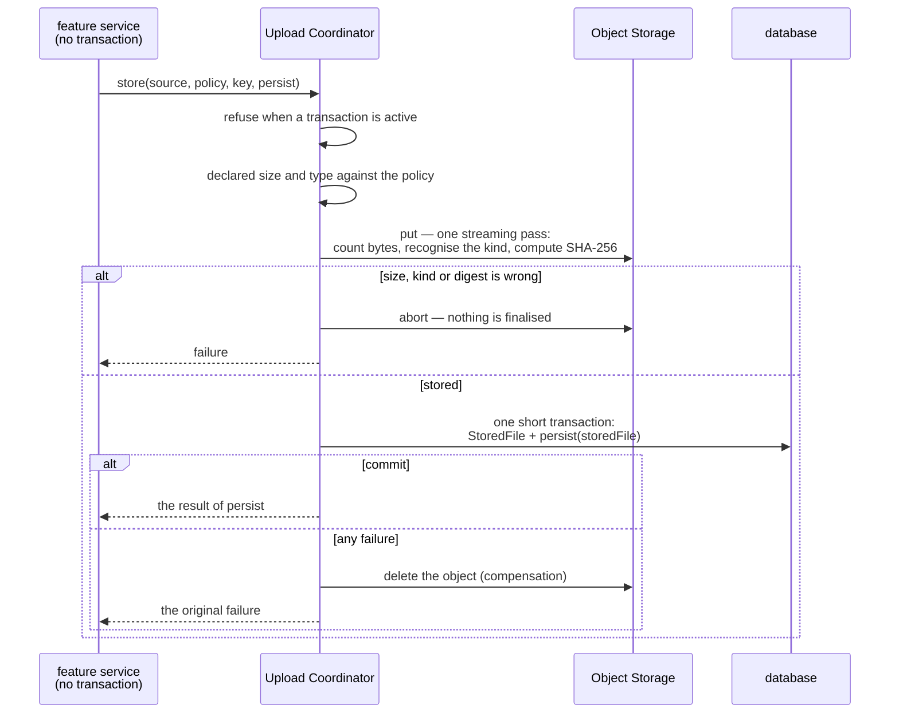
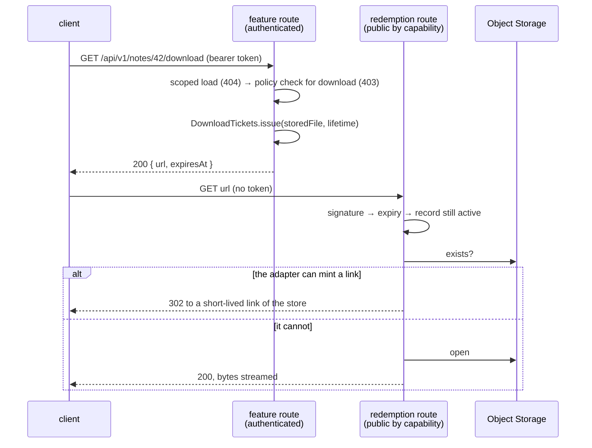
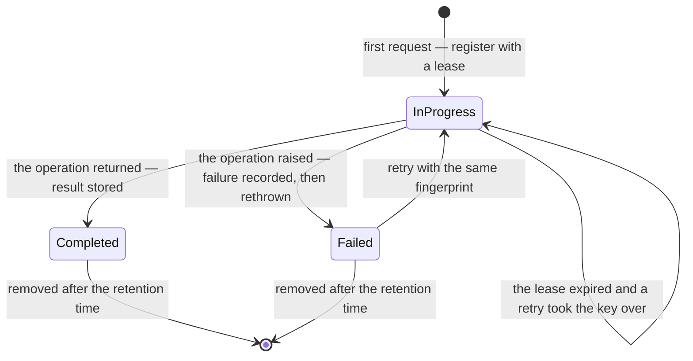
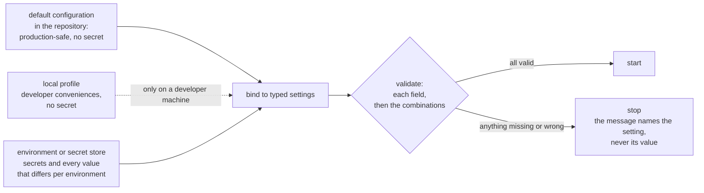
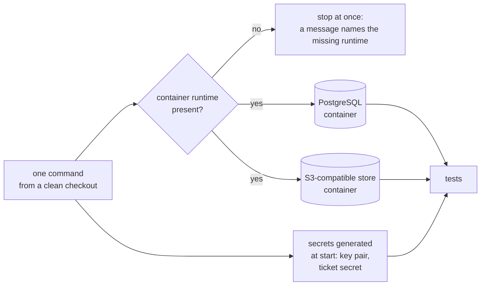
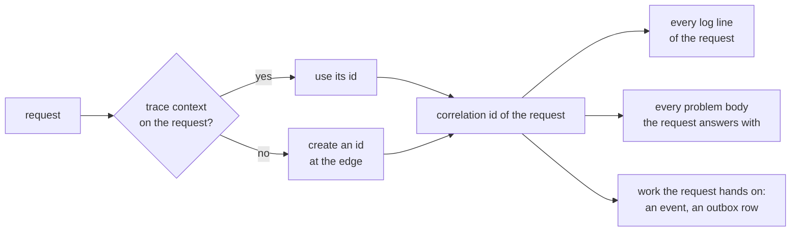
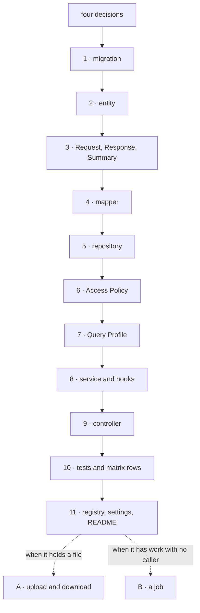

# Task: Guide Documents 10–16 and the Contract Review Gate — Storage, Idempotency, Configuration, Testing, Operations, Recipe, Traceability

#task #current #high-complexity #parent-spring-boot-architecture-guide-and-base-project

**Parent:** [[Features/to-do/Spring-Boot-Architecture-Guide-and-Base-Project|Spring Boot Architecture Guide, Base Project and Skill]]
**Parent Type:** Feature
**Related Step(s):** Phase 2 — Steps 2.4, 2.5 and 2.6 (Task 5 in the parent's Task Breakdown)
**Estimated Complexity:** High

---

## Goal

Write Guide documents `10-Object-Storage-and-Uploads`, `11-Idempotency`, `12-Configuration-and-Secrets`,
`13-Testing-Strategy`, `14-Observability-and-Operations` and `15-Recipe-Add-a-Feature` as drafts, with 88
rules (`G10-01` … `G15-05`), and `16-Traceability-Matrix`, which maps all 78 in-scope reference findings
to the rules that prevent them. Then run the **blind contract review** of the whole Guide (`GC-R` findings)
and close its gate — no Critical and no High finding open — because that gate is what lets the Skill
(Task 6) be written, and it is the day the Rule IDs become permanent.

---

## Parent Context

The parent Feature turns the analysis of the three Reference Projects into a **Guide**, a **Base
Project** and a rewritten **Skill**, and proves them with a **Validation Loop**. Phases execute
**1 → 2 → 4 → 5 → 3 → 6**. This Task is the last Task of Phase 2 and the fifth of 13.

What the parent says about this Task:

- **Step 2.4:** "Write Guide 10–11 (object storage and uploads incl. the optional replication extension;
  idempotency)."
- **Step 2.5:** "Write Guide 12–15 (configuration and secrets, testing strategy, observability, recipe)."
- **Step 2.6:** "Write Guide 16 (traceability matrix): every 🔴/🟠 reference finding plus every 🟡/🟢
  finding raised by a security-category review maps to a rule or a justified N/A; validator passes; user
  reviews the Guide. Then run a **blind design review of the module contracts** (fresh agent context;
  the review format of the analysis documents; finding IDs `GC-R<NN>-<MM>`; contracts judged on
  interfaces, invariants, error modes and cross-module interactions) and gate 0 🔴 / 0 🟠 before Phase 4
  (the Skill) starts. The Guide's contract layer is what is gated here; each document's prose is
  finalized later, against the built Base Project."
- **Reason for grouping:** "Remaining contract documents, the matrix that verifies the whole Guide, and
  the blind contract design review that gates the Skill. Guide prose stays at `draft` until Task 12."
- **Section 3 (the Guide documents)** gives one row of required content per document:

| # | Document | Content the parent requires |
|---|---|---|
| 10 | Object-Storage-and-Uploads | Storage port and adapters, object keys, streaming, `UploadSource` and its expected content digest, Upload Coordinator with digest-verified streaming and its no-transaction contract, compensation, downloads (`DownloadTicket`, one redemption controller, redirect-or-stream, header policy), optional replication extension |
| 11 | Idempotency | Keys, fingerprints (body hash for buffered requests; declared content digest for file requests, fail-closed), the two 422 meanings, states, leases, replay, cleanup, the spool fallback |
| 12 | Configuration-and-Secrets | Typed properties, fail-fast validation, profiles, no literal secrets (incl. the download-ticket secret and the CORS origins) |
| 13 | Testing-Strategy | Test layers, Testcontainers, contract tests, transaction-boundary tests, auth matrix, ArchUnit, what not to test |
| 14 | Observability-and-Operations | Health indicators, logging rules (parameterised, no personal data), SQL logging off by default |
| 15 | Recipe-Add-a-Feature | End-to-end walkthrough of adding one Feature Module |
| 16 | Traceability-Matrix | Every 🔴/🟠 reference finding plus every 🟡/🟢 finding of a security review → the rule(s) that prevent it, or "N/A — reason" |

- **Sections 10, 11 and 12** of the parent (storage, idempotency, configuration and operations), its
  **Testing Decisions** and its **Potential Issues** are the design these documents state.
- **The decisions are recorded as ADRs** and are this Task's requirements:
  [[ADRs/ADR-013-object-storage-port-upload-coordinator-and-download-tickets|ADR-013]] (storage, nine
  decisions), [[ADRs/ADR-014-idempotency-guard-opt-in-per-endpoint|ADR-014]] (idempotency, ten
  decisions), [[ADRs/ADR-009-unchecked-domain-exceptions-as-problem-details|ADR-009]] (the pinned
  statuses of tickets, digests and fingerprints),
  [[ADRs/ADR-010-postgresql-flyway-and-testcontainers|ADR-010]] (containers for tests),
  [[ADRs/ADR-006-identity-current-user-seam-and-removable-local-issuer|ADR-006]] (keys and origins from
  configuration; throttling as a deployment concern),
  [[ADRs/ADR-016-guide-document-format-and-rule-ids|ADR-016]] (the format, the matrix scope, the `GC-R`
  family), [[ADRs/ADR-015-validation-loop-protocol-and-exit-gate|ADR-015]] (what the tests of document
  13 must make possible), [[ADRs/ADR-003-version-baseline-as-a-support-policy|ADR-003]] (rules are
  version-neutral) and [[ADRs/ADR-002-code-free-skill-and-reference-base-project|ADR-002]].

What this Task enables:

- **Task 6** completes ADR-017 and rewrites the Skill against the gated contracts. The Skill cites Rule
  IDs; from the day the gate passes, a Rule ID is never renumbered and never reused.
- **Task 7** writes the reviewer prompt and the rule-coverage ledger of the Validation Loop. The ledger
  lists every Rule ID of the Guide; the `**Optional:**` rules of document 10 are the ones a review may
  mark as not applicable.
- **Task 12** finalises the prose of every document against the Base Project and lifts `#draft`.

Constraints from the parent and the memory bank:

- Documents are **drafts** (`#draft`): rules, IDs and module contracts are complete and binding.
- Rule text is behavioural. It names products, standards and the names this convention defines; it never
  names a framework class, method, annotation or property (ADR-003). Those live in Version Notes.
- A Guide document never links a Feature, Task or Bug document. No secret value appears in any new file.
- The three reference projects are read-only. ADRs are immutable once accepted.
- One home per rule (decided in Task 3): a rule that documents 01–09 already state is **cited**, not
  restated.

### Rules that already have a home in documents 01–09

Documents 10–16 cite these and do not restate them.

| Subject | Home | Cited from |
|---|---|---|
| Per-entry-point transactions; no storage call inside one | `G04-15` | 10, 14 |
| The order of checks at an entry point; `download` as an action | `G04-11`, `G04-07` | 10, 15 |
| The statuses of ticket redemption | `G05-12` | 10 |
| Search is never guarded by an idempotency key | `G05-11` | 11 |
| The public list and its contribution contract | `G08-26` | 10, 14 |
| Platform housekeeping touches only platform tables | `G08-07` | 10, 11, 14 |
| The signing key, the first administrator, the CORS origins | `G08-15`, `G08-23`, `G08-24` | 12 |
| Throttling per client address is the deployment layer's | `G08-22` | 13, 16 |
| The registry of problem types; the correlation id; the catch-all | `G09-04`, `G09-02`, `G09-06` | 10, 11, 14 |
| PostgreSQL in every environment, tests included | `G07-01` | 12, 13 |
| Unique constraints for what must hold under a race | `G07-13` | 11 |
| One owner per setting; a safety property is enforced by a signature or a start-up check | `G01-05`, `G01-04` | 10, 12 |
| Architecture tests run with the ordinary test run | `G02-11` | 13, 15 |
| The start-up check of a Query Profile | `G06-16` | 12 |

### Gaps in the parent that this Task closes

Each row is a contract point the parent and the ADRs leave open and a document of this Task must pin.
The Design Decisions section gives the reasoning. **The user confirms them in Step 1**; the rows marked
★ deserve a deliberate yes, because each becomes a rule whose ID is permanent after the gate.

| # | Gap | Resolution in this Task |
|---|---|---|
| J1 ★ | ADR-013 decision 5: "Which header is pinned is decided in the Guide." The parent offers `X-Content-SHA256` or RFC 9530 `Repr-Digest` | **`X-Content-SHA256`**, with the value `sha-256:<hex>` — the same value format as the multipart field, so a client has one format to produce (`G10-09`). |
| J2 ★ | ADR-013 writes `store(source, key, persist)` and says the coordinator "validates size and type itself" — against what is not said | `store` takes a fourth argument, the **Upload Policy** of the feature (largest size, allowed kinds), bounded by one platform ceiling that is also the source of the web server's limit (`G10-14`). |
| J3 ★ | "Validates … type": WP-R08-05 is exactly a type check that trusts the client. Task 4 left "the file-type check by content" to document 10. No status exists for it | The kind is recognised from the **leading bytes** in the single streaming pass and must be the declared type and on the policy's list (`G10-15`). A new problem type **`/problems/content-type-mismatch` (422)** — one row in document 09's registry and one phrase in document 05's 422 row (Step 9). |
| J4 ★ | ADR-013 decision 8: "the Guide defines how" an object is removed when its owner is deleted | **`StoredFiles.release`**, called inside the caller's transaction (it fails at once outside one — the mirror of `store`); the record becomes `released` with that commit; the platform deletes the object and then the record after the commit and retries. The module's invariant: no failure leaves an active record without its object (`G10-23`, `G10-24`). An **optional orphan sweep** handles a crash between transfer and record (`G10-25`). |
| J5 ★ | Document 05 says document 10 "specifies the ticket, the route that issues it and the response headers"; the parent's redemption route has no versioned prefix and offers an "optional actor-id binding" | Issuing: a `GET` ending in `/download` that answers 200 with `url` and `expiresAt`. Redemption: `GET /api/v1/files/download/{ticket}`. Checks in the order signature → expiry → record → object. **No actor binding** in the ticket (`G10-16`, `G10-17`, `G10-19`, `G10-22`). |
| J6 ★ | "Redirect when the adapter can mint one": ADR-013 fixes the port at four operations. `StoredFile` has six fields in ADR-013, none of which is a name to download under or a state | A separate capability, **`DirectLinks`**, that an adapter may offer; the port keeps four operations. `StoredFile` gains a **download name** and a **state** (`G10-08`, `G10-20`). |
| J7 ★ | The parent says the interceptor "reads the client `Idempotency-Key` header" — what if a guarded endpoint gets none? | A guarded endpoint **requires** the key; a request without it is invalid (400). A key is 1–255 visible ASCII characters, scoped by the actor (`G11-03`). |
| J8 ★ | States are "`COMPLETED` (stored response) or `FAILED`" — what does a retry of a failed key do, and does a different request under a failed key pass? | A failure is **not replayed**: a retry with the same fingerprint runs the operation again. A different fingerprint is rejected (422) in **every** state (`G11-05`, `G11-07`). |
| J9 ★ | Nothing says where the guard sits among the failures of `G09-14`, where its own writes sit, nor what it cannot guarantee | The guard runs after "not authenticated" and "invalid by itself" and before the entry point; an invalid request registers no key (`G11-15`). It writes in short transactions of its own and holds none while the operation runs (needed for `G10-10`). Its limit is stated: a crash between the operation's commit and the recording of the result allows one more execution after the lease; an operation that must never repeat also holds a unique constraint (`G11-10`, `G11-11`, `G11-12`). |
| J10 ★ | "Typed `@ConfigurationProperties` records … per Platform Module" — the names of the settings are not given; only `app.identity.mode` and `app.storage.provider` exist | The **settings catalogue** of document 12 (`app.<module>.*`), a **`Secret`** type whose text form is masked, and "no profile named after a deployed environment" (`G12-01`, `G12-06`, `G12-09`). |
| J11 ★ | "Route × role matrix (anonymous → 401, wrong role → 403, owner/other user, allowed role → 2xx)" — its exact shape, and whether public routes are in it | Four cases per route: no token (401); an actor the policy does not allow — **one who can see the row**, because the scoped load comes first (`G04-11`) and an actor who cannot see it gets 404 (403); allowed (2xx); row not visible (404). A case that cannot occur is written down with its reason. Run with **real tokens** in every supported identity mode; the route-coverage test includes public routes, each as a row that says so (`G13-03`, `G13-04`, `G13-05`). |
| J12 ★ | WP-R01-12 (SSRF, a security-review finding, so in the matrix scope) has no home in the parent's sixteen rows. The parent does not say whether the public health answer shows details | Two rules on calls to other systems in document 14: timeouts everywhere, and a caller-supplied address is resolved and checked first (`G14-12`, `G14-13`). Public health answers the status only; whether the object store makes an instance not ready is the project's written choice (`G14-01`, `G14-02`). |
| J13 ★ | Step 2.6 names the contract review but not its protocol: how many reviews, what the reviewer may read, how a finding is closed | Five reviews by document group, each in a fresh context that reads only the Guide and the review format; a **`**Resolution:**` line** per finding (one bullet added to `Guide-Conventions` section 8); a Critical or High finding is closed only by a fix that a second fresh review confirms, or by withdrawal; at most three rounds (Steps 11–12). |
| J14 | The multipart wire form | The file part is `file`; its digest is the form field `fileDigest`; non-file fields precede the file part, so the server can read them without reading the file. |
| J15 | "Canonical non-file fields (the body hash)" | For a buffered body, the bytes as received — no JSON canonicalisation; for a file request, the non-file fields in name order and each declared digest (`G11-04`). |
| J16 | Who decides that the spool fallback applies | The endpoint, on its marker — never a storage adapter (`G11-13`). |
| J17 | Which rules a validation review may skip | Two rules carry `**Optional:**`: the orphan sweep (`G10-25`) and storage replication (`G10-26`). |
| J18 | Whether the recipe states rules | Five (`G15-01` … `G15-05`): ADR-014 decision 10 puts the "uploads carry the marker" default in the recipe, and a ledger can only check a rule that has an ID. |
| J19 | The matrix may use `N/A — reason` | It needs none: all 78 findings have at least one rule; 10 rows are `partial`. A Defect column carries each finding's title. |
| J20 | "`inline` only for a safe-media allowlist" — its content | Raster images and PDF by default; never HTML or SVG (`G10-21`). |
| J21 | Expired idempotency records | A record past its retention time counts as absent even before the clean-up removes it (`G11-14`). |

### Inconsistencies in the parent, found while creating this Task

None blocks the Task; each is resolved by a row above and reported so the user can correct the parent if
they wish (the parent is not edited beyond ticking Steps 2.4–2.6 and its Task link).

1. Section 10 writes `store(UploadSource source, ObjectKey key, Function<StoredFile, T> persist)` — three
   arguments, with no input for the size and type it must validate (J2).
2. Section 10 writes the redemption route as `GET .../files/download/{ticket}`, without the versioned
   prefix every API route has (`G05-01`) (J5).
3. Section 10 lists six `StoredFile` fields and an `UploadSource` without a file name; a download then
   has no name to present (J6).
4. Section 10 keeps "optional actor-id binding in the ticket" next to "the ticket is a bearer
   capability"; the two are different contracts (J5).
5. Step 2.6 expects rows with "a justified N/A"; the matrix written here has none (J19).
6. Testing Decisions says the validator tests follow "the existing 44 tests"; there are 104.
7. Section 3 has no row for calls to other systems, while WP-R01-12 is in the matrix scope (J12).

---

## Preconditions / Dependencies

- **Tasks 1–4 are done.**
  [[Tasks/done/Spring-Boot-Architecture-Guide-and-Base-Project-step-4-guide-query-persistence-identity-errors]]
  wrote documents 06–09; `documentation/Docs/Guide/` holds documents 01–09 (141 rules), the conventions
  and the index.
- **State of the repository at creation (2026-10-05, measured in `/home/jlievano/Documents/spring-skills`
  at commit `e253ec3`, working tree clean):**
  - `python3 scripts/validate-analysis-docs.py guide` exits 0; `python3 -m unittest discover -s
    scripts/tests` runs 104 tests, all passing.
  - The index reports `Draft documents: 9`, `Version Notes not verified: 38`, and lists documents 10–16
    as `planned`.
  - Documents 02, 03, 05, 08 and 09 name documents 10–15 in inline code 17 times (1, 1, 5, 5, 5); the
    index names 10–16 seven times.
  - `documentation/Tasks/current/` was empty.
- **Three things differ on this machine from what the memory bank describes. Read them before Step 1.**
  1. **`BugTracker/` and `wpmanager/` are empty directories here.** They are git links with no
     `.gitmodules`, and this checkout never fetched them. `backend/` is present (it is tracked). As a
     result `python3 scripts/validate-analysis-docs.py backend|BugTracker|wpmanager` exit 1 here (8, 670
     and 887 "path does not exist" lines) — a property of this checkout, not a defect of the documents.
     The `guide` target is not affected: the Guide cites one source path, `backend/pom.xml:30`. This Task
     needs the review documents under `documentation/Docs/<project>/Reviews/` (present), not the
     projects' sources.
  2. **`scripts/.snapshots/` does not exist here** (it is git-ignored and local to the machine that
     created it). The three "reference project unchanged" checks cannot run. `git status` still shows
     any change to `backend/`.
  3. **`.glossaryrc` points at another copy of the repository**
     (`/home/jlievano/Dropbox/CodeProjects/spring-boot-backend-skill/…`), whose glossary has 4 categories
     and none of the Guide's terms. `glossary` run from the repository root reads and **writes that other
     copy**. The workspace glossary (`documentation/Glossary/glossary.json`, 6 categories, 64 terms) is
     the right one. Step 13 must not run `glossary add` until this is settled with the user. The
     `glossary` command is also not on the `PATH` here; it is
     `~/.claude/skills/glossary-management/cli/glossary`.
- **The validator is not changed by this Task.** `Guide-Conventions.md` gains one bullet and one
  changelog line (Step 11, gap J13) — the user confirms that in Step 1.
- **Traps of the `guide` target** (read in `scripts/validate-analysis-docs.py`; they shape every edit to
  a document and every review file):

| Trap | Rule to follow |
|---|---|
| Every `G<NN>-<MM>`, `<PROJ>-R<NN>-<MM>`, `GC-R<NN>-<MM>` and `ADR-NNN` written anywhere — prose, tables, inline code, fenced blocks — must resolve | Cite only rules, findings and ADRs that exist. A review may cite a `GC-R` ID only of a finding that is written. |
| A wiki link must resolve, and none may point into `Features/`, `Tasks/` or `Bugs/` | This holds for review files too. |
| A backticked path that starts with `backend/`, `BugTracker/`, `wpmanager/`, `base-project/` or `documentation/Docs/Validation/` and continues is a source citation and must exist | `` `backend/` `` alone is fine. Write no `base-project/…` path. A reviewer must not cite `BugTracker/…` or `wpmanager/…` source paths — they do not exist on this machine. |
| Inside `## Rules`, every `###` heading is a Rule ID, and a line that starts with `**Word:**` ends the field before it | Free text after a rule's fields must not start a line with a bold label. |
| Inside `## Findings` of a review, every `###` heading is a Finding ID, and six fields are required: Title, Severity, Evidence, Recommendation, Verified against, Confidence | Use the template of Step 11 unchanged. |
| `## Version Notes` accepts only `- ` items that start with a marker | Never put a full stop or a comma directly after a URL. |
| `## Traceability Matrix`: a row whose first cell holds exactly one Finding ID is a mapping; each in-scope finding needs exactly one | Do not add a second table with Finding IDs in the first column to that section. |
| The index must link every document, **every review file included**, and report true counts | Update the index in the same step as the file. |
| As soon as one review exists, `Reviews/00-Review-Summary.md` must exist and name every `GC-R` ID | Write the summary in the same step as the reviews. |
| The words `TODO`, `TBD`, `FIXME` and a bracketed ellipsis are rejected outside code | — |

- **`base-project/` and `documentation/Docs/Validation/` do not exist.** A `verified` Version Note can
  cite only a reference Finding ID or a version-tagged URL.
- **The version line for Version Notes is Spring Boot 4.1.x**, which manages Spring Framework 7.0.x and
  Spring Security 7.1.x.
- **`rg` is a shell function of the agent harness here, not a binary.** Commands use `grep`.
  **`obsidian.use_cli` is `false`.**
- **A way to start a fresh agent context must exist** for Steps 11 and 12 (a subagent, or a new session
  the user starts). The executor's own context has read this Task and is never the reviewer.
- **The user must be available** for Step 1 (the gaps), Step 10 (reading the documents), Step 12 (every
  Critical and High finding), Step 13 (the glossary) and the Manual Validation items.

---

## Skills and Documentation Preparation

### Skills Reviewed

- `documentation-management` — **Selected** — Task template, document locations, the "only modify files
  when asked" rule.
- `memory-bank` — **Selected** — project context; Step 14 updates the agent-maintained files. The skill
  is not registered in this runtime; its instructions were read from `~/.agents/skills/memory-bank/` and
  all seven memory files were read.
- `glossary-management` — **Selected** — the documents use the glossary's terms as defined (*Object
  Storage*, *Upload Coordinator*, *Download Ticket*, *Idempotency Guard*, *Idempotency Key*,
  *Compensation*, *Contract Review*, *Traceability Matrix*, *Draft Marker*, *Entry Point*, *System
  Actor*); Step 13 proposes eleven new terms. The terms were read through the CLI with a read-only
  scratch configuration, because of the `.glossaryrc` problem above.
- `doc-exploration` — **Selected (at creation)** — 18 ADRs checked: 013 and 014 read in full; the
  decisions of 003, 009, 010, 015 and 016; the rest by title in the index. 10 are cited as evidence by
  the new rules (002, 004, 005, 006, 009, 010, 011, 013, 014, 018); 001, 008, 015 and 016 are linked.
- `solid-deep-design` — **Selected** — the test applied to every module these documents define (table
  in "Approach").
- `find-docs` — **Selected** — version-matched documentation for every `verified` Version Note (table
  below). The `ctx7` CLI is not installed here; the Context7 MCP tools and direct reads of the versioned
  pages were used instead.
- `tdd` — **Selected, adapted** — this Task writes no application code. Its public interfaces are two
  CLIs: the validator and `gate.py` (Step 12). The expected red state after each step is given.
- `task-reviewer` — **Selected (at creation)** — reviewed this document.
- `task-executor` — **Not needed here** — it is the skill that will execute this Task.
- `interview-me`, `feature-creator`, `improve-codebase-architecture` — **Not needed** — the design was
  decided in D1–D18 and the ADRs; the open points are listed for the user in Step 1.

Exploration at creation was done directly, not through subagents (`Memory/known-issues.md` records that
agent inventories produced wrong leads): the impact and the recommendation of every finding a new rule
cites were read in its review document.

### Documentation Reviewed

All read on 2026-10-05. `docs.spring.io` redirected the versioned address of each current line to the
unversioned one — today also for Spring Security 7.1; each page below was reached that way and its
header shows the version given. The Version Notes cite the **versioned** address (memory bank).

| Source | What was checked | Result |
|---|---|---|
| Spring Framework **7.0** javadoc (page shows 7.0.9) — `org/springframework/transaction/annotation/Propagation.html` | The no-transaction propagation setting | `NEVER`: "Execute non-transactionally, throw an exception if a transaction exists." |
| Spring Framework reference 7.0 — `data-access/transaction/programmatic.html` | A short transaction around a block | `TransactionTemplate.execute` with a callback; `setRollbackOnly`. **The page does not say** that an unchecked exception from the callback rolls back — that part is a `not verified` note. |
| Spring Framework reference 7.0 — `web/webmvc/mvc-ann-async.html` | Streaming a response | `StreamingResponseBody` writes to the response stream without message conversion, on a thread of the configured `AsyncTaskExecutor`. |
| Spring Boot reference **4.1** (page shows 4.1.1) — `features/external-config.html` | Typed settings, profiles | Profile files `application-{profile}` override the default file; relaxed binding of environment variables; a record binds through its constructor. The fetch was cut before the validation section. |
| Context7 `/spring-projects/spring-boot/v4.1.0` (snippet source at tag `v4.1.0`, the same page) | Validation of settings types | Validated when the type carries `@Validated`, with `jakarta.validation` constraints; a nested type needs `@Valid`. What happens at start-up on failure was **not** in the snippets — a `not verified` note. |
| Spring Boot reference 4.1 — `actuator/endpoints.html` | Health | Only `health` is exposed over HTTP by default; `management.endpoint.health.show-details` defaults to `never`; `org.springframework.boot.health.contributor.HealthIndicator`; `/actuator/health/liveness` and `/readiness`. |
| Spring Boot reference 4.1 — `testing/testcontainers.html` | Containers in tests | `@ServiceConnection` (module `spring-boot-testcontainers`) with `@Testcontainers` and `@Container`; `@DynamicPropertySource` as the alternative. |
| Spring Security reference **7.1** (page shows 7.1.1) — `servlet/test/mockmvc/oauth2.html` | Simulated tokens | The `jwt()` request post-processor builds an authentication without the application's decoder. |
| Context7 `/aws/aws-sdk-java-v2` | The S3 client and the presigner | `endpointOverride`, `forcePathStyle`, `apiCallTimeout`, `apiCallAttemptTimeout` (off by default), `S3Presigner.presignGetObject` with `signatureDuration`. **The snippets come from `master`, not from a tagged version**, and the SDK is not in Spring Boot's managed set: every SDK detail is a `not verified` note. |
| The three review sets under `documentation/Docs/<project>/Reviews/` | Every finding cited by a new rule | 88 rules cite 80 distinct findings; 48 of them are not cited by documents 01–09. |
| ADR-003, ADR-009, ADR-010, ADR-013, ADR-014, ADR-015, ADR-016 | The decisions the rules state | See "Parent Context". |

Not looked up, and marked `not verified` in the documents: the mechanism that honours the idempotency
marker, body caching for the fingerprint, the after-commit hook, multipart parsing and its limits,
Testcontainers 2.0 module names, ArchUnit, the tracing support, database job locks, HTTP client
timeouts.

### Related Existing Code

- `documentation/Docs/Guide/Guide-Conventions.md` — the format contract; section 8 (contract reviews)
  and section 9 (the matrix) are applied for the first time by this Task.
- `documentation/Docs/Guide/Guide-Index.md` — seven rows, two counts, the Reviews section, the changelog.
- `documentation/Docs/Guide/09-Errors-and-Validation.md` — the registry of problem types that documents
  10 and 11 specify, and the style every new document follows.
- `documentation/Docs/Guide/02-…`, `03-…`, `05-…`, `08-…`, `09-…` — 17 inline-code names become links.
- `documentation/Docs/Analysis-Doc-Conventions.md` — sections 5–7: the review template, the severity
  scale and the finding-ID rules the contract reviews use.
- `scripts/validate-analysis-docs.py:447-487` — the matrix scope and the row check;
  `scripts/validate-analysis-docs.py:522-541` — which files may exist under `Docs/Guide/`;
  `scripts/validate-analysis-docs.py:248-273` — the fields of a review finding. **Not edited.**
- `documentation/Docs/<project>/Reviews/NN-*-Review.md` — where a Finding ID resolves.

---

## Implementation Details

### Approach

**The documents are written here, in full, and were proven before the Task was written** — the method
of Tasks 3 and 4. All seven were built in the session scratchpad and run through the real validator
against a copy of the real documentation: the final state exits 0, the state after each document was
measured, and the documents were rebuilt from this Task's text alone and validated again. The executor's
work on Steps 2–9 is to settle the open points with the user, write the files and read the validator's
output — not to re-derive 88 rules.

**The contract review is not written here, and must not be.** Its value is that the reviewer has not
seen this Task, the parent Feature or the reasoning behind any rule. Steps 11 and 12 give the protocol,
the prompt, the file format (proven against the validator with a sample) and the gate check.

**Contract first.** Each `Design` section states modules by contract — entry points, invariants, error
modes, interactions — with a diagram where there is a flow. Code appears only as short Java-like
sketches that fix names of this convention and no framework syntax.

**Applying `solid-deep-design` to the modules these documents define:**

| Module | Interface | What it hides | Seam / deletion test |
|---|---|---|---|
| Object storage port | four operations | the store's protocol, streaming, atomic replacement | A real seam: two production adapters and the suite's use |
| `DirectLinks` | one operation | how a store mints a short-lived link | Offered by the adapters that can; an adapter that cannot is not forced to pretend (ISP) |
| Upload Coordinator | one operation | where the transaction sits, the single pass, size, kind and digest checks, compensation, the alert | Deleting it puts all of that into every upload |
| Download Tickets + redemption route | one operation, one route | signing, expiry, the order of checks, redirect or stream, the header policy | Deleting it makes every feature a file server |
| `StoredFiles.release` | one operation | the order of deletes, the retry, the state | Deleting it brings back "a delete route that skips storage clean-up" |
| Idempotency Guard | one operation | the key scope, its place among the failures, the state machine, the lease, the race, replay, failure recording | Deleting it puts a multi-call protocol into every retried endpoint |
| Typed settings + `Secret` | a type per module | binding, validation, masking | Deleting them brings back names read as strings in many places |
| Authorization matrix + route-coverage test | a table and one test | the comparison with the registered routes | Deleting it leaves authorization to whoever remembers a test |

Three interfaces a feature uses in `platform.storage` and one in `platform.idempotency` — within the
"one to four entry points" of `G01-02`. `platform.idempotency` and `platform.storage` do not depend on
each other (`G02-03`): the digest crosses between them as text, at the HTTP edge.

**Service language and wire language** (kept from Tasks 3 and 4): documents 10 and 11 state outcomes in
the words of the service ("rejected as invalid", "answered as not found") and name the problem type;
document 09 owns the registry.

**Order and validation.** Documents are written 10 → 16 and the validator runs after each. Until Step 9
the run fails **only** on links to documents not yet written and on the index — a filter in Step 2
hides exactly those lines, and whatever is left is a real error. After Step 9 the target exits 0.

### What this Task leaves to later work

| Later work | Left open here, on purpose |
|---|---|
| Task 6 (the Skill) | How the Skill words these rules and loads the documents |
| Task 7 (validation protocol) | The reviewer prompt and the rule-coverage ledger of validation runs; which rules a ledger may mark not applicable beyond the two `**Optional:**` ones |
| Tasks 9–12 (the Base Project) | Every `not verified` Version Note; the conformance list of document 13 as real test names; the choice of the mechanism that honours the idempotency marker; the lock for jobs |
| Task 12 | The prose of all sixteen documents and the removal of `#draft` |
| A project that needs it | Replication (specified, not built); deeper content inspection of uploads; an anonymous actor |

### Files to Create/Modify

- [ ] `documentation/Docs/Guide/10-Object-Storage-and-Uploads.md` — **new**; 26 rules (Step 2)
- [ ] `documentation/Docs/Guide/11-Idempotency.md` — **new**; 15 rules (Step 3)
- [ ] `documentation/Docs/Guide/12-Configuration-and-Secrets.md` — **new**; 14 rules (Step 4)
- [ ] `documentation/Docs/Guide/13-Testing-Strategy.md` — **new**; 15 rules (Step 5)
- [ ] `documentation/Docs/Guide/14-Observability-and-Operations.md` — **new**; 13 rules (Step 6)
- [ ] `documentation/Docs/Guide/15-Recipe-Add-a-Feature.md` — **new**; 5 rules (Step 7)
- [ ] `documentation/Docs/Guide/16-Traceability-Matrix.md` — **new**; 78 rows, no rule (Step 8)
- [ ] `documentation/Docs/Guide/02-Project-Layout-and-Module-Boundaries.md`, `03-Feature-Module-Anatomy.md`,
  `05-API-Contract.md`, `08-Identity-Authentication-and-Authorization.md`, `09-Errors-and-Validation.md` —
  the link pass: 17 names become links; one phrase in 05 and one registry row in 09 (Step 9)
- [ ] `documentation/Docs/Guide/Guide-Index.md` — seven rows, two counts, changelog (Step 9); the Reviews
  section and the gate line (Steps 11–12)
- [ ] `documentation/Docs/Guide/Guide-Conventions.md` — one bullet in section 8, one changelog line
  (Step 11)
- [ ] `documentation/Docs/Guide/Reviews/01-Principles-Layout-and-Feature-Anatomy-Review.md`,
  `02-CRUD-API-and-Query-Contracts-Review.md`, `03-Persistence-Identity-and-Errors-Contracts-Review.md`,
  `04-Storage-and-Idempotency-Contracts-Review.md`, `05-Cross-Module-Interactions-Review.md` — **new**,
  written by blind reviewers (Step 11)
- [ ] `documentation/Docs/Guide/Reviews/00-Review-Summary.md` — **new** (Step 11)
- [ ] `documentation/Docs/Guide/Reviews/06-Fix-Verification-Review.md` — **new, only if** a verification
  round raises a new finding (Step 12)
- [ ] Any Guide document a contract finding requires to change (Step 12) — known only after the review
- [ ] `documentation/Features/to-do/Spring-Boot-Architecture-Guide-and-Base-Project.md` — tick Steps 2.4,
  2.5 and 2.6 (Step 14). The Task link of Task 5 is set when this Task is created.
- [ ] `documentation/Glossary/glossary.json`, `documentation/Glossary/Glossary.md` — **through the
  `glossary` CLI only**, and only the terms the user confirms (Step 13)
- [ ] `documentation/Memory/context.md`, `progress.md`, `architecture.md`, `known-issues.md`, `tech.md`
  (Step 14)

**Not modified:** `scripts/validate-analysis-docs.py`, both test files,
`documentation/Docs/Analysis-Doc-Conventions.md`, Guide documents 01, 04, 06 and 07 (unless a contract
finding requires it in Step 12), every existing ADR, `documentation/Memory/brief.md`, the three
reference projects, `.glossaryrc` (unless the user says so).

Scratch files (session scratchpad, not committed): `extract_docs.py` (Step 2), `link_pass.py` (Step 9),
`rule_evidence.py` (Step 9), `conventions_pass.py` (Step 11), `gate.py` (Step 12).

---

## Step-by-Step Implementation

### Step 1: Record the baseline and settle the open points with the user

**Goal:** Nothing is written until the environment is understood and the contract choices are confirmed.
**Dependencies:** None. **Needs the user.**

- [ ] Run the baseline and keep the output:

```bash
python3 scripts/validate-analysis-docs.py guide; echo "guide exit=$?"
python3 -m unittest discover -s scripts/tests 2>&1 | tail -3
git status --short | head; git log -1 --format='%h %s'
ls documentation/Tasks/current/
ls BugTracker wpmanager | wc -l; ls scripts/.snapshots 2>&1 | head -1
sha256sum scripts/validate-analysis-docs.py scripts/tests/*.py documentation/Docs/Analysis-Doc-Conventions.md \
  documentation/Docs/Guide/01-*.md documentation/Docs/Guide/04-*.md documentation/Docs/Guide/06-*.md \
  documentation/Docs/Guide/07-*.md documentation/ADRs/ADR-0[01][0-9]-*.md > <scratchpad>/frozen.sha256
wc -l < <scratchpad>/frozen.sha256
grep -c -o -E '`1[0-6]-[A-Za-z-]+`' documentation/Docs/Guide/0[2-9]-*.md documentation/Docs/Guide/Guide-Index.md
```

  Expected: `guide exit=0`; `Ran 104 tests` and `OK`; only this Task (and the parent's link line) as
  changes; this Task in `Tasks/current/`; `26` frozen files (the validator, two test files, one
  conventions document, four Guide documents, eighteen ADRs); the name counts `1`, `1`, `5`, `5` and `5`
  for documents 02, 03, 05, 08 and 09, `0` for 04, 06 and 07, and `7` for the index.
- [ ] Read the output of `ls BugTracker wpmanager | wc -l` and `ls scripts/.snapshots`:
  - `0` and "No such file" — this is the machine described in Preconditions. The three project targets
    and the three snapshot checks are **skipped**, and the final report says so.
  - Otherwise the reference projects are present: run
    `for p in backend BugTracker wpmanager; do python3 scripts/validate-analysis-docs.py "$p" >/dev/null; echo "$p exit=$?"; done`
    and `for s in backend bugtracker wpmanager; do sha256sum --quiet -c scripts/.snapshots/$s.sha256 && echo "$s unchanged"; done`,
    expect three `exit=0` and three `unchanged`, and repeat both at the end.
- [ ] Tell the user the three environment findings of Preconditions and ask what to do about
  `.glossaryrc` (Step 13 needs the answer; the other two need no action for this Task).
- [ ] Show the user the table "Gaps in the parent that this Task closes" and ask for confirmation of the
  ★ rows J1–J13. Record each answer.
- [ ] Show the user the list "Inconsistencies in the parent" and ask whether the parent should be
  corrected. This Task does not edit the parent beyond the ticks unless the user says so.
- [ ] If the user changes a point, change the affected text **before** writing the document (the edge
  cases below say where each point lives).

**Why this step is critical:**
Thirteen of these choices are in no ADR. After the gate a Rule ID is permanent: a choice the user would
have made differently is cheap to change now and costs a withdrawn rule later.

#### Edge Cases
1. **Case:** the user prefers RFC 9530 `Repr-Digest` (J1) — in document 10 change the raw-body row of
   the "What arrives" table and the sentence under it (the header value is then `sha-256=:<base64>:`,
   and the multipart field keeps `sha-256:<hex>` — say that the two forms differ); `G10-09` names no
   header and stays.
2. **Case:** the user wants `store` with three arguments (J2) — the policy must still reach the
   coordinator: move `UploadPolicy` into `UploadSource` in the sketch, and reword `G10-14` ("the Upload
   Policy carried by the upload source"). Say to the user that a caller-built source then carries the
   feature's rule.
3. **Case:** the user rejects the content check (J3) — remove `G10-15`, the "recognise the kind" parts
   of the coordinator's steps and diagram, the `content-type-mismatch` row of the outcome table, and
   the two `EDITS` of `link_pass.py`. WP-R08-05 then has no rule: its matrix row is not in scope (🟡,
   not a security review), but say so to the user. Renumber nothing: `G10-16` … keep their IDs only if
   the rule is **withdrawn** instead of removed; before the gate, removing and closing the gap in the
   numbering is allowed — the validator does not require consecutive numbers, so prefer leaving the gap.
4. **Case:** the user wants objects deleted inside the transaction, or by each feature (J4) — this
   contradicts ADR-013 decision 8 ("must not be left to each feature"): stop and ask.
5. **Case:** the user wants the actor bound into the ticket (J5) — add the actor's user id to the
   payload in "The ticket", add a check row "the caller's token names the same user" after the expiry
   row, and reword `G10-22`: the route then reads the token and is no longer usable from a link or an
   image element. Put that consequence to the user first.
6. **Case:** the user wants a fifth port operation instead of `DirectLinks` (J6) — change the sketch and
   the adapter table; `G10-20` does not change; note in Design Decisions that ADR-013's depth statement
   then reads "five".
7. **Case:** the user wants a missing key to mean "run unguarded" (J7) — reword the last sentence of
   `G11-03` and the last bullet of "The key"; add to Design Decisions that the guard is then fail-open
   for a client that forgets the header.
8. **Case:** the user wants failures replayed (J8) — reword `G11-07` and the `failed` row of the outcome
   table; the stored result then includes failures, and `G11-08` needs "or the failure".
9. **Case:** the user changes a setting name (J10) — change it in the catalogue of document 12 and
   wherever documents 10 and 12 use it (`grep -n 'app\.' <the two files>`).
10. **Case:** the user rejects the outbound-call rules (J12) — remove `G14-12`, `G14-13` and the section
    "Calls to other systems"; the matrix row of WP-R01-12 becomes `N/A — <the user's reason>`.
11. **Case:** the user wants a different review split or to see the reviewer prompt first (J13) — change
    the table and the prompt of Step 11 before running it.
12. **Case:** the user is not available — stop here.

---

### Step 2: Write document 10 — Object Storage and Uploads

**Goal:** The contract of `platform.storage`: the port, the upload, the download, the removal.
**Dependencies:** Step 1.

- [ ] Save `extract_docs.py` (below) in the scratchpad. Run
  `python3 <scratchpad>/extract_docs.py documentation/Tasks/current/Spring-Boot-Architecture-Guide-and-Base-Project-step-5-guide-contracts-gate.md <scratchpad>/guide-docs`.
  Expected: seven lines, one per document, and `7 document(s) written`. The files are byte-exact copies
  of the fenced blocks of Steps 2–8. (Copying each block by hand is equivalent, as long as the copy is
  exact.)
- [ ] If a gap of Step 1 changed a document, edit the extracted file now.
- [ ] Copy `<scratchpad>/guide-docs/10-Object-Storage-and-Uploads.md` to `documentation/Docs/Guide/`.
- [ ] Run the filtered validation (use this same command after Steps 3–8):

```bash
python3 scripts/validate-analysis-docs.py guide | grep -v -E \
  'wiki link \[\[Docs/Guide/1[0-6]-[A-Za-z-]+\]\] does not resolve|Guide-Index\.md: (does not link|reports)'
```

  Expected: **no output**. (Unfiltered, the validator prints 12 lines now: links to documents 11–15 and
  the index.)

**Why this step is critical:**
The Critical upload defects of wpmanager (a file-less row that blocks retries, objects left behind,
anonymous bucket access) are all closed by this one contract.

#### Implementation

`extract_docs.py`:

`````python
"""Write the Guide documents that a Task document embeds as five-backtick `markdown` blocks.

    python3 extract_docs.py <task document> <output directory>      # read-only on the Task document
"""
import pathlib, re, sys

task, out = pathlib.Path(sys.argv[1]), pathlib.Path(sys.argv[2])
NAMES = {
    "# Object Storage and Uploads": "10-Object-Storage-and-Uploads.md",
    "# Idempotency": "11-Idempotency.md",
    "# Configuration and Secrets": "12-Configuration-and-Secrets.md",
    "# Testing Strategy": "13-Testing-Strategy.md",
    "# Observability and Operations": "14-Observability-and-Operations.md",
    "# Recipe: Add a Feature": "15-Recipe-Add-a-Feature.md",
    "# Traceability Matrix": "16-Traceability-Matrix.md",
}
out.mkdir(parents=True, exist_ok=True)
written = 0
for block in re.findall(r"^`````markdown\n(.*?)^`````$", task.read_text(encoding="utf-8"), re.M | re.S):
    name = NAMES.get(block.split("\n", 1)[0])
    if name:
        (out / name).write_text(block, encoding="utf-8")
        print(f"{name}: {len(block.splitlines())} lines")
        written += 1
print(f"{written} document(s) written")
`````

Document 10:

`````markdown
# Object Storage and Uploads

#doc #guide #architecture #security #api-design #draft

**Guide:** [[Docs/Guide/Guide-Index]] · **Conventions:** [[Docs/Guide/Guide-Conventions]]

## Purpose

This document is the contract of `platform.storage`: how a binary object is stored, recorded, served and
removed, on an S3-compatible store or on a local disk. A feature uses three operations — store a file,
issue a Download Ticket, release a file — and writes no transaction code, no clean-up code and no
storage call of its own. The one idea to take away: the record in the database is the truth. Every
failure path may leave an object that no record names, which is garbage to be collected; none may leave
a record whose object is missing, which is a broken download.

## Design

### What a feature uses, and what stays inside

Design sketch in Java-like notation. It fixes names and shapes of this convention, not framework syntax.

```java
// platform.storage — the three entry points a feature uses
interface UploadCoordinator {
  <T> T store(UploadSource source, UploadPolicy policy, ObjectKey key, Function<StoredFile, T> persist);
}
interface DownloadTickets {
  DownloadTicket issue(StoredFile file, Duration lifetime);
}
interface StoredFiles {
  void release(StoredFile file);            // only inside the caller's transaction
}

record UploadSource(InputStream content, long declaredSize, String declaredType,
                    String fileName, ContentDigest expectedDigest) {}   // cannot be built without a digest
record UploadPolicy(long maxSize, Set<ContentKind> allowedKinds) {}
record ObjectKey(String value) {}           // built by the feature's one key function

// platform.storage — the seam; only code of this module calls it
interface ObjectStorage {
  StoredObject put(ObjectKey key, InputStream content, ObjectMetadata metadata);
  InputStream open(ObjectKey key);          // streams; ObjectNotFound when absent
  boolean exists(ObjectKey key);
  void delete(ObjectKey key);               // succeeds when the object is already gone
}
interface DirectLinks {                     // offered only by an adapter that can mint a link
  URI linkFor(ObjectKey key, Duration lifetime, DownloadHeaders headers);
}
```

| Part | Used by | Job |
|---|---|---|
| `UploadCoordinator.store` | a feature service | Store a file and record it, as one step for the caller |
| `DownloadTickets.issue` | a feature service | Turn an authorized request into a short-lived capability |
| `StoredFiles.release` | a feature service or hook | Give a file up when its owner is deleted or replaces it |
| The redemption route | any client that holds a ticket | Verify a ticket and serve the bytes |
| `ObjectStorage` | the module itself | Put, open, check and delete an object on the active store |
| `DirectLinks` | the redemption route | Mint a short-lived link of the store, where the store can |

### The port and its adapters

`ObjectStorage` is a port with two production adapters. One setting, `app.storage.provider`, chooses the
active one ([[Docs/Guide/12-Configuration-and-Secrets]]).

| | S3-compatible adapter | Local-filesystem adapter |
|---|---|---|
| For | Any store that speaks the S3 protocol: AWS S3, MinIO, Wasabi, R2 | Development and single-node deployments |
| Client | Built once from configuration and reused; timeouts on every call | — |
| Address | An endpoint override and a path-style switch for stores that are not AWS | A root directory from configuration |
| Start-up check | The bucket is reachable — checked once | The root exists and is writable — checked once |
| `put` | Streams; a large object goes in parts | Writes a temporary file, then moves it into place atomically |
| Keys | Used as object keys as they are | Resolved inside the root; a key that would leave the root is rejected |
| `DirectLinks` | Yes: a presigned link | No: the redemption route streams |
| More than one instance | Yes | No — the disk belongs to one node |

The semantics every adapter keeps:

- `put` replaces an object as a whole. A reader sees the old object or the new one, never a part.
- `open` streams. A missing object is reported as `ObjectNotFound` — never as empty content and never as
  a general store failure.
- `exists` answers yes or no. When the store cannot be asked, it fails; it does not answer no.
- `delete` succeeds when the object is already gone.
- No operation holds a whole object in memory.

One shared contract suite states these semantics as tests and runs against every adapter
([[Docs/Guide/13-Testing-Strategy]]). A further store — Azure Blob, Google Cloud Storage, FTP — is a new
adapter that passes the suite; nothing else changes.

### Object keys

A feature has one function that builds the key of a new object, for example
`notes/<ownerId>/<generated unique part>`. The function uses server-side values only: the feature's
name, the id of an owner or a parent, and a generated unique part. It never uses a name the client sent.
A key is never reused — each upload gets a new one — so two records can never point at one object, and a
replaced file is a new object plus a release of the old one. No code rebuilds a key from a URL or from
any other text: the key is read from the stored file's record.

### The stored file

`StoredFile` is the platform's record of one stored object. A feature refers to a file through it — its
entity holds a lazy association to the record, a column with a foreign key — and keeps no key and no
address of its own.

| Field | Meaning |
|---|---|
| id | The record's identifier — what the feature's foreign key holds and what a ticket carries |
| key | The object key |
| provider | The adapter that stored the object |
| size | The number of bytes received |
| SHA-256 | The digest computed while the object was stored |
| content type | The verified kind of the content |
| download name | The name a download presents; taken from the upload and cleaned by the platform |
| created at | When the object was stored |
| state | `active`, or `released` once its owner gave it up |

A deployment has one active provider. Moving existing objects from one provider to another is a copy job
outside this contract.

### Uploading

**What arrives.** An upload reaches the server in one of two forms, and both carry the SHA-256 of the
object's bytes, computed by the client:

| Form | The file | The declared digest |
|---|---|---|
| Multipart form | the part `file` | the form field `fileDigest`, sent **before** the file part, like every other non-file field |
| Raw body | the request body | the header `X-Content-SHA256` |

The value is `sha-256:<64 lower-case hexadecimal characters>` in both forms. The digest covers the
object's bytes only. The whole-message digest header of RFC 9530 (`Content-Digest`) is not used: for a
multipart request it covers the envelope, so it can never equal the stored digest.

The HTTP edge builds the `UploadSource` from the request. An `UploadSource` cannot be built without a
digest, so a request with none is rejected as invalid before anything else happens.

**What the feature decides.** The feature passes an `UploadPolicy` — the largest size it accepts and the
kinds of content it accepts — and the `ObjectKey` from its key function. A `ContentKind` is a media type
together with the way to recognise it from the leading bytes of the content. The platform ships the
common kinds; a project adds one by adding a recogniser.

**What the coordinator does.**



1. `store` is called with **no database transaction open**. A call made while one is active fails at
   once, before any byte reaches the store. Upload entry points are therefore service operations that
   declare no transaction (G04-15), and a hook never calls `store`.
2. The declared size and the declared type are checked against the policy before the first byte is read.
3. The content is streamed to the store **once**. In that same pass the coordinator counts the bytes,
   recognises the kind from the leading bytes and computes the SHA-256. The request body is never read a
   second time.
4. If more bytes arrive than the policy allows, if the recognised kind is not the declared one or is not
   on the policy's list, or if the computed digest is not the declared one, the upload is aborted before
   the object is finalised: the temporary file is dropped, the multipart upload of the store is aborted.
5. Otherwise the coordinator opens one short transaction, writes the `StoredFile` and calls `persist`
   with it. The feature writes its own row there and returns its result.
6. If that transaction fails for any reason, the coordinator deletes the object and passes on the
   original failure. If the delete fails as well, it writes an alert log entry
   ([[Docs/Guide/14-Observability-and-Operations]]) and still passes on the original failure.

| Situation | Outcome | Problem type ([[Docs/Guide/09-Errors-and-Validation]]) |
|---|---|---|
| No digest, or one that is not well formed | invalid request, before the coordinator is called | `invalid-request` |
| Declared size above the policy; declared type not on the policy's list | invalid request, nothing read | `invalid-request` |
| More bytes arrive than the policy allows | invalid request, nothing stored | `invalid-request` |
| The content is not of the declared kind | refused against the content, nothing stored | `content-type-mismatch` |
| The computed digest is not the declared one | refused against the content, nothing stored | `content-digest-mismatch` |
| The store fails | unexpected failure, nothing recorded | `internal-error` |
| `persist` fails | the failure `persist` raised, after compensation | as raised |
| `store` is called inside a transaction | a defect of the caller: fails at once, no storage call | `internal-error` |

The platform has one size ceiling for any upload, in typed configuration. A policy cannot exceed it, and
the web server's own request limit is set from the same value, so the limit has one definition (G01-05).
A request above the ceiling is cut off by the web server before any controller runs.

Deeper inspection of the content — the entries of an archive, a malware scan — is the feature's own
step. The coordinator proves what kind of file it stored, not that the file is harmless.

### Downloading

A file is never served by a feature route. Downloading is two requests:



**Issuing.** The feature's download route is an ordinary entry point (G04-11): it loads the owning row
through the Row Scope, asks the Access Policy for the `download` action, and then calls
`DownloadTickets.issue`. No ticket is issued for a released file: the call reports it as not found. The
route is a `GET` whose path ends in `/download`, and it answers 200 with:

```json
{ "url": "/api/v1/files/download/<ticket>", "expiresAt": "2026-10-05T10:15:00Z" }
```

The response is marked as not to be cached. The client treats `url` as opaque and hands it to whatever
fetches the file — a link, an image element, a download manager — none of which could send a token.

**The ticket.** A Download Ticket is an opaque, URL-safe text with two parts: a payload — the stored
file's id and the expiry — and an HMAC-SHA-256 of the payload under the ticket secret. It holds no
object key, no address of the store and no personal data. The lifetime the feature asks for is capped by
one platform maximum. The ticket secret comes from the environment, has no default and is used for
nothing else. Changing the secret ends every outstanding ticket; nothing else can revoke a ticket before
it expires.

**Redeeming.** One platform route, `GET /api/v1/files/download/{ticket}`, redeems every ticket. It is on
the public list of [[Docs/Guide/08-Identity-Authentication-and-Authorization]] (G08-26) because the
ticket is the credential; it does not read the caller's token. Its checks run in this order:

| Check | When it fails |
|---|---|
| The ticket is well formed and its signature is right — compared in constant time | not found |
| The expiry has not passed | gone (`ticket-expired`) |
| The stored file is recorded and `active` | not found |
| The object exists in the store | not found |

The signature is checked first, so a forged ticket learns nothing from the answer. The statuses are
those of [[Docs/Guide/05-API-Contract]] (G05-12).

**Serving.** When the active adapter offers `DirectLinks`, the route answers 302 with a link that lives
for a short fixed time, and the bytes travel from the store to the client. When it does not, the route
streams the object through the port. Either way no database transaction is open while bytes flow, and no
whole object is held in memory. A download is a read: it is never guarded by an idempotency key and
takes no write precondition.

**Headers.** The redemption route is the one place that decides the download headers:

| Header | Value |
|---|---|
| Content type | the stored file's verified content type |
| `X-Content-Type-Options` | `nosniff` |
| `Content-Disposition` | `attachment` with the download name; `inline` only when the content type is on the configured safe list |

The safe list holds types a browser can show without running anything from them — common raster images
and PDF by default. HTML and SVG are never on it. On a redirect the route passes the same content type
and disposition to the store's link. The `nosniff` header is then the store's to send; what protects the
application there is that the bytes arrive from the store's origin, not from the application's.

### Removing a file

A feature never deletes an object. When a row that refers to a stored file is deleted, or starts to
refer to another file, the feature calls `StoredFiles.release(file)` **inside that transaction** —
typically from its delete hook. A call made with no transaction active fails at once: a release that is
not part of the commit that drops the reference could give up a file that is still in use. The release
is recorded with the same commit as the feature's change.
After the commit the platform deletes the object and then the record, and it retries until both are
gone. A released file cannot be redeemed, whether or not its object still exists.

| Path | What a crash or a failure can leave | Who removes it |
|---|---|---|
| Upload: the object is stored, the record is not | an object with no record | the compensation; after a crash, the orphan sweep |
| Removal: the release is committed, the object is still there | a `released` record and its object | the platform's retry |
| Any path | a record whose object is missing | nothing — this state is never produced |

The **orphan sweep** is an optional job: it lists the store, and deletes every object older than a grace
period that no record names. The grace period is longer than the longest upload, so an object whose
record is about to be written is never taken for an orphan. A project that cannot afford lost storage space after a crash runs it.

The retry and the sweep are platform housekeeping. They touch only this module's table and the store,
never a feature's rows (G08-07).

### Depth

Deleting `platform.storage` would put into every feature that handles a file: the placement of the
transaction, the digest check, the kind check, the size limit, the compensation and its alert, the
ticket, the header policy, and the order of deletes. The module hides that behind three entry points
(G01-02). The port is a real seam — two production adapters and the suite's test use (G01-03).

### Optional extension: replication

A project that needs every file on more than one store adds replication. It is not part of the base
contract and the Base Project does not build it.

- A registry of providers, one of them the default. Uploads go to the default.
- In the transaction that records a file, one outbox row per provider that must receive a copy.
- A worker takes one outbox row at a time, copies by streaming, and marks the row done. A failed row
  keeps its error, its attempt count and its next attempt time, and does not stop the rows after it.
- A copy is missing when a provider is not among the providers that hold the file. Counting rows is not
  a way to find missing copies.
- The backlog and the failures are visible in the application's health
  ([[Docs/Guide/14-Observability-and-Operations]]).

## Rules

### G10-01
**Rule:** Binary objects are stored and read only through the `ObjectStorage` port — put, open, exists,
delete — and only code of `platform.storage` calls the port. A feature stores, serves and removes a file
through the module's three entry points: store, issue a ticket, release.
**Why:** A storage call written in a feature or a controller has no transaction rule, no clean-up and no
authorization around it.
**Evidence:** WP-R05-05, WP-R01-02 · ADR-013
**Differs from references:** wpmanager put the storage operations on a JPA entity and called the client
from services and from a controller.

### G10-02
**Rule:** The active store is chosen by one setting, between an S3-compatible adapter and a
local-filesystem adapter, and every adapter passes the same contract suite. Another store is a new
adapter that passes the suite; no other code changes.
**Why:** A port with one working adapter is an assumption, and an adapter nothing tests fails on the
first call.
**Evidence:** WP-R05-05 · ADR-013, ADR-010
**Differs from references:** wpmanager had one working adapter; its second one returned nothing and
would have failed every upload sent to it.

### G10-03
**Rule:** Every adapter keeps the port's semantics: put replaces an object as a whole; open streams and
reports a missing object as not found; exists fails when the store cannot be asked instead of answering
no; delete succeeds when the object is already gone.
**Why:** When "the store did not answer" reads as "the object is not there", a short outage triggers
re-uploads and wrong clean-ups.
**Evidence:** WP-R05-03, WP-R05-07 · ADR-013
**Differs from references:** In wpmanager a failed bucket check was reported as a file that does not
exist.

### G10-04
**Rule:** The client of an S3-compatible store is built once from configuration and reused, with a
timeout on every call. The bucket is checked once, at start-up; no operation is preceded by a check of
its own.
**Why:** A client per call leaks connections and threads, a check per call doubles the traffic, and a
call with no timeout holds a request thread for as long as the store hangs.
**Evidence:** WP-R05-01, WP-R05-03, WP-R05-07 · ADR-013
**Differs from references:** wpmanager built a new client on every use, rarely closed it, checked the
bucket before every operation and set no timeout.

### G10-05
**Rule:** The local-filesystem adapter resolves every key inside its configured root and rejects a key
that would leave it. It writes to a temporary file and moves it into place atomically. It serves one
node only: a project that runs more than one instance uses the S3-compatible adapter.
**Why:** A key that escapes the root reads or overwrites any file of the server, and a disk that only
one node can see makes the others answer "not found" for files that exist.
**Evidence:** WP-R04-04 · ADR-013
**Differs from references:** The reference projects had no local store; wpmanager's single-node
assumptions were unstated.

### G10-06
**Rule:** An object is streamed on every path — upload, download and copy — and a large upload reaches
the store in parts. No code holds a whole object in memory.
**Why:** One buffered object costs its size in memory, and a few large requests at once end the process.
**Evidence:** WP-R05-04 · ADR-013
**Differs from references:** wpmanager read whole objects of up to 100 MB into memory to copy and to
serve them.

### G10-07
**Rule:** The key of an object is built by the feature's one key function from server-side values: the
feature name, an owner or parent id and a generated unique part. A key never contains a name the client
sent, is never rebuilt from a URL or other text, and is never reused — each upload gets a new key.
**Why:** A key made from a client's text changes with that text; a key rebuilt by parsing misses the
object; a shared key lets one upload overwrite or delete another's bytes.
**Evidence:** WP-R05-07, WP-R03-04, WP-R06-07 · ADR-013
**Differs from references:** wpmanager built keys from the plugin name and the version, rebuilt them by
parsing URLs, and let two uploads of one version share a key.

### G10-08
**Rule:** Every stored object has exactly one `StoredFile` record, owned by `platform.storage`: key,
provider, size, SHA-256, content type, download name, creation time and state. A feature refers to a
file only through that record and keeps no key and no store address of its own.
**Why:** A key or a URL copied into a feature's row goes stale when the store, the bucket or the key
scheme changes, and nothing can tell which objects are still in use.
**Evidence:** WP-R05-07, WP-R03-04 · ADR-013
**Differs from references:** wpmanager kept no record of a key: every operation rebuilt the object's
address from a base address and the version name.

### G10-09
**Rule:** Every upload declares the SHA-256 of the object's bytes: in the digest form field that belongs
to the file part, sent before it, for a multipart request, and in the one pinned request header for a
raw body. An upload with no well-formed digest is rejected as invalid before any byte is stored.
**Why:** The declared digest is the only proof that the bytes stored are the bytes sent, and the only
part of a file an idempotency fingerprint can use without reading the file.
**Evidence:** WP-R04-06, WP-R04-02 · ADR-013, ADR-014
**Differs from references:** wpmanager computed the checksum on the server, twice per request, and used
it alone as the idempotency key.

### G10-10
**Rule:** A file is stored only through the Upload Coordinator's one operation, and that operation is
called with no database transaction open. A call made inside a transaction fails at once, before any
byte reaches the store.
**Why:** A transaction that waits for a network transfer holds a database connection for its whole
length; a handful of uploads then stalls every other request.
**Evidence:** WP-R03-02, WP-R03-01 · ADR-013, ADR-005
**Differs from references:** wpmanager uploaded files of up to 100 MB inside the transaction of the
upload service.

### G10-11
**Rule:** The coordinator stores the object first and then records it — the `StoredFile` and everything
the caller's persist step writes — in one short transaction. When that transaction fails, for any
reason, the coordinator deletes the object and the caller receives the original failure.
**Why:** With the row first, a failed transfer leaves a row with no file that blocks every retry; with
partial clean-up, later failures leave objects nobody will find.
**Evidence:** WP-R03-01, WP-R03-03 · ADR-013
**Differs from references:** wpmanager committed the version row before the transfer and compensated
for one of several failure points only.

### G10-12
**Rule:** When the compensating delete fails as well, the coordinator writes an alert log entry with a
fixed event name and the object key, and still reports the original failure to the caller.
**Why:** An orphan that is not announced is found only on the storage bill.
**Evidence:** WP-R03-03 · ADR-013
**Differs from references:** wpmanager logged an orphan alert on one path and nothing on the others.

### G10-13
**Rule:** The content of an upload is read exactly once. In that one pass the coordinator streams it to
the store, counts its bytes, recognises its kind and computes its SHA-256; a computed digest that is not
the declared one fails the upload before the object is finalised, and nothing is stored or recorded.
**Why:** A second read of a large body costs its size again in time or in memory, and a digest checked
after the object is final leaves a wrong file to clean up.
**Evidence:** WP-R04-06, WP-R05-04 · ADR-013, ADR-009
**Differs from references:** wpmanager hashed each upload twice and compared nothing against what the
client meant to send.

### G10-14
**Rule:** Every upload is checked against the Upload Policy its feature passes — the largest size and
the allowed kinds of content — by the coordinator and by nothing else. Size is enforced by counting the
bytes received, never by trusting a declared length, and the platform's one size ceiling bounds every
policy and is the source of the web server's own limit.
**Why:** Two definitions of one limit drift apart, and a limit that trusts the declared length is a
limit the sender chooses.
**Evidence:** WP-R09-05, BE-R07-08 · ADR-013
**Differs from references:** wpmanager defined the upload limit in two places; `backend/` kept a 100 MB
request limit for an API with no upload.

### G10-15
**Rule:** The kind of an upload is decided from its content — the signature in its leading bytes — and
it must be the declared content type and be on the policy's list. A file name and a declared type never
decide it by themselves.
**Why:** Whatever the client names a file, the server stores it and later serves it under that name's
type.
**Evidence:** WP-R08-05 · ADR-013
**Differs from references:** wpmanager accepted any file whose name ended in `.zip` and whose declared
type said ZIP.

### G10-16
**Rule:** A feature serves a file only by issuing a Download Ticket from an ordinary entry point: the
scoped load of the owning row, the Access Policy's check for the download action, then the ticket. No
feature route returns file bytes or an address of the store.
**Why:** A route that returns bytes re-decides authorization, headers and streaming for itself, and an
address of the store works for anyone who learns it.
**Evidence:** WP-R01-02, WP-R01-03 · ADR-013, ADR-018
**Differs from references:** wpmanager had an anonymous controller that downloaded any object by name.

### G10-17
**Rule:** A Download Ticket is an opaque, URL-safe token: the stored file's id and an expiry,
authenticated with an HMAC-SHA-256. It carries no object key, no store address and no personal data,
and its lifetime never exceeds the platform's one maximum.
**Why:** A link that shows the key or the bucket teaches a caller how to ask the store for other
objects, and a link with no end is a public file.
**Evidence:** WP-R05-07, WP-R01-04 · ADR-013
**Differs from references:** wpmanager signed file integrity, not links, and its object keys were
predictable: the plugin name and the version.

### G10-18
**Rule:** The ticket secret comes from the environment, has no default and a minimum length, and is used
for nothing but tickets. An application that uses storage does not start without it.
**Why:** A default secret is a published secret, and anyone who holds it can mint a ticket for any file.
**Evidence:** WP-R01-07, BE-R01-05 · ADR-013
**Differs from references:** wpmanager's token-signing secret had a literal fallback; `backend/` used
one secret for two purposes.

### G10-19
**Rule:** One platform route redeems every ticket. It checks, in this order, the signature in constant
time, the expiry, that the stored file is recorded and active, and that the object exists — and only
then serves. A malformed, unknown or tampered ticket and a ticket whose file is gone are answered as not
found, an expired one as gone, with no further detail.
**Why:** A second redemption path is a second place to forget a check, and an answer that tells a forged
ticket from an expired one helps the forger.
**Evidence:** WP-R01-02 · ADR-013, ADR-009
**Differs from references:** The reference projects had no redemption step: a download was a direct
read of the bucket.

### G10-20
**Rule:** Redemption redirects to a link of the store that lives for a short fixed time when the active
adapter can mint one, and streams through the port when it cannot. No database transaction is open
while bytes flow, and a download is never guarded by an idempotency key and takes no write precondition.
**Why:** Proxying every byte through the application spends its bandwidth for nothing, and a transaction
held for the length of a download is the upload defect again.
**Evidence:** WP-R03-02, WP-R05-04 · ADR-013, ADR-014
**Differs from references:** wpmanager served downloads by reading the whole object into memory.

### G10-21
**Rule:** The headers of a download are decided in one place, the redemption route: content-type
sniffing is switched off, the disposition is attachment with the stored download name, and inline only
for content types on the configured safe list, which never holds HTML or SVG. A redirect passes the same
content type and disposition to the store's link.
**Why:** A stored file that a browser renders as a page runs the uploader's script with the
application's origin.
**Evidence:** WP-R08-05, WP-R01-02 · ADR-013
**Differs from references:** wpmanager served stored objects from an anonymous test controller, and
what it had stored was accepted on the client's word for its type.

### G10-22
**Rule:** The redemption route is public because the ticket is the credential, and it does not read the
caller's token. Authorization is decided when the ticket is issued; the ticket's lifetime is the whole
exposure window, and nothing revokes a ticket before it expires except a change of the secret.
**Why:** A link, an image element and a download manager cannot send a token, so the alternative is a
route with no protection at all.
**Evidence:** WP-R01-02 · ADR-013, ADR-006
**Differs from references:** wpmanager's test routes over the bucket were anonymous, with no
credential of any kind.

### G10-23
**Rule:** A stored file is removed only through the module's release operation, called inside the
transaction that deletes or replaces the reference to it; a call with no transaction active fails at
once. The release is recorded with that commit; the platform deletes the object and then the record
after the commit and retries until both are gone. A released file is never redeemed and gets no new
ticket.
**Why:** A delete of the object inside the transaction cannot be rolled back, and a delete left to each
feature is skipped by the first route that forgets it.
**Evidence:** WP-R02-05, WP-R07-02, WP-R03-03 · ADR-013
**Differs from references:** wpmanager deleted objects in the middle of a database transaction, and its
inherited delete route skipped the storage clean-up altogether.

### G10-24
**Rule:** No failure and no crash leaves an active record whose object is missing. The only inconsistent
state the module can leave is an object that no active record names.
**Why:** An object with no record costs space; a record with no object is a file the application offers
and cannot deliver.
**Evidence:** WP-R03-01, WP-R07-02 · ADR-013
**Differs from references:** wpmanager could leave both: version rows with no file, and objects with no
row.

### G10-25
**Rule:** The orphan sweep lists the store and deletes every object older than a grace period that no
record names, and it reports how many it removed. It never deletes an object a record names.
**Optional:** orphan sweep
**Why:** A crash between the transfer and the record leaves an object that no compensation ran for.
**Evidence:** WP-R03-03 · ADR-013
**Differs from references:** wpmanager had no reconciliation between the bucket and the file rows.

### G10-26
**Rule:** Replication writes one outbox row per missing copy in the transaction that records the file. A
worker processes one row at a time, by streaming, with retries and a growing delay; one row's failure
never stops the rows after it; a copy is missing when a provider is not among those that hold the file,
never by a count; and the backlog and the failures are visible in the application's health.
**Optional:** storage replication
**Why:** A replication run that one bad row can stop, and that nobody can see has stopped, lets
redundancy decay in silence.
**Evidence:** WP-R05-02, WP-R05-06, WP-R03-05 · ADR-013
**Differs from references:** wpmanager's replication job stopped at the first version with no source
copy, found work by counting rows, started 83 minutes after a deploy and reported nothing.

## Differs From the Reference Projects

- The storage port is a module with two tested adapters, not a method on an entity (G10-01, G10-02;
  WP-R05-05).
- The transfer happens outside every transaction, and the record is written after it (G10-10, G10-11;
  WP-R03-02, WP-R03-01).
- Every failure after the transfer is compensated, and a failed compensation is announced (G10-11,
  G10-12; WP-R03-03).
- The client declares the digest; the server reads the file once (G10-09, G10-13; WP-R04-06).
- The kind of a file comes from its content, and the size limit has one definition (G10-14, G10-15;
  WP-R08-05, WP-R09-05).
- Keys are server-made, unique and never parsed (G10-07; WP-R05-07, WP-R03-04).
- Downloads need an authorized ticket; nothing reads the bucket anonymously (G10-16, G10-19, G10-22;
  WP-R01-02).
- Objects are streamed, never buffered (G10-06; WP-R05-04).
- One client per store, with timeouts (G10-04; WP-R05-01, WP-R05-07).
- Removing a file is the platform's job, after the commit (G10-23; WP-R02-05, WP-R07-02).
- New in this convention, with no reference counterpart: the local-filesystem adapter (G10-05), the
  Download Ticket (G10-17) and the single header policy (G10-21).

## Version Notes

- **verified on 4.1.x** — Spring Framework 7.0 offers the propagation setting `NEVER` — "Execute
  non-transactionally, throw an exception if a transaction exists" — which is how the coordinator's
  no-transaction contract is declared. Evidence:
  https://docs.spring.io/spring-framework/docs/7.0.x/javadoc-api/org/springframework/transaction/annotation/Propagation.html
- **verified on 4.1.x** — a short transaction around a block of code is opened with
  `TransactionTemplate.execute` and a callback. Evidence:
  https://docs.spring.io/spring-framework/reference/7.0/data-access/transaction/programmatic.html
- **verified on 4.1.x** — a controller streams a response body with `StreamingResponseBody`, which
  writes to the response stream without message conversion, on a separate thread of the configured
  `AsyncTaskExecutor`. Evidence:
  https://docs.spring.io/spring-framework/reference/7.0/web/webmvc/mvc-ann-async.html
- **verified on 3.4.x** — a transactional annotation on the upload service puts the whole transfer
  inside the database transaction. Evidence: WP-R03-02
- **not verified** — current-docs lookup at execution time: which exception a call inside a transaction
  raises under `NEVER` (`IllegalTransactionStateException`), and that an unchecked exception thrown from
  a `TransactionTemplate` callback rolls the transaction back.
- **not verified** — current-docs lookup at execution time: the AWS SDK for Java v2 calls of the
  S3-compatible adapter — that a client owns a connection pool and is meant to be shared,
  `S3Client.builder()` with `endpointOverride` and `forcePathStyle`, the
  `apiCallTimeout` and `apiCallAttemptTimeout` settings (off by default), a multipart upload from a
  stream of unknown length, and aborting it. The SDK is not in Spring Boot's managed set, so the project
  pins its version (G01-07).
- **not verified** — current-docs lookup at execution time: minting a presigned link with `S3Presigner`
  (`presignGetObject`, `signatureDuration`) and overriding the response content type and disposition on
  it.
- **not verified** — current-docs lookup at execution time: how the action after the commit is
  registered (a transaction synchronisation or a transactional event listener for the after-commit
  phase).
- **not verified** — current-docs lookup at execution time: how multipart parts reach a controller on
  this line (spooled to disk by the web server, or parsed as a stream), and the properties of the
  request and file size ceiling (`spring.servlet.multipart.max-file-size`,
  `spring.servlet.multipart.max-request-size`).
- **not verified** — current-docs lookup at execution time: the JDK calls for the ticket (`Mac` with
  `HmacSHA256`, `MessageDigest.isEqual` for the constant-time comparison) and for the atomic move
  (`Files.move` with `ATOMIC_MOVE`).
- **not verified** — current-docs lookup at execution time: whether the security layer already writes
  `X-Content-Type-Options: nosniff` on every response of this line, and how a single route sets
  `Cache-Control: no-store`.

## Related Documents

- [[Docs/Guide/02-Project-Layout-and-Module-Boundaries]] — where `platform.storage` sits and what it may
  depend on.
- [[Docs/Guide/04-CRUD-Base-and-Service-Hooks]] — the order of checks of an entry point (G04-11), the
  per-entry-point transaction rule (G04-15) and the delete hook.
- [[Docs/Guide/05-API-Contract]] — the statuses of ticket redemption (G05-12).
- [[Docs/Guide/08-Identity-Authentication-and-Authorization]] — the public list and its contribution
  contract (G08-26); platform housekeeping (G08-07).
- [[Docs/Guide/09-Errors-and-Validation]] — the registry of problem types.
- [[Docs/Guide/11-Idempotency]] — how the declared digest enters the request fingerprint.
- [[Docs/Guide/12-Configuration-and-Secrets]] — the storage settings, the ticket secret and the rule
  that a credential is never data.
- [[Docs/Guide/13-Testing-Strategy]] — the contract suite and the tests of every invariant of this
  document.
- [[Docs/Guide/14-Observability-and-Operations]] — the storage health indicator and the alert log
  entry.
- [[Docs/Guide/15-Recipe-Add-a-Feature]] — adding an upload to a feature, step by step.
- [[ADRs/ADR-013-object-storage-port-upload-coordinator-and-download-tickets|ADR-013]] — the decision
  this document details.
- [[ADRs/ADR-014-idempotency-guard-opt-in-per-endpoint|ADR-014]] — why the digest is declared.
- [[ADRs/ADR-009-unchecked-domain-exceptions-as-problem-details|ADR-009]] — the pinned statuses.
`````

#### Edge Cases
1. **Case:** the validator reports `rule G… does not exist` — a Rule ID in the text has no rule block; a
   rule was removed in Step 1 and a citation of it was left.
2. **Case:** a feature needs to accept a kind the platform cannot recognise — it adds a `ContentKind`
   with a recogniser; it never falls back to the declared type (`G10-15`).
3. **Case:** the JSON fence of the issuing route holds `<ticket>` — an illustration inside a fence; the
   validator ignores it.

---

### Step 3: Write document 11 — Idempotency

**Goal:** The contract of the Idempotency Guard.
**Dependencies:** Step 2.

- [ ] Copy `<scratchpad>/guide-docs/11-Idempotency.md` to `documentation/Docs/Guide/`.
- [ ] Run the filtered validation of Step 2. Expected: no output.

**Why this step is critical:**
The guard and the Upload Coordinator share one contract point — the declared digest — and one
constraint: the guard holds no transaction while the coordinator runs.

#### Implementation

`````markdown
# Idempotency

#doc #guide #api-design #architecture #draft

**Guide:** [[Docs/Guide/Guide-Index]] · **Conventions:** [[Docs/Guide/Guide-Conventions]]

## Purpose

A client that sends a `POST` and gets no answer cannot know whether the work was done. This document is
the contract of `platform.idempotency`, the module that makes such a request safe to send again: the
client names the operation with a key, and a retry with the same key gets the first result instead of a
second execution. The guard is opt-in per endpoint and has one entry point. The one idea to take away: a
key stands for exactly one request — the same request again is a replay, and a different request under
the same key is an error, never another upload's result.

## Design

### Interface

Design sketch in Java-like notation. It fixes names and shapes of this convention, not framework syntax.

```java
// platform.idempotency
interface IdempotencyGuard {
  <T> T execute(IdempotencyKey key, Fingerprint fingerprint, Class<T> type, Supplier<T> operation);
}
record IdempotencyKey(String actorId, String clientKey) {}   // the client's key, scoped by the actor
record Fingerprint(String value) {}                          // SHA-256 over what identifies the request

@interface Idempotent {                                      // the marker on a controller method
  boolean spoolWhenNoDigest() default false;                 // the fallback of "Uploads" below
}
```

- `execute` is the whole interface. The caller never sees a state and never calls a transition.
- The marker is honoured at the HTTP edge. For a marked controller method the edge reads the
  `Idempotency-Key` header, resolves the actor ([[Docs/Guide/02-Project-Layout-and-Module-Boundaries]],
  G02-06), builds the fingerprint and runs the controller method as the guard's operation.
- Code that is not an HTTP request — a worker that must not repeat a step — may call `execute` with a
  key of its own.

### Which endpoints are guarded

| Request | Guarded? | Why |
|---|---|---|
| A `POST` that creates something or starts work, and that a client may retry | When the endpoint carries the marker | A retry would do the work twice |
| An upload | Yes, by the recipe ([[Docs/Guide/15-Recipe-Add-a-Feature]]) | A retry would store the file twice |
| `GET`, a list, a search (G05-11), a download ([[Docs/Guide/10-Object-Storage-and-Uploads]]) | Never | A read changes nothing |
| Update and delete | No need | The write precondition already refuses a second application (G04-12) |

### The key

- The client sends the key in the `Idempotency-Key` request header. The header name follows the IETF
  draft "The Idempotency-Key HTTP Header Field", which is not yet a standard.
- A key is 1 to 255 visible ASCII characters and is opaque to the server. A random UUID is a good key.
- The client makes a new key for each new operation and sends the same key with every retry of it.
- The server scopes the key by the actor: the same text sent by two users is two keys.
- A guarded endpoint **requires** the key. A request without it is invalid.

### The fingerprint

The fingerprint tells "the same request again" from "another request under the same key". It is a
SHA-256 over:

| Request | What goes into the fingerprint |
|---|---|
| A buffered body (JSON) | the method, the path with its query string, the bytes of the body as received |
| A request with a file (multipart or raw) | the method, the path with its query string, the non-file fields in name order, and the **declared** content digest of each file |

No code reads a file's bytes to build a fingerprint. The digest the client declares stands for the file,
and the Upload Coordinator proves it against the bytes later, in its one streaming pass (G10-13). A
reused key with other bytes therefore has another digest, another fingerprint, and is rejected.

### States and outcomes



What a request with a key meets, and what happens:

| Record for this actor and key | Fingerprint | Outcome |
|---|---|---|
| None, or one past its retention time | — | Register `in progress` with a lease; run the operation |
| `in progress`, lease still running | same | Rejected: `request-in-progress` (409) |
| `in progress`, lease expired | same | The request takes the key over with a new lease; run the operation |
| `completed` | same | The stored result is returned; the operation does not run |
| `failed` | same | A new lease; run the operation again |
| any | different | Rejected: `idempotency-fingerprint-mismatch` (422) |

The two rejections have problem types of their own in the registry of
[[Docs/Guide/09-Errors-and-Validation]].

- **The lease** is how long an `in progress` record blocks a retry. It is a setting, and it must be
  longer than the longest run of a guarded operation — for uploads, longer than the upload timeout.
- **The stored result** is the outcome of the operation as the client saw it: the status, the headers
  this contract defines (`Location`, `ETag`) and the body. A replay returns exactly that, and only to
  the actor who made the first request.
- **A failure is not replayed.** The guard records it, rethrows the original failure unchanged, and a
  retry runs the operation again. The client sees the status the failure has without the guard.
- **The retention time** is how long a `completed` or `failed` record is kept. A record past it counts
  as absent, whether or not the clean-up has removed it yet.

### Where the guard sits

The guard runs at the HTTP edge, after the request has been authenticated and found valid by itself, and
before the operation. In the order of failures of [[Docs/Guide/09-Errors-and-Validation]] (G09-14) its
answers come third:

1. **401** — the request is not authenticated.
2. **400** — the request is invalid by itself: a failed Request constraint, a missing or malformed key,
   a file with no well-formed digest. Nothing is registered for such a request.
3. **409, 422** — the guard's own rejections: in progress, fingerprint mismatch.
4. Everything the operation answers — the entry point's checks, a hook's refusal, the database's
   refusal. These happen inside the guarded operation, so they are recorded as its failure.

A replay is answered at step 3, before the entry point's checks run again: the caller receives the
result of its own first request.

### The guard and transactions

- The state lives in one table with a unique constraint on actor and key. Registering a key is an
  insert, and the constraint decides a race: the request that loses it finds an `in progress` record.
  There is no copy of the state in memory, so every instance of the application sees the same state.
- The guard writes its record in short transactions of its own — one to register, one to record the
  outcome — and holds none open while the operation runs. That is what lets a guarded endpoint call the
  Upload Coordinator, which refuses to run inside a transaction (G10-10).
- An operation run under the guard must be **all or nothing**: it completes, or it leaves nothing
  behind. A database transaction gives that for rows; the Upload Coordinator gives it for a file and its
  rows. The guard does not make half-done work safe to repeat.

**The limit of the guarantee.** Between the moment the operation commits and the moment the guard
records the result, a crash leaves the record `in progress`. When its lease expires, one retry runs the
operation again. The guard therefore prevents duplicates from retries and from concurrent requests, not
from a crash in that window. An operation that must never happen twice also holds a unique constraint on
its natural key (G07-13), which turns the second execution into a conflict.

### Uploads

An upload endpoint carries the marker by the recipe. Its fingerprint uses the declared digest of
[[Docs/Guide/10-Object-Storage-and-Uploads]] (G10-09), so the file is still read exactly once, by the
coordinator.

**The spool fallback.** Some clients cannot compute a digest before sending — a plain HTML form, for
example. An endpoint may declare the fallback on its marker. For a request with no digest it then writes
the upload to a temporary file once, computes the SHA-256 in that same pass, and gives the digest and
the file to both the guard and the coordinator: computed once, passed along, never read a second time.
The temporary file is removed when the request ends. A request that does declare a digest is handled as
usual. The fallback belongs to the endpoint, never to a storage adapter: an upload must behave the same
on every store. Without the fallback, a file request with no digest is rejected as invalid before the
guard runs.

`platform.idempotency` does not depend on `platform.storage` (G02-03). The edge reads the declared
digest as text. With the fallback it hands the computed digest and the spooled content to the
controller, and the controller builds its `UploadSource` from them.

### Clean-up

A scheduled clean-up removes records past their retention time. It is platform housekeeping: it touches
only this module's table (G08-07) and reports through the application's health like every other job
([[Docs/Guide/14-Observability-and-Operations]]).

### Depth

One operation hides the header, the scoping, the state machine, the lease, the race on registration, the
replay and the failure record. Deleting the module would put that protocol, and its order of calls, into
every endpoint that must survive a retry (G01-02).

## Rules

### G11-01
**Rule:** An endpoint is guarded only when it carries the idempotency marker, and the marker goes on a
non-repeatable `POST`. A get, a list, a search and a download are never guarded.
**Why:** A guard on every request pays for a table row per call, and a guarded read would answer with
stale data as if it were fresh.
**Evidence:** WP-R04-05 · ADR-014, ADR-011
**Differs from references:** wpmanager wired its mechanism into one upload service; nothing else could
use it and nothing said where it applied.

### G11-02
**Rule:** The Idempotency Guard has one entry point: execute an operation under a key and a fingerprint
and return its result. No caller reads a state or calls a transition.
**Why:** A protocol of several calls in a required order is learned again, and broken again, by every
caller.
**Evidence:** WP-R04-05 · ADR-014
**Differs from references:** wpmanager's state keeper exposed each transition as a method and was tied
to one result type.

### G11-03
**Rule:** The client sends the key in the `Idempotency-Key` header: 1 to 255 visible ASCII characters,
opaque to the server, and scoped by the actor, so the same text from two users is two keys. A guarded
endpoint requires the header; a request without it is rejected as invalid.
**Why:** A key the server derives from the content cannot tell a retry from a second, intended request,
and a key shared between users would hand one user another's result.
**Evidence:** WP-R04-02 · ADR-014
**Differs from references:** wpmanager used the file's checksum as the key, for every user alike.

### G11-04
**Rule:** Every key is stored with the fingerprint of its request: the method, the path with its query
string and the body — the bytes of a buffered body, or, for a request with a file, the non-file fields
and the declared content digest of each file. A file's bytes are never read to build a fingerprint.
**Why:** Without a fingerprint a reused key replays an unrelated result; a fingerprint that hashes the
file reads every upload twice.
**Evidence:** WP-R04-02, WP-R04-06, WP-R05-04 · ADR-014
**Differs from references:** wpmanager stored no fingerprint, so the same archive sent as another
version returned the earlier version's result.

### G11-05
**Rule:** A request whose key is completed with the same fingerprint receives the stored result, and the
operation does not run. The same key with a different fingerprint is rejected as a fingerprint mismatch,
whatever the state of the key. The same key and fingerprint while the first request is still in progress
is rejected as in progress.
**Why:** These three answers are what a client's retry logic is built on; any other answer either
repeats the work or hides that it was never done.
**Evidence:** WP-R04-02, WP-R04-01 · ADR-014, ADR-009
**Differs from references:** wpmanager had the replay and the in-flight rejection, and no way to detect
a different request under the same key.

### G11-06
**Rule:** An in-progress key carries a lease, set longer than the longest run of the guarded operation.
When the lease has expired, a retry takes the key over and runs. No key blocks retries for longer than
its lease.
**Why:** A crash in the middle of an operation otherwise leaves its key in progress, and the client
locked out, until someone deletes the row.
**Evidence:** WP-R04-03 · ADR-014
**Differs from references:** In wpmanager a crash left the key pending and blocked that file for 24
hours.

### G11-07
**Rule:** When the operation fails, the guard records the failure and rethrows the original failure
unchanged, so the client receives the status it would have received without the guard. A failed key may
be retried with the same fingerprint, and the operation then runs again.
**Why:** A guard that wraps every failure in its own makes a rejected input look like an outage, and
clients retry what can never succeed.
**Evidence:** WP-R04-01 · ADR-014, ADR-009
**Differs from references:** wpmanager answered 500 for every failure inside the guarded upload, a
wrong file type and a duplicate version included.

### G11-08
**Rule:** What the guard stores for a completed key is the result as the client saw it — the status, the
`Location` and `ETag` headers and the body — and a replay returns exactly that, to the actor who made
the first request and to nobody else.
**Why:** A replay that differs from the first answer breaks the client that missed the first answer,
which is the only client that ever sees a replay.
**Evidence:** WP-R04-02, WP-R04-05 · ADR-014
**Differs from references:** wpmanager stored one DTO type as text and replayed it to whoever sent the
same file.

### G11-09
**Rule:** The state of every key lives in one database table with a unique constraint on actor and key.
Registering a key is an insert that the constraint decides, and no instance keeps a copy of the state in
memory.
**Why:** A state cached per instance disagrees between instances, and a check before the insert lets two
requests both believe they were first.
**Evidence:** WP-R04-04 · ADR-014, ADR-010
**Differs from references:** wpmanager cached key states in a map per instance and did not handle the
race of two first requests.

### G11-10
**Rule:** The guard writes its record in short transactions of its own, before and after the operation,
and holds no transaction open while the operation runs.
**Why:** A transaction opened by the guard would wrap the whole operation — for an upload, the whole
transfer — and the first request's record would be invisible to the retry it must block.
**Evidence:** WP-R03-02, WP-R04-04 · ADR-014, ADR-013
**Differs from references:** wpmanager ran the guarded upload inside the transaction of the upload
service.

### G11-11
**Rule:** An operation run under the guard is all or nothing: it completes, or it leaves no row and no
object behind. The guard is never the reason half-done work is safe to repeat.
**Why:** A retry after a failure runs the operation again; whatever the first run left behind is then
there twice, or blocks the second run.
**Evidence:** WP-R03-01, WP-R03-03 · ADR-014, ADR-013
**Differs from references:** A failed wpmanager upload left a version row that made every retry fail as
a duplicate.

### G11-12
**Rule:** The guard prevents a second execution on a retry and on a concurrent duplicate; it does not
prevent one after a crash between the operation's commit and the recording of its result. An operation
that must never happen twice also holds a unique constraint on its natural key.
**Why:** A guarantee stated more strongly than it holds is trusted exactly where it fails.
**Evidence:** WP-R03-04, WP-R04-03 · ADR-014, ADR-010
**Differs from references:** wpmanager's duplicate-version check was a read before the insert, with no
constraint behind it.

### G11-13
**Rule:** An upload endpoint may declare the spool fallback. A request with no digest is then written
once to a temporary file while its SHA-256 is computed in that same pass, and the digest and the file
are given to both the guard and the Upload Coordinator. The fallback is a property of the endpoint,
never of a storage adapter; without it, a file request with no digest is rejected as invalid before the
guard runs.
**Why:** A fallback that reads the file twice brings back the double read, and one that depends on the
store makes the same upload behave differently per deployment.
**Evidence:** WP-R04-06 · ADR-014, ADR-013
**Differs from references:** wpmanager read each upload twice to compute the same checksum.

### G11-14
**Rule:** A completed or failed record is kept for a configured retention time and is then removed by a
scheduled clean-up that touches only this module's table. A record past its retention time counts as
absent even before the clean-up has removed it.
**Why:** A record that blocks until a job deletes it ties the correctness of every retry to a job
nobody watches.
**Evidence:** WP-R04-03, WP-R04-04 · ADR-014
**Differs from references:** wpmanager did not check a key's expiry when it was used again; an expired
key blocked until the clean-up job ran.

### G11-15
**Rule:** The guard runs after the request has been authenticated and found valid by itself, and before
the operation. Its two rejections therefore come after "not authenticated" and "invalid" and before any
answer of the entry point, and a request that is invalid by itself registers no key.
**Why:** If the guard ran first, a malformed request would occupy its key, and the order in which a
caller sees failures would differ between guarded and unguarded routes.
**Evidence:** WP-R04-01 · ADR-009, ADR-014
**Differs from references:** wpmanager registered the key first and validated the upload inside the
guarded call, so every validation failure became a failed key and a 500.

## Differs From the Reference Projects

- The key comes from the client and is scoped by the user; the file's checksum is no longer the key
  (G11-03; WP-R04-02).
- Each key has a fingerprint, so a different request under the same key is rejected, not answered with
  another result (G11-04, G11-05; WP-R04-02).
- Failures keep their own status (G11-07; WP-R04-01).
- A crash blocks a key for the length of its lease, not for a day (G11-06; WP-R04-03).
- The state is in the database only, and a race is decided by a constraint (G11-09; WP-R04-04).
- One operation replaces a protocol of calls, and works for any result type (G11-02, G11-08;
  WP-R04-05).
- The file is read once (G11-04, G11-13; WP-R04-06).

## Version Notes

- **not verified** — current-docs lookup at execution time: how the marker is honoured around a
  controller method on this line. A handler interceptor cannot replace a handler's result, so the
  likely mechanism is an around advice on the marked method.
- **not verified** — current-docs lookup at execution time: that the arguments of a controller method
  are resolved and validated before an advice around that method runs — which is what puts the 400 of
  a failed Request constraint before the guard.
- **not verified** — current-docs lookup at execution time: how the bytes of a buffered body are made
  available for the fingerprint before the controller reads them (a request wrapper that caches the
  body).
- **not verified** — current-docs lookup at execution time: which exception a violated unique constraint
  raises when the key is registered (`DataIntegrityViolationException`) and how the insert is isolated
  so that the violation does not mark an outer transaction for rollback.
- **not verified** — current-docs lookup at execution time: the JSON mapper type of this line
  (Jackson 3) used to store and read back the result.
- **not verified** — current-docs lookup at execution time: how the clean-up is scheduled
  (`@Scheduled`) and how scheduling is switched on.

## Related Documents

- [[Docs/Guide/02-Project-Layout-and-Module-Boundaries]] — where `platform.idempotency` sits; the actor
  is resolved at the HTTP edge (G02-06).
- [[Docs/Guide/05-API-Contract]] — search is never guarded (G05-11); the statuses.
- [[Docs/Guide/07-Domain-Model-and-Persistence]] — unique constraints (G07-13).
- [[Docs/Guide/08-Identity-Authentication-and-Authorization]] — platform housekeeping (G08-07).
- [[Docs/Guide/09-Errors-and-Validation]] — the `request-in-progress` and
  `idempotency-fingerprint-mismatch` problem types; the order of failures (G09-14).
- [[Docs/Guide/10-Object-Storage-and-Uploads]] — the declared digest (G10-09) and the single streaming
  pass (G10-13).
- [[Docs/Guide/12-Configuration-and-Secrets]] — the lease and retention settings.
- [[Docs/Guide/13-Testing-Strategy]] — the tests of every outcome of this document.
- [[Docs/Guide/14-Observability-and-Operations]] — the clean-up as a reported job.
- [[Docs/Guide/15-Recipe-Add-a-Feature]] — why an upload endpoint carries the marker.
- [[ADRs/ADR-014-idempotency-guard-opt-in-per-endpoint|ADR-014]] — the decision this document details.
- [[ADRs/ADR-013-object-storage-port-upload-coordinator-and-download-tickets|ADR-013]] — the Upload
  Coordinator the guard works with.
`````

#### Edge Cases
1. **Case:** a guarded endpoint returns a large or streamed body — it must not be guarded; the stored
   result is a buffered Response (`G11-01`, `G11-08`).
2. **Case:** the same key arrives on two routes — the fingerprints differ (the path is part of it), so
   the second is a fingerprint mismatch. That is intended: a key names one request.

---

### Step 4: Write document 12 — Configuration and Secrets

**Goal:** Where a setting lives, how it is checked, how a secret is handled.
**Dependencies:** Step 3.

- [ ] Copy `<scratchpad>/guide-docs/12-Configuration-and-Secrets.md` to `documentation/Docs/Guide/`.
- [ ] Run the filtered validation of Step 2. Expected: no output.
- [ ] Run `grep -n -i -E "password\s*[:=]|secret\s*[:=]\s*\S|AKIA[0-9A-Z]{12}" documentation/Docs/Guide/12-*.md`.
  Expected: no output — the document about secrets holds none.

**Why this step is critical:**
All three reference projects committed secrets. This document is also where documents 06, 08, 10 and 11
get the typed settings they refer to.

#### Implementation

`````markdown
# Configuration and Secrets

#doc #guide #configuration #security #draft

**Guide:** [[Docs/Guide/Guide-Index]] · **Conventions:** [[Docs/Guide/Guide-Conventions]]

## Purpose

This document says where a setting is defined, how it is checked and how a secret is handled. Every
setting belongs to one typed settings type that is validated when the application starts, so a missing
or wrong value stops the start-up instead of failing in the middle of a request. A secret has no literal
value and no fallback anywhere in the repository. The one idea to take away: the application either
starts with a complete, valid configuration or does not start, and nothing in the repository can make it
start with a secret that someone else knows.

## Design

### Typed settings

Design sketch in Java-like notation. It fixes names and shapes of this convention, not framework syntax.

```java
// platform.storage — one settings type per module, bound under app.<module>
record StorageSettings(
    Provider provider,                // required
    DataSize maxUploadSize,           // the one upload ceiling
    S3Settings s3,                    // required when provider = s3
    LocalSettings local,              // required when provider = local
    TicketSettings tickets) {}

record TicketSettings(
    Secret secret,                    // required; no default; minimum length
    Duration maxLifetime,
    Duration linkLifetime,
    Set<String> inlineTypes) {}

final class Secret {                  // platform.config — holds a secret value
  String reveal();                    // the only way to read it
  public String toString() { return "****"; }
}
```

- A settings type belongs to the module that uses it and is bound under the prefix `app.<module>`.
  A feature that needs a setting has a settings type of its own under `app.<feature>`.
- A module reads its settings through its settings type. No code looks a setting up by its name.
- A secret is held in the `Secret` type of `platform.config`, whose text form is masked. A settings type
  can therefore be printed, logged or compared without showing a secret.
- Settings of the framework itself — the database address, the server port — keep the framework's own
  names; the rules of this document apply to them unchanged.

### From the environment to a running application



What stops the start-up:

| Check | Example |
|---|---|
| A required setting is missing | no identity mode; no storage provider while a feature uses storage |
| A value is not valid | a negative lifetime; a ticket secret shorter than the minimum |
| A choice lacks what it requires | `external` identity mode with no key-set address; the `s3` provider with no bucket |
| A combination is unsafe | wildcard CORS origins together with credentials (G08-24) |
| A declaration is wrong | a Query Profile that names a field its entity does not have (G06-16) |
| A dependency is unreachable | the bucket or the storage root cannot be reached (G10-04, G10-05) |
| A required first step cannot run | no administrator exists and none is supplied (G08-23) |

### The settings of the platform

The names below are the convention's. A project adds its own under `app.<feature>`.

| Setting | Owner | Secret | Required | Default |
|---|---|---|---|---|
| `app.identity.mode` | `identity` | no | always | none |
| `app.identity.issuer`, `app.identity.audience` | `identity` | no | always | none |
| `app.identity.jwk-set-uri`, `app.identity.role-claim` | `identity` | no | in `external` mode | none |
| `app.identity.local.private-key`, `app.identity.local.public-key` | `identity.local` | the private key | in `local` mode | none |
| `app.identity.local.access-token-lifetime`, `app.identity.local.refresh-token-lifetime` | `identity.local` | no | no | short, stated in the project's list |
| `app.identity.local.lockout.threshold`, `app.identity.local.lockout.duration` | `identity.local` | no | no | stated in the project's list |
| `app.identity.local.bootstrap-admin.login-name`, `app.identity.local.bootstrap-admin.password` | `identity.local` | the password | while no administrator exists | none |
| `app.access.admin-role` | `access` | no | always | none |
| `app.access.cors.allowed-origins` | `access` | no | no | empty — no cross-origin access; the developer origin in the `local` profile only |
| `app.query.defaults.*` — the list bounds of [[Docs/Guide/06-Query-Engine]] | `query` | no | no | stated in the project's list |
| `app.storage.provider` | `storage` | no | when storage is used | none |
| `app.storage.max-upload-size` | `storage` | no | no | stated in the project's list |
| `app.storage.s3.endpoint`, `app.storage.s3.region`, `app.storage.s3.bucket`, `app.storage.s3.path-style`, `app.storage.s3.timeout` | `storage` | no | for the `s3` provider | none, except the timeout |
| `app.storage.s3.access-key`, `app.storage.s3.secret-key` | `storage` | yes | for the `s3` provider | none |
| `app.storage.local.root` | `storage` | no | for the `local` provider | none |
| `app.storage.tickets.secret` | `storage` | yes | when storage is used | none |
| `app.storage.tickets.max-lifetime`, `app.storage.tickets.link-lifetime`, `app.storage.tickets.inline-types` | `storage` | no | no | minutes; under a minute; raster images and PDF |
| `app.idempotency.lease`, `app.idempotency.retention` | `idempotency` | no | no | stated in the project's list |
| The database address, user and password | the framework | the password | always | none |

### Secrets

A secret is any value that gives access when known: a password, a private key, a signing secret, an
access key, a token.

- **No literal, no fallback.** No secret has a value in the repository — not in source, not in a
  configuration file of any profile, not in a test, not in documentation, not in an example file. A
  setting that holds a secret has no default.
- **From the environment.** A secret reaches the application from the environment or from a secret store
  the deployment provides. On a developer machine it comes from the developer's shell or from a file
  that is not tracked.
- **One purpose.** The token signing key, the ticket secret and the database password are three secrets.
  A value is never used for two jobs.
- **It never leaves.** A secret is not returned by any API, not written to any log and not shown by the
  text form of any object.
- **A credential is configuration, not data.** The credentials of the database, of the object store and
  of an identity provider are settings. They are not stored in a table of the application and are not
  managed through a route. A project that keeps a registry of stores — the replication extension of
  [[Docs/Guide/10-Object-Storage-and-Uploads]] — stores names and addresses there, and each entry names
  the settings that hold its credentials.
- **In tests.** Test secrets are made when the tests start: a key pair and a ticket secret are generated,
  and containers supply their own credentials ([[Docs/Guide/13-Testing-Strategy]]).
- **Checked.** A check that searches the repository for secret-looking values runs with the project's
  ordinary checks.

### Profiles

| Where | What it holds | What it never holds |
|---|---|---|
| The default configuration | The production-safe value of every setting that has one: conveniences off, statement logging off, no cross-origin access | A secret; a host name, an origin or an address of one environment |
| The `local` profile | Conveniences for a developer's machine: the developer origin for CORS, the local storage root, readable logs | A secret |
| The test source tree | Everything tests need | — it is not part of the application artifact |
| The environment | Secrets, and every value that differs between deployed environments | — |

There is no profile named after a deployed environment. What differs between environments comes from
the environment.

### A lean build

- The build declares the dependencies the code uses, and no others. A dependency arrives with the feature
  that needs it and leaves with it.
- No setting exists for a capability the application does not have.
- Scheduling is switched on when the first job exists, and each job has an on/off setting that the
  project owns.

### One list of settings

The project's README lists every setting once: its exact name, whether it is a secret, whether it is
required and its default. An example environment file names the variables and holds no real value. The
names in that list are the names the code binds — the list is checked whenever a setting is added.

## Rules

### G12-01
**Rule:** Every setting the application defines is a field of one typed settings type, owned by the
module or feature that uses it and bound under `app.<module>` or `app.<feature>`. No other code reads a
setting by its name.
**Why:** A setting read by name in several places has several spellings, several defaults and no place
where it can be validated.
**Evidence:** BE-R07-11, BT-R08-07, WP-R09-05
**Differs from references:** The reference projects read values by name where they were used; in
`backend/` the documented variable names and the names the code read had drifted apart.

### G12-02
**Rule:** Every settings type is validated when the application starts, field by field and then for the
settings its chosen identity mode and storage provider require. A missing or invalid setting stops the
start-up with a message that names the setting and never shows its value.
**Why:** A setting checked at first use fails in the middle of a user's request — or is never checked,
and the application runs on a default nobody chose.
**Evidence:** BE-R07-11, WP-R01-07, BT-R08-07 · ADR-006, ADR-013
**Differs from references:** wpmanager started with a fallback signing secret when none was set;
`backend/` read variables its own setup notes did not name, so a documented setup did not start.

### G12-03
**Rule:** A secret has no literal value and no fallback default anywhere in the repository: not in
source, not in a configuration file of any profile, not in a test, not in documentation and not in an
example file.
**Why:** A secret in a repository is known to everyone who can read it, now and in every later copy of
its history.
**Evidence:** BE-R01-11, BT-R01-03, WP-R01-07, WP-R01-06 · ADR-006
**Differs from references:** All three projects committed secrets: database passwords, signing keys,
seed passwords and, in a wpmanager test, live cloud-storage keys.

### G12-04
**Rule:** A secret reaches the application only from the environment or from a secret store the
deployment provides. The `local` profile holds none: a developer supplies secrets from the shell or
from a file that is not tracked.
**Why:** A "development-only" secret in a profile file is the value that ends up in production the day
the environment forgets to set its own.
**Evidence:** WP-R01-07, BE-R01-11, BE-R07-06 · ADR-006
**Differs from references:** The reference projects kept working secret values in committed property
files and used them as defaults.

### G12-05
**Rule:** A secret has one purpose. Two uses are two secrets, each with its own setting.
**Why:** A value used twice cannot be rotated for one use, and whoever learns it for the lesser use
holds it for the greater.
**Evidence:** BE-R01-05 · ADR-006, ADR-013
**Differs from references:** `backend/` used one secret to sign tokens and to derive passwords.

### G12-06
**Rule:** A secret is never returned by an API, never written to a log and never shown by the text form
of a settings object, an entity or an exception.
**Why:** One response or one log line with the key gives away everything the key protects.
**Evidence:** WP-R01-04, BE-R09-06 · ADR-013
**Differs from references:** wpmanager returned the storage providers' secret keys to any client that
listed them.

### G12-07
**Rule:** The credentials of an external system — the database, the object store, an identity provider —
are settings. They are not stored in an application table and are not created, read or changed through
an API route.
**Why:** A credential in a row is read by every query, every dump and every response that touches the
row.
**Evidence:** WP-R01-04 · ADR-013
**Differs from references:** wpmanager stored storage credentials in plain text in a table and managed
them through its CRUD routes.

### G12-08
**Rule:** Test configuration lives only in the test source tree and is not part of the application
artifact. Test secrets are generated when the tests start, and no test uses a credential of a real
external account.
**Why:** A test profile that ships can be switched on in production, with secrets everyone knows; a real
credential in a test is a published credential.
**Evidence:** BE-R07-06, WP-R09-02, WP-R01-06 · ADR-010
**Differs from references:** `backend/` and wpmanager shipped a test profile with fixed secrets in the
application jar; a wpmanager test held live cloud keys.

### G12-09
**Rule:** The default configuration is production-safe: every convenience is off and it holds no value
of one environment. The only other profile in the main source tree is `local`, for a developer's
machine. No profile is named after a deployed environment.
**Why:** When the safe behaviour needs a profile to be switched on, the unsafe behaviour is what runs
when someone forgets.
**Evidence:** BT-R08-07, BE-R07-05, BE-R07-06
**Differs from references:** The reference defaults were the developer's: statement logging on, the
developer's origin, a local database.

### G12-10
**Rule:** A value that differs between deployed environments — a host, a port, an origin, the address of
another system — comes from the environment. It is not a literal in code or in the default
configuration.
**Why:** A literal host works in the one environment it was written for, and every other deployment
starts with an edit.
**Evidence:** BE-R07-07, BT-R08-07, BE-R01-10, WP-R01-13
**Differs from references:** `backend/` fixed the database host to `db`; BugTracker and wpmanager fixed
the allowed origin and the database address in source.

### G12-11
**Rule:** The project's README lists every setting once — exact name, secret or not, required or not,
default — and says how to run the application and how the first administrator is created. An example
environment file names the variables and holds no real value.
**Why:** Settings nobody listed are found by reading code or by a failed start, and a list that names
other variables than the code reads configures nothing.
**Evidence:** BE-R07-11, BT-R08-08, WP-R09-07
**Differs from references:** BugTracker and wpmanager had no run instructions; the env file of
`backend/` named variables the code did not read.

### G12-12
**Rule:** The build declares only the dependencies the code uses. A dependency is added with the feature
that needs it and removed with it.
**Why:** An unused library is not inert: it can export routes, create tables, start schedulers, and it
adds its vulnerabilities to the application.
**Evidence:** BE-R07-01, BT-R08-04, WP-R09-01
**Differs from references:** Each reference project carried six or more unused starters, some of which
configured themselves at start-up.

### G12-13
**Rule:** No setting exists for a capability the application does not have. Scheduling is switched on
only when a job exists, and every job has an on/off setting the project defines.
**Why:** Dead configuration describes an application that is not there, and a switch that the framework
does not know switches nothing.
**Evidence:** BE-R07-08, BE-R07-02, WP-R09-04
**Differs from references:** `backend/` kept upload limits and a scheduler with no upload and no job;
wpmanager tried to disable its jobs with a property the framework does not have.

### G12-14
**Rule:** A check that searches the repository for secret-looking values runs with the project's
ordinary checks, and a hit fails it.
**Why:** A rule against committing secrets that nothing checks is broken by the first hurried commit.
**Evidence:** BE-R01-11, WP-R01-06
**Differs from references:** None of the reference projects scanned for secrets, and all three committed
some.

## Differs From the Reference Projects

- Settings are typed and validated at start-up; nothing is read by name (G12-01, G12-02; BE-R07-11,
  BT-R08-07).
- No secret is in the repository, and no secret setting has a default (G12-03, G12-04; BE-R01-11,
  BT-R01-03, WP-R01-07).
- A secret has one purpose and never leaves the application (G12-05, G12-06; BE-R01-05, WP-R01-04).
- Credentials of other systems are configuration, not rows (G12-07; WP-R01-04).
- The test profile does not ship (G12-08; BE-R07-06, WP-R09-02).
- The default is the production-safe configuration (G12-09, G12-10; BT-R08-07, BE-R07-07).
- The build and the configuration hold nothing that is unused (G12-12, G12-13; BE-R07-01, BT-R08-04,
  WP-R09-01).

## Version Notes

- **verified on 4.1.x** — a settings type is bound with `@ConfigurationProperties`; it is validated when
  it also carries `@Validated`, with `jakarta.validation` constraints on its fields, and a nested type
  is validated only when its field carries `@Valid`. A record is bound through its constructor with no
  further annotation. Evidence:
  https://docs.spring.io/spring-boot/4.1/reference/features/external-config.html
- **verified on 4.1.x** — a profile-specific file is named `application-{profile}`, is loaded from the
  same locations as the default file and overrides it; an environment variable binds to a property by
  relaxed binding (`SPRING_CONFIG_NAME` for `spring.config.name`). Evidence:
  https://docs.spring.io/spring-boot/4.1/reference/features/external-config.html
- **verified on 3.4.x** — `spring.task.scheduling.enabled` is not a property of Spring Boot. Evidence:
  WP-R09-04
- **not verified** — current-docs lookup at execution time: that a settings type that fails validation
  stops the start-up on this line, and whether the failure report prints the rejected value.
- **not verified** — current-docs lookup at execution time: how settings types are registered
  (`@ConfigurationPropertiesScan` or `@EnableConfigurationProperties`).
- **not verified** — current-docs lookup at execution time: how a mode-dependent requirement is
  validated at start-up (a class-level constraint on the settings type, or a validating bean).
- **not verified** — current-docs lookup at execution time: how a custom value type such as `Secret` is
  bound from text (a converter), and that the text form of a record prints every component — which is
  why a secret is not held as plain text in one.

## Related Documents

- [[Docs/Guide/01-Principles-and-Baseline]] — one owner per setting (G01-05); start-up checks as the way
  to enforce a safety property (G01-04).
- [[Docs/Guide/02-Project-Layout-and-Module-Boundaries]] — `platform.config` depends on no other module.
- [[Docs/Guide/06-Query-Engine]] — the list bounds and the start-up check of a Query Profile (G06-16).
- [[Docs/Guide/07-Domain-Model-and-Persistence]] — no in-memory database in any scope (G07-01).
- [[Docs/Guide/08-Identity-Authentication-and-Authorization]] — the signing key (G08-15), the first
  administrator (G08-23) and the CORS origins (G08-24).
- [[Docs/Guide/10-Object-Storage-and-Uploads]] — the storage settings and the ticket secret (G10-18).
- [[Docs/Guide/11-Idempotency]] — the lease and the retention time.
- [[Docs/Guide/13-Testing-Strategy]] — how tests get their configuration and their secrets.
- [[Docs/Guide/14-Observability-and-Operations]] — statement logging and what a log may contain.
- [[ADRs/ADR-006-identity-current-user-seam-and-removable-local-issuer|ADR-006]] — keys and origins
  from configuration.
- [[ADRs/ADR-013-object-storage-port-upload-coordinator-and-download-tickets|ADR-013]] — storage
  credentials from the environment only.
`````

#### Edge Cases
1. **Case:** a project needs a profile for a shared test environment — it supplies the values from that
   environment; it does not add a profile file (`G12-09`, `G12-10`).
2. **Case:** a setting name in the catalogue is also used in document 08 (`app.identity.mode`) — it is
   the one name fixed before this Task; do not change it.

---

### Step 5: Write document 13 — Testing Strategy

**Goal:** What is tested, at which layer, on what; the authorization matrix; the conformance list.
**Dependencies:** Step 4.

- [ ] Copy `<scratchpad>/guide-docs/13-Testing-Strategy.md` to `documentation/Docs/Guide/`.
- [ ] Run the filtered validation of Step 2. Expected: no output.

**Why this step is critical:**
ADR-015's Exit Gate requires "all tests pass, including architecture tests and the authorization matrix"
in every generated project; this document defines those tests. Its conformance table is also what Task
12 completes with real test names.

#### Implementation

`````markdown
# Testing Strategy

#doc #guide #testing #security #draft

**Guide:** [[Docs/Guide/Guide-Index]] · **Conventions:** [[Docs/Guide/Guide-Conventions]]

## Purpose

This document says what a project tests, at which layer, and on what. The reference projects had tests
that stayed green while no route required a login and the generic update did nothing; the lesson is that
a test must go through the same door a caller uses, on the same database and with a real token. The one
idea to take away: every rule of the Guide that describes behaviour has a test that would fail if the
behaviour were removed — and the authorization of every route is one of those behaviours.

## Design

### What a good test is

- It exercises behaviour through a public interface: a route, a service entry point, a port.
- It asserts on what a caller can observe: a status, a body, a stored row read back, an object in the
  store.
- It survives a rewrite of the inside of the module. It calls no private member, replaces no
  collaborator inside the module under test and asserts on no internal structure.
- It creates the data it needs and leaves nothing another test depends on.

### Layers

| Layer | Proves | Runs on | Examples |
|---|---|---|---|
| Unit | Logic with no I/O | plain objects | An Access Policy's `check` and `rowScope`; an object-key function; the request fingerprint; ticket signing and verification |
| Module | A Platform Module through its entry points | the application context and PostgreSQL in a container | The list engine; the Idempotency Guard; the Upload Coordinator with the local adapter; migrations apply and the mappings validate |
| HTTP | A route from request to response | the whole application, the real security chain, real tokens, PostgreSQL in a container | Statuses and headers; problem details; the authorization matrix |
| Contract suite | That every adapter of a port keeps the port's semantics | each adapter; for the S3-compatible one, an S3-compatible store in a container | Object storage; the Claims Mapper adapters |
| Architecture | The dependency rules of [[Docs/Guide/02-Project-Layout-and-Module-Boundaries]] | the compiled code | G02-11 lists them |

Most tests of a feature are HTTP tests: a feature is routes, and its rules are visible there. Unit tests
are for logic that has many cases and no I/O.

### The environment of a test run



A test run needs a container runtime and nothing else: no database installed on the machine, no cloud
account, no public internet. Persistence is tested on PostgreSQL only (G07-01). An outside system a test
needs — an identity provider's key set, a remote site — is replaced by a local stand-in.

### The authorization matrix

The matrix is a table the project keeps as test data, and a test that runs it. One row per route:

| Route | No token | Actor the policy does not allow | Allowed actor | Actor who may not see the row |
|---|---|---|---|---|
| `GET /api/v1/notes/{id}` | 401 | cannot occur: every caller who sees a note may read it | 200 | 404 |
| `POST /api/v1/notes` | 401 | 403 | 201 | no target row |
| `DELETE /api/v1/notes/{id}` | 401 | 403 | 204 | 404 |
| `GET /api/v1/notes/{id}/download` | 401 | 403 | 200 | 404 |
| `GET /api/v1/files/download/{ticket}` | public by capability: 200 or 302 with a valid ticket, 404 with none | — | — | — |
| `POST /api/v1/auth/login` | public | — | — | — |

The rows are those of the `note` example of [[Docs/Guide/15-Recipe-Add-a-Feature]]: a user owns notes,
an administrator sees every note and may only read, so the administrator is the 403 case of delete and
download.

- **The two middle cases are different actors.** A route that targets a row loads the row through the
  Row Scope first (G04-11). An actor who cannot see the row gets 404 and never reaches the policy check.
  The 403 case therefore needs an actor who **can** see the row and whom no rule allows the action. An
  actor with no rule at all is the 403 case only of a route with no target row.
- A case that cannot occur for a route is written down as such, with the reason. An empty cell is a
  case nobody thought about.

- Every route the application registers has a row. A **route-coverage test** reads the registered routes
  from the running application and fails for any route that has none, so a new route cannot ship
  unclassified. A public route is a row that says so.
- The matrix runs against the real security chain with real tokens: in local mode, tokens signed with a
  key pair generated for the run; in external mode, tokens of a stand-in issuer that serves its key set
  locally. A project that supports both modes runs the matrix in both.
- A list route has one more case: two users with rows of their own each list, and each sees only their
  rows, with totals and page counts that count only those (G04-09).
- Work with no caller is covered at the service: a job's entry point is called directly with the system
  actor. Each feature has a case where the system actor is denied because the policy has no rule for
  it, and one where it is allowed if the feature has system work.

### What every CRUD feature tests

| Behaviour | Expected | Rule |
|---|---|---|
| Create | 201, `Location`, the Response, an `ETag` | G05-04, G05-08 |
| Update with the current tag | Every Request field is changed and read back; a new `ETag` | G04-04 |
| Update or delete with a stale tag; with no precondition | 412; 428 | G04-12, G05-08 |
| Delete, then get | 204, then 404 | G05-04 |
| A duplicate of a unique value | 409 | G09-11 |
| An invalid Request | 400 with every violation | G09-09 |
| A list by two users | Each sees only their rows and their totals | G04-09 |
| A filter or a sort on a field that is not declared | 400 | G06-03 |
| The feature's rows in the authorization matrix | as declared | G13-03 |

A feature with an upload adds: the upload stores and records the file; a wrong digest is refused and
leaves nothing; a retry with the same key returns the first result; the download route issues a ticket
only to an allowed actor.

### What every Platform Module tests

Every invariant and every error mode a Guide document states is backed by at least one test. The project
keeps the list that maps each to its test — the **conformance list**. Its minimum content:

| Module | What is proven | Rules |
|---|---|---|
| CRUD base | Update applies every field; the id comes from the server; the order of checks (a hidden row is not found before a precondition is judged, a denied actor is refused before it); two concurrent writes with one tag — exactly one succeeds; the base cannot be built without a policy; a policy with no rule denies | G04-01, G04-03, G04-04, G04-08, G04-11, G04-13 |
| List engine | Undeclared fields and operators are rejected; values are read by declared type; a request beyond a bound is rejected; the scope is applied before paging; the order is total; a wrong profile stops the start-up; the number of queries does not grow with the page | G06-03, G06-05, G06-08, G06-09, G06-10, G06-15, G06-16 |
| Persistence | The migrations build an empty database and the mappings validate against it; audit fields are never empty, for system work too | G07-02, G07-06 |
| Identity and access | Verification in each mode; the subject invariant; a disabled user is refused on the next request; first-request creation under two simultaneous requests; rebind and its conflict; the public list is exactly the declared one; CORS from configuration, and no start with a wildcard plus credentials | G08-02, G08-04, G08-10, G08-11, G08-12, G08-24, G08-26 |
| Local Token Issuer | Login, wrong password, unknown name, locked credential, disabled user — the four failures answer identically; lockout at the threshold and its reset; refresh rotation and reuse; logout; an expired and a tampered token | G08-16, G08-19, G08-20, G08-21 |
| Errors | The body of every problem type; an unexpected failure shows nothing internal and logs under its correlation id; a security failure has the same shape | G09-02, G09-06, G09-08 |
| Object storage | The contract suite on both adapters; a key that leaves the root is rejected; storing inside a transaction fails with no storage call; a failed persist leaves no object; a failed compensation writes the alert; a wrong digest, a wrong kind and too many bytes leave nothing; ticket round trip, tampered, expired, released; redirect on one adapter and streaming on the other; the download headers; release fails outside a transaction and removes the object only after the commit | G10-03, G10-05, G10-10, G10-11, G10-12, G10-13, G10-14, G10-15, G10-19, G10-20, G10-21, G10-23 |
| Idempotency | Replay; a different request under the same key, including a change of the file only; a request in progress; lease expiry; a failure keeps its status and can be retried; a missing key; a missing digest; an invalid request registers no key; the spool fallback reads once | G11-03, G11-04, G11-05, G11-06, G11-07, G11-13, G11-15 |
| Configuration | The start-up stops for a missing secret and for each unsafe combination | G12-02 |

### What is not tested

- The framework: that a request is routed, that JSON is parsed.
- A generated mapper's field-by-field copying. The build already fails for an unmapped field (G03-06).
- The deployment layer's request throttling (G08-22).
- Anything through an outside system that the test run does not own.

## Rules

### G13-01
**Rule:** A test exercises behaviour through a public interface — a route, a service entry point, a
port — and asserts on what a caller can observe. It calls no private member, replaces no collaborator
inside the module under test and asserts on no internal structure.
**Why:** A test tied to the inside of a module fails when the code is tidied and passes when the
behaviour is broken.
**Evidence:** BE-R08-01, BE-R08-04
**Differs from references:** The tests of `backend/` bypassed the security layer with a simulated user
and so asserted on a path no real caller takes.

### G13-02
**Rule:** The test run needs a container runtime and nothing else: no database on the machine, no cloud
account and no public internet. When the runtime is missing, the run stops at once with a message that
says so.
**Why:** A suite that needs the developer's own database is red on every other machine, and a suite
that is red by default is ignored.
**Evidence:** BT-R09-01, WP-R10-05, WP-R10-04, BE-R08-03, WP-R01-06 · ADR-010
**Differs from references:** BugTracker's one test needed a live MySQL; wpmanager's tests needed MySQL,
the public internet and real cloud keys; the whole-context test of `backend/` failed outside Docker.

### G13-03
**Rule:** Every route has a row in the project's authorization matrix, and the matrix is a test. For
each route it sends a request with no token; as an actor the policy does not allow the action — one who
can see the target row, where the route has one; as an allowed actor; and, for a route that targets a
row, as an actor who may not see that row. It expects not authenticated, forbidden, success and not
found, and a case that cannot occur for a route is marked as such with its reason.
**Why:** Authorization that no test exercises is removed by a refactoring and nobody notices: every
reference project shipped that way.
**Evidence:** BE-R08-01, WP-R10-01, BT-R09-02, BE-R01-01, WP-R01-03 · ADR-005
**Differs from references:** wpmanager tested authorization for one module; `backend/` and BugTracker
for none.

### G13-04
**Rule:** A route-coverage test compares the authorization matrix with the routes the running
application registers. A registered route with no row fails the build; a public route is a row that
says it is public.
**Why:** A matrix kept by hand covers the routes someone remembered, and the dangerous route is the one
nobody remembered.
**Evidence:** WP-R10-01, WP-R01-02, WP-R01-01 · ADR-006
**Differs from references:** wpmanager shipped an anonymous test controller over its bucket that no test
knew about.

### G13-05
**Rule:** The authorization matrix runs against the real security chain with real tokens — a signature,
an issuer and an audience that are verified — in every identity mode the project supports. A simulated
authentication is used only in a test whose subject is neither authentication nor authorization.
**Why:** A simulated user is accepted whether or not the application checks anything, so the suite stays
green with security switched off.
**Evidence:** BE-R08-01 · ADR-006
**Differs from references:** The tests of `backend/` used a simulated user throughout and passed while
no route required a login.

### G13-06
**Rule:** A job or a worker is tested by calling its entry point directly, with the system actor. Each
feature has a test in which the system actor is denied where its Access Policy has no rule for it.
**Why:** Work that only a clock starts is work no test starts, and a policy that quietly lets the system
actor through is a superuser.
**Evidence:** WP-R10-02, WP-R05-02 · ADR-006, ADR-005
**Differs from references:** wpmanager's replication job had no test and ran with no actor.

### G13-07
**Rule:** The local Token Issuer has tests for a successful login, a wrong password, an unknown login
name, a locked credential, a disabled user, the rotation and the reuse of a refresh token, logout, and
an expired and a tampered access token.
**Why:** These are the paths the reference projects got wrong, and none of them had a test.
**Evidence:** BE-R08-02, BE-R01-08, WP-R01-09, BT-R09-02 · ADR-006
**Differs from references:** Login was untested in `backend/` and BugTracker, and all three projects
ignored the account-status flags.

### G13-08
**Rule:** Every CRUD feature has tests for: create with its status, location and body; an update that
changes every Request field and reads it back; delete followed by not found; a duplicate; an invalid
Request; a stale and a missing write precondition; and a list by two users in which each sees only
their own rows and totals.
**Why:** The generic update that did nothing was in every reference project because no test wrote a
field and read it back.
**Evidence:** BE-R08-02, BE-R02-01, BT-R09-02, WP-R10-03
**Differs from references:** `backend/` and BugTracker tested no write operation; in all three the
generic update did nothing and no test noticed.

### G13-09
**Rule:** Every port has one contract suite, written against the port, and the suite runs against every
adapter. For object storage that is the local-filesystem adapter and the S3-compatible adapter on an
S3-compatible store in a container.
**Why:** Two adapters that were tested separately agree only where their authors happened to look.
**Evidence:** WP-R10-02, WP-R05-05 · ADR-013, ADR-010
**Differs from references:** wpmanager's storage code had one adapter and no test.

### G13-10
**Rule:** Every invariant and every error mode that a Guide document states for a Platform Module is
proven by at least one test, and the project keeps the list that maps each to its test.
**Why:** A contract that no test holds is a paragraph; the next change breaks it without a sound.
**Evidence:** WP-R10-02, BT-R09-02, BE-R08-02 · ADR-002
**Differs from references:** Upload, idempotency, storage and replication — the riskiest code of
wpmanager — had no test at all.

### G13-11
**Rule:** Each transaction boundary the Guide states has a test: storing a file inside a transaction
fails with no storage call; a failed persist leaves no object and no row; a failure inside an entry
point leaves no row behind.
**Why:** A transaction boundary cannot be seen in a response; only a test that injects the failure shows
where it is.
**Evidence:** WP-R03-01, WP-R03-02, BT-R07-02 · ADR-013
**Differs from references:** No reference test injected a failure; the partial commits of BugTracker
and wpmanager were found by reading the code.

### G13-12
**Rule:** The whole suite runs with one command from a clean checkout, every test belongs to it, and it
passes on the main branch. A failing test is fixed or removed — it is never skipped and never left
failing.
**Why:** One test that is known to fail teaches everyone to stop reading the result.
**Evidence:** BE-R08-03, WP-R10-05, BT-R09-04, WP-R10-06
**Differs from references:** In `backend/` the default test run was red; in wpmanager one test sat
outside every suite and the recorded results were stale.

### G13-13
**Rule:** No test type is empty and no test is without an assertion; the name of a test states the
behaviour it proves. A test dependency is declared only when a test uses it.
**Why:** Empty suites and unused test libraries read as coverage that does not exist.
**Evidence:** BE-R08-04, BT-R09-03, WP-R09-01
**Differs from references:** `backend/` had empty suites and a test whose name promised more than it
checked; BugTracker declared test libraries no test used.

### G13-14
**Rule:** Each test creates the data it needs and depends on no other test, on no seeded data and on no
order of execution.
**Why:** Tests that share data pass together and fail alone, and the failure points at the wrong test.
**Evidence:** BT-R09-01, BE-R08-04
**Differs from references:** BugTracker's test ran against the development database and whatever it
held.

### G13-15
**Rule:** A project tests its own behaviour: not the framework, not the field copying of a generated
mapper, and not the deployment layer's request throttling. An outside system a test needs is replaced by
a local stand-in.
**Why:** A test of someone else's system fails for someone else's reasons.
**Evidence:** WP-R10-04 · ADR-006
**Differs from references:** A wpmanager test called public websites and failed whenever one of them
changed.

## Differs From the Reference Projects

- Tests go through the real security chain with real tokens (G13-05; BE-R08-01).
- Authorization is tested for every route, and a new route cannot escape the matrix (G13-03, G13-04;
  WP-R10-01, BT-R09-02).
- Tests run on PostgreSQL and an S3-compatible store in containers, and need nothing else (G13-02;
  BT-R09-01, WP-R10-05).
- Writes are tested by writing and reading back (G13-08; BE-R08-02).
- Storage, uploads and idempotency are tested, adapters by one suite (G13-09, G13-10; WP-R10-02).
- The default run is green (G13-12; BE-R08-03).
- Kept from the reference projects: the four-layer tests of the `backend/` query engine and wpmanager's
  end-to-end tests with real tokens — the two places where the references tested the right way.

## Version Notes

- **verified on 4.1.x** — a container is connected to the application under test with
  `@ServiceConnection` (module `spring-boot-testcontainers`) on a field managed by `@Testcontainers` and
  `@Container`; `@DynamicPropertySource` with a `DynamicPropertyRegistry` is the alternative, and the
  way to hand generated values to the application. Evidence:
  https://docs.spring.io/spring-boot/4.1/reference/testing/testcontainers.html
- **verified on 4.1.x** — Spring Security 7.1 offers the `jwt()` request post-processor, which builds an
  authentication for a test without the application's token decoder; it therefore proves nothing about
  token verification. Evidence:
  https://docs.spring.io/spring-security/reference/7.1/servlet/test/mockmvc/oauth2.html
- **not verified** — current-docs lookup at execution time: how the registered routes are read from the
  running application (`RequestMappingHandlerMapping`), and how actuator routes are included.
- **not verified** — current-docs lookup at execution time: the Testcontainers 2.0 modules and classes
  for PostgreSQL and for an S3-compatible store, and how a run fails fast when no container runtime is
  present.
- **not verified** — current-docs lookup at execution time: the ArchUnit version and its integration
  with the JUnit version of this line; ArchUnit is not in Spring Boot's managed set (G01-07).
- **not verified** — current-docs lookup at execution time: how a stand-in issuer serves a key set to
  the resource-server decoder in a test, and which HTTP test client of this line sends real requests to
  the running application.

## Related Documents

- [[Docs/Guide/02-Project-Layout-and-Module-Boundaries]] — the architecture tests (G02-11).
- [[Docs/Guide/04-CRUD-Base-and-Service-Hooks]] — the behaviours of the base that the tests prove.
- [[Docs/Guide/06-Query-Engine]] — the behaviours of the list engine.
- [[Docs/Guide/07-Domain-Model-and-Persistence]] — PostgreSQL in every environment (G07-01).
- [[Docs/Guide/08-Identity-Authentication-and-Authorization]] — the public list, the two identity modes
  and the login rules.
- [[Docs/Guide/09-Errors-and-Validation]] — the problem types a test asserts on.
- [[Docs/Guide/10-Object-Storage-and-Uploads]] — the port's semantics, which the contract suite states.
- [[Docs/Guide/11-Idempotency]] — the outcomes the tests prove.
- [[Docs/Guide/12-Configuration-and-Secrets]] — test configuration and generated secrets (G12-08).
- [[Docs/Guide/15-Recipe-Add-a-Feature]] — where the tests of a new feature are written.
- [[ADRs/ADR-010-postgresql-flyway-and-testcontainers|ADR-010]] — containers for tests.
- [[ADRs/ADR-015-validation-loop-protocol-and-exit-gate|ADR-015]] — the Exit Gate requires these tests
  in every generated project.
`````

#### Edge Cases
1. **Case:** a rule is added or withdrawn in Step 12 — the conformance table of this document names Rule
   IDs per module; add or remove the ID there in the same change.
2. **Case:** a project supports one identity mode only — the matrix runs in that mode (`G13-05` says
   "every identity mode the project supports").

---

### Step 6: Write document 14 — Observability and Operations

**Goal:** Health, jobs, logging, the correlation id, calls to other systems.
**Dependencies:** Step 5.

- [ ] Copy `<scratchpad>/guide-docs/14-Observability-and-Operations.md` to `documentation/Docs/Guide/`.
- [ ] Run the filtered validation of Step 2. Expected: no output.

**Why this step is critical:**
Documents 05, 08 and 09 point here for the health endpoint, the correlation id and the logging rules,
and the matrix needs a home for WP-R01-12.

#### Implementation

`````markdown
# Observability and Operations

#doc #guide #configuration #error-handling #draft

**Guide:** [[Docs/Guide/Guide-Index]] · **Conventions:** [[Docs/Guide/Guide-Conventions]]

## Purpose

This document is what an operator can rely on: how the application says whether it is healthy, what its
jobs report, what a log line may and may not contain, and how a failure is traced from a client's error
to the server's log. In the reference projects a replication job could stop on every run, and orphaned
files could pile up, with no signal anywhere. The one idea to take away: nothing that runs without a
caller may fail without leaving a signal that an operator can see without reading code.

## Design

### Operational endpoints

Operational endpoints are not API routes. They do not sit under the `/api/v<major>` prefix of
[[Docs/Guide/05-API-Contract]], and they are not in the API description.

| Endpoint | Who may call it | What it answers |
|---|---|---|
| Health — overall, liveness, readiness | anyone; it is on the public list (G08-26) | The status only: up or down |
| Health with details | an authenticated operator | The state of each indicator and each job |
| Every other operational endpoint | off by default; an authenticated operator when a project switches one on | — |

**Liveness** says the process works; it depends on nothing outside the process. **Readiness** says the
instance can take requests; it is down when the database cannot be reached.

| Indicator | Reports | Makes the instance not ready? |
|---|---|---|
| Database | Whether a connection can be obtained | Yes |
| Object store | Whether the active store answers ([[Docs/Guide/10-Object-Storage-and-Uploads]]) | The project decides, and writes the decision down |
| Each job | Last run, last success, processed and failed items, backlog | No |

### Jobs

A job is work that a clock or a queue starts: the clean-up of idempotency records
([[Docs/Guide/11-Idempotency]]) and of refresh tokens, the removal of released files, the orphan sweep,
the replication worker, and whatever a feature schedules.

- A job has an entry point like any other work. A feature's job passes the system actor (G04-02);
  platform housekeeping touches only its own module's tables (G08-07).
- A job that works through items treats each item by itself: a failure is recorded with the item, and
  the job goes on to the next.
- A job reports when it last ran, when it last succeeded, how many items it processed and how many
  failed, and — where it has one — its backlog. The report is part of the detailed health answer.
- A job has an on/off setting the project defines (G12-13).
- A job that must not run twice at the same time takes a lock in the database, because the application
  may run as several instances.

### More than one instance

The application is written to run as several instances behind a load balancer. Whatever instances must
agree on is in the database: idempotency records, refresh tokens, lock state, job locks. Nothing is kept
in the memory of one instance and expected by another. The one stated exception is the local-filesystem
storage adapter, which serves one node (G10-05).

### Logging

| Level | What is logged there |
|---|---|
| Error | A failure of the server that someone must look at: an unexpected exception, a failed compensation, a failed job run |
| Warning | Something unusual that the server handled: a retry, a lock that could not be taken, a credential that was locked |
| Info | The life of the application: start, stop, a job run with its counts |
| Debug | Detail for a developer, off by default — including a request the client got wrong |

- Every line goes through the logging API, with a message that has parameters instead of joined text.
  Nothing writes to standard output and nothing prints a stack trace by itself.
- A request the client got wrong — any 4xx — is not an error of the server and is not logged as one.
- An unexpected failure is logged once, at error level, with its stack trace and its correlation id
  ([[Docs/Guide/09-Errors-and-Validation]], G09-06).
- A log line never holds a secret, a credential, a token or a request body. Personal data — a name, an
  e-mail address — does not appear at the levels that are on by default. A user is named by id.
- Statement logging is off in the default configuration. Bound values are never logged outside a
  developer's machine: they are the application's data.

### The correlation id



A client that reports a failure quotes the `correlationId` of the problem it received; the operator
finds the log lines by that id. A job run has a correlation id of its own, created when the run starts.

### Events that need a person

Some log lines exist to be found by a search or an alert. Each has a fixed event name, written as a
field of the line, and the project keeps the list.

| Event name | When | From |
|---|---|---|
| `storage.compensation-failed` | An upload failed and its object could not be deleted | G10-12 |
| `storage.release-failed` | The removal of a released file keeps failing | G10-23 |
| `job.run-failed` | A job run ended with a failure that is not an item's | this document |
| `identity.rebind` | A subject was rebound — an audit entry, with its actor | G08-12 |

### Calls to other systems

- Every call to another system — the object store, an identity provider's key set, any HTTP service —
  has a connect timeout and a response timeout.
- No such call runs inside a database transaction (G04-15, G10-10).
- The addresses the application calls come from its configuration
  ([[Docs/Guide/12-Configuration-and-Secrets]], G12-10).
- A feature that must call an address a caller supplied — a web hook, a link to check — is a risk of its
  own: without care it lets a caller make the server reach hosts inside the network. Such a feature
  resolves the address first, refuses loopback, private, link-local and metadata addresses, repeats the
  check for every redirect, and limits the time and the size of the answer.

## Rules

### G14-01
**Rule:** The application exposes a health endpoint with a liveness and a readiness answer. Readiness is
down when the database cannot be reached, and the state of the active object store and of every job is
part of the detailed health answer.
**Why:** Without it a load balancer sends requests to an instance that cannot serve them, and a
dependency can be down for days before a user reports it.
**Evidence:** WP-R09-03, WP-R05-06
**Differs from references:** None of the reference projects had a health endpoint or any metric.

### G14-02
**Rule:** Operational endpoints sit outside the API prefix. Health is the only one reachable without
authentication, and it then answers with the status alone; details and every other operational endpoint
need an authenticated operator, and an endpoint the project does not use is off.
**Why:** An open operational endpoint describes the inside of the application — its dependencies, its
settings, its routes — to anyone who asks.
**Evidence:** WP-R09-03, WP-R01-01, BE-R01-03 · ADR-006
**Differs from references:** The reference projects exposed whatever the libraries on their classpath
exposed; nobody had decided.

### G14-03
**Rule:** Every job reports when it last ran, when it last succeeded, how many items it processed and
how many failed, and its backlog where it has one. The report is visible in the detailed health answer.
**Why:** A job that stops fails silently by nature: nobody is waiting for its answer.
**Evidence:** WP-R05-06, WP-R09-03, WP-R05-02
**Differs from references:** wpmanager's replication could stop at one bad row, on every run, with no
signal.

### G14-04
**Rule:** A job that processes items handles the failure of each item by itself: the error is recorded
with the item, and the job continues with the next one.
**Why:** One bad item at the front of the queue otherwise stops everything behind it, for ever.
**Evidence:** WP-R05-02, WP-R03-05
**Differs from references:** wpmanager's replication run ended at the first version it could not copy.

### G14-05
**Rule:** No correctness property depends on the application running as a single instance: what
instances must agree on is in the database, and a job that must not run twice at once takes a lock
there. The one stated exception is local-filesystem storage.
**Why:** State in one instance's memory is wrong on the second instance, and the second instance arrives
with the first scale-out or the first rolling deploy.
**Evidence:** WP-R04-04, WP-R05-06 · ADR-014
**Differs from references:** wpmanager kept idempotency state in a map per instance and ran its jobs
with no lock.

### G14-06
**Rule:** Every log line is written through the logging API with a parameterised message. Nothing writes
to standard output, and nothing prints a stack trace by itself.
**Why:** Output that bypasses the logging API has no level, no correlation id and cannot be filtered or
switched off.
**Evidence:** BE-R09-06, BT-R10-01, WP-R11-02
**Differs from references:** BugTracker and wpmanager printed to standard output; all three joined
values into their messages.

### G14-07
**Rule:** A failure caused by the client's request is not logged as an error. The error level is for a
failure of the server that someone must look at, and an unexpected failure is logged exactly once, with
its stack trace and its correlation id.
**Why:** When every rejected input is an error, the alerts fire all day and the real failure is one line
among thousands.
**Evidence:** BE-R09-06, WP-R11-02, BE-R05-04 · ADR-009
**Differs from references:** `backend/` and wpmanager logged ordinary validation failures at error
level.

### G14-08
**Rule:** A log line never contains a secret, a credential, a token or a request body, and contains no
personal data at the levels that are on by default. A user is named by id.
**Why:** Logs are copied, shipped and kept far longer and far wider than the database they describe.
**Evidence:** BE-R09-06, BT-R10-01, WP-R11-02, WP-R01-04
**Differs from references:** The reference projects logged user names and e-mail addresses at error
level and on standard output.

### G14-09
**Rule:** Statement logging is off in the default configuration, and bound values are never logged
outside a developer's machine.
**Why:** Statement logs cost I/O on every query, and bound values are the data itself — password hashes
included.
**Evidence:** BE-R07-05
**Differs from references:** `backend/` logged every statement in its runtime configuration.

### G14-10
**Rule:** Every request has one correlation id — the id of the incoming trace context when there is
one, otherwise an id created at the edge. It is on every log line written for the request and in every
problem the request is answered with, and a job run has one of its own.
**Why:** An error id the client holds is worthless if the server's log lines do not carry it.
**Evidence:** BE-R05-03, WP-R08-02 · ADR-009
**Differs from references:** The reference projects had no correlation id; a reported failure was found
by time and guesswork.

### G14-11
**Rule:** An event that needs a person — a compensation that failed, a released file that cannot be
removed, a job run that failed — is logged at error level with a fixed event name from the project's
list of events.
**Why:** A message that is reworded stops matching the search and the alert that were built on it.
**Evidence:** WP-R03-03, WP-R05-06 · ADR-013
**Differs from references:** wpmanager logged an orphaned-file alert on one failure path and nothing on
the others.

### G14-12
**Rule:** Every call to another system has a connect timeout and a response timeout, and no such call
runs inside a database transaction.
**Why:** A call with no timeout holds a request thread — and, inside a transaction, a database
connection — for as long as the other system hangs.
**Evidence:** WP-R05-07, WP-R03-02, WP-R01-12 · ADR-013
**Differs from references:** wpmanager called its object store with no timeout, from inside a
transaction.

### G14-13
**Rule:** The application calls only addresses that its configuration names. A feature that must call an
address a caller supplied resolves it first, refuses loopback, private, link-local and metadata
addresses, applies the same check to every redirect, and limits the time and the size of the answer.
**Why:** A server that fetches any address on request lets a caller reach the hosts that only the server
can reach.
**Evidence:** WP-R01-12, WP-R10-04
**Differs from references:** wpmanager probed any website URL a client sent, followed its redirects and
waited up to twenty seconds.

## Differs From the Reference Projects

- There is a health endpoint, and jobs report through it (G14-01, G14-03; WP-R09-03, WP-R05-06).
- One bad item does not stop a job (G14-04; WP-R05-02).
- Nothing assumes a single instance (G14-05; WP-R04-04).
- Logging goes through the logging API, with levels that mean something and no personal data (G14-06,
  G14-07, G14-08; BE-R09-06, BT-R10-01, WP-R11-02).
- Statement logging is off by default (G14-09; BE-R07-05).
- A failure can be followed from the client to the log by one id (G14-10; BE-R05-03).
- Calls to other systems have timeouts, and caller-supplied addresses are checked (G14-12, G14-13;
  WP-R05-07, WP-R01-12).

## Version Notes

- **verified on 4.1.x** — Spring Boot's Actuator exposes only the health endpoint over HTTP by default
  (`management.endpoints.web.exposure.include`), at `/actuator/health`; it shows details according to
  `management.endpoint.health.show-details`, whose default is `never`; liveness and readiness are served
  at `/actuator/health/liveness` and `/actuator/health/readiness`; and a custom indicator implements
  `org.springframework.boot.health.contributor.HealthIndicator`. Evidence:
  https://docs.spring.io/spring-boot/4.1/reference/actuator/endpoints.html
- **verified on 3.4.x** — with Hibernate 6 the category that logs bound values is
  `org.hibernate.orm.jdbc.bind`; the older category name does nothing. Evidence: BE-R07-05
- **not verified** — current-docs lookup at execution time: whether the liveness and readiness groups
  are on by default outside Kubernetes (`management.endpoint.health.probes.enabled`), and which
  indicators belong to readiness by default.
- **not verified** — current-docs lookup at execution time: how the trace id of this line's tracing
  support reaches the logging context and the log pattern, and how an id is created when no trace
  context arrives.
- **not verified** — current-docs lookup at execution time: how a job takes a lock in the database — a
  PostgreSQL advisory lock, or a lock library, which is not in Spring Boot's managed set (G01-07).
- **not verified** — current-docs lookup at execution time: the timeout settings of the HTTP client of
  this line, and how its redirect handling is switched off.

## Related Documents

- [[Docs/Guide/05-API-Contract]] — operational endpoints are not API routes.
- [[Docs/Guide/08-Identity-Authentication-and-Authorization]] — health on the public list (G08-26);
  platform housekeeping (G08-07); the audit of a rebind (G08-12).
- [[Docs/Guide/09-Errors-and-Validation]] — the correlation id in every problem (G09-02) and the
  catch-all (G09-06).
- [[Docs/Guide/10-Object-Storage-and-Uploads]] — the store's health, the alert of a failed compensation
  and the jobs of the storage module.
- [[Docs/Guide/11-Idempotency]] — the clean-up job.
- [[Docs/Guide/12-Configuration-and-Secrets]] — statement logging off by default (G12-09); job switches
  (G12-13).
- [[Docs/Guide/13-Testing-Strategy]] — a job is tested through its entry point (G13-06).
- [[ADRs/ADR-009-unchecked-domain-exceptions-as-problem-details|ADR-009]] — the correlation id.
- [[ADRs/ADR-013-object-storage-port-upload-coordinator-and-download-tickets|ADR-013]] — the alert log
  entry and the replication health indicator.
`````

#### Edge Cases
1. **Case:** a project has no job — `G14-03` and `G14-04` have nothing to apply to; a validation review
   records them as checked with the evidence "no scheduled work".
2. **Case:** the event-name table gains a row — the project's list of events is the authority; this
   table is the platform's minimum.

---

### Step 7: Write document 15 — Recipe: Add a Feature

**Goal:** The walk through one Feature Module, citing the rules of documents 03–14.
**Dependencies:** Step 6.

- [ ] Copy `<scratchpad>/guide-docs/15-Recipe-Add-a-Feature.md` to `documentation/Docs/Guide/`.
- [ ] Run the filtered validation of Step 2. Expected: no output.

**Why this step is critical:**
The recipe is what a developer and the Skill follow step by step, and it carries the one default that
ADR-014 places in the recipe: an upload endpoint is guarded.

#### Implementation

`````markdown
# Recipe: Add a Feature

#doc #guide #architecture #api-design #draft

**Guide:** [[Docs/Guide/Guide-Index]] · **Conventions:** [[Docs/Guide/Guide-Conventions]]

## Purpose

This document walks through adding one Feature Module, from the first decision to the last test, with a
`note` feature as the running example: a note has an owner, a title, a body, a status and one optional
attachment. It restates no rule. Each step names what to write and cites the rules that govern it, so
the walk can be followed with the other documents open. The one idea to take away: a feature is a
package, a migration and tests — when adding one seems to need a change to a Platform Module, that is a
change to the platform, made first and by itself.

## Design

### Before any code: four decisions

| Decision | For the example | Lands in |
|---|---|---|
| Who may do what? | A user may create notes and may read, change, delete and download their own; an administrator may read all; the system actor may delete notes past their retention | `NoteAccessPolicy.check` |
| Who sees which rows? | A user sees their own notes; an administrator sees all; the system actor sees all | `NoteAccessPolicy.rowScope` |
| Which fields can a list filter and sort by? | title, status, created-at | `NoteQueryProfile` |
| Does it hold a file, and does it have work with no caller? | One attachment; one nightly clean-up | The two optional parts below |

A cell with no answer is a denied cell (G04-08). Writing the table first is what makes the policy
complete.

### The walk



| Step | Write | Governed by |
|---|---|---|
| 1 | The migration `V<n>__note.sql`: the table with the shared columns (identifier, concurrency token, four audit fields), the owner's user id with its foreign key, every constraint the rules of the feature imply | [[Docs/Guide/07-Domain-Model-and-Persistence]] — G07-02, G07-03, G07-13, G07-15 |
| 2 | The entity `Note`, extending the shared base type; associations lazy; the status stored by name | G07-04, G07-11, G07-12 |
| 3 | `NoteRequest` with its input constraints and no server-owned field; `NoteResponse`; `NoteSummary` | [[Docs/Guide/03-Feature-Module-Anatomy]] — G03-03, G03-04, G03-05 |
| 4 | `NoteMapper`, with its four operations and the server-controlled fields listed as ignored | G03-06, G03-07 |
| 5 | `NoteRepository` | G03-01 |
| 6 | `NoteAccessPolicy` from the decision table: `check` and `rowScope`, an answer for every actor | [[Docs/Guide/04-CRUD-Base-and-Service-Hooks]] — G04-07, G04-08; [[Docs/Guide/06-Query-Engine]] — G06-11 |
| 7 | `NoteQueryProfile`: each field once, the default sort, the bounds | G06-03, G06-08 |
| 8 | `NoteService`, extending the CRUD base with the four collaborators; the rules of the data in its hooks; the owner recorded in the relation hook | G04-01, G04-05, G04-06 |
| 9 | `NoteController`, extending the base controller: the collection path, and only the routes that are not one of the six | [[Docs/Guide/05-API-Contract]] — G05-02, G05-03; G03-10 |
| 10 | The feature's rows in the authorization matrix — with the 403 case played by an actor who can see the row — and its tests | [[Docs/Guide/13-Testing-Strategy]] — G13-03, G13-08 |
| 11 | A problem type only if a client must tell a new failure apart; a settings type only if the feature has a setting; the README's list of settings | [[Docs/Guide/09-Errors-and-Validation]] — G09-04; [[Docs/Guide/12-Configuration-and-Secrets]] — G12-01, G12-11 |

What the Access Policy of the example looks like — a sketch of the shape, not of framework syntax:

```java
// features.note
class NoteAccessPolicy implements AccessPolicy<Note> {

  public void check(Action action, CurrentUser actor, Note noteOrNull) {
    boolean allowed =
        actor.isSystem()                  ? action == Action.delete
      : actor.roles().contains("ADMIN")   ? READS.contains(action)        // get, list, search
      : actor.roles().contains("USER");   // every action; the Row Scope limits a user to their own notes
    if (!allowed) throw new Forbidden();  // no rule matched: denied
  }

  public RowScope rowScope(CurrentUser actor) {
    if (actor.isSystem())                 return RowScope.system(actor);
    if (actor.roles().contains("ADMIN"))  return RowScope.all();
    if (actor.roles().contains("USER"))   return RowScope.ownedBy("ownerId", actor);
    return RowScope.none();               // an actor with no rule sees nothing
  }
}
```

### A · When the feature holds a file

| Step | Write | Governed by |
|---|---|---|
| A1 | A lazy association from the note to its `StoredFile`: a column with a foreign key, added by a migration | G10-08, G07-11 |
| A2 | The key function: `notes/<ownerId>/<generated unique part>` | G10-07 |
| A3 | The Upload Policy: the largest size and the allowed kinds | G10-14, G10-15 |
| A4 | The upload operation in the service: **no transaction**; the scoped load and the policy check; then `UploadCoordinator.store`, whose persist step attaches the stored file to the note and releases the one it replaces | G10-10, G10-11, G10-23 |
| A5 | The upload route, carrying the idempotency marker | [[Docs/Guide/11-Idempotency]] — G15-03 |
| A6 | The download route: scoped load, the policy check for `download`, `DownloadTickets.issue` | G10-16 |
| A7 | The release of the file in the delete hook | G10-23 |
| A8 | Tests: the upload stores and records; a wrong digest leaves nothing; a retry with the same key returns the first result; the ticket goes only to an allowed actor; the matrix rows of the two routes | G13-08, G13-10 |

```java
// features.note — the upload operation; it declares no transaction
public NoteResponse attach(Long noteId, UploadSource source, CurrentUser actor) {
  Note note = listQuery.findVisible(Note.class, noteId, policy.rowScope(actor))
      .orElseThrow(NotFound::new);                           // scoped load: not found when hidden
  policy.check(Action.update, actor, note);
  return uploads.store(source, NOTE_ATTACHMENTS, NoteKeys.attachment(note), storedFile ->
      replaceAttachment(noteId, storedFile, actor));         // runs inside the coordinator's short transaction:
}                                                            // attach the new file, release the old one, stamp the actor
```

### B · When the feature has work with no caller

| Step | Write | Governed by |
|---|---|---|
| B1 | An operation in the service that takes the actor like any other | G04-02 |
| B2 | A narrow rule for the system actor in the Access Policy | G04-07, G08-06 |
| B3 | The trigger: it calls the operation with `CurrentUser.system()`, handles each item by itself and reports its run | [[Docs/Guide/14-Observability-and-Operations]] — G14-03, G14-04 |
| B4 | An on/off setting for the job | G12-13 |
| B5 | A test that calls the operation with the system actor | G13-06 |

### C · When the feature does not fit the CRUD base

A feature that is not "six operations on rows" — a report, a state machine, a join of two features — is
a plain service and controller. Steps 6, 7, 10 and 11 stay as they are; the service consults the policy
at every entry point and lists through the list engine (G03-09).

### Done when

- The feature's package holds the file set and nothing else that has a role in it (G03-01).
- The migration builds the tables on an empty database and the mappings validate (G07-02).
- Every route of the feature has a row in the authorization matrix, and the matrix passes (G13-03,
  G13-04).
- The feature tests pass (G13-08), and the architecture tests still pass (G02-11).
- No Platform Module was changed.

## Rules

### G15-01
**Rule:** A feature is added by adding its package, its migrations and its tests. Adding a feature
changes no Platform Module; a change the platform needs is made first, as a change to the platform and
to the Guide document that describes it.
**Why:** A platform edited to fit one feature stops fitting the others, and the next feature copies the
edit instead of the contract.
**Evidence:** WP-R07-03, WP-R02-06 · ADR-004, ADR-005
**Differs from references:** wpmanager's features overrode half of the base service, and its theme
feature was a copy of its plugin feature that had already diverged.

### G15-02
**Rule:** A feature is complete only with its migration, its Access Policy, its rows in the
authorization matrix and its feature tests, delivered in the same change as its code.
**Why:** The parts left for later are the ones the reference projects never wrote: the tests and the
authorization.
**Evidence:** BE-R08-02, WP-R10-01, WP-R07-01, BE-R03-04 · ADR-010
**Differs from references:** wpmanager shipped a theme upload that failed on every call, with no test
that ran it; no reference feature came with a migration.

### G15-03
**Rule:** An upload endpoint carries the idempotency marker. A feature that leaves it out states the
reason in the type-level documentation of its controller.
**Why:** An upload is the request most likely to be retried after a timeout and the most expensive to
run twice.
**Evidence:** WP-R04-02 · ADR-014
**Differs from references:** wpmanager guarded its uploads, with a key that could not tell a retry from
a different upload.

### G15-04
**Rule:** A feature that stores a file has all of: a key function, an Upload Policy, a download route
that issues a ticket, and a release of the file in its delete hook and wherever it replaces the file.
**Why:** Each missing part is a known defect: an unchecked file, a file nobody may fetch, or an object
that outlives its row.
**Evidence:** WP-R02-05, WP-R07-02, WP-R08-05 · ADR-013
**Differs from references:** wpmanager's inherited delete route removed the row and left the objects.

### G15-05
**Rule:** A job of a feature has an entry point that takes the system actor, a rule for that actor in
the feature's Access Policy, a report of its runs and an on/off setting.
**Why:** A job written as a method that a scheduler calls has no actor, no authorization and no signal
when it stops.
**Evidence:** WP-R03-05, WP-R05-06 · ADR-006
**Differs from references:** wpmanager's jobs wrote rows with no actor and no transaction, and reported
nothing.

## Differs From the Reference Projects

- A feature is eleven files and a migration, written in a fixed order, instead of a copy of the nearest
  feature (G15-01; WP-R07-03).
- Authorization is decided in a table before the code is written (G15-02; WP-R10-01).
- A feature arrives with its migration and its tests (G15-02; BE-R08-02, BE-R03-04).
- An upload is guarded, checked, served through tickets and released (G15-03, G15-04; WP-R04-02,
  WP-R02-05).
- Kept from the reference projects: each of them ends its explanation documents with a recipe for
  building a project the same way; this document is that recipe for the corrected convention.

## Version Notes

None.

## Related Documents

- [[Docs/Guide/02-Project-Layout-and-Module-Boundaries]] — where the feature package sits and what it
  may use.
- [[Docs/Guide/03-Feature-Module-Anatomy]] — the file set this recipe walks through.
- [[Docs/Guide/04-CRUD-Base-and-Service-Hooks]] — the base, the hooks and the Access Policy.
- [[Docs/Guide/05-API-Contract]] — routes and statuses.
- [[Docs/Guide/06-Query-Engine]] — the Query Profile and the Row Scope.
- [[Docs/Guide/07-Domain-Model-and-Persistence]] — the entity and the migration.
- [[Docs/Guide/09-Errors-and-Validation]] — failures a hook may raise.
- [[Docs/Guide/10-Object-Storage-and-Uploads]] — part A.
- [[Docs/Guide/11-Idempotency]] — the marker on the upload route.
- [[Docs/Guide/12-Configuration-and-Secrets]] — a feature's settings.
- [[Docs/Guide/13-Testing-Strategy]] — the feature tests and the matrix.
- [[Docs/Guide/14-Observability-and-Operations]] — part B.
- [[ADRs/ADR-005-deepened-crud-base-with-access-policy|ADR-005]] — the base a feature plugs into.
- [[ADRs/ADR-014-idempotency-guard-opt-in-per-endpoint|ADR-014]] — decision 10: the upload recipe opts
  in.
`````

#### Edge Cases
1. **Case:** the two Java-like sketches use names of documents 04, 06 and 08 (`AccessPolicy`, `Action`,
   `RowScope.ownedBy`, `ListQuery.findVisible`, `CurrentUser.isSystem`) — they were checked against
   those documents at creation; if Step 1 or Step 12 renames one, change the sketch.
2. **Case:** role names in the sketch (`ADMIN`, `USER`) — examples; role names belong to the project
   (`G08-13`).

---

### Step 8: Write document 16 — Traceability Matrix

**Goal:** One row per in-scope finding, naming the rules that prevent it.
**Dependencies:** Steps 2–7.

- [ ] Copy `<scratchpad>/guide-docs/16-Traceability-Matrix.md` to `documentation/Docs/Guide/`.
- [ ] Run the filtered validation of Step 2. Expected: no output. (Unfiltered: 9 lines, all about the
  index.)
- [ ] Run `grep -c -E '^\| (BE|BT|WP)-R[0-9]{2}-[0-9]{2} \|' documentation/Docs/Guide/16-Traceability-Matrix.md`.
  Expected: `78`.

**Why this step is critical:**
User story 51: the matrix is the proof that the old defects are covered, including the medium and low
security findings a severity-only scope would skip. The validator checks its completeness; the mapping
itself is judgement, and the user reviews it in Step 10.

#### Implementation

The rows were generated from the `**Evidence:**` fields of all 229 rules and then curated: 16 rows were
set by hand — most to name only the rules that prevent the defect, the three lockout rows to add
`G08-22`, and `BT-R06-04` and `WP-R07-01`, which no rule cites, to map them — and 10 rows carry a
`partial` note.

`````markdown
# Traceability Matrix

#doc #guide #architecture #testing #draft

**Guide:** [[Docs/Guide/Guide-Index]] · **Conventions:** [[Docs/Guide/Guide-Conventions]]

## Purpose

This document proves that the defects found in the three reference projects are covered. Every finding
that is in scope has one row that names the Guide rules that prevent it. A reader who doubts a rule can
follow it back to the defect it exists for, and a reader who knows a defect can find the rule that stops
it from being built again. The one idea to take away: the Guide keeps the shape of the reference
projects and removes their defects, and this table is where that claim can be checked line by line.

## Design

### Scope

The matrix holds 78 findings ([[ADRs/ADR-016-guide-document-format-and-rule-ids|ADR-016]]):

- every 🔴 Critical and 🟠 High finding of the three review sets, and
- every finding of a security review — `BE-R01-*`, `BT-R01-*`, `WP-R01-*` — whatever its severity, so
  that a medium or low security finding cannot be lost behind its severity.

| Review set | 🔴 | 🟠 | 🟡 | 🟢 | In scope |
|---|---|---|---|---|---|
| `backend/` | 4 | 10 | 1 | 1 | 16 |
| `BugTracker/` | 5 | 19 | 4 | 3 | 31 |
| `wpmanager/` | 9 | 16 | 4 | 2 | 31 |
| **Total** | 18 | 45 | 9 | 6 | 78 |

### How to read a row

| Column | Holds |
|---|---|
| Finding | The Finding ID. It resolves to its review document |
| Severity | The severity the review gave it |
| Defect | The finding's title |
| Rule(s) | The rules that prevent the defect in a project built from the Guide |
| Note | Empty when the rules cover the defect; `partial — <what is left>` when they do not cover all of it |

- A row names the rules that **prevent** the defect, which is fewer than the rules that cite the finding
  as evidence.
- 68 rows are covered in full and 10 are partial. No row is `N/A`: every finding in scope has
  at least one rule.
- A partial row is never counted as covered. What it leaves open is stated in its note and is one of
  three kinds: something outside the convention's reach (a secret already in a history), something a
  project adds on top (tenancy, replication), or a coding defect of one feature that a convention can
  only make a test find.
- The matrix is checked by the validator: every finding in scope has exactly one row, and no row names a
  withdrawn rule.

### When the Guide changes

A rule that is withdrawn is replaced in every row that names it, in the same change. A finding added to
a review set, or raised in severity, gets its row in the same change — the validator fails until it has
one.

## Traceability Matrix

| Finding | Severity | Defect | Rule(s) | Note |
|---|---|---|---|---|
| BE-R01-01 | 🔴 | No authorization is enforced anywhere | G04-07, G04-08, G08-25, G13-03 |  |
| BE-R01-02 | 🔴 | Anyone can mint a client JWT | G08-18 |  |
| BE-R01-03 | 🔴 | Spring Data REST likely exports user repositories, including password hashes and write operations | G02-09, G05-10, G08-09, G14-02 |  |
| BE-R01-04 | 🟠 | Seed admin with hardcoded password | G08-12, G08-23 |  |
| BE-R01-05 | 🟠 | One secret for JWT signing and HMAC password derivation | G08-15, G10-18, G12-05 |  |
| BE-R01-06 | 🟠 | Client passwords are derived from e-mail; rotation is dead code | G08-17 |  |
| BE-R01-07 | 🟠 | JWT design: claims-only trust, constant subject, no issuer check, no revocation | G08-01, G08-02, G08-04, G08-10, G08-16 |  |
| BE-R01-08 | 🟠 | Account-status flags are ignored | G08-10, G08-19, G08-20, G08-22, G13-07 | partial — the lockout is per credential; throttling per client address belongs to the deployment layer (G08-22), so password spraying remains a named risk |
| BE-R01-09 | 🟢 | JWT filter is also registered as a servlet filter | G08-01 |  |
| BE-R01-10 | 🟡 | CORS origin hardcoded; injected source ignored | G08-24, G12-10 |  |
| BE-R01-11 | 🟠 | Literal secrets in the working tree and in git history | G08-15, G12-03, G12-04, G12-14 | partial — the rules keep new secrets out; a secret already in the history stays exposed until it is rotated |
| BE-R02-01 | 🔴 | Base `update` ignores the form | G03-06, G04-04, G13-08 |  |
| BE-R03-03 | 🟠 | Roles stored as ordinals | G07-12, G08-13 |  |
| BE-R03-04 | 🟠 | No migrations; `ddl-auto=update` in the runtime config | G07-02, G07-03, G07-14, G15-02 |  |
| BE-R08-01 | 🟠 | `@WithMockUser` masks the missing authorization | G13-01, G13-03, G13-05 |  |
| BE-R08-02 | 🟠 | Login, JWT and all write operations are untested | G13-07, G13-08, G13-10, G15-02 |  |
| BT-R01-01 | 🔴 | Authorization is authentication only | G04-07, G04-08, G08-25 |  |
| BT-R01-02 | 🔴 | No tenant isolation | G04-09, G06-01, G06-10, G06-11 | partial — visibility by owner is enforced in every query; tenancy itself is outside the Base Project (ADR-008) and is added by composing the Row Scope |
| BT-R01-03 | 🔴 | JWT key, DB credentials and seed passwords are literals in source | G08-15, G08-23, G12-03 |  |
| BT-R01-04 | 🟠 | `POST /user` accepts roles from the caller | G03-04, G08-12, G08-13 |  |
| BT-R01-05 | 🟠 | Authors and actors come from the request body | G02-06, G03-04, G04-02, G04-06 |  |
| BT-R01-06 | 🟠 | Usernames unique only per user kind; login picks an arbitrary match | G07-13, G08-04, G08-08, G08-11 |  |
| BT-R01-07 | 🟠 | Spring Data REST likely exports every repository | G05-10 |  |
| BT-R01-08 | 🟡 | Token validator fails with 500 instead of 401 | G08-01, G08-28, G09-08, G09-14 |  |
| BT-R01-09 | 🟡 | Token generator dereferences before its null check; filters registered twice | G08-01 |  |
| BT-R01-10 | 🟡 | Ten-day tokens, no revocation, constant subject | G08-02, G08-04, G08-15, G08-16 |  |
| BT-R01-11 | 🟡 | Account-status flags are ignored | G08-19, G08-20, G08-22 | partial — the lockout is per credential; throttling per client address belongs to the deployment layer (G08-22), so password spraying remains a named risk |
| BT-R01-12 | 🟢 | Unknown username raises `NoSuchElementException` | G08-21 |  |
| BT-R01-13 | 🟢 | `ErrorResponseBody.trace` returns exception text | G09-05, G09-06 |  |
| BT-R01-14 | 🟢 | Pre-6.x security configuration style | G01-08 |  |
| BT-R02-01 | 🔴 | Base `update` ignores the form (22 of 31 services) | G04-04 |  |
| BT-R02-02 | 🟠 | A client-supplied `id` on `POST` overwrites an existing row | G03-04, G04-03, G07-04, G07-08 |  |
| BT-R03-01 | 🔴 | `equals` casts to `PlanEntity` in `InvoiceEntity` and `EmployeeEntity` | G07-09 |  |
| BT-R03-05 | 🟠 | Lombok `@Builder` drops collection and flag initializers | G07-10 |  |
| BT-R03-09 | 🟠 | No migrations; `ddl-auto=update` | G07-02 |  |
| BT-R04-01 | 🟠 | Fifteen EAGER collections on the tenant root pull in the tenant graph | G06-15, G07-11 |  |
| BT-R05-01 | 🟠 | Filters are stored on a shared singleton | G06-13 |  |
| BT-R05-07 | 🟠 | No field or sort whitelist (password hashes can be probed) | G03-08, G06-03, G06-04 |  |
| BT-R06-01 | 🟠 | Uniqueness of tenant data is checked globally | G06-11, G07-13 |  |
| BT-R06-02 | 🟠 | Priority delete reorders every tenant's priorities | G04-14 | partial — a bulk change must carry the scope and the token; that the reorder belongs to one tenant is the feature's own rule |
| BT-R06-03 | 🟠 | Channel insert fails with members; its uniqueness check uses a null project | G07-10 |  |
| BT-R06-04 | 🟠 | Task category delete throws `ConcurrentModificationException` | G13-08 | partial — a coding defect in one feature's delete (a collection changed while it is read); the delete test every feature has finds it only with data that has two links |
| BT-R07-01 | 🟠 | Domain exceptions are unmapped and become 500 | G05-05, G09-03, G09-05, G09-11 |  |
| BT-R07-02 | 🟠 | Checked exceptions commit partial work | G04-16, G09-01, G13-11 |  |
| BT-R08-01 | 🟠 | Spring Boot 2.7 is out of OSS support, and this is 2.7.0 | G01-06 |  |
| BT-R09-01 | 🟠 | One test, and it needs a live MySQL | G13-02, G13-14 |  |
| BT-R09-02 | 🟠 | No coverage of security, services or the filter engine | G13-03, G13-07, G13-08, G13-10 |  |
| WP-R01-01 | 🔴 | No URL-level authorization; unannotated endpoints are anonymous | G08-25, G08-26, G13-04 |  |
| WP-R01-02 | 🔴 | `/tests3/*` lets anonymous callers upload, overwrite, delete and download bucket objects | G08-26, G10-16, G10-19, G10-22, G13-04 |  |
| WP-R01-03 | 🔴 | Inherited operations need only a login: clients can delete admins, providers and others' data | G04-01, G04-07, G04-08, G04-09, G04-10, G13-03 |  |
| WP-R01-04 | 🔴 | Storage-provider secret keys are returned by `/s3` and stored in plaintext | G10-17, G12-06, G12-07, G14-08 |  |
| WP-R01-05 | 🔴 | Spring Data REST likely exports every repository | G02-09, G05-10, G08-09 |  |
| WP-R01-06 | 🔴 | Live cloud-storage keys committed in a test file | G12-03, G12-08, G12-14, G13-02 | partial — the rules keep credentials out of tests; the committed keys stay exposed until they are rotated |
| WP-R01-07 | 🟠 | Hardcoded DB credentials, JWT fallback secret and seed admin password | G08-15, G08-23, G10-18, G12-02, G12-03 |  |
| WP-R01-08 | 🟠 | JWT design: claims-only trust, no revocation, issuer not checked | G08-01, G08-02, G08-03, G08-10, G08-16 |  |
| WP-R01-09 | 🟠 | Account-status flags are ignored | G08-19, G08-20, G08-22, G13-07 | partial — the lockout is per credential; throttling per client address belongs to the deployment layer (G08-22), so password spraying remains a named risk |
| WP-R01-10 | 🟡 | Client passwords are derived; clients authenticate only through admin-minted tokens | G08-17, G08-18 |  |
| WP-R01-11 | 🟡 | Method security is switched on from three service classes | G01-04, G02-05, G08-27 |  |
| WP-R01-12 | 🟡 | SSRF surface in website URL probing | G14-12, G14-13 | the convention ships no module that calls a caller-supplied address; the rule binds a feature that adds one |
| WP-R01-13 | 🟡 | CORS origin hardcoded; injected source ignored | G08-24, G12-10 |  |
| WP-R01-14 | 🟢 | Duplicate `@EnableWebSecurity`; JWT filter also registered as a servlet filter | G08-01 |  |
| WP-R01-15 | 🟢 | `@PreAuthorize` on the non-bean `S3StorageClient` is inert | G01-04, G02-05, G08-27 |  |
| WP-R02-01 | 🔴 | Base `update` ignores the form (admin, S3 provider, downloadable) | G04-04 |  |
| WP-R03-01 | 🔴 | A failed provider upload commits a file-less version that blocks that version forever | G10-10, G10-11, G10-24, G13-11 |  |
| WP-R03-02 | 🟠 | Storage I/O runs inside the database transaction; the two phases share it | G04-15, G10-10, G11-10, G13-11 |  |
| WP-R03-03 | 🟠 | Compensation covers only the file-row insert; later failures leave objects behind | G10-11, G10-12, G10-23, G10-25 |  |
| WP-R04-01 | 🟠 | Every failure inside the upload becomes HTTP 500 | G05-05, G09-03, G11-05, G11-07, G11-15 |  |
| WP-R04-02 | 🟠 | The key is the file checksum only; a reused ZIP replays another upload's result | G10-09, G11-03, G11-04, G11-05 |  |
| WP-R05-01 | 🟠 | A new `S3Client` per `getClient()` call, mostly never closed | G10-04 |  |
| WP-R05-02 | 🟠 | One version without a source copy aborts every replication run | G10-26, G13-06, G14-03, G14-04 | partial — replication is an optional extension (G10-26); the job rules apply to every job |
| WP-R06-01 | 🟠 | Roles stored as ordinals | G07-12 |  |
| WP-R06-02 | 🟠 | No migrations; `ddl-auto=update` | G07-02, G07-03 |  |
| WP-R06-03 | 🟠 | EAGER collections, including every provider's full file map | G07-11 |  |
| WP-R07-01 | 🔴 | Theme upload always fails | G10-01, G13-10, G15-02 | partial — a defect of one feature's code; one shared upload path removes the diverged copy that failed, and the feature's upload test finds such a defect |
| WP-R07-02 | 🟠 | Deleting a plugin or theme with two or more versions throws `ConcurrentModificationException` | G10-23, G10-24, G15-04 |  |
| WP-R07-03 | 🟠 | Plugin and theme services are near-copies that have already diverged | G01-01, G04-05, G15-01 |  |
| WP-R10-01 | 🟠 | Authorization is tested for one module only | G13-03, G13-04, G15-02 |  |
| WP-R10-02 | 🟠 | Upload, idempotency, storage and replication are untested | G13-06, G13-09, G13-10 |  |

## Rules

None — this document maps findings to the rules of documents 01 to 15 and states no rule of its own.

## Differs From the Reference Projects

None.

## Version Notes

None.

## Related Documents

- [[Docs/Guide/Guide-Index]] — the sixteen documents whose rules the rows name.
- [[Docs/Guide/Guide-Conventions]] — the scope and the row grammar of the matrix (section 9).
- [[Docs/backend/Reviews/00-Review-Summary]] — the findings of `backend/`.
- [[Docs/BugTracker/Reviews/00-Review-Summary]] — the findings of BugTracker.
- [[Docs/wpmanager/Reviews/00-Review-Summary]] — the findings of wpmanager.
- [[ADRs/ADR-001-guide-is-the-source-of-truth|ADR-001]] — why the reference projects are evidence and
  not authority.
- [[ADRs/ADR-016-guide-document-format-and-rule-ids|ADR-016]] — the scope of the matrix.
- [[ADRs/ADR-008-no-multi-tenancy-in-the-base-project|ADR-008]] — why tenant isolation is partial.
`````

#### Edge Cases
1. **Case:** a rule named in a row was changed or removed in Step 1 — the validator reports `rule G…
   does not exist`; replace it in the row, or mark the row `partial` if nothing else covers the defect.
2. **Case:** a row would be left with no rule — write `N/A — <reason>` in the Rule(s) cell and correct
   the sentence "No row is `N/A`" and the two counts in "How to read a row".
3. **Case:** the three severity counts in the scope table — they come from the review documents (18 🔴,
   45 🟠, 9 🟡, 6 🟢); they change only if a review document changes.

---

### Step 9: Link pass, the new problem type and the index

**Goal:** Documents 02–09 link the seven documents, the registry knows `content-type-mismatch`, the
index is true, and the validator is green.
**Dependencies:** Steps 2–8.

- [ ] Save `link_pass.py` (below) in the scratchpad and run `python3 <scratchpad>/link_pass.py .` from
  the repository root. Expected output:

```text
02-Project-Layout-and-Module-Boundaries.md: 1 change(s)
03-Feature-Module-Anatomy.md: 1 change(s)
05-API-Contract.md: 6 change(s)
08-Identity-Authentication-and-Authorization.md: 5 change(s)
09-Errors-and-Validation.md: 6 change(s)
total 19; inline-code names of documents 10-16 left in 01-16: 0
index: 7 row(s) linked; Draft documents: 16; Version Notes not verified: 63; rules in the Guide: 229
```

  (17 names, plus the 422 phrase of document 05 and the registry row of document 09.)
- [ ] Run `python3 scripts/validate-analysis-docs.py guide; echo "exit=$?"`. Expected: no output,
  `exit=0`.
- [ ] Read the changed places: `git diff -- documentation/Docs/Guide/0[2-9]-*.md documentation/Docs/Guide/Guide-Index.md`.
  Three lines grow past the usual width (document 05 lines with the new link, document 09's sentence
  under the registry); re-wrap them by hand if wanted, and run the validator again.
- [ ] Save `rule_evidence.py` in the scratchpad — the script is in
  [[Tasks/done/Spring-Boot-Architecture-Guide-and-Base-Project-step-3-guide-structure-crud-api]], Step 8,
  unchanged — and run `python3 <scratchpad>/rule_evidence.py | tail -1`. Expected:
  `229 rules; rule texts that contain '@': 0`.

**Why this step is critical:**
A planned name in inline code is a promise; once the document exists the promise is a link the validator
checks. The index is the front page the contract reviewers start from.

#### Implementation

`````python
"""Close the Guide after documents 10-16 are written: turn the inline-code names of documents 10-16 in
documents 02-09 into wiki links, add the content-type-mismatch problem type (documents 05 and 09), and
bring Guide-Index.md up to date.

    python3 link_pass.py [repository root] [date]     # defaults: the current directory, today; safe to run twice
"""
import datetime, pathlib, re, sys, textwrap

root = pathlib.Path(sys.argv[1] if len(sys.argv) > 1 else ".")
date = sys.argv[2] if len(sys.argv) > 2 else datetime.date.today().isoformat()
guide = root / "documentation" / "Docs" / "Guide"
NAME = r"(1[0-6]-[A-Za-z-]+)"
LINK = r"[[Docs/Guide/\1]]"
PATTERNS = [
    (re.compile(rf"^- `{NAME}` — planned: ", re.M), rf"- {LINK} — "),   # Related Documents items
    (re.compile(rf"`{NAME}`(\s+)\(planned\)"), rf"{LINK}"),             # "`14-…` (planned)"
    (re.compile(rf"`{NAME}`"), LINK),                                   # every other inline-code name
]
EDITS = {  # exact text -> replacement, one occurrence each (the new problem type, gap J3)
    "05-API-Contract.md": [(
        "a business rule, an idempotency fingerprint mismatch, a content-digest mismatch |",
        "a business rule, an idempotency fingerprint mismatch, a content-digest mismatch, content that is "
        "not of its declared type |")],
    "09-Errors-and-Validation.md": [(
        "| `/problems/content-digest-mismatch` | 422 | The declared digest is not the digest of the bytes "
        "received | `platform.storage` |\n",
        "| `/problems/content-digest-mismatch` | 422 | The declared digest is not the digest of the bytes "
        "received | `platform.storage` |\n"
        "| `/problems/content-type-mismatch` | 422 | The bytes received are not of the declared content "
        "type | `platform.storage` |\n")],
}

total = 0
for doc in sorted(guide.glob("0[2-9]-*.md")):
    text = doc.read_text(encoding="utf-8")
    count = 0
    for pattern, replacement in PATTERNS:
        text, n = pattern.subn(replacement, text)
        count += n
    for old, new in EDITS.get(doc.name, []):
        if new not in text and old in text:
            text = text.replace(old, new, 1)
            count += 1
    if count:
        doc.write_text(text, encoding="utf-8")
        print(f"{doc.name}: {count} change(s)")
    total += count
left = sum(len(re.findall(rf"`{NAME}`", d.read_text(encoding="utf-8"))) for d in guide.glob("[01][0-9]-*.md"))
print(f"total {total}; inline-code names of documents 10-16 left in 01-16: {left}")

# --- the index: seven rows, two counts, one changelog line
index = guide / "Guide-Index.md"
text = index.read_text(encoding="utf-8")
text, rows = re.subn(rf"^\| (1[0-6]) \| `{NAME}` \| (.*?) \| planned \|$",
                     r"| \1 | [[Docs/Guide/\2\\|\2]] | \3 | draft |", text, flags=re.M)
docs = sorted(guide.glob("[0-9][0-9]-*.md"))
drafts = sum("#draft" in [l for l in d.read_text(encoding="utf-8").splitlines() if l.strip()][1].split() for d in docs)
unverified = sum(len(re.findall(r"^- \*\*not verified\*\*", d.read_text(encoding="utf-8"), re.M)) for d in docs)
text = re.sub(r"^- \*\*Draft documents:\*\* \d+$", f"- **Draft documents:** {drafts}", text, flags=re.M)
text = re.sub(r"^- \*\*Version Notes not verified:\*\* \d+$", f"- **Version Notes not verified:** {unverified}",
              text, flags=re.M)
counts = {d.name[:2]: len(re.findall(r"^### G\d\d-\d\d$", d.read_text(encoding="utf-8"), re.M)) for d in docs}
new = [n for n in ("10", "11", "12", "13", "14", "15") if counts.get(n)]
sentence = (f"- **{date}** — Documents 10–16 written as drafts: {sum(counts[n] for n in new)} rules ("
            + ", ".join(f"G{n}-01 to G{n}-{counts[n]:02d}" for n in new)
            + ") and the traceability matrix. Their names in documents 02–09 became links; the problem type "
              "`content-type-mismatch` was added to the registry of document 09.")
line = textwrap.fill(sentence, width=105, subsequent_indent="  ", break_long_words=False,
                     break_on_hyphens=False) + "\n"
if "Documents 10–16 written as drafts" not in text:
    text = text.replace("## Changelog\n\n", "## Changelog\n\n" + line, 1)
index.write_text(text, encoding="utf-8")
print(f"index: {rows} row(s) linked; Draft documents: {drafts}; Version Notes not verified: {unverified}; "
      f"rules in the Guide: {sum(counts.values())}")
`````

The index after the script — the seven rows end in `draft`, and:

```markdown
- **Draft documents:** 16
- **Version Notes not verified:** 63
```

#### Edge Cases
1. **Case:** the script reports fewer changes — a name was already linked or a line was reworded; the
   line `left in 01-16: 0` and the validator's exit 0 are what count.
2. **Case:** the user rejected the content check (J3) — the two `EDITS` were removed in Step 1; the
   totals are then 5 and 5 for documents 05 and 09, 17 in all.
3. **Case:** a rule count changed in Step 1 — the script computes the changelog line and the counts from
   the files, so they are true; the numbers in this Task's expected output differ by the same amount.
4. **Case:** the script is run a second time — it changes nothing and prints `total 0`.

---

### Step 10: The user reads the Guide

**Goal:** The parent's "user reviews the Guide" — before the blind review, so that the reviewers judge
what the owner means.
**Dependencies:** Step 9. **Needs the user.**

- [ ] Give the user `python3 <scratchpad>/rule_evidence.py` (every rule beside the title and severity of
  each finding it rests on) and the seven documents.
- [ ] Ask the user to approve the rules of documents 10–15 and the mapping of document 16, or to ask
  for changes. Apply each change, run the validator, and — when a rule's number of rules changed — run
  `link_pass.py` again for the counts.
- [ ] Do not start Step 11 before the user says the rules are ready to be reviewed.

**Why this step is critical:**
A blind review of rules the owner would have changed anyway wastes the review, and every finding it
writes against a rule that then changes must be re-judged.

#### Edge Cases
1. **Case:** the user wants a rule moved to another document — before the gate this is a move with a new
   ID in the target document; delete the old block and fix every citation the validator then reports.
2. **Case:** the user approves with open questions "for the reviewers" — record them; do **not** pass
   them to the reviewers (it would un-blind the review). Compare them with the findings afterwards.

---

### Step 11: Run the blind contract review

**Goal:** Five review documents and a summary under `documentation/Docs/Guide/Reviews/`, written by
reviewers who know nothing about how the Guide was written.
**Dependencies:** Step 10.

- [ ] Save `conventions_pass.py` (below) and run `python3 <scratchpad>/conventions_pass.py .`. Expected:
  `section 8 and the changelog updated`. Run the validator: `exit=0`.
- [ ] For each row of the table below, start **one fresh agent context** with the reviewer prompt, the
  placeholders filled in. The five may run in parallel. Each reviewer writes one file into
  `<scratchpad>/gc-review/` and reports its path.
- [ ] Copy each file **unchanged** to `documentation/Docs/Guide/Reviews/`. The executor does not add,
  remove, merge or reword a finding and does not change a severity.
- [ ] Write `Reviews/00-Review-Summary.md` from the template below: one row per finding, copied from the
  reviews.
- [ ] In `Guide-Index.md` replace the line under `## Reviews` by one line per review file, the summary
  first (text below).
- [ ] Run `python3 scripts/validate-analysis-docs.py guide; echo "exit=$?"`. Expected: `exit=0`. If a
  review file fails the validator, fix **only its form** — a heading, a missing field label, an ID that
  does not resolve — and list every such fix in the final report.
- [ ] Save `gate.py` (Step 12) and run `python3 <scratchpad>/gate.py .`. It lists every finding with its
  severity and `Open`.

| NN | File name | Focus documents | Area tags |
|---|---|---|---|
| 01 | `01-Principles-Layout-and-Feature-Anatomy-Review.md` | 01, 02, 03, 15 | `#architecture` |
| 02 | `02-CRUD-API-and-Query-Contracts-Review.md` | 04, 05, 06 | `#api-design #architecture #security` |
| 03 | `03-Persistence-Identity-and-Errors-Contracts-Review.md` | 07, 08, 09 | `#security #persistence #error-handling` |
| 04 | `04-Storage-and-Idempotency-Contracts-Review.md` | 10, 11 | `#architecture #api-design #security` |
| 05 | `05-Cross-Module-Interactions-Review.md` | 12, 13, 14, 16, and the seams between all sixteen | `#architecture #testing #configuration` |

**Why this step is critical:**
This is the only review of the convention before the Skill and two generated projects are built on it.
The parent's risk "self-grading bias" applies in full: the session that wrote the rules cannot judge
them.

#### Implementation

**What makes the review blind.** The reviewer is a context that has read none of: this Task, the parent
Feature, the Bug Report that reviewed the Feature, the memory bank, the transcript of any session that
wrote the Guide. It is given the prompt below and nothing else. It may read the Guide, the review format
and — only to check that a rule's evidence supports the rule — a cited finding or the Decision section
of a cited ADR. If the runtime cannot start a fresh context, stop and ask the user to paste the prompt
into a new session.

`conventions_pass.py`:

`````python
"""Add the Resolution field of contract-review findings to Guide-Conventions.md (section 8 and Changelog).

    python3 conventions_pass.py [repository root] [date]     # safe to run twice
"""
import datetime, pathlib, sys

root = pathlib.Path(sys.argv[1] if len(sys.argv) > 1 else ".")
date = sys.argv[2] if len(sys.argv) > 2 else datetime.date.today().isoformat()
doc = root / "documentation" / "Docs" / "Guide" / "Guide-Conventions.md"
text = doc.read_text(encoding="utf-8")
ANCHOR = ("- The gate (no Critical and no High finding left open) is judged by the reviewer and the owner, not by the\n"
          "  validator.\n")
BULLET = ("- Every finding carries a `**Resolution:**` line: `Open` when the review is written, then\n"
          "  `Fixed — <what changed, with the Rule IDs>` or `Accepted — <the owner's reason>`. A Critical or High\n"
          "  finding is closed only by `Fixed`, confirmed by a second review in a fresh context, or by withdrawing\n"
          "  the finding (`**Status:** Withdrawn — <reason>`). It is never `Accepted`. The review summary shows the\n"
          "  resolution of every finding.\n")
ENTRY = (f"- **{date}** — Section 8: every contract-review finding carries a `**Resolution:**` line, and a\n"
         "  Critical or High finding is closed only by a verified fix or by withdrawal. Not checked by the\n"
         "  validator.\n")
if "`**Resolution:**`" in text:
    print("already applied")
else:
    assert ANCHOR in text and "## Changelog\n\n" in text
    text = text.replace(ANCHOR, BULLET + ANCHOR, 1).replace("## Changelog\n\n", "## Changelog\n\n" + ENTRY, 1)
    doc.write_text(text, encoding="utf-8")
    print("section 8 and the changelog updated")
`````

The reviewer prompt — fill `<NN>`, `<FILE>`, `<FOCUS>`, `<TAGS>` and `<SCRATCH>`; change nothing else:

`````text
You are reviewing a written design convention for Spring Boot REST APIs — "the Guide" — before anything
is built on it. You did not write it and you have not seen how it was written. Your job is to find what
is wrong with its module contracts. Do not be polite to the text: a problem you do not report will be
built into every project made from this Guide.

WHAT TO READ
1. documentation/Docs/Guide/Guide-Index.md and documentation/Docs/Guide/Guide-Conventions.md.
2. All sixteen Guide documents, documentation/Docs/Guide/NN-*.md, in order. Your focus documents are
   <FOCUS>: read those twice, the second time against the others.
3. documentation/Docs/Analysis-Doc-Conventions.md, sections 5, 6, 7 and 11: the format of your output.
You may open a reference finding (documentation/Docs/backend|BugTracker|wpmanager/Reviews/) or the
"Decision" section of an ADR (documentation/ADRs/) for one purpose only: to check that the Evidence of
a rule supports the rule.
You must not open anything under documentation/Features, documentation/Tasks, documentation/Bugs or
documentation/Memory, nor spring-boot-skill/, nor run git log or git diff. If you have seen any of
these in this session, say so at the top of your Scope section.

WHAT TO JUDGE
The contracts of the modules your focus documents define — and how they fit the contracts of the other
documents. For each module ask:
- Interface: are the entry points, their inputs and their outputs stated completely? Can a caller use
  the module wrongly without being stopped? Is each safety property enforced by a signature, a
  constructor or a start-up check, or only by a sentence?
- Invariants: is each one stated? Does it still hold with two requests at once, after a crash at the
  worst moment, on a retry, with two instances of the application? Do two rules contradict each other?
- Error modes: does every failure have exactly one outcome? Is the order of checks fixed? Does any
  answer tell a caller something it should not learn?
- Interactions: who calls whom, and is that allowed by the dependency table of document 02? Where does
  each transaction begin and end when two modules work together? Is a term used with two meanings? Does
  one document promise something another document does not deliver?
- Depth: would deleting the module scatter real complexity, or is it a pass-through? Is the interface
  small against what it hides?
- Testability: can each invariant be proven by a test at the module's interface? Does document 13
  require that test?
- Rules as rules: is the rule behaviour that can be checked? Does it name a framework class, method,
  annotation or property (it must not)? Does its Evidence support it? Is the same rule stated twice
  with different words?
For review 05 also check the seams of the whole Guide: every setting a document names is in document
12; every job is covered by document 14; every problem type a document names is in the registry of
document 09; every invariant of documents 04 to 11 has a line in the conformance table of document 13;
every step of document 15 cites rules that say what the step needs; every row of document 16 names
rules that really prevent the defect in its title.

SEVERITY (Analysis-Doc-Conventions section 6, read for a contract)
- Critical: built as written, the contract gives an exploitable hole, loses or corrupts data, or cannot
  be implemented at all.
- High: two careful implementers would build incompatible or unsafe things from it; a contradiction
  between rules; a gap that makes a production incident likely.
- Medium: an ambiguity or an omission with real cost; a latent problem under uncommon conditions.
- Low: wording, naming, duplication.
Report what you find. Do not pad the list and do not soften a severity. If a contract is unsound, report
it even when an ADR decided it — say in the finding that the fix needs a new ADR.

WHAT TO WRITE
One file: <SCRATCH>/gc-review/<FILE> (create the directory). Use exactly this skeleton. The validator of
this repository parses it: keep every heading and every bold field label as written.

# <Title of the area> Contracts Review — Guide

#doc #review #guide <TAGS>

**Guide:** [[Docs/Guide/Guide-Index]] · **Documents reviewed:** <full-path wiki links of the focus documents> · **Format:** [[Docs/Analysis-Doc-Conventions]] section 5

## Scope
<what you reviewed, what you read only for context, what you did not review>

## Verdict
<3-5 sentences>

## Strengths to Keep
<bullets, each with the Rule IDs it is about>

## Findings Summary
| ID | Finding | Severity | Category | Confidence |
|---|---|---|---|---|

## Findings

### GC-R<NN>-01
**Title:** <short title>
**Severity:** 🔴 Critical | 🟠 High | 🟡 Medium | 🟢 Low   (write one)
**Category:** security | correctness | architecture | design | persistence | performance | api-design | error-handling | configuration | testing | hygiene
**Principle:** <the principle broken, in the words of document 01; "—" if none>
**Evidence:** <the Rule IDs and the section names it is about, with a short quotation>
**Impact:** <what goes wrong, for whom, under what conditions>
**Recommendation:** <the better contract, concrete enough to write into the document>
**Verified against:** N/A — no library API involved   (or the documentation you checked)
**Confidence:** Confirmed (read in the Guide) | Needs runtime verification
**Resolution:** Open

## Recommended Target Pattern
<5-15 lines: what these contracts should say once your findings are fixed>

## Related Documents
<full-path wiki links to the documents you reviewed>

RULES OF THE FORMAT
- Finding IDs are GC-R<NN>-01, GC-R<NN>-02, ... in the order you write them. The "###" heading is
  exactly the ID.
- Every G<NN>-<MM>, ADR-NNN and reference Finding ID you write must exist. Write no ID you have not seen.
- Wiki links use the full path from documentation/ (for example [[Docs/Guide/10-Object-Storage-and-Uploads]])
  and never point into Features/, Tasks/ or Bugs/.
- Do not write a file path in backticks that starts with backend/, BugTracker/, wpmanager/ or
  base-project/.
- Do not write the words TODO, TBD or FIXME.
- When you have no finding of some severity, simply have none; do not write an empty finding.
Your final message: the path of the file, the number of findings by severity, and one sentence on the
most serious one.
`````

`Reviews/00-Review-Summary.md` — proven against the validator with a sample at creation:

`````markdown
# Contract Review Summary — Guide

#doc #review #review-summary #guide

## Overview

<when the review was run, that each review was written in a fresh context that read only the Guide and
the review format, the number of findings by severity, and the state of the gate>

## Findings by Severity

| ID | Finding | Severity | Review | Resolution |
|---|---|---|---|---|
| GC-R04-01 | <title> | 🟠 | [[Docs/Guide/Reviews/04-Storage-and-Idempotency-Contracts-Review#GC-R04-01\|04]] | Open |

## Related Documents

- [[Docs/Guide/Guide-Index]]
- [[Docs/Guide/Guide-Conventions]] — section 8, contract reviews.
- <one full-path wiki link per review file>
`````

Order the rows by severity, Critical first. The angle-bracket texts are to be replaced; none may remain
(the row shown is an example — a `GC-R` ID that no review holds fails the validator).

The `## Reviews` section of the index:

```markdown
- [[Docs/Guide/Reviews/00-Review-Summary]] — every contract-review finding and its resolution.
- [[Docs/Guide/Reviews/01-Principles-Layout-and-Feature-Anatomy-Review]] — documents 01, 02, 03 and 15.
- [[Docs/Guide/Reviews/02-CRUD-API-and-Query-Contracts-Review]] — documents 04, 05 and 06.
- [[Docs/Guide/Reviews/03-Persistence-Identity-and-Errors-Contracts-Review]] — documents 07, 08 and 09.
- [[Docs/Guide/Reviews/04-Storage-and-Idempotency-Contracts-Review]] — documents 10 and 11.
- [[Docs/Guide/Reviews/05-Cross-Module-Interactions-Review]] — documents 12, 13, 14 and 16, and the seams
  between all sixteen.
```

#### Edge Cases
1. **Case:** a reviewer returns no file, or a file with no `## Findings` section — run that reviewer
   again in a new context; do not write the review yourself.
2. **Case:** a reviewer reports that it has seen forbidden material — discard its review and run it
   again in a new context.
3. **Case:** a reviewer reports zero findings for its focus — keep the file (`## Findings` with no
   block is valid; its summary table has no row). Tell the user: a review of five to thirty rules with
   no finding at all is unusual and the user may want a second reviewer.
4. **Case:** two reviews report the same problem — keep both findings; in Step 12 one fix closes both,
   and each Resolution line names the other ID.
5. **Case:** the `Write` tool refuses a `.md` path inside a subagent (memory bank) — the prompt already
   sends the file to the scratchpad; the executor copies it.
6. **Case:** a reviewer cites a `BugTracker/…` or `wpmanager/…` source path — on this machine the
   validator rejects it (the directories are empty). Replace the path by the Finding ID it belongs to,
   and list the fix in the final report.

---

### Step 12: Close the gate

**Goal:** No Critical and no High contract finding is open; every finding has a resolution; the Rule IDs
are declared permanent.
**Dependencies:** Step 11. **Needs the user.**

- [ ] Run `python3 <scratchpad>/gate.py .` and show the user every finding, Critical and High first,
  each with the reviewer's recommendation and a proposed change to the Guide.
- [ ] For each finding, record the user's decision and apply it:

| Decision | Allowed for | What to do |
|---|---|---|
| **Fix** | every severity | Change the Guide document at the place the finding names. Then set `**Resolution:** Fixed — <what changed, with the Rule IDs>` in the review file and in the summary. |
| **Accept** | 🟡 and 🟢 only | Set `**Resolution:** Accepted — <the user's reason>`. |
| **Withdraw** | every severity — only when the finding is shown to be wrong about what the Guide says | Add `**Status:** Withdrawn — <reason>` under the title. The user must agree. |

- [ ] Rules for a fix:
  - **A Rule ID is never renumbered or reused from now on** — the reviews cite them. A new rule takes the
    next unused number of its document. A rule that no longer holds is withdrawn as
    `Guide-Conventions` section 4 says (keep the heading and `**Rule:**`, add `**Status:** Withdrawn —
    <reason>`), and every matrix row and every conformance-table cell that names it is changed in the
    same edit.
  - A fix that contradicts an accepted ADR needs a **new ADR** first (the pattern of ADR-018: narrow,
    naming the decision it replaces), approved by the user; add it to `ADR-index.md`.
  - Rule text stays behavioural. A new Version Note carries a marker.
  - After every fix: `python3 <scratchpad>/link_pass.py .` (it recomputes the two index counts), then
    the validator, then `rule_evidence.py | tail -1`.
- [ ] **Verify the fixes of Critical and High findings in a fresh context.** Start one new agent context
  with the verification prompt below. For each finding it answers `fixed`, `not fixed` or `fixed, but`
  with a new problem.
  - `not fixed` — the finding stays `Open`; fix again.
  - A new problem — the verifier writes it as a finding of
    `Reviews/06-Fix-Verification-Review.md` (`GC-R06-<MM>`); add the file to the index and its findings
    to the summary; they enter the same loop.
- [ ] Repeat until `python3 <scratchpad>/gate.py .` ends with `GATE OPEN` and exits 0. **After three
  rounds of verification, stop and ask the user** how to go on.
- [ ] Record the gate. In `Guide-Index.md`, add as the first line under `## Reviews`:
  `Contract review gate: passed on <date> — <n> findings, no Critical and no High finding open.` and as
  the first item under `## Changelog`:
  `- **<date>** — The contract review passed its gate. Rule IDs are permanent from this day: a rule is withdrawn, never renumbered or reused.`
  plus one line per rule that was added or withdrawn by a fix.
- [ ] Complete the `## Overview` of the summary: the dates, the rounds, the counts by severity and
  resolution (the last lines of `gate.py`).
- [ ] Run the validator: `exit=0`.

**Why this step is critical:**
The parent gates Phase 4 on this: the Skill is written against contracts that passed. The gate is judged
by the reviewer and the owner (`Guide-Conventions` section 8) — `gate.py` only makes its state visible
and stops a closed gate from being reported as open.

#### Implementation

`gate.py`:

`````python
"""Report the state of the contract-review gate: every GC finding with its severity and resolution.

    python3 gate.py [repository root]      # read-only; exit 0 = no Critical or High finding is open
"""
import pathlib, re, sys

root = pathlib.Path(sys.argv[1] if len(sys.argv) > 1 else ".")
reviews = sorted((root / "documentation" / "Docs" / "Guide" / "Reviews").glob("[0-9][0-9]-*-Review.md"))
if not reviews:
    sys.exit("no contract review found under documentation/Docs/Guide/Reviews/")
blocking, counts = [], {}
for review in reviews:
    body = review.read_text(encoding="utf-8").split("\n## Findings\n", 1)[-1].split("\n## ", 1)[0]
    for block in re.split(r"^### ", body, flags=re.M)[1:]:
        fid, _, content = block.partition("\n")
        fid = fid.strip()
        if not re.fullmatch(r"GC-R\d{2}-\d{2}", fid):
            continue
        severity = re.search(r"^\*\*Severity:\*\*\s*(\S+)", content, re.M)
        severity = severity.group(1) if severity else "?"
        if re.search(r"^\*\*Status:\*\*\s*Withdrawn", content, re.M):
            state = "Withdrawn"
        else:
            resolution = re.search(r"^\*\*Resolution:\*\*\s*(\w+)", content, re.M)
            state = resolution.group(1) if resolution else "MISSING"
        counts[(severity, state)] = counts.get((severity, state), 0) + 1
        if state not in ("Open", "Fixed", "Accepted", "Withdrawn"):
            blocking.append(f"{fid}: no valid Resolution line ({state})")
        elif severity in ("🔴", "🟠") and state not in ("Fixed", "Withdrawn"):
            blocking.append(f"{fid}: {severity} is {state}")
        print(f"{fid}  {severity}  {state}")
print()
for (severity, state), n in sorted(counts.items()):
    print(f"{severity} {state}: {n}")
print(f"{len(reviews)} review(s), {sum(counts.values())} finding(s)")
if blocking:
    print("GATE CLOSED:\n  " + "\n  ".join(blocking))
    sys.exit(1)
print("GATE OPEN: no Critical or High finding is open")
`````

The verification prompt — fill `<LIST>` with, per Critical or High finding, its ID, its title, its
Evidence line and its Recommendation line, copied from the review file; fill `<SCRATCH>`:

`````text
You are checking whether defects found in a written design convention — "the Guide" — have been fixed.
You did not write the Guide, the findings or the fixes.

Read documentation/Docs/Guide/Guide-Conventions.md and the Guide documents the findings name
(documentation/Docs/Guide/NN-*.md), then any other Guide document you need. Do not open anything under
documentation/Features, documentation/Tasks, documentation/Bugs or documentation/Memory, and do not run
git log or git diff.

The findings:
<LIST>

For each finding, read what the Guide says now and answer one of:
- fixed — the defect the finding describes can no longer be built from the text. Quote the sentence or
  the rule that fixes it.
- not fixed — say what is still wrong.
- fixed, but — the defect is gone and the change causes a new problem: a contradiction with another
  rule, a new gap, a rule that now names a framework API. Describe the new problem as a finding with
  Title, Severity, Evidence, Impact and Recommendation.
Judge the text, not the intention. If a fix only moved the problem, that is "not fixed".

Write your answer to <SCRATCH>/gc-review/verification-round-<N>.md as a list, one entry per finding ID,
and write any new finding in the finding format of documentation/Docs/Analysis-Doc-Conventions.md
section 5, with IDs GC-R06-<MM>.
`````

`Reviews/06-Fix-Verification-Review.md`, when needed, uses the skeleton of Step 11 with the title
`# Fix Verification Review — Guide`, the tags `#doc #review #guide #architecture`, and continues its
`GC-R06-<MM>` numbers across rounds.

#### Edge Cases
1. **Case:** a High finding says a ★ gap of Step 1 is wrong (for example J5, the missing actor binding)
   — the user decided that point once without the reviewer's argument; show both and let the user
   decide again. If the user keeps the choice, the finding cannot be `Accepted` (it is High): either
   the text changes so that the defect is no longer there, or the reviewer's claim is shown wrong and
   the finding is withdrawn, or the gate stays closed.
2. **Case:** a fix needs a change to documents 01–09 — allowed; they are drafts. The frozen-file check
   of Step 14 then reports that document: list it in the final report as changed by a contract finding.
3. **Case:** a fix changes a problem type or a status — change the registry of document 09 and the
   status table of document 05 in the same edit.
4. **Case:** a finding asks for something the validator should check — record it for the user as a
   follow-up; this Task does not change the validator.
5. **Case:** the user wants to stop with a High finding open — the gate is not passed: do not write the
   gate lines, do not tick Step 2.6, and say so in the report. Task 6 must not start.
6. **Case:** only 🟡 and 🟢 findings exist — the gate is open at once; still record a resolution for
   each (`Fixed` or `Accepted`), because `gate.py` reports a finding with no decision as `Open`, which
   is allowed for those severities but leaves work behind: ask the user for each.

---

### Step 13: Propose the glossary terms

**Goal:** The words these documents introduce have one definition (user story 52).
**Dependencies:** Step 12. **Needs the user.**

- [ ] Run `~/.claude/skills/glossary-management/cli/glossary categories` from the repository root (or
  `glossary categories` if it is on the `PATH`).
  - It lists **six** categories, among them `Guide and Convention` and `Platform Modules` — the CLI
    reads the workspace glossary; go on.
  - It lists **four** categories (`Skill Architecture`, `Operating Principles`, `Onboarding`, `Project
    Analysis`) — `.glossaryrc` still points at the other copy. **Do not add anything.** Apply what the
    user decided in Step 1: with their yes, run `glossary init --json-path <absolute path of
    documentation/Glossary/glossary.json> --markdown-path <absolute path of
    documentation/Glossary/Glossary.md>` (this rewrites the tracked `.glossaryrc`) and check again; with
    their no, skip this step and say so in the report.
- [ ] Show the user the eleven proposals below and ask which to accept.
- [ ] For each accepted term, run its `glossary add` command, then `glossary search "<term>"` — the term
  is returned. Where `glossary` is not on the `PATH`, write the full path of the CLI in its place.

#### Implementation

```bash
glossary add --term "Stored File" --category "Platform Modules" \
  --definition "The platform's record of one stored object: key, provider, size, SHA-256, content type, download name, creation time and state (active or released). A feature refers to a file only through it and keeps no key and no store address of its own. A feature gives a file up by releasing it inside its own transaction; the platform removes the object and the record after the commit." \
  --examples "A note's attachment is a column with the Stored File's id; deleting the note releases it in the delete hook." \
  --synonyms "StoredFile, file record" \
  --related "Object Storage, Upload Coordinator, Download Ticket, Object Key"

glossary add --term "Object Key" --category "Platform Modules" \
  --definition "The name of an object in the store. It is built by a feature's one key function from server-side values only (the feature name, an owner or parent id, a generated unique part), never contains a client-supplied name, is never rebuilt from a URL and is never reused." \
  --examples "notes/42/7f3c9a1e-0b5d-4c1a-9f2e-6d8a4b2c1e00" \
  --synonyms "ObjectKey, storage key" \
  --related "Stored File, Object Storage"

glossary add --term "Upload Policy" --category "Platform Modules" \
  --definition "What a feature accepts for an upload: the largest size and the allowed kinds of content. The feature passes it to the Upload Coordinator, which enforces it while streaming; one platform ceiling bounds every policy." \
  --examples "Note attachments: at most 10 MB; PNG, JPEG or PDF." \
  --synonyms "UploadPolicy" \
  --related "Upload Coordinator, Content Digest"

glossary add --term "Content Digest" --category "Platform Modules" \
  --definition "The SHA-256 of an uploaded object's bytes, computed by the client and declared with the upload (the form field fileDigest, or the header X-Content-SHA256), written sha-256:<hex>. The Upload Coordinator verifies it in its single streaming pass, and it is the file's part of the Request Fingerprint." \
  --examples "A declared digest that is not the digest of the bytes received is refused with the problem type content-digest-mismatch (422)." \
  --synonyms "declared digest, expected digest, ContentDigest" \
  --related "Upload Coordinator, Request Fingerprint, Idempotency Guard"

glossary add --term "Request Fingerprint" --category "Platform Modules" \
  --definition "A SHA-256 over what identifies a request, stored with its Idempotency Key: the method, the path with its query string and the body — the bytes of a buffered body, or the non-file fields and the declared Content Digest of each file. It tells the same request again (a replay) from a different request under the same key (rejected, 422). A file's bytes are never read to build it." \
  --examples "Re-sending the same upload with the same key replays the first result; sending other bytes with that key is a fingerprint mismatch." \
  --synonyms "Fingerprint, idempotency fingerprint" \
  --related "Idempotency Key, Idempotency Guard, Content Digest"

glossary add --term "Idempotency Lease" --category "Platform Modules" \
  --definition "How long an in-progress Idempotency Key blocks a retry. It is a setting, longer than the longest run of the guarded operation. When it has expired — for example after a crash — a retry takes the key over and runs." \
  --examples "With a lease of two minutes, a retry sent ten seconds after the first request gets request-in-progress (409); one sent after a crash and three minutes runs." \
  --synonyms "lease" \
  --related "Idempotency Guard, Idempotency Key"

glossary add --term "Typed Settings" --category "Platform Modules" \
  --definition "The way configuration is defined in the Guide: every setting is a field of one settings type owned by the module or feature that uses it, bound under app.<module>, and validated when the application starts. A secret is held in a type whose text form is masked. No code reads a setting by its name." \
  --examples "StorageSettings holds app.storage.provider and app.storage.tickets.secret; a missing ticket secret stops the start-up." \
  --synonyms "typed configuration, settings type" \
  --related "Platform Module, Identity Mode"

glossary add --term "Correlation Id" --category "Platform Modules" \
  --definition "The one id of a request: the id of the incoming trace context, or one created at the HTTP edge. It is on every log line written for the request and in every problem detail the request is answered with, so a failure a client reports can be found in the log." \
  --examples "A 500 answers with correlationId 0f8c…; the operator searches the log for that value." \
  --synonyms "correlationId" \
  --related "Problem Type, Domain Exception"

glossary add --term "Authorization Matrix" --category "Guide and Convention" \
  --definition "The table a project keeps as test data, with one row per route, and the test that runs it: for each route a request with no token, as an actor the policy does not allow the action (one who can see the target row, where the route has one), as an allowed actor and — for a route that targets a row — as an actor who may not see the row, expecting 401, 403, success and 404. A case that cannot occur is marked with its reason. It runs with real tokens. A route-coverage test fails the build for any registered route that has no row." \
  --examples "DELETE /api/v1/notes/{id}: 401 with no token; 403 for an administrator, who sees the note and may not delete it; 204 for the owner; 404 for another user." \
  --synonyms "auth matrix, route × role matrix, route-coverage test" \
  --related "Access Policy, Row Scope, Exit Gate"

glossary add --term "Contract Suite" --category "Guide and Convention" \
  --definition "One set of tests written against a port, stating the port's semantics, and run unchanged against every adapter of that port." \
  --examples "The Object Storage suite runs against the local-filesystem adapter and against the S3-compatible adapter on a store in a container." \
  --synonyms "contract test suite" \
  --related "Object Storage, Claims Mapper, Module Contract"

glossary add --term "Conformance List" --category "Guide and Convention" \
  --definition "The list a project keeps that maps every invariant and every error mode the Guide states for a Platform Module to the test that proves it. The Base Project completes it before it is released." \
  --examples "G10-10 (store refuses to run inside a transaction) — UploadCoordinator contract test." \
  --synonyms "contract-conformance checklist" \
  --related "Module Contract, Base Project, Guide Rule"
```

#### Edge Cases
1. **Case:** `glossary add` exits 2 — the term exists. Show the user the existing term and ask whether to
   update it.
2. **Case:** the user declines a term — do not add it; say so in the final report.
3. **Case:** Step 1 or Step 12 changed a name a definition uses (the header, the field name, a problem
   type) — adjust the definition before adding.
4. **Case:** `glossary search` does not find a synonym — it matches term names only (memory bank).

---

### Step 14: Update the memory bank, tick the parent and close

**Goal:** The next session knows the Guide is complete and gated, which choices the user made, and what
Task 6 starts from.
**Dependencies:** Steps 1–13.

- [ ] `documentation/Memory/context.md` — current focus: Task 5 done; the Guide holds sixteen drafts and
  has passed the contract review; next: Task 6 (ADR-017 and the Skill). Keep it short.
- [ ] `documentation/Memory/progress.md` — prepend `## <date> (Task 5 — Guide 10–16 and the contract
  review)`: the seven documents and their rule counts, the user's answers to J1–J13, the number of
  contract findings by severity and resolution, every rule added or withdrawn by a fix, the glossary
  terms accepted, and a link to this Task.
- [ ] `documentation/Memory/architecture.md` — in the `documentation/Docs/Guide/` row: sixteen documents
  exist as drafts (the true rule count); `Reviews/` holds the contract reviews; Rule IDs are permanent
  since `<date>`.
- [ ] `documentation/Memory/known-issues.md` — under "Environmental": (a) a checkout may lack
  `BugTracker/` and `wpmanager/` (git links with no `.gitmodules`); the three project targets then fail
  and only the `guide` target is meaningful; (b) `scripts/.snapshots/` is local to one machine; (c)
  what was decided about `.glossaryrc`. Under "Architectural constraints": a Rule ID is permanent — a
  rule is withdrawn, never renumbered; a contract-review file must not cite a source path of a
  reference project that a checkout may lack.
- [ ] `documentation/Memory/tech.md` — add `python3 <scratchpad>/gate.py` is **not** part of the
  repository (a scratch aid); add to the tooling notes that `docs.spring.io` now redirects the versioned
  Spring Security 7.1 address as well.
- [ ] `documentation/Memory/product.md`, `brief.md` — read; no change is expected; `brief.md` is never
  edited.
- [ ] In the parent Feature, change `- [ ] **Step 2.4:**`, `- [ ] **Step 2.5:**` and
  `- [ ] **Step 2.6:**` to `- [x]`. Tick Step 2.6 **only if the gate is passed**.
- [ ] Run every command of "Automatic Validation" one last time and read the output.
- [ ] Tick this Task's completion criteria. Moving the Task to `Tasks/done/` happens when the user asks;
  the link in the parent's Task Breakdown and in `Memory/progress.md` then changes from
  `Tasks/current/` to `Tasks/done/`.

**Why this step is critical:**
Task 6 writes the Skill from the memory bank and the gated Guide; a wrong rule count or a missing note
about permanent IDs would be carried into the Skill's citations.

#### Edge Cases
1. **Case:** the gate is not passed — tick Steps 2.4 and 2.5 only; the memory bank says "contract review
   open: <n> High findings" and names them.
2. **Case:** the user changed a gap in Step 1 — the progress entry records the final rule, not this
   Task's proposal.

---

## Design Decisions

**Decision 1:** The Task carries the full text of the seven documents, proven by the validator at
creation; the contract review is specified, not written.
- **Why:** As in Tasks 3 and 4: 88 rule blocks and 78 matrix rows cannot be described more briefly than
  they can be written, and the wording is the part that becomes permanent. The review is the opposite
  case: writing it in the session that wrote the rules would be self-grading.
- **Alternatives considered:** an outline per document (the executor would re-derive the rules without
  the evidence reading done here); two Tasks, one for the documents and one for the review (the parent
  groups Steps 2.4–2.6 in one Task, and the review needs no design work beyond its protocol).

**Decision 2 (J1, J14):** One digest format in both upload forms; `X-Content-SHA256` for a raw body.
- **Why:** A client that can upload both ways computes one value. `Repr-Digest` is the standard header,
  but its value is a structured field with base64, so the two forms would differ, and its meaning
  ("the selected representation") needs explaining for every content coding.
- **Alternatives considered:** `Repr-Digest` (kept as edge case 1 of Step 1); `Content-Digest` (rejected
  by ADR-013).
- **Trade-off:** a header outside the standards.

**Decision 3 (J2, J3):** The Upload Policy is an argument of `store`; the kind is read from the content.
- **Why:** `G01-04` — a safety property is enforced by a signature. A policy the coordinator must be
  given cannot be forgotten; a limit in configuration alone is one size for every feature. For the
  kind: the declared type and the file name are both the client's words (WP-R08-05).
- **Alternatives considered:** limits only in configuration; the policy inside `UploadSource` (the
  input and the rule about the input would travel in one caller-built value).
- **Trade-off:** `store` has four arguments where ADR-013 writes three, and the registry gains one
  problem type. Neither contradicts a decision of the ADR; both are put to the user (Step 1).

**Decision 4 (J4):** Release in the caller's transaction, removal after the commit, by the platform.
- **Why:** A database rollback cannot bring back a deleted object, so the object must go last. Marking
  the record in the caller's transaction makes "the owner is gone" and "the file is given up" one
  commit, needs no ordering of deletes against a foreign key, and leaves a retry that only touches
  platform tables (`G08-07`). The direction is always the same: the worst case is an object without a
  record.
- **Alternatives considered:** delete the object inside the transaction (wpmanager; WP-R07-02 shows the
  result); delete the record at once (a foreign key from the feature's row forbids it until that row is
  gone); a pending record before the upload, so that no object ever lacks a record (two more writes per
  upload; the optional sweep covers the same case).

**Decision 5 (J5, J6):** Tickets without an actor; redirect as an optional capability of an adapter.
- **Why:** The reason for the ticket is that a link, an image element or a download manager cannot send
  a token. A ticket bound to an actor needs the token again and loses that. `DirectLinks` keeps the
  port at ADR-013's four operations and does not force the local adapter to implement something it
  cannot do.
- **Alternatives considered:** a fifth port operation that may answer "none"; an actor claim in the
  ticket checked when a token happens to be present (two behaviours for one route).
- **Trade-off:** a ticket is a bearer capability until it expires; the lifetime is the only control.
  This is the point most likely to be challenged by the contract review (Step 12, edge case 1).

**Decision 6 (J7, J8, J9):** A guarded endpoint requires the key; failures are not replayed; the limit
is stated.
- **Why:** An endpoint that opted in and then runs unguarded when the header is missing is fail-open.
  A failure left nothing behind (`G11-11`), so running again is safe and lets the client correct a
  transient cause; replaying a failure would keep a client locked to it until the record expires. And
  a guarantee that is stated more strongly than it holds is trusted exactly where it fails — the window
  between commit and record exists in every design that does not put both in one transaction, which
  the Upload Coordinator's no-transaction contract forbids.
- **Alternatives considered:** replay failures too (simple, but a 500 would be replayed); record the
  result inside the operation's transaction (impossible for uploads).

**Decision 7 (J10):** A catalogue of setting names, and a `Secret` type.
- **Why:** Documents 06, 08, 10 and 11 refer to "typed configuration" for a dozen settings without
  naming them; two generated projects would invent two sets of names. A record prints all its
  components, so a secret held as text in a settings record is printed with it.
- **Alternatives considered:** leave the names to each project (the Validation Loop would then compare
  projects that differ for no reason).

**Decision 8 (J11):** The matrix has four cases per route and covers public routes.
- **Why:** BE-R08-01 and WP-R10-01: authorization that no test exercises disappears unnoticed. The
  fourth case — an actor who may not see the row — is what proves `G04-10` (hidden rows read as not
  found). The 403 case must be played by an actor who **can** see the row: under ADR-018 the scoped load
  comes first, so an actor with no rule at all gets 404 on a row route, and a matrix that expects 403
  from such an actor would be wrong or would push implementers to check the policy first. A public
  route without a row is exactly how an anonymous test controller shipped (WP-R01-02).
- **Alternatives considered:** the three cases of the parent's wording plus "owner/other user" as a
  separate test per feature (the same checks, in two places).

**Decision 9 (J12):** Rules for calls to other systems, in document 14.
- **Why:** WP-R01-12 is in the matrix scope. `N/A` would be honest but would leave a known security
  defect with no rule; the rule costs nothing to a project that calls no caller-supplied address.
- **Alternatives considered:** `N/A — no module of the convention fetches a caller's address`; a
  seventeenth document.

**Decision 10 (J13):** Five reviews by document group, a Resolution line, strict closing of Critical and
High findings, at most three rounds.
- **Why:** One reviewer for sixteen documents reads the last ones tired; five contexts each read
  everything and judge a part twice. The groups follow the contracts that span documents (Row Scope
  across 04–06; the digest across 10–11), as Step 3.7 of the parent does. `Accepted` is not allowed for
  a High finding because the parent's gate is "0 🔴 / 0 🟠", not "0 unexplained".
- **Alternatives considered:** one review document (the format allows it; the depth would suffer); the
  executor writing the reviews (not blind); a validator check for the gate (the conventions say the
  gate is judged by people; `gate.py` only reports).
- **Trade-off:** `Guide-Conventions` gains a bullet that the validator does not enforce.

**Decision 11 (J18, J19):** The recipe states five rules; the matrix has no `N/A`.
- **Why:** ADR-014 decision 10 says the upload default "lives in the recipe a developer follows"; the
  rule-coverage ledger of ADR-015 can check it only if it has an ID. For the matrix, every in-scope
  finding turned out to have at least one preventing rule; where the cover is not full the row says
  `partial` and why.
- **Alternatives considered:** `None —` in the recipe's Rules section; `N/A` for the two feature-level
  coding defects (they are found by the tests document 13 requires, so a rule does apply — partially).

**Decision 12:** Deliberately not in this Task.
- Everything in "What this Task leaves to later work"; any change to the validator, to an existing ADR
  or to the parent's text beyond the ticks; fetching the missing reference projects or recreating the
  snapshots on this machine (the user's environment, reported in Step 1).

---

## Testing Considerations

This Task writes documents. The `tdd` principle still holds: verify behaviour through a public
interface — here two CLIs, the validator and `gate.py`. Each step has one check and its expected output;
the documents are added one at a time, never all at once. Red states: after Steps 2–8 the unfiltered
validator fails on later documents and the index only; after Step 11 `gate.py` lists every finding as
`Open`. Green: `exit=0` from the validator after Steps 9, 11 and 12, and `GATE OPEN` after Step 12.

What neither CLI can judge — whether a rule is right, whether its evidence supports it, whether a matrix
row names the rules that really prevent the defect — is covered by `rule_evidence.py` (an aid), by the
user's reading (Step 10) and by the blind review (Step 11).

### Automatic Validation

- [ ] Run `python3 scripts/validate-analysis-docs.py guide; echo "exit=$?"` — expect no error line and
  `exit=0`
- [ ] Run `grep -c '^### G' documentation/Docs/Guide/1[0-5]-*.md` — expect `26`, `15`, `14`, `15`, `13`
  and `5` for documents 10 to 15, or the numbers that follow from Steps 1, 10 and 12
- [ ] Run `grep -c -E '^\| (BE|BT|WP)-R[0-9]{2}-[0-9]{2} \|' documentation/Docs/Guide/16-Traceability-Matrix.md`
  — expect `78`
- [ ] Run `grep -c '| draft |' documentation/Docs/Guide/Guide-Index.md` — expect `16`; run
  `grep -c '| planned |' documentation/Docs/Guide/Guide-Index.md` — expect `0`
- [ ] Run `grep -E '^- \*\*(Draft documents|Version Notes not verified):' documentation/Docs/Guide/Guide-Index.md`
  — expect `- **Draft documents:** 16` and `- **Version Notes not verified:** 63` (the second number
  may differ after Step 12; the validator's exit 0 proves it is true)
- [ ] Run `python3 <scratchpad>/rule_evidence.py | tail -1` — expect
  `229 rules; rule texts that contain '@': 0` (the rule count may differ after Step 12; the `0` may not)
- [ ] Run `python3 <scratchpad>/rule_evidence.py | grep -c 'DOES NOT RESOLVE'` — expect `0`
- [ ] Run ``grep -c -E '`1[0-6]-[A-Za-z-]+`' documentation/Docs/Guide/[01][0-9]-*.md | grep -v ':0$'`` —
  expect no output (no inline-code name of a written document is left)
- [ ] Run `grep -rn -E '\[\[(Features|Tasks|Bugs)/' documentation/Docs/Guide` — expect no output
- [ ] Run `grep -rn -i -E "password\s*[:=]|secret\s*[:=]\s*\S|AKIA[0-9A-Z]{12}" documentation/Docs/Guide`
  — expect no output
- [ ] Run `ls documentation/Docs/Guide/Reviews/` — expect `00-Review-Summary.md` and the five review
  files (and `06-Fix-Verification-Review.md` if a verification round raised a finding)
- [ ] Run `python3 <scratchpad>/gate.py .; echo "exit=$?"` — expect a last line `GATE OPEN: no Critical
  or High finding is open` and `exit=0`
- [ ] Run `python3 <scratchpad>/gate.py . | grep -c ' Open$'` — expect `0` (every finding has a decision)
- [ ] Run `grep -c 'Rule IDs are permanent' documentation/Docs/Guide/Guide-Index.md` — expect `1`
- [ ] Run `python3 -m unittest discover -s scripts/tests 2>&1 | tail -3` — expect `Ran 104 tests` and
  `OK`
- [ ] Run `sha256sum --quiet -c <scratchpad>/frozen.sha256 && echo "frozen files unchanged"` — expect
  `frozen files unchanged`, or a `FAILED` line only for a Guide document that a contract finding
  changed in Step 12 (name each in the report)
- [ ] Run `git status --short -- backend BugTracker wpmanager` — expect no output
- [ ] **Only where the reference projects and the snapshots exist** (Step 1 decided): the three project
  targets exit 0 and the three snapshot checks print `unchanged`. On the machine of Preconditions these
  two checks are skipped and reported as skipped.

### Manual Validation

- [ ] **(User)** Confirm or change the ★ gaps J1–J13 (Step 1).
- [ ] **(User)** Decide what to do about `.glossaryrc` (Step 1), and say whether the seven
  inconsistencies in the parent should be corrected there.
- [ ] **(User)** Read documents 10–15 and the matrix and approve the rules, or ask for changes (Step
  10). The output of `rule_evidence.py` shows each rule beside the findings it rests on. This is the
  last cheap moment to move, merge or reword a rule.
- [ ] **(User)** Open the seven documents in Obsidian: the tags appear, the links to the other Guide
  documents and to the ADRs open, the tables render — the 78-row matrix in particular — and the seven
  Mermaid diagrams render (two in document 10; one each in 11, 12, 13, 14 and 15). Open documents 02,
  03, 05, 08 and 09 and check that the new links open.
- [ ] **(User)** Decide every Critical and High contract finding (Step 12), and accept or fix the
  Medium and Low ones.
- [ ] **(User)** Confirm that the gate is passed, or that it stays closed.
- [ ] **(User)** Open the review files and the summary in Obsidian: the links from the summary to each
  finding open at the finding.
- [ ] **(User)** Glossary: accept or decline the eleven terms of Step 13.

**Rule:** Run automatic checks when possible. If validation requires manual testing, document the steps here
for the user and do not attempt to execute those manual tests yourself.

---

## Related Code Explanations

No code-explanation documents exist (`documentation/Code/` is not used in this workspace). Related
documents and code:

- [[Features/to-do/Spring-Boot-Architecture-Guide-and-Base-Project]] — section 3 (the sixteen
  documents), sections 10–12 (the design these documents state), section 15 (what the Validation Loop
  will ask of the tests), Testing Decisions and Potential Issues.
- [[Docs/Guide/Guide-Conventions]] — the format; section 8 (contract reviews) and section 9 (the
  matrix). [[Docs/Guide/Guide-Index]] — the front page.
- [[Docs/Guide/09-Errors-and-Validation]] — the registry the new documents specify rows of.
- [[Docs/Guide/08-Identity-Authentication-and-Authorization]] — the public list the redemption route and
  the health endpoint are on.
- [[Docs/Analysis-Doc-Conventions]] — the review template of the contract reviews.
- [[ADRs/ADR-013-object-storage-port-upload-coordinator-and-download-tickets|ADR-013]],
  [[ADRs/ADR-014-idempotency-guard-opt-in-per-endpoint|ADR-014]],
  [[ADRs/ADR-016-guide-document-format-and-rule-ids|ADR-016]],
  [[ADRs/ADR-015-validation-loop-protocol-and-exit-gate|ADR-015]] — the decisions these documents state
  as rules and the gate they serve.
- [[Docs/wpmanager/Reviews/03-Upload-Transactions-and-Consistency-Review]],
  [[Docs/wpmanager/Reviews/04-Idempotency-Review]], [[Docs/wpmanager/Reviews/05-Storage-Integration-Review]]
  — the main evidence for documents 10 and 11.
- [[Docs/backend/Reviews/07-Build-Dependencies-and-Configuration-Review]],
  [[Docs/backend/Reviews/08-Testing-Review]], [[Docs/BugTracker/Reviews/09-Testing-Review]],
  [[Docs/wpmanager/Reviews/10-Testing-Review]] — the main evidence for documents 12 and 13.
- [[Tasks/done/Spring-Boot-Architecture-Guide-and-Base-Project-step-4-guide-query-persistence-identity-errors]]
  — the method this Task follows; its Step 7 lists the 17 in-scope findings that documents 10–14 had to
  cover.
- [[Tasks/done/Spring-Boot-Architecture-Guide-and-Base-Project-step-3-guide-structure-crud-api]] —
  `rule_evidence.py` (Step 8).
- `scripts/validate-analysis-docs.py:447-487` — the matrix scope and row check;
  `scripts/validate-analysis-docs.py:582-645` — the two passes of the `guide` target.

---

## Review Notes (at creation)

Reviewed with `task-reviewer` on 2026-10-05, after the seven documents had been validated. The findings
below were patched in the embedded documents and in this Task; the whole was then rebuilt from the Task
text alone and validated again (exit 0; 229 rules; 78 matrix rows).

- **The authorization matrix expected 403 from "an actor with no rule" on every route.** Under ADR-018
  the scoped load comes first, so on a route that targets a row such an actor gets 404. The matrix, its
  example rows, `G13-03`, gap J11, Decision 8 and the glossary proposal now say that the 403 case is an
  actor who can see the row, and that a case that cannot occur is written down with its reason.
- **The guard had no place in the order of failures of `G09-14`.** Document 11 gained the section "Where
  the guard sits" and `G11-15`: after "not authenticated" and "invalid by itself", before the entry
  point; an invalid request registers no key.
- **`release` had no error mode for a call outside a transaction.** It now fails at once, the mirror of
  `store` (`G10-23`), and no ticket is issued for a released file.
- **Four `verified on 3.4.x` Version Notes rested on findings whose own verification line is not
  version-pinned or is "N/A".** They were removed (documents 10, 11, 12 and 13); the conventions forbid
  promoting a note without evidence.
- **Eleven "Differs from references" lines said more than the cited finding does** (for example that
  wpmanager stored a URL per file row, or that no reference project tested a write). Each was reworded
  to what the finding states.
- **The recipe attached a file by "a column for the stored file's id", while `issue` and `release` take
  a `StoredFile`.** Document 10 and step A1 of the recipe now say: a lazy association with a foreign key.
- The orphan sweep's grace period is now tied to the longest upload, so an object whose record is about
  to be written is not taken for an orphan.
- The statistics of "Documentation Reviewed" and the per-file name counts of Step 1 were measured again
  and corrected.

---

## Completion Criteria

- [ ] Parent document reviewed and reflected accurately in this task
- [ ] Relevant skills reviewed and selected for this task
- [ ] Up-to-date documentation reviewed for the affected technologies (Spring Framework 7.0, Spring Boot
  4.1, Spring Security 7.1 — the versions Spring Boot 4.1.x manages)
- [ ] The user confirmed or changed the ★ gaps J1–J13, and the documents reflect the answers
- [ ] The seven Guide documents exist under `documentation/Docs/Guide/`, each tagged
  `#doc #guide … #draft`, with the six required headings; document 16 has its `## Traceability Matrix`
- [ ] 88 rules exist in documents 10–15 (26, 15, 14, 15, 13, 5) — or the number that follows from the
  user's changes and the contract findings — each with `Rule`, `Why`, `Evidence` and
  `Differs from references`
- [ ] No rule text names a framework class, method, annotation or property
- [ ] The matrix has exactly one row for each of the 78 in-scope findings; every partial cover says so
- [ ] Documents 02–09 link documents 10–16 (no inline-code name of them is left); the registry of
  document 09 holds every problem type documents 10 and 11 name
- [ ] `Guide-Index.md` links the seven documents with state `draft` and every review file, reports true
  counts, and has the changelog lines
- [ ] The user approved the rules of documents 10–15 and the matrix before the contract review started
- [ ] Five contract reviews were written, each in a fresh context that read only the Guide and the
  review format; the executor changed no finding and no severity; every form fix is listed in the report
- [ ] `Reviews/00-Review-Summary.md` lists every `GC-R` finding with its resolution
- [ ] Every Critical and High contract finding is `Fixed` and confirmed by a verification in a fresh
  context, or withdrawn with the user's agreement; `gate.py` exits 0 — **or** the gate is reported as
  not passed and Step 2.6 is left unticked
- [ ] Every Medium and Low contract finding has a resolution the user decided
- [ ] The index records the gate and that Rule IDs are permanent from that day
- [ ] `python3 scripts/validate-analysis-docs.py guide` exits 0
- [ ] Glossary proposals handled as the user decided; nothing was written to a glossary outside this
  workspace
- [ ] Memory bank updated (`context`, `progress`, `architecture`, `known-issues`, `tech`); `brief.md`
  untouched
- [ ] The validator, its tests, `Analysis-Doc-Conventions.md` and every existing ADR are unchanged by
  this Task; Guide documents 01, 04, 06 and 07 are unchanged or changed only by a named contract finding
  (checksum check against the Step 1 baseline)
- [ ] The reference projects are unchanged (`git status`; the snapshot checks where they exist)
- [ ] All implementation steps checked off
- [ ] Automatic validation passes
- [ ] Manual validation steps documented for the user when needed
- [ ] Code explanation files updated (if new files created) — not applicable: `documentation/Code/` is
  not used
- [ ] Parent Feature Steps 2.4, 2.5 and 2.6 marked complete (2.6 only with the gate passed)
