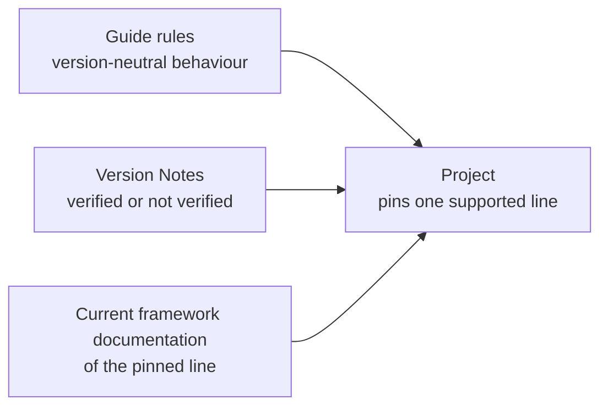
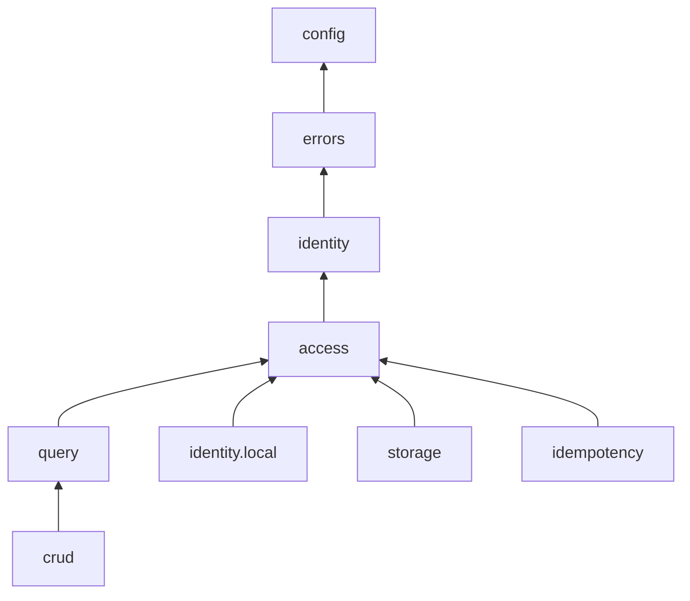
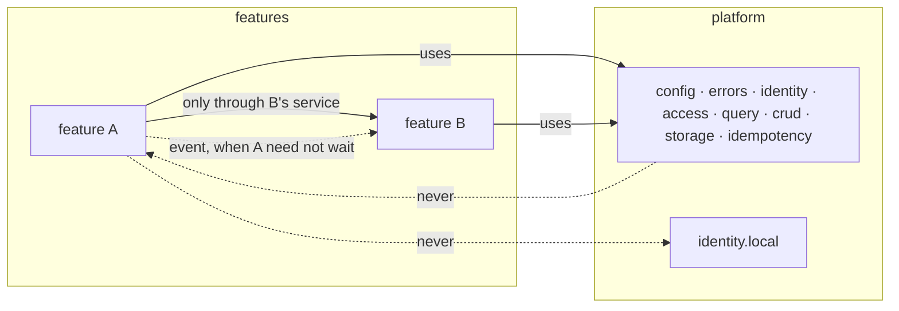
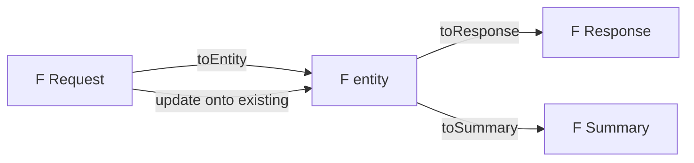
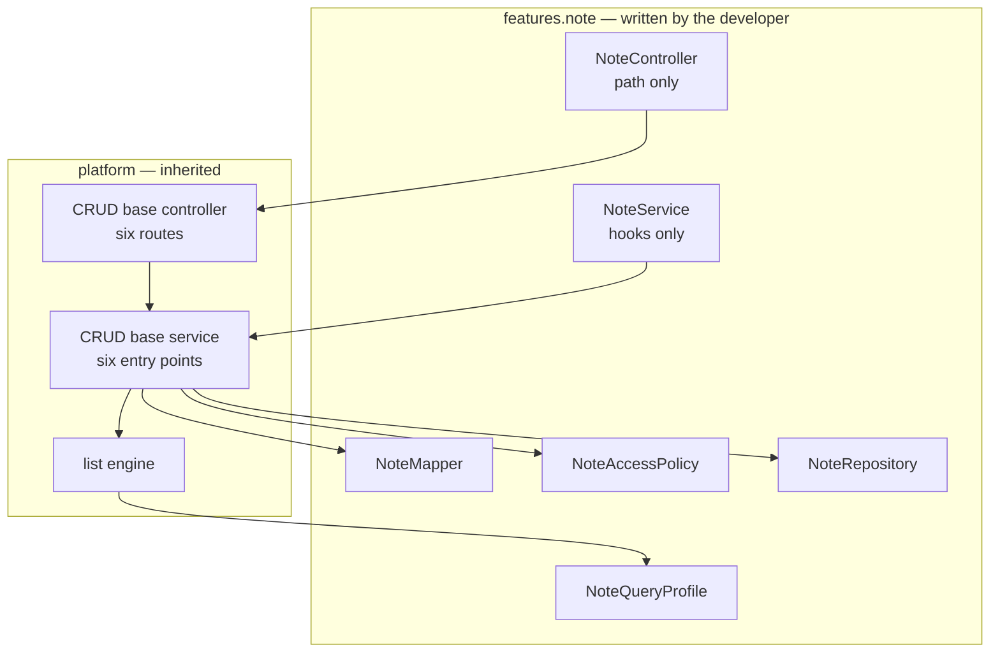
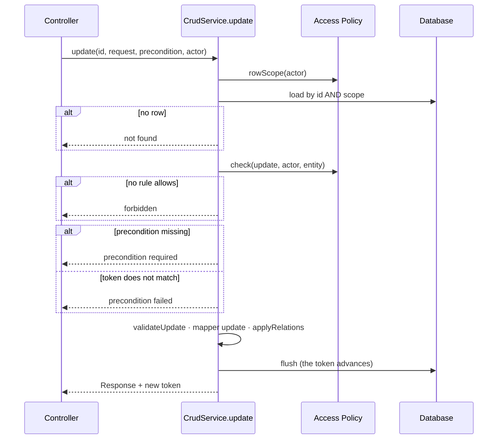
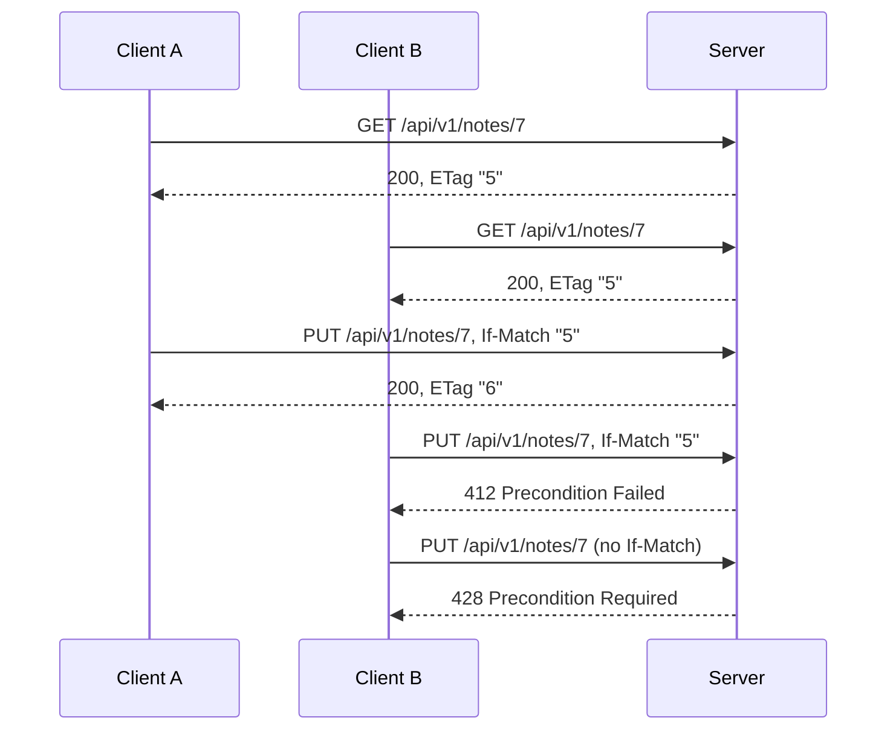

# Task: Guide Documents 01–05 — Principles, Layout, Feature Anatomy, CRUD Base and API Contract

#task #current #high-complexity #parent-spring-boot-architecture-guide-and-base-project

**Parent:** [[Features/to-do/Spring-Boot-Architecture-Guide-and-Base-Project|Spring Boot Architecture Guide, Base Project and Skill]]
**Parent Type:** Feature
**Related Step(s):** Phase 2 — Step 2.2 (Task 3 in the parent's Task Breakdown)
**Estimated Complexity:** High

---

## Goal

Write the first five documents of the Guide — `01-Principles-and-Baseline`,
`02-Project-Layout-and-Module-Boundaries`, `03-Feature-Module-Anatomy`, `04-CRUD-Base-and-Service-Hooks`
and `05-API-Contract` — as drafts in the format of [[Docs/Guide/Guide-Conventions]], with 63 rules
(`G01-01` … `G05-13`), each resting on a reference finding or an ADR. These five documents are the
skeleton every later Guide document, the Skill and the Base Project refer to, so their contracts and Rule
IDs must be right before anything cites them.

---

## Parent Context

The parent Feature turns the analysis of the three Reference Projects into a **Guide**, a **Base Project**
and a rewritten **Skill**, and proves them with a **Validation Loop**. Phases execute
**1 → 2 → 4 → 5 → 3 → 6**. This Task is the second Task of Phase 2 and the third of 13.

What the parent says about this Task:

- **Step 2.2:** "Write Guide 01–05 (principles, layout and boundaries, feature anatomy, CRUD base, API
  contract)."
- **Reason for grouping:** "Documents 01–05 define the skeleton every other document refers to."
- **Section 3 (the Guide documents)** gives one row of required content per document:

| # | Document | Content the parent requires |
|---|---|---|
| 01 | Principles-and-Baseline | Deep modules + SOLID as the design rules; the version **support policy**; what Version Notes mean and their evidence-scoped markers; how rules are cited |
| 02 | Project-Layout-and-Module-Boundaries | `platform` / `features`; allowed dependencies; cross-feature communication; ArchUnit rules |
| 03 | Feature-Module-Anatomy | The fixed file set and naming; when to opt out of the CRUD base |
| 04 | CRUD-Base-and-Service-Hooks | Base controller and service contract; hooks; `<F>AccessPolicy` as the single authorization module; mandatory `RowScope`; per-entry-point transactions; conditional writes; server-assigned ids |
| 05 | API-Contract | Resource naming, `/api/v1` prefix, status codes, `Location`, `PageResponse`, strong `ETag` / `If-Match`, download ticket semantics, OpenAPI |

- **Sections 4, 5, 6 and 7** of the parent (module layout, Feature Module anatomy, CRUD base, the page
  shape of the query engine) are the design these documents state.
- **The decisions are recorded as ADRs** and are this Task's requirements:
  [[ADRs/ADR-001-guide-is-the-source-of-truth|ADR-001]] (every rule cites evidence),
  [[ADRs/ADR-003-version-baseline-as-a-support-policy|ADR-003]] (rules are version-neutral),
  [[ADRs/ADR-004-platform-and-features-package-layout|ADR-004]] (layout and seven dependency rules),
  [[ADRs/ADR-005-deepened-crud-base-with-access-policy|ADR-005]] (the CRUD base, twelve decisions),
  [[ADRs/ADR-009-unchecked-domain-exceptions-as-problem-details|ADR-009]] (status meanings),
  [[ADRs/ADR-011-list-api-get-paging-and-post-search|ADR-011]] (routes and the page shape),
  [[ADRs/ADR-012-mapstruct-mapping-with-unmapped-target-errors|ADR-012]] (mappers),
  [[ADRs/ADR-013-object-storage-port-upload-coordinator-and-download-tickets|ADR-013]] (download
  redemption) and [[ADRs/ADR-016-guide-document-format-and-rule-ids|ADR-016]] (the format).

What this Task enables:

- **Tasks 4 and 5** write documents 06–16. They cite the Rule IDs of this Task and turn the inline-code
  names this Task leaves (`06-Query-Engine`, …) into links.
- **Task 5** runs the blind contract review (`GC-R`). The contracts in documents 02, 04 and 05 are the
  largest part of what it judges.
- **Task 6** (the Skill) cites these Rule IDs. From the day the Guide passes the contract review a Rule ID
  is never renumbered, so this Task's numbering becomes permanent then.

Constraints from the parent and the memory bank:

- Documents are **drafts** (`#draft`). The rules, their IDs and the module contracts are complete and
  binding; the narrative, the "Differs" section and the Version Notes are finalised in Task 12 against the
  built Base Project.
- Rule text is behavioural. It names products, standards and the names this convention defines; it never
  names a framework class, method, annotation or property (ADR-003). Those live in Version Notes.
- A Guide document never links a Feature, Task or Bug document (they move).
- The three reference projects are read-only. No secret value appears in any new file.
- ADRs are immutable once accepted; a changed decision is a new ADR.

### An inconsistency between two accepted ADRs, found while creating this Task

**The order of checks at an entry point that targets a row is stated two ways.**

| Source | Order |
|---|---|
| ADR-005, decision 8 — and the parent, section 6 | authenticate → **policy check (403) → scoped load (404)** → precondition → mutate |
| ADR-013, decision 7 — and the parent, section 10 (download) | **scoped load (404) → policy check** with the entity → ticket |
| ADR-005, decision 5 | `check(action, actor, entityOrNull)` holds entity-conditioned rules; the base consults it **once** per entry point |
| ADR-005, decision 6 | a row outside the scope reads as **404, not 403** |

These cannot all hold. A policy consulted before the row is loaded cannot receive the row, so no
entity-conditioned rule can run on the inherited get, update or delete. And a caller whose role is denied
gets 403 for a row outside its scope, which decision 6 rules out. The parent calls the download route "an
ordinary entry point", yet gives it the opposite order.

Document 04 must state one order (rule `G04-11`). **This is the user's decision** — Step 1 asks for it
before document 04 is written:

| Option | Order | What it costs |
|---|---|---|
| **A (recommended)** | scoped load (404) → policy check with the row (403) → precondition (428 / 412) → mutate, for every row entry point including download | A new ADR — **ADR-018** — that replaces the order sentence of ADR-005 decision 8. ADR-005 stays Accepted for everything else. Two sentences of the parent change. |
| **B** | ADR-005's literal order for the inherited operations; download keeps ADR-013's order | Nothing changes today. The policy receives no entity on inherited operations, the two orders stay different, and the contract review (Task 5) will very likely raise it. |
| A, strict form | As A, but ADR-018 restates and supersedes ADR-005 as a whole | By the letter of the ADR rule. Every rule that cites ADR-005 must cite ADR-018 instead (33 occurrences in the five documents). |

Why A is recommended: it is the only order under which "a hidden row reads as 404" is structural (decided
before any policy rule runs), the policy always receives the row for row actions, and update and download
follow one order. The documents in this Task are written for option A. Step 6 carries a tested script
that rewrites document 04 to option B in seven replacements.

### A second, smaller inconsistency in the parent

The parent's Implementation Architecture says every Platform Module has "a small interface (1–4 entry
points)". Its own section 6 gives the CRUD base **six** entry points, and ADR-005 decision 1 confirms six.
A Guide rule that said "at most four" would be broken by the Guide's own central module, and every
validation review would have to report it. Rule `G01-02` therefore keeps the measure and names the CRUD
base as the one exception (gap G12 below).

### Gaps in the parent that this Task closes

Each row is a contract point the parent leaves open and a document of this Task must pin. The Design
Decisions section gives the reasoning. **The user confirms them in Step 1**; the rows marked ★ deserve a
deliberate yes.

| # | Gap | Resolution in this Task |
|---|---|---|
| G1 | Documents 06–16 do not exist, but 01–05 must refer to them; the validator rejects a link or a Rule ID that does not resolve | A planned document is named in inline code (`06-Query-Engine`), never linked, and no Rule ID of an unwritten document is cited. The Task that writes the target turns the name into a link. |
| G2 ★ | Several rules belong to two or three documents in the parent (the annotation ban: sections 4, 6 and 8) | **One home per rule** (table "Rule homes" below). Other documents cite the ID. |
| G3 ★ | ADR-004 fixes `platform` → `features` but gives no direction **inside** `platform` | Document 02 carries a dependency table: `config` ← `errors` ← `identity` ← `access` ← `query` ← `crud`, plus three side modules. `RowScope`, `Action` and the Access Policy contract live in `platform.access`. |
| G4 ★ | "`Action` covers the CRUD actions plus `download`" — the values are not named | Seven values, one per entry point plus download: `get`, `list`, `search`, `create`, `update`, `delete`, `download`. |
| G5 | The parent's `CrudService` sketch has no actor parameter (it predates F17) and does not say which hooks see the actor | Every entry point takes the actor. Only `applyRelations` receives it, to record ownership; the other three hooks do not, so a caller-dependent rule cannot be written in them. |
| G6 ★ | "Update applies every request field" — what happens to a field the request leaves out? | `PUT` is full replacement: the field takes its empty value. The base has no partial update. |
| G7 ★ | `PageResponse.page` — zero-based or one-based? | Zero-based. |
| G8 | How a feature refuses one inherited operation | It gives the action no policy rule; the base denies it. Opting out is for features that are not resources. |
| G9 | The parent's sketch returns the Response but says "get, create and update return the token" | Two names in the sketch: `Versioned<RES>` (Response plus token) and `WritePrecondition` (what the client said about the version). |
| G10 ★ | "The Base Project cites rule IDs in class-level Javadoc of Platform Modules" (parent, Risk Assessment) — is that a rule for every project? | Yes: rule `G01-09`. |
| G11 | Findings with no matching sentence in the parent: version overrides (BE-R07-04, BT-R08-05), zone-less date-times on the wire (BE-R05-05, BE-R06-06), casts (BE-R02-02), a second route for one operation (WP-R02-05), naming (BE-R09-03) | Five rules: `G01-07`, `G05-09`, `G04-18`, `G04-19`, `G03-02`. Each cites its findings. |
| G12 ★ | "A small interface (1–4 entry points)" for every Platform Module, but the CRUD base has six | `G01-02` states the deletion test and "one to four entry points", with the CRUD base as the one named exception. |
| G13 | The parent says the architecture tests cover "every dependency rule"; a write through an association (`G02-08`) cannot be read from compiled code; and a feature that uses another feature's service must also see the shapes it returns and the events it publishes | `G02-07` names what a feature may use of another feature; `G02-11` claims test enforcement only for rules a test can read, and document 02 names `G02-08` as the one checked in review. |
| G14 | "An endpoint returns only these statuses" cannot hold for statuses the framework produces before a controller runs (405, 406, 415) | `G05-05` binds application code to the status table and lets protocol-level statuses keep their standard meaning, in the same error shape. |

### Rule homes

| Rule | Home | Cited from |
|---|---|---|
| No method-security annotation in `features` | `G02-05` (it is a structural ban an architecture test enforces) | 04; later 08 |
| The actor is a parameter; the provider stays at the edge | `G02-06` (the dependency rule), `G04-02` (the entry-point rule) | 01, 02; later 08 |
| Access Policy: single module, deny by default | `G04-07`, `G04-08` | 01, 03; later 08 |
| Row Scope is mandatory; hidden rows read as not found | `G04-09`, `G04-10` | 01, 05; later 06 |
| Order of checks | `G04-11` | 05; later 09, 10 |
| Conditional write — behaviour of the base | `G04-12`, `G04-13`, `G04-14` | 01; later 07 |
| Conditional write — on the wire (`ETag`, `If-Match`, 412, 428) | `G05-08` | — |
| Status codes and their meanings (400 / 422 / 409) | `G05-04`, `G05-05`, `G05-06` | later 09 |
| Input constraints live on the Request | `G03-05` | later 09 |
| Mappers: generated, no dependencies | `G03-06`, `G03-07` | later 15 |
| No automatic export of repositories | `G05-10` | later 08 |
| Download redemption statuses | `G05-12` | later 09, 10 |

---

## Preconditions / Dependencies

- **Tasks 1 and 2 are done.**
  [[Tasks/done/Spring-Boot-Architecture-Guide-and-Base-Project-step-1-decisions-adrs-glossary]] produced
  ADR-001 … ADR-017 (001–016 `Accepted`, 017 `Proposed`) and the Guide vocabulary (the glossary holds
  53 terms today).
  [[Tasks/done/Spring-Boot-Architecture-Guide-and-Base-Project-step-2-guide-format-validator]] produced
  `Guide-Conventions.md`, `Guide-Index.md` and the `guide` target of the validator.
- **State of the repository at creation (2026-10-04, measured):**
  - `documentation/Docs/Guide/` holds `Guide-Conventions.md` and `Guide-Index.md`; the index lists sixteen
    planned documents and reports `Draft documents: 0`, `Version Notes not verified: 0`.
  - `python3 scripts/validate-analysis-docs.py guide` exits 0. The three project targets exit 0.
  - `python3 -m unittest discover -s scripts/tests` runs 104 tests, all passing.
  - The three checksum snapshots in `scripts/.snapshots/` match.
  - `documentation/Tasks/current/` was empty. The working tree holds the uncommitted output of Tasks 1
    and 2; it is not part of this Task and must not be reverted.
- **The validator is not changed by this Task.** If a document needs something the validator rejects,
  the document changes — unless the user decides otherwise.
- **What the `guide` target checks that shapes how a document is written** (read in
  `scripts/validate-analysis-docs.py`):

| Trap | Rule to follow |
|---|---|
| Every `G<NN>-<MM>`, `<PROJ>-R<NN>-<MM>` and `ADR-NNN` written anywhere — prose, tables, inline code, fenced blocks — must resolve | Cite only rules of documents 01–05, findings that exist, and ADR-001 … ADR-017 (plus ADR-018 under option A). |
| A wiki link must resolve, and none may point into `Features/`, `Tasks/` or `Bugs/` | Link documents 01–05, the conventions, the index and ADRs. Name planned documents in inline code. |
| A backticked path that starts with `backend/`, `BugTracker/`, `wpmanager/`, `base-project/` or `documentation/Docs/Validation/` and continues is a source citation and must exist | `` `backend/` `` alone is fine. Do not write a `base-project/…` path: the Base Project does not exist yet. |
| Inside `## Rules`, every `###` heading is a Rule ID, and any line that starts with `**Word:**` ends the field before it | Free text after a rule's fields must not start a line with a bold label. |
| `## Version Notes` accepts only `- ` items that start with `**verified on <major>.<minor>.x**` or `**not verified**` | A `verified` note cites a reference Finding ID or a URL with a version segment. Never put a full stop or a comma directly after a URL: it becomes part of the address. |
| The index must link every document and report true counts | Update the row and both counts in the same step as the document. |
| The words `TODO`, `TBD`, `FIXME` and the text `[...]` are rejected outside code | — |

- **`base-project/` and `documentation/Docs/Validation/` do not exist.** A `verified` Version Note can
  cite only a reference Finding ID or a version-tagged URL.
- **The version line for Version Notes is Spring Boot 4.1.x** — the current general-availability line
  (4.1.2 on 2026-10-04; open-source support until 2027-07-31, ADR-003).
- **`rg` is not a binary on the PATH** here (a shell function of the agent harness). Commands use `grep`.
- **`obsidian.use_cli` is `false`.** Use direct file operations.
- **The user must be available** for Step 1 (the check order and the gaps), for the ADR text in Step 2,
  for the glossary terms in Step 9 and for the Manual Validation items.

---

## Skills and Documentation Preparation

### Skills Reviewed

- `documentation-management` — **Selected** — Task template, document locations, the ADR workflow used in
  Step 2, the "only modify files when asked" rule.
- `memory-bank` — **Selected** — project context; Step 10 updates the agent-maintained files.
- `glossary-management` — **Selected** — the documents use the glossary's terms as defined (*Platform
  Module*, *Feature Module*, *Access Policy*, *Row Scope*, *Conditional Write*, *Current User*, *Query
  Profile*, *Module Contract*, *Version Note*, *Draft Marker*); Step 9 proposes five new terms.
- `doc-exploration` — **Selected (at creation)** — 17 ADRs read in full; 13 are cited by the five
  documents (001–006, 008, 009, 011–014, 016).
- `solid-deep-design` — **Selected** — it is the content of document 01 and the test applied to every
  contract in documents 02–05 (one responsibility, depth, the deletion test, two adapters per seam).
- `find-docs` — **Selected** — version-matched documentation for every Version Note (table below).
- `tdd` — **Selected, adapted** — this Task writes no code. Its "public interface" is the validator's CLI:
  each document is checked through `scripts/validate-analysis-docs.py guide`, and the expected errors
  after each step are listed (they name only documents of later steps).
- `task-reviewer` — **Selected (at creation)** — reviewed this document.
- `superpowers:verification-before-completion` — **Selected** — run each validation command and read its
  output before ticking a criterion.
- `superpowers:brainstorming`, `interview-me` — **Not needed** — the design was decided in D1–D18 and the
  ADRs; the open points are listed for the user in Step 1.
- `improve-codebase-architecture`, `skill-creator` — **Not needed** — no code base is changed; the Skill
  is Task 6.

Exploration at creation was done directly, not through subagents: `Memory/known-issues.md` records that
three leads from agent inventories were wrong on inspection, so every finding cited here was read in its
review document.

### Documentation Reviewed

All read on 2026-10-04. The version line is Spring Boot 4.1.x.

| Source | What was checked | Result |
|---|---|---|
| Spring Boot 4.1 managed coordinates — `https://docs.spring.io/spring-boot/4.1/appendix/dependency-versions/coordinates.html` | Which versions the line manages | Spring Framework **7.0.9**, Spring Security **7.1.1**, Spring Data **4.1.1**, Hibernate ORM 7.4.5, Jakarta Persistence 3.2.0, Flyway 12.4.0, Jackson 3.1.5 (and 2.21.5), JUnit Jupiter 6.0.3, Testcontainers 2.0.5. MapStruct, ArchUnit and springdoc-openapi are **not** managed. |
| Context7 `/spring-projects/spring-framework/v7.0.5` (snippet source URLs carry the `v7.0.5` tag) | Conditional requests, API versioning, `@Transactional` defaults | `checkNotModified` for `ETag`; "for conditional `POST`, `PUT`, and `DELETE` … 412 (PRECONDITION_FAILED), to prevent concurrent modification"; API versioning by path segment through `ApiVersionConfigurer`; rollback only for `RuntimeException` and `Error` by default; a method-level `@Transactional` takes precedence over the class-level one. |
| Spring Framework source at tag `v7.0.9` — `ServletWebRequest.java`, `HttpStatus.java` | How `If-Match` is evaluated; the status constants | For an unsafe method `If-Match` is evaluated first, with **strong** comparison, and 412 is set when no tag matches. **An absent `If-Match` is not an error** — so 428 must be produced by the CRUD base. `PRECONDITION_REQUIRED` (428) and `UNPROCESSABLE_CONTENT` (422) exist; `UNPROCESSABLE_ENTITY` is deprecated since 7.0. |
| Spring Framework reference 7.0 — path matching | A common path prefix | `PathMatchConfigurer.addPathPrefix`. |
| Spring Boot 4.1 application properties | API-versioning and paging properties | `spring.mvc.apiversion.*` (including `use.path-segment`), `spring.data.web.pageable.serialization-mode`. |
| Spring Framework 7.0.9 javadoc — `ObjectOptimisticLockingFailureException` | The exception of a refused optimistic-lock write | "Exception thrown on an optimistic locking violation for a mapped object." |
| MapStruct 1.6.3 reference guide — `https://mapstruct.org/documentation/1.6/reference/html/` | `unmappedTargetPolicy`, `@MappingTarget`, null handling on update | `ERROR` fails the build on an unmapped target property; an update method marks the target with `@MappingTarget`; a null source property sets the target property to null by default. Context7's `/mapstruct/mapstruct/1_6_3` returned snippets from `main`, so the 1.6 reference page was read directly. |
| ArchUnit user guide at tag `v1.5.1` (released 2026-09-25) | Rule syntax, JUnit support | `noClasses().that().resideInAPackage(..).should().dependOnClassesThat().resideInAPackage(..)`; `slices().matching(..).should().beFreeOfCycles()`; JUnit 4, 5 and 6 are supported. Context7's `/tng/archunit` returned `main`; the same text is at the tag. |
| springdoc-openapi `README.md` at tag `v3.1.1` (released 2026-09-06) | Spring Boot 4 support | "Automatically deploys swagger-ui to a Spring Boot 4.x application"; `springdoc-openapi-starter-webmvc-api` is the artifact without the UI. |
| The three review sets under `documentation/Docs/<project>/Reviews/` | Every finding cited by a rule | 87 distinct findings are cited; each was read. 26 of them are in the traceability scope of 78. |
| ADR-001 … ADR-017 | The decisions the rules state | See "Parent Context"; the conflict between ADR-005 and ADR-013 was found here. |

**For Task 4:** the parent's section 8 marks its resource-server detail as verified against the Spring
Security **7.0** reference. Spring Boot 4.1.x manages Spring Security **7.1**. A `verified on 4.1.x` note
in document 08 must cite the 7.1 documentation.

### Related Existing Code

- `documentation/Docs/Guide/Guide-Conventions.md` — the format contract: sections 3 (template), 4 (rule
  block), 5 (citations), 6 (Version Notes), 7 (index).
- `documentation/Docs/Guide/Guide-Index.md` — the front page this Task updates (five rows, two counts, one
  changelog line).
- `scripts/validate-analysis-docs.py` — the `guide` target. Key locations: `:82-84` `GUIDE_CITATION`;
  `:202-223` `check_citations`; `:313-321` `check_guide_tags`; `:345-374` `check_rules`; `:388-423`
  `check_version_notes`; `:426-444` `check_tokens`; `:490-497` `check_guide_status`; `:582-645`
  `validate_guide`. **Not edited by this Task.**
- `documentation/Docs/<project>/Reviews/NN-*-Review.md` — where a Finding ID resolves (a heading that is
  exactly the ID).
- `documentation/ADRs/ADR-NNN-*.md` and `ADR-index.md` — where an ADR resolves; Step 2 adds ADR-018 under
  option A.
- `scripts/.snapshots/*.sha256` — the read-only guard for the reference projects.

---

## Implementation Details

### Approach

**The documents are written here, in full, and were proven before the Task was written.** All five were
built in the session scratchpad and run through the real validator against a copy of the real
documentation: the final state exits 0 in both options (A with ADR-018, B without). A Guide document is
this Task's "code", and a rule block that does not validate is a bug, so the Task carries the text
instead of a description of it. The executor's work is to settle the open decisions with the user, write
the files, validate after each one and read the result — not to re-derive 63 rules.

**Contract first.** Each document's `Design` section states modules by contract — entry points,
invariants, error modes, interactions — with a diagram where there is a flow or a direction. Code appears
only as one Java-like sketch in document 04, which fixes names of this convention and no framework
syntax.

**Applying `solid-deep-design` to the contracts.** For each module a document defines:

| Module | Interface | What it hides | Deletion test |
|---|---|---|---|
| CRUD base (`platform.crud`) | six entry points, four hooks | scope, policy, precondition, transaction and mapping, in a fixed order | six routes and six operations return to every feature |
| Access Policy (per feature) | two operations | every "who may do what to which rows" rule of the feature | authorization scatters over URL rules, annotations, hooks and query filters |
| Feature Module | a fixed file set | nothing — it is the unit of extension | — |
| The layout (`platform` / `features`) | eleven rules, nine architecture tests | — | enforced by tests, so it cannot erode |

A seam appears only where two adapters exist: the Access Policy has one implementation per feature plus
test doubles. No port is added for the repository or the mapper.

**One home per rule** (table in Parent Context), so a rule has one place to change (ADR-001).

**The service/wire split between documents 04 and 05.** Document 04 states behaviour in the language of
the service ("precondition failed", "not found"). Document 05 states the same outcomes in HTTP (412, 404,
`If-Match`). Neither repeats the other: 04 owns the order and the semantics, 05 owns status numbers,
headers and paths.

**Writing style.** Short sentences, one idea each, plain words. Every rule block reads on its own.

**Order and validation.** Documents are written 01 → 05 and the validator runs after each. Documents 01–03
refer forward to 04 and 05, so the runs after Steps 3–6 fail **only** on references to documents of later
steps. The expected errors were measured and are listed in each step. After Step 7 the target exits 0.

### What this Task leaves to later documents

| Later document | Left open here, on purpose |
|---|---|
| `06-Query-Engine` | How a Row Scope is applied and composed; the list parameters and the search body; bounds; the predicate technology; what the list engine needs from a repository |
| `07-Domain-Model-and-Persistence` | The concurrency token and audit fields on the entity; migrations; whether a feature entity may reference the `User` entity or only its id (the parent says both "`CurrentUser` is the only identity type feature code may import" and "per-type data lives in feature entities that reference `User`") |
| `08-Identity-…` | `CurrentUser`, the system actor, the current-user provider; URL rules and the public-route list; the single method-security switch; whether the login routes sit under the versioned prefix |
| `09-Errors-and-Validation` | The exception hierarchy and the `type` values; which domain exception each failure of the base raises; where request validation sits relative to authorization (the framework validates the Request before the service is called) |
| `10-Object-Storage-and-Uploads` | The Download Ticket, the response of the route that issues it, the redemption headers; deleting stored objects when the owning entity is deleted |
| `11-Idempotency` | The `Idempotency-Key` header |
| `13-Testing-Strategy` | Where the architecture tests sit; the route-coverage test; the authorization matrix |
| `14-Observability-and-Operations` | Where operational endpoints (health) live, since they are not under the versioned prefix |
| `16-Traceability-Matrix` | 26 of the 78 in-scope findings already have a rule here (list in Step 8) |

**Link pass for Tasks 4 and 5.** When a planned document is written, its inline-code name in documents
02–05 becomes a wiki link. Find the names with
``grep -n -o -E '`(0[6-9]|1[0-6])-[A-Za-z-]+`' documentation/Docs/Guide/0[1-5]-*.md`` (24 occurrences of
9 names at creation).

### Files to Create/Modify

- [x] `documentation/Docs/Guide/01-Principles-and-Baseline.md` — **new**; 9 rules (Step 3)
- [x] `documentation/Docs/Guide/02-Project-Layout-and-Module-Boundaries.md` — **new**; 11 rules (Step 4)
- [x] `documentation/Docs/Guide/03-Feature-Module-Anatomy.md` — **new**; 10 rules (Step 5)
- [x] `documentation/Docs/Guide/04-CRUD-Base-and-Service-Hooks.md` — **new**; 20 rules (Step 6)
- [x] `documentation/Docs/Guide/05-API-Contract.md` — **new**; 13 rules (Step 7)
- [x] `documentation/Docs/Guide/Guide-Index.md` — five rows become links with state `draft`; the two
  counts; one changelog line (Steps 3–8)
- [x] `documentation/ADRs/ADR-018-scoped-load-before-policy-check.md` — **new, option A only** (Step 2)
- [x] `documentation/ADRs/ADR-index.md` — one row, **option A only** (Step 2)
- [x] `documentation/Features/to-do/Spring-Boot-Architecture-Guide-and-Base-Project.md` — tick Step 2.2;
  under option A also the order sentence in section 6, one ADR table row and "ADRs 001–018" (Steps 2, 10)
- [x] `documentation/Glossary/glossary.json`, `documentation/Glossary/Glossary.md` — **through the
  `glossary` CLI only**, and only the terms the user confirms (Step 9)
- [x] `documentation/Memory/context.md`, `progress.md`, `architecture.md`, `tech.md`, `known-issues.md`
  (Step 10)

**Not modified:** `scripts/validate-analysis-docs.py`, both test files, `Guide-Conventions.md`,
`Analysis-Doc-Conventions.md`, ADR-001 … ADR-017, `documentation/Memory/brief.md`, the three reference
projects.

Scratch files (session scratchpad, not committed): `rule_evidence.py` (Step 8), `variant_b.py` (Step 6,
option B only).

---

## Step-by-Step Implementation

### Step 1: Record the baseline and settle the open decisions with the user

**Goal:** Nothing is written until the one blocking decision is made and the contract choices are
confirmed.
**Dependencies:** None. **Needs the user.**

- [x] Run the baseline and keep the output:

```bash
python3 scripts/validate-analysis-docs.py guide; echo "guide exit=$?"
for p in backend BugTracker wpmanager; do python3 scripts/validate-analysis-docs.py "$p" >/dev/null; echo "$p exit=$?"; done
python3 -m unittest discover -s scripts/tests 2>&1 | tail -3
for s in backend bugtracker wpmanager; do sha256sum --quiet -c scripts/.snapshots/$s.sha256 && echo "$s unchanged"; done
git status --short > <scratchpad>/status-before.txt
sha256sum scripts/validate-analysis-docs.py scripts/tests/*.py documentation/Docs/Guide/Guide-Conventions.md \
  documentation/Docs/Analysis-Doc-Conventions.md documentation/ADRs/ADR-0[01][0-9]-*.md > <scratchpad>/frozen.sha256
wc -l < <scratchpad>/frozen.sha256
```

  Expected: four `exit=0` lines, `Ran 104 tests` and `OK`, three `unchanged` lines, and `22` (the
  validator, two test files, two conventions documents and seventeen ADRs). `git diff` cannot guard these
  files: `documentation/ADRs/` and `documentation/Docs/Guide/` are untracked, and the validator already
  carries Task 2's uncommitted changes.
- [x] Ask the user for **the order of checks** ("An inconsistency between two accepted ADRs" above):
  option A (recommended), option B, or the strict form of A. Record the answer.
- [x] Show the user the table "Gaps in the parent that this Task closes" and ask for confirmation of the
  ★ rows: G2 (rule homes), G3 (the dependency table inside `platform`, `RowScope` in `platform.access`),
  G4 (the seven `Action` values), G6 (`PUT` is full replacement), G7 (zero-based `page`), G10 (`G01-09`
  applies to every project), G12 (the CRUD base as the one exception to "one to four entry points").
  Record each answer.
- [x] If the user changes a point, change the affected text **before** writing the document (the edge
  cases below say where each point lives).

**Why this step is critical:**
Rule IDs become permanent at the contract review. A contract choice that the user would have made
differently is cheap to change now and costs a withdrawn rule later. The check order also decides whether
an ADR is written, which changes what document 04 may cite.

#### Edge Cases
1. **Case:** the user chooses option B — skip Step 2; in Step 6 write document 04 as given and then run
   `variant_b.py`.
2. **Case:** the user chooses the strict form of A — in Step 2 write ADR-018 as a full restatement of
   ADR-005 with decision 8 corrected, set ADR-005 to `Superseded` (status line, tag, index row — the
   three edits the ADR workflow allows), and when writing the five documents replace `ADR-005` with
   `ADR-018` and the link target `ADRs/ADR-005-deepened-crud-base-with-access-policy` with the new file's
   path. The validator rejects a rule that cites a Superseded ADR, so a missed occurrence is reported.
3. **Case:** the user wants one-based pages (G7) — change `"page": 0` and "zero-based" in document 05
   (the JSON example, the sentence under it and `G05-07`).
4. **Case:** the user rejects G10 — remove rule `G01-09` and its mentions in document 01 ("How rules are
   cited"); the document then has 8 rules, the total is 62, and the counts in Step 8 change accordingly.
5. **Case:** the user wants `RowScope` in `platform.query` (G3) — in document 02 move it in the tree
   comment, remove `access` from the "May depend on" cell of `query`, add `query` to that of `access`,
   reverse the `query --> access` arrow, and change the sentence under the table; in document 04 change
   "It is defined in `platform.access`".
6. **Case:** the user is not available — stop here. Do not write document 04 on an assumed answer.

---

### Step 2: Write ADR-018 and correct the parent (option A only)

**Goal:** The order document 04 states is a recorded decision, and the parent no longer says the
opposite.
**Dependencies:** Step 1, option A. **Needs the user** (approval of the ADR text).

- [x] Show the user the ADR text below. On approval, create
  `documentation/ADRs/ADR-018-scoped-load-before-policy-check.md` with it (status `Accepted`).
- [x] Append to the table in `documentation/ADRs/ADR-index.md`:
  `| ADR 18 | At a row entry point the scoped load comes before the policy check (replaces the order sentence of ADR 5, decision 8) | Accepted | <date> | — |`
- [x] In the parent Feature, section 6, replace the first line below with the second. The rest of the
  sentence ("(412/428) → mutate — a row outside the scope never leaks existence through a 412") stays.

```text
client-visible meaning. Check order: authenticate → `policy.check` (403) → scoped load (404) → precondition
client-visible meaning. Check order (ADR-018): authenticate → scoped load (404) → `policy.check` with the loaded row (403) → precondition
```

- [x] In the parent Feature, add a row to the ADR table of section 1:
  `| 018 | At a row entry point the scoped load comes before the policy check | D5 (order of checks) |`,
  and in "Affected Systems / Modules" change `ADRs 001–017` to `ADRs 001–018`.
- [x] Do **not** edit ADR-005 or ADR-013.

**Why this step is critical:**
Without ADR-018, `G04-11` would cite ADR-005 while stating the opposite of its decision 8, and the
validator would also report `ADR-018 is cited but no such ADR exists`.

#### Implementation

`````markdown
#adr #adr-accepted #architecture #backend #security

## ADR 018: At a row entry point the scoped load comes before the policy check

### Status
Accepted

### Context

[[ADRs/ADR-005-deepened-crud-base-with-access-policy|ADR-005]] contains three statements that cannot all
hold for an entry point that targets a row (get, update, delete):

- decision 5 — the Access Policy's `check(action, actor, entityOrNull)` holds the rules that depend on
  the entity, and the base consults it once per entry point;
- decision 6 — a row outside the Row Scope reads as 404, not 403;
- decision 8 — the order is: authenticate → policy check (403) → scoped load (404) → precondition →
  mutate.

A policy that is consulted before the row is loaded cannot be given the row, so no entity-conditioned
rule can run on an inherited operation. And an actor whose role is denied the action receives 403 for a
row outside its scope, which decision 6 rules out.
[[ADRs/ADR-013-object-storage-port-upload-coordinator-and-download-tickets|ADR-013]] (decision 7) already
states the other order for the download entry point: scoped load (404), then the policy check. The two
accepted ADRs therefore give opposite orders for entry points the convention calls "ordinary" alike. The
conflict was found while the contract of the CRUD base was written for the Guide.

**Evidence:**
[[Docs/wpmanager/Reviews/01-Security-Review#WP-R01-03|WP-R01-03]] — inherited operations need only a
login; object-level authorization needs the object;
[[Docs/BugTracker/Reviews/03-Domain-Model-and-Persistence-Review#BT-R03-07|BT-R03-07]] — no optimistic
locking, which is why the precondition has a place in the order at all.

### Decision

1. We will evaluate an entry point that targets a row in this order: authenticate → load the row through
   the Row Scope (absent: 404) → consult the Access Policy once, with the loaded row (no rule: 403) →
   evaluate the precondition (missing: 428; stale: 412) → run the hooks and mutate.
2. We will consult the policy with no entity at an entry point that has no target row — list, search and
   create — and then proceed.
3. We will use the same order at the download entry point and at the entry points of a feature that opts
   out of the CRUD base.
4. This order replaces the order sentence in decision 8 of ADR 005. Every other decision of ADR 005 stays
   in force, and ADR 005 stays Accepted.

**Alternatives rejected:**
- Keep the policy check before the load — the policy never sees the row on inherited operations, and
  download would follow a different order from update.
- Check twice, once before the load for the role and once after for the row — contradicts "once per entry
  point" and gives a rule two places to be forgotten.
- Load silently, check with the row or nothing, and report 403 before 404 — every policy would have to
  handle a missing row for row actions, and whether a hidden row reads as 404 would depend on how each
  rule is written.

### Consequences

- "A hidden row reads as 404" becomes structural: it is decided before any policy rule runs.
- The policy always receives the row for get, update, delete and download, and nothing for list, search
  and create.
- A caller whose role is denied an action receives 404 for a row it may not see and 403 for a row it may
  see.
- A denied caller costs one scoped query before the denial.
- A reader of ADR 005 alone sees the old order. The index title of this ADR names the relationship, and
  the Guide's rule on the order of checks cites this ADR.

**Related:** [[Features/to-do/Spring-Boot-Architecture-Guide-and-Base-Project]] (D5; F7, F9, F13),
[[ADRs/ADR-005-deepened-crud-base-with-access-policy|ADR-005]],
[[ADRs/ADR-013-object-storage-port-upload-coordinator-and-download-tickets|ADR-013]],
[[ADRs/ADR-009-unchecked-domain-exceptions-as-problem-details|ADR-009]].
`````

#### Edge Cases
1. **Case:** the user asks for changes to the ADR text — apply them before creating the file; an ADR is
   immutable only once accepted.
2. **Case:** the number 018 is taken by the time of execution — use the next free number and replace
   `ADR-018` in document 04 (three occurrences: `G04-11` evidence, the Related Documents link text and
   its target) and in this step's parent edits.
3. **Case:** the parent's sentence was already changed — check with
   `grep -n "Check order" documentation/Features/to-do/Spring-Boot-Architecture-Guide-and-Base-Project.md`
   and edit what is there.

---

### Step 3: Write document 01 — Principles and Baseline

**Goal:** The principles and the version baseline every other document applies.
**Dependencies:** Step 1.

- [x] Create `documentation/Docs/Guide/01-Principles-and-Baseline.md` with the text below.
- [x] In `Guide-Index.md` replace the row of document 01 with the row given in Step 8, and set
  `Draft documents: 1`, `Version Notes not verified: 1`.
- [x] Run `python3 scripts/validate-analysis-docs.py guide`. Expected: exit 1 with **only** these eight
  lines, all about documents of later steps — two `wiki link … does not resolve` (documents 02 and 04)
  and six `rule … does not exist` (`G02-11`, `G04-01`, `G04-02`, `G04-08`, `G04-09`, `G04-12`).

**Why this step is critical:**
Document 01 is where a reader learns how to read a rule, and where the four design questions the other
documents answer are named.

#### Implementation

`````markdown
# Principles and Baseline

#doc #guide #architecture #build #draft

**Guide:** [[Docs/Guide/Guide-Index]] · **Conventions:** [[Docs/Guide/Guide-Conventions]]

## Purpose

This document states the design principles every other Guide document applies, and the version baseline a
project built from the Guide stands on. The principles are few: a module has one responsibility, hides a
lot behind a small interface, and makes the unsafe case impossible instead of forbidden. The baseline is a
support policy, not a version number: a project runs on a Spring Boot line that is still supported, and
everything that depends on that line is looked up when the code is written. Read this document first; the
others assume it.

## Design

### The unit of design is the module

A **module** is anything with an interface and an implementation: a Platform Module, a Feature Module, a
class. Its **interface** is everything a caller must know to use it correctly — the entry points, the
invariants, the order of calls, the error modes. The Guide states each Platform Module as a **Module
Contract**: interface, invariants, error modes, and how it interacts with other modules. It never states
one as code.

The design rules are the SOLID principles together with the deep-module test: SOLID says how modules
relate, depth says whether a module earns its place. Four questions decide whether a module is well
shaped. Every Guide document answers them for the modules
it defines.

| Question | Principle | Rule |
|---|---|---|
| Can its job be said in one sentence without "and"? | One responsibility | G01-01 |
| Is its interface much smaller than what it hides? Would deleting it push its work into every caller? | Deep module, deletion test | G01-02 |
| Does something really vary behind its interface? | A seam needs two adapters | G01-03 |
| Can a caller forget the step that keeps it safe? | Fail closed by construction | G01-04 |

A fifth principle is about decisions, not modules: every decision and every setting has exactly one owner
(G01-05).

### What "fail closed by construction" means in this Guide

The reference projects were not careless. Their defects are steps that someone had to remember: add the
authorization annotation, filter by owner, open the transaction in the right place. The Guide removes the
step where it can.

| Safety property | How the convention makes the unsafe case impossible | Stated in |
|---|---|---|
| Authorization | The CRUD base cannot be constructed without an Access Policy, and a policy with no matching rule denies | G04-01, G04-08 |
| Row visibility | Every query takes a Row Scope; there is no entry point without one | G04-09 |
| The actor | Every entry point takes the actor as a parameter | G04-02 |
| Lost updates | A write without a precondition is refused | G04-12 |
| Layout | A forbidden dependency fails the build | G02-11 |

### The version baseline



- **Rules are version-neutral.** A rule names a product or a standard (PostgreSQL, Flyway, MapStruct,
  RFC 9457, JWT) and the names this convention defines (`CurrentUser`, `RowScope`). It never names a
  framework class, method, annotation or property.
- **The floor moves with support.** A project is built on a Spring Boot line that is under open-source
  support on the day the project is built, with Java 21 or newer. On 2026-10-04 that means the 4.x
  generation; every 3.x line has ended.
- **One line per project.** A project pins one Spring Boot line and takes its dependency versions from
  that line.
- **Version Notes carry the rest.** Class names, annotations and property names live in the Version Notes
  of each document. A note marked `verified on <line>` cites its proof. A note marked `not verified` is
  the author's best knowledge: whoever implements the rule looks the detail up in the documentation of
  the pinned line.

### How rules are cited

A rule is cited by its Rule ID. The Base Project and the Skill never restate a rule; they cite it. Inside
a project, the type-level documentation of each Platform Module names the Rule IDs the module implements
(G01-09), so a reviewer can walk from code to rule and back. The format of a rule, its evidence and the
four ID families are defined in [[Docs/Guide/Guide-Conventions]].

## Rules

### G01-01
**Rule:** A module has one responsibility: what it does can be said in one sentence without "and". A
second responsibility is a second module.
**Why:** A module with several jobs grows a wide interface and many collaborators, and every change to one
job risks the others.
**Evidence:** WP-R07-04, WP-R07-03 · ADR-014
**Differs from references:** wpmanager's plugin service took 17 constructor dependencies for four jobs
(catalogue, categories, upload, cascade delete) and was copied into a theme service that then diverged.

### G01-02
**Rule:** A Platform Module passes the deletion test: removing it would force every caller to re-create
what it did. Its interface is small against what it hides — one to four entry points; the CRUD base is
the one stated exception, with the six operations of a resource.
**Why:** A module whose interface costs as much as its implementation gives no leverage. Callers end up
overriding it, and the rules it should hold scatter.
**Evidence:** WP-R02-06, BT-R02-03, BT-R02-04, WP-R04-05 · ADR-005, ADR-011
**Differs from references:** The reference CRUD base was deep for routing and shallow for validation,
relations and authorization; wpmanager overrode 29 of its 60 method slots. The idempotency state keeper
exposed five methods that callers had to call in the right order.

### G01-03
**Rule:** A port is introduced only where at least two adapters exist; a test adapter counts. Where the
framework already provides the port, the project adds no wrapper around it.
**Why:** A port with one adapter is indirection that hides nothing, and an adapter that cannot do its job
is a broken seam.
**Evidence:** WP-R05-05 · ADR-006, ADR-013
**Differs from references:** wpmanager put the storage port on a JPA entity with one real adapter; the
second adapter returned nothing and every caller used it without a check.

### G01-04
**Rule:** A safety property — authorization, row visibility, the actor of an operation, a transaction
boundary, a write precondition, a required secret — is enforced by a signature, a constructor or a
start-up check. It is never left to a step a developer must remember.
**Why:** A remembered step is forgotten on the next feature, and nothing fails when it is.
**Evidence:** BE-R01-01, WP-R01-03, WP-R01-11, WP-R01-15 · ADR-005, ADR-006
**Differs from references:** All three projects relied on an annotation being present on each operation.
In `backend/` the switch that makes those annotations work was lost when a service was deleted, and no
build or test failed.

### G01-05
**Rule:** Every decision and every setting has exactly one owner: one module that states it, and one
place where its value is defined.
**Why:** A decision stated twice drifts. The two copies then disagree, and callers see two behaviours for
one condition.
**Evidence:** WP-R09-05, BE-R05-02, WP-R08-07, BE-R04-05 · ADR-006
**Differs from references:** The upload size limit was defined in two places, the error body was built in
four, and the same conflict returned 409 on create and 400 on update.

### G01-06
**Rule:** A project is built on a Spring Boot line that is under open-source support on the day it is
built, with Java 21 or newer. A line that has reached its end of support is never the baseline.
**Why:** An unsupported line gets no security fixes for the framework or for the libraries it manages.
**Evidence:** BT-R08-01, BT-R08-02 · ADR-003
**Differs from references:** BugTracker runs the first patch of a line whose open-source support ended in
2023. The other two run a line that has ended since.

### G01-07
**Rule:** A project pins exactly one Spring Boot line and takes its dependency versions from that line. A
version that departs from the line is written with its reason next to it.
**Why:** A silent override runs a combination nobody tested, and nobody remembers why it is there.
**Evidence:** BE-R07-04, BT-R08-05, BT-R08-03, WP-R09-06 · ADR-003
**Differs from references:** The reference builds pinned a test plugin below the managed version, repeated
a managed version by hand, overrode one starter, and declared one Java version while compiling with
another.

### G01-08
**Rule:** Version-specific detail — class names, annotations, property names, default values — is taken
from the current documentation of the line the project pins, at the time the code is written. It is never
taken from memory, from an older project or from the text of a rule.
**Why:** Names change between generations. A name that no longer exists is often ignored without an
error, so the code looks right and does nothing.
**Evidence:** BE-R07-05, WP-R09-04, BT-R01-14, BT-R08-09 · ADR-002, ADR-003
**Differs from references:** `backend/` carried a logging setting from an older generation that no longer
had any effect, and wpmanager set a property the framework does not define.

### G01-09
**Rule:** The type-level documentation of each Platform Module names the Rule IDs the module implements
and restates no rule.
**Why:** Documentation that restates a rule drifts from it. A citation cannot drift: it either resolves
or it does not.
**Evidence:** WP-R11-04 · ADR-001
**Differs from references:** wpmanager kept its own documentation vault, and that vault contradicts the
code today.

## Differs From the Reference Projects

- The reference projects have no written convention; each one is the previous one, copied, and the one
  vault that documents a project contradicts its code (WP-R11-04). The Guide is the convention, the
  projects are its evidence ([[ADRs/ADR-001-guide-is-the-source-of-truth|ADR-001]]), and code cites rules
  instead of restating them (G01-09).
- Safety depended on remembered steps (BE-R01-01, WP-R01-03). The Guide makes the unsafe case fail to
  compile, fail to start or fail the build (G01-04).
- Modules were shallow where the work is hard (WP-R02-06, BT-R02-03) and wide where it is easy
  (WP-R07-04). The Guide measures every Platform Module against G01-01 and G01-02.
- A seam existed with one working adapter (WP-R05-05). The Guide requires two (G01-03).
- The version was whatever the project started on, and it stayed there (BT-R08-01). The Guide sets a
  moving floor (G01-06) and one pinned line (G01-07).
- Framework names were carried from project to project (BE-R07-05, WP-R09-04). The Guide requires a
  lookup in the current documentation (G01-08).

## Version Notes

- **verified on 4.1.x** — this line manages Spring Framework 7.0.x, Spring Security 7.1.x, Spring Data
  4.1.x, Hibernate ORM 7.4.x, Jakarta Persistence 3.2, Flyway 12.x, Jackson 3.1.x, JUnit Jupiter 6.0.x and
  Testcontainers 2.0.x. A note about one of these libraries cites the documentation of that version.
  Evidence: https://docs.spring.io/spring-boot/4.1/appendix/dependency-versions/coordinates.html
- **verified on 4.1.x** — MapStruct, ArchUnit and springdoc-openapi are not in this line's managed set; a
  project that uses them pins their versions itself and states the reason (G01-07).
  Evidence: https://docs.spring.io/spring-boot/4.1/appendix/dependency-versions/coordinates.html
- **verified on 2.7.x** — open-source support for this line ended on 2023-06-30. Evidence: BT-R08-01
- **not verified** — current-docs lookup at execution time: which Spring Boot line is the current
  general-availability line, and the end date of its open-source support. The source is the Spring Boot
  support page; the answer changes about every six months.

## Related Documents

- [[Docs/Guide/02-Project-Layout-and-Module-Boundaries]] — where modules live and which may depend on
  which.
- [[Docs/Guide/04-CRUD-Base-and-Service-Hooks]] — the module where G01-02 and G01-04 are applied hardest.
- [[ADRs/ADR-001-guide-is-the-source-of-truth|ADR-001]] — the Guide is the source of truth.
- [[ADRs/ADR-002-code-free-skill-and-reference-base-project|ADR-002]] — contracts, not code.
- [[ADRs/ADR-003-version-baseline-as-a-support-policy|ADR-003]] — the support policy.
- [[ADRs/ADR-016-guide-document-format-and-rule-ids|ADR-016]] — the document format and the Rule IDs.
`````

#### Edge Cases
1. **Case:** any other error line appears — it is a real defect in the file as written (a typo in an ID,
   a broken link). Fix it before going on.
2. **Case:** the current general-availability line is no longer 4.1.x at execution — the two
   `verified on 4.1.x` notes stay true for 4.1.x (their URL is versioned); do not rename the line. The
   `not verified` note already says the line changes.

---

### Step 4: Write document 02 — Project Layout and Module Boundaries

**Goal:** One place for everything, and dependency directions the build enforces.
**Dependencies:** Step 3.

- [x] Create `documentation/Docs/Guide/02-Project-Layout-and-Module-Boundaries.md` with the text below.
- [x] Update the index: row of document 02; `Draft documents: 2`, `Version Notes not verified: 5`.
- [x] Run the validator. Expected: exit 1 with only forward references — `wiki link` lines for documents
  03 and 04, and `rule … does not exist` for `G04-01`, `G04-02`, `G04-08`, `G04-09`, `G04-12`
  (from document 01) and `G04-02` (from document 02).

**Why this step is critical:**
The dependency table inside `platform` is new (gap G3). Documents 06–11 place their modules by it.

#### Implementation

`````markdown
# Project Layout and Module Boundaries

#doc #guide #architecture #testing #draft

**Guide:** [[Docs/Guide/Guide-Index]] · **Conventions:** [[Docs/Guide/Guide-Conventions]]

## Purpose

This document fixes where code lives and which code may depend on which. A project has two package roots:
`platform`, the shared modules every feature uses, and `features`, one package per Feature Module.
Dependencies point one way — features use the platform, the platform never knows a feature — and the
build fails when they do not. The one idea to take away: the layout is not a suggestion a reviewer
defends, it is a set of tests.

## Design

### The package tree

```
<root>/
├── <Application>            the application entry type; nothing else lives in the root
├── platform/
│   ├── config/              typed settings and start-up validation
│   ├── errors/              the domain exception hierarchy and the one error writer
│   ├── identity/            who the caller is: token verification, CurrentUser, user records
│   │   └── local/           the removable local Token Issuer
│   ├── access/              who may do what: URL rules, the Access Policy contract, Action, RowScope
│   ├── query/               the list engine, Query Profile, PageResponse
│   ├── crud/                the CRUD base controller and service
│   ├── storage/             object storage, uploads, download tickets
│   └── idempotency/         the Idempotency Guard
└── features/
    └── <feature>/           one package per Feature Module
```

`config`, `errors`, `identity`, `access`, `query` and `crud` exist in every project. `identity.local`
exists while the project issues its own tokens. `storage` and `idempotency` exist when a feature uses
them.

### Dependencies between Platform Modules



An arrow means "may depend on", and it is transitive: `crud` may use `query`, `access`, `identity`,
`errors` and `config`.

| Module | Responsibility | May depend on |
|---|---|---|
| `config` | Typed, validated settings | — |
| `errors` | One failure model from domain to wire | `config` |
| `identity` | Turn a verified token into a `CurrentUser` | `config`, `errors` |
| `access` | Decide who may do what to which rows | `config`, `errors`, `identity` |
| `query` | Run a filtered, sorted, paged list safely | `config`, `errors`, `identity`, `access` |
| `crud` | Give a feature its six operations | `config`, `errors`, `identity`, `access`, `query` |
| `identity.local` | Issue the project's own tokens | `config`, `errors`, `identity`, `access` |
| `storage` | Store, record and serve binary objects | `config`, `errors`, `identity`, `access` |
| `idempotency` | Make a non-repeatable request safe to retry | `config`, `errors`, `identity`, `access` |

The three side modules — `identity.local`, `storage`, `idempotency` — never depend on `query` or `crud`,
and `query` and `crud` never depend on them. `RowScope` lives in `access` because it is the answer to an
authorization question; `query` only applies it.

### Dependencies of a Feature Module



- A feature uses Platform Modules through their interfaces.
- A feature talks to another feature through that feature's service. It may use the shapes that service
  takes and returns and the events the feature publishes. It never touches the other feature's
  repository, mapper, Query Profile, Access Policy or controller.
- When the caller does not need the result, the owning feature publishes an application event and the
  other feature listens. The publisher does not know its listeners.
- An entity may hold an association to another feature's entity. Reading through it is allowed. Changing
  the other entity is a call to its service.
- Entities stop at the service. A controller receives a Request and returns a Response or a Summary
  ([[Docs/Guide/03-Feature-Module-Anatomy]]).

### Where the actor enters

The current-user provider reads the caller from the request. It is used in exactly two kinds of place:
the HTTP edge (a controller, a request interceptor) and adapters. From there the actor travels as a
parameter (G04-02). A service that needs the actor and has no parameter for it cannot compile — which is
the point.

### Architecture tests

Every rule below except G02-08 is checked by a test that reads the compiled code. The tests run with the
ordinary test run, so a forbidden import fails the same build as a failing unit test.

| Test | Enforces |
|---|---|
| Every type sits in `platform.<module>`, in `features.<feature>` or is the application entry type | G02-01 |
| `platform` does not depend on `features` | G02-02 |
| Platform Modules follow the dependency table | G02-03 |
| Nothing outside `platform.identity.local` depends on it | G02-04 |
| No method-security annotation on a type or member in `features` | G02-05 |
| The current-user provider is used only by controllers, interceptors and adapters | G02-06 |
| A feature does not depend on another feature's repository, mapper, Query Profile, Access Policy or controller | G02-07 |
| No controller method takes or returns an entity type | G02-09 |
| Packages are free of cycles; no lazy injection | G02-10 |

G02-08 is the one rule a test cannot read from the code: a write through an association looks like any
other call. It is checked in review.

## Rules

### G02-01
**Rule:** Code lives under two package roots: `<root>.platform.<module>` for Platform Modules and
`<root>.features.<feature>` for Feature Modules. Every type belongs to exactly one of them; only the
application entry type sits in the root package.
**Why:** With one obvious place for everything, new code does not start a second convention.
**Evidence:** BE-R09-07, WP-R07-05 · ADR-004
**Differs from references:** The reference projects used a `shared/` package and a `models/` package with
no rule about what goes where; configuration, tools and exceptions sat in further top-level packages.

### G02-02
**Rule:** No type in `platform` depends on a type in `features`.
**Why:** A platform that knows a feature cannot be reused or reasoned about without it, and every new
feature becomes an edit to shared code.
**Evidence:** BE-R09-07 · ADR-004
**Differs from references:** A shared tool in `backend/` imported the admin and client entities and
repositories and had one method per user type.

### G02-03
**Rule:** A Platform Module depends on another Platform Module only in the direction of this document's
dependency table, and `config` depends on none. A new edge is a change to this document.
**Why:** Without a direction, shared code grows into one unit that can only be changed as a whole.
**Evidence:** WP-R07-05, BT-R10-05 · ADR-004
**Differs from references:** The reference `shared/` package had no internal structure, so nothing
limited what a shared class could reach.

### G02-04
**Rule:** Nothing outside `platform.identity.local` depends on a type inside it.
**Why:** The module is meant to be deleted when login moves to an external identity provider. One import
from outside turns that deletion into a rewrite.
**Evidence:** ADR-004, ADR-006
**Differs from references:** The reference projects mixed token issuing, token checking and user lookup in
one security package; none of it could be removed alone.

### G02-05
**Rule:** No method-security annotation appears on a type or a member in `features`. A feature states its
authorization only in its Access Policy.
**Why:** An annotation on each operation is a remembered step: the inherited operations cannot carry a
per-feature rule, and a forgotten annotation leaves the operation open.
**Evidence:** WP-R01-03, WP-R01-11, WP-R01-15 · ADR-004, ADR-005
**Differs from references:** The reference base service allowed every inherited operation to any
authenticated caller, and features added role annotations method by method — some of them on objects the
framework never saw.

### G02-06
**Rule:** The current-user provider is used only at the HTTP edge and in adapters. Service code and
feature code receive the actor as a parameter.
**Why:** An ambient lookup returns nothing in scheduled and background work, and it lets code act without
saying for whom.
**Evidence:** BE-R09-07, BT-R01-05 · ADR-004, ADR-006
**Differs from references:** The reference projects read the caller from a static security context inside
shared tools and services; BugTracker also took authors from the request body.

### G02-07
**Rule:** Of another feature, a feature uses only its service, the shapes that service takes and returns,
and the events it publishes — never its repository, mapper, Query Profile, Access Policy or controller. A
side effect the caller does not need to wait for is an application event published by the feature that
owns the change.
**Why:** A call to another feature's repository skips that feature's validation, authorization and
invariants, and it ties the caller to the other feature's tables.
**Evidence:** WP-R07-05 · ADR-004
**Differs from references:** wpmanager's plugin service used the category, author, downloadable and
website repositories directly.

### G02-08
**Rule:** An entity may hold an association to another feature's entity. Every write to that entity goes
through the service of the feature that owns it.
**Why:** The association is needed for joins and filters. A write through it would change another
feature's rows without that feature's rules.
**Evidence:** WP-R07-05, WP-R02-05 · ADR-004
**Differs from references:** Reference services read and wrote other modules' rows through those
modules' repositories, and one inherited delete route removed a row without the clean-up its owner
performs.

### G02-09
**Rule:** A controller never accepts and never returns an entity. Entities are not serialised and not
deserialised anywhere at the HTTP edge.
**Why:** An entity on the wire exposes every column, including the ones a caller must not see or set.
**Evidence:** BE-R01-03, WP-R01-05 · ADR-004
**Differs from references:** The reference controllers used DTOs, but a repository-export library on the
classpath was set to publish the entities themselves, password hashes included. The reviews rate that
exposure as likely, not as confirmed at run time.

### G02-10
**Rule:** The dependency graph between packages has no cycle. Lazy injection is never used to hide one.
**Why:** A cycle means two modules are one module. Hiding it moves the failure from start-up to the first
request that walks the cycle.
**Evidence:** BT-R10-05, WP-R07-05 · ADR-004, ADR-012
**Differs from references:** BugTracker marked 27 mappers as lazily injected to break mapper cycles;
wpmanager did the same in eleven constructors.

### G02-11
**Rule:** Every rule of this document that can be read from the compiled code is enforced by an
architecture test that runs with the project's ordinary test run, and a violation fails the build. The
architecture-test table of this document names the one rule that cannot.
**Why:** A layout that only a reviewer defends erodes one import at a time.
**Evidence:** BE-R09-07, WP-R07-05 · ADR-004
**Differs from references:** None of the reference projects had an architecture test; each violation
above was found by reading.

## Differs From the Reference Projects

- `shared/` plus `models/`, with no direction, became `platform` plus `features` with a direction
  (G02-01, G02-02; BE-R09-07).
- The platform gained an inner structure with its own direction (G02-03); the reference `shared/` had
  none (WP-R07-05).
- The local login can be deleted (G02-04; ADR-006). In the reference projects it could not be separated
  from token checking.
- Authorization left the annotations (G02-05; WP-R01-03, WP-R01-11, WP-R01-15).
- The actor became a parameter (G02-06; BE-R09-07, BT-R01-05).
- Features stopped reaching into each other (G02-07, G02-08; WP-R07-05, WP-R02-05).
- Cycles are a build failure, not something to annotate away (G02-10; BT-R10-05).
- All of it that code can show is tested (G02-11; BE-R09-07). The reference projects enforced none of it.

## Version Notes

- **verified on 4.1.x** — ArchUnit 1.5 states a package dependency rule as
  `noClasses().that().resideInAPackage("..platform..").should().dependOnClassesThat().resideInAPackage("..features..")`
  and a cycle rule as `slices().matching("..features.(*)..").should().beFreeOfCycles()`.
  Evidence: https://github.com/TNG/ArchUnit/blob/v1.5.1/docs/userguide/004_What_to_Check.adoc
- **verified on 4.1.x** — ArchUnit 1.5 runs under the JUnit 5 and JUnit 6 engines with `@AnalyzeClasses`
  on the test class and `@ArchTest` on each rule.
  Evidence: https://github.com/TNG/ArchUnit/blob/v1.5.1/docs/userguide/009_JUnit_Support.adoc
- **not verified** — current-docs lookup at execution time: that ArchUnit 1.5 reads the class files of a
  project built on this line with the project's Java version. No test proves it yet.
- **not verified** — current-docs lookup at execution time: the full list of method-security annotations
  that G02-05 bans (`@PreAuthorize`, `@PostAuthorize`, `@PreFilter`, `@PostFilter`, `@Secured` and the
  `jakarta.annotation.security` annotations are the author's list for Spring Security 7.1).
- **not verified** — current-docs lookup at execution time: the application-event API of G02-07
  (`ApplicationEventPublisher`; a listener that runs after the publisher's transaction commits).
- **not verified** — current-docs lookup at execution time: how lazy injection is spelled (`@Lazy` on a
  constructor parameter or a field), so the architecture test of G02-10 can ban it.

## Related Documents

- [[Docs/Guide/01-Principles-and-Baseline]] — the principles this layout applies.
- [[Docs/Guide/03-Feature-Module-Anatomy]] — what is inside one `features.<feature>` package.
- [[Docs/Guide/04-CRUD-Base-and-Service-Hooks]] — `platform.crud` and the Access Policy contract.
- `08-Identity-Authentication-and-Authorization` — planned: `platform.identity`, `platform.access`, the
  URL rules and the single method-security switch.
- `13-Testing-Strategy` — planned: where the architecture tests sit among the other test layers.
- [[ADRs/ADR-004-platform-and-features-package-layout|ADR-004]] — the layout decision and its seven
  dependency rules.
- [[ADRs/ADR-006-identity-current-user-seam-and-removable-local-issuer|ADR-006]] — why the local Token
  Issuer is removable.
`````

#### Edge Cases
1. **Case:** a later document needs an edge the table does not allow — that is a change to this document
   (rule `G02-03` says so), recorded in the index changelog; it is not solved by a local exception.
2. **Case:** `storage` or `idempotency` is not used by a project — the package does not exist; the tree
   says which modules are always present.

---

### Step 5: Write document 03 — Feature Module Anatomy

**Goal:** The fixed file set of a feature, what each file may contain, and when to opt out.
**Dependencies:** Step 4.

- [x] Create `documentation/Docs/Guide/03-Feature-Module-Anatomy.md` with the text below.
- [x] Update the index: row of document 03; `Draft documents: 3`, `Version Notes not verified: 8`.
- [x] Run the validator. Expected: exit 1 with only forward references — `wiki link` lines for documents
  04 and 05, the `rule … does not exist` lines of Step 4, and `G04-04`, `G04-08` from document 03.

**Why this step is critical:**
This is the document a developer follows most often, and the one the recipe (document 15) walks through.

#### Implementation

`````markdown
# Feature Module Anatomy

#doc #guide #architecture #api-design #draft

**Guide:** [[Docs/Guide/Guide-Index]] · **Conventions:** [[Docs/Guide/Guide-Conventions]]

## Purpose

A Feature Module is the unit a developer adds when the application gains a resource: one package with a
fixed set of files, each with one job. This document names those files, says what each one may contain,
and says when a feature should not use the CRUD base at all. The one idea to take away: a feature supplies
its data shapes and its rules — nothing else. Everything a feature would otherwise copy from the last
feature lives in the platform.

## Design

### The file set

A Feature Module is the package `<root>.features.<feature>`. `<F>` is the entity name.

| File | Role | Contains | Never contains |
|---|---|---|---|
| `<F>` | Entity | Persistent state; the server-owned concurrency token; audit fields | Input constraints |
| `<F>Repository` | Persistence access | Finder methods the service needs | Business rules |
| `<F>Request` | Create and update input | The client-writable fields, with their input constraints | An id, an owner, a concurrency token, an audit field |
| `<F>Response` | Detail output; also the create and update response | The fields a caller may read, with the id | A secret; another feature's full entity |
| `<F>Summary` | List-row output | The fields a list shows | Collections that need a query per row |
| `<F>Mapper` | Shape conversion | Four generated operations (below) | A repository; another feature's mapper; a business rule |
| `<F>QueryProfile` | Field whitelist for lists | The filterable and sortable fields, default sort, bounds | Row visibility |
| `<F>AccessPolicy` | Authorization | Role rules, entity-conditioned rules, the Row Scope | Anything that is not "who may do what to which rows" |
| `<F>Service` | Use cases | The service hooks; feature-specific operations | Routing; shape conversion written by hand |
| `<F>Controller` | Routing | The resource path; feature-specific routes | A business rule; an entity in a signature |
| `V<n>__<feature>.sql` | Schema | The feature's tables and constraints | — |

The migration file sits with the other migrations, not in the feature package; `07-Domain-Model-and-Persistence`
(planned) states the migration rules.

### The three shapes and the mapper



- `toEntity(request)` builds a new entity. The id, the owner, the concurrency token and the audit fields
  are listed as ignored — visibly, in the mapper.
- `update(request, entity)` writes every Request field onto an existing entity, with the same ignored
  fields. It is what makes the generic update real (G04-04).
- `toResponse(entity)` and `toSummary(entity)` build the two outputs.

The mapper is generated at build time, and a target field with no source fails the build (G03-06). A
field that needs a lookup — an id that must become an entity, the owner taken from the actor — is not the
mapper's job. The service resolves it in its relation hook
([[Docs/Guide/04-CRUD-Base-and-Service-Hooks]]).

### What a CRUD feature writes, and what it gets



### When to opt out of the CRUD base

The CRUD base fits a feature that is a resource with identity: it can be fetched by id, listed, created,
replaced and deleted. A feature opts out when that is not what it is:

- it is an action or a process, not a stored resource (a report, an import, a login);
- it has no identity of its own (a single settings object; a pure link between two resources);
- it is append-only or read-only by nature, so most of the six operations make no sense;
- more than half of the six entry points would have to be replaced wholesale.

A feature that only wants to refuse one operation does not opt out: it gives that action no rule in its
Access Policy, and the base denies it (G04-08).

An opt-out feature is a plain service and a plain controller in the same package layout. It keeps
everything else: an Access Policy consulted at every entry point, the actor as a parameter, the list
engine for anything it lists, the platform's errors, and the API contract of
[[Docs/Guide/05-API-Contract]] (G03-09).

## Rules

### G03-01
**Rule:** A Feature Module is one package, `<root>.features.<feature>`, that holds this document's file
set; a file is left out only when its role does not exist in the feature (no list — no Summary and no
Query Profile). A further file is added only for something the set has no role for: an event, a value
type, the input or output of a feature-specific operation.
**Why:** A fixed set makes a feature cheap to write and makes every feature readable by anyone who has
read one.
**Evidence:** BE-R02-06, BT-R02-03 · ADR-004, ADR-005
**Differs from references:** The reference module was ten files with four data shapes and six type
parameters, even for an entity that overrode nothing.

### G03-02
**Rule:** Each file is named `<F>` plus its role suffix exactly as in the file set. Type names are upper
camel case; package names are lower case; the feature package is the entity name in the singular.
**Why:** A name that follows no pattern is found by nobody, and a wrong name is copied into the next
project.
**Evidence:** BE-R09-03, BT-R10-03, WP-R11-01, BE-R09-02
**Differs from references:** BugTracker has 233 types whose names start in lower case; a misspelled
package name travelled from wpmanager into `backend/`; one service alone carried an `Impl` suffix.

### G03-03
**Rule:** A feature exposes its entity through exactly three shapes: Request (create and update input),
Response (detail output, and the response of create and update) and Summary (list row).
**Why:** Each extra shape is another class and another mapping to keep in step, and the copies drift.
**Evidence:** BE-R02-06, BE-R04-03, BT-R02-03 · ADR-005
**Differs from references:** The reference projects had four shapes — Form, DTO, MiniDTO, ListDTO. In
`backend/` two of them were field-for-field the same, and the mappers filled different fields in each.

### G03-04
**Rule:** The Request carries only fields the client may write. It has no id, no owner, no concurrency
token and no audit field, and the same Request type is used for create and for update.
**Why:** A field in the input is a field the client controls. An id lets a create overwrite a row; an
owner or an author lets a caller act as someone else.
**Evidence:** BT-R02-02, BT-R01-04, BT-R01-05 · ADR-005
**Differs from references:** BugTracker's forms carried an id that turned a create into an overwrite,
roles the caller could grant itself, and the author of a comment.

### G03-05
**Rule:** Input constraints are declared on the Request. The entity declares none.
**Why:** A constraint on the entity is checked when the row is written — too late for a clear answer —
and leaves the input unchecked at the boundary.
**Evidence:** BE-R03-07, WP-R08-03, BT-R07-03 · ADR-009
**Differs from references:** The reference projects put size constraints on entities and almost none on
forms, then validated by hand in services.

### G03-06
**Rule:** The mapper is generated by MapStruct and has four operations: Request to a new entity, Request
onto an existing entity, entity to Response, entity to Summary. A target field with no mapping fails the
build, and server-controlled fields are listed as ignored in the two Request mappings.
**Why:** A hand-written mapper compiles when a field is forgotten, and the field stays empty until a
user notices.
**Evidence:** BE-R04-03, WP-R07-07, BE-R02-01 · ADR-012
**Differs from references:** The reference mappers were written by hand: fields returned as null, a
field set from the wrong source, and no operation that updates an existing entity.

### G03-07
**Rule:** A mapper depends on no repository and on no other feature's mapper. A value that needs a
lookup is resolved by the service, in its relation hook.
**Why:** Mappers that call each other form cycles, and a mapper that queries hides database work inside a
conversion.
**Evidence:** WP-R07-05, BT-R10-05 · ADR-012
**Differs from references:** Reference mappers called other mappers and repositories; one depended on 18
others, several of which depended back on it.

### G03-08
**Rule:** Every Feature Module declares exactly one Access Policy, and one that lists rows declares
exactly one Query Profile. Both hold whether or not the feature uses the CRUD base.
**Why:** A feature without a policy has no stated authorization, and a list without a profile can be
filtered and sorted by any column.
**Evidence:** WP-R01-03, BT-R05-07 · ADR-005, ADR-011
**Differs from references:** The reference projects had neither: authorization was an annotation per
method, and BugTracker's lists accepted any field name.

### G03-09
**Rule:** A feature that does not fit the CRUD base is a plain service and controller that still consults
its Access Policy at every entry point, takes the actor as a parameter, lists through the list engine
with a Row Scope and uses the platform's errors. The service's type-level documentation states that the
feature opts out and why.
**Why:** A feature forced into the base overrides most of it, and an opt-out with its own rules for
authorization or paging brings back the defects the base removes.
**Evidence:** WP-R02-06, BT-R02-09, WP-R02-05 · ADR-005
**Differs from references:** The reference projects had no opt-out. Features that did not fit overrode the
base method by method, or added a second route beside the inherited one.

### G03-10
**Rule:** Business rules live in the service — in its hooks or in feature-specific operations. A
controller only routes (it resolves the actor, calls one service entry point and returns the result), and
a mapper only converts.
**Why:** A rule in a controller or a mapper is skipped by every caller that does not go through that
controller or that mapper.
**Evidence:** BE-R03-01, BE-R04-02 · ADR-012
**Differs from references:** Reference invariants were scattered over services and mappers, and a
missing input surfaced as a null-pointer failure inside a mapper.

## Differs From the Reference Projects

- Ten files and four shapes became the file set of this document with three shapes (G03-01, G03-03;
  BE-R02-06, BT-R02-03).
- The input lost every field the server owns (G03-04; BT-R02-02, BT-R01-04, BT-R01-05).
- Constraints moved from the entity to the Request (G03-05; BE-R03-07).
- Mappers are generated and cannot skip a field (G03-06; BE-R04-03, WP-R07-07), and they no longer call
  each other (G03-07; BT-R10-05).
- Two files are new: the Access Policy and, since `backend/`, the Query Profile (G03-08; WP-R01-03,
  BT-R05-07).
- A feature may opt out of the base, openly and with the same guarantees (G03-09; WP-R02-06).
- Names follow one pattern (G03-02; BE-R09-03, BT-R10-03).

## Version Notes

- **verified on 4.1.x** — in MapStruct 1.6 an unmapped target property fails the build with
  `unmappedTargetPolicy = ReportingPolicy.ERROR`; an operation that writes onto an existing object marks
  that parameter with `@MappingTarget`; in such an operation a source property that is null sets the
  target property to null by default. Evidence: https://mapstruct.org/documentation/1.6/reference/html/
- **not verified** — current-docs lookup at execution time: that MapStruct 1.6 builds on this line with
  the project's Java version, and the order of annotation processors when another processor is present.
- **not verified** — current-docs lookup at execution time: the repository base type and the query
  capability the list engine needs from it; the choice is recorded in `06-Query-Engine` (planned).
- **not verified** — current-docs lookup at execution time: the constraint annotations of the Request
  (`jakarta.validation`) and how the controller triggers them.

## Related Documents

- [[Docs/Guide/02-Project-Layout-and-Module-Boundaries]] — where the package sits and what it may import.
- [[Docs/Guide/04-CRUD-Base-and-Service-Hooks]] — what the service and the controller inherit.
- [[Docs/Guide/05-API-Contract]] — what the routes look like on the wire.
- `06-Query-Engine` — planned: the Query Profile in full.
- `07-Domain-Model-and-Persistence` — planned: the entity, the concurrency token, migrations.
- `15-Recipe-Add-a-Feature` — planned: this document as a step-by-step walk.
- [[ADRs/ADR-005-deepened-crud-base-with-access-policy|ADR-005]] — three shapes, hooks, the Access Policy.
- [[ADRs/ADR-012-mapstruct-mapping-with-unmapped-target-errors|ADR-012]] — generated mappers.
`````

#### Edge Cases
1. **Case:** a feature has no list — it has no Summary and no Query Profile (`G03-01`, `G03-08`).
2. **Case:** a feature wants to refuse one operation — it does not opt out; it gives the action no policy
   rule (document 03, "When to opt out"; `G04-08`).

---

### Step 6: Write document 04 — CRUD Base and Service Hooks

**Goal:** The contract of the CRUD base: entry points, hooks, the Access Policy, scoped queries,
conditional writes, the order of checks.
**Dependencies:** Step 5; Step 2 under option A.

- [x] Create `documentation/Docs/Guide/04-CRUD-Base-and-Service-Hooks.md` with the text below (it is
  written for option A).
- [x] **Option B only:** save the script below as `<scratchpad>/variant_b.py` and run
  `python3 <scratchpad>/variant_b.py` from the repository root. Expected:
  `… rewritten to option B (7 replacements)`.
- [x] Update the index: row of document 04; `Draft documents: 4`, `Version Notes not verified: 11`.
- [x] Run the validator. Expected: exit 1 with only `wiki link [[Docs/Guide/05-API-Contract]] does not
  resolve` lines (from documents 03 and 04). No `rule … does not exist` line is left.

**Why this step is critical:**
Most Critical findings of the reference projects live in the CRUD base. Twenty of the 63 rules are here,
and the contract review will spend most of its time on this document.

#### Implementation

`````markdown
# CRUD Base and Service Hooks

#doc #guide #architecture #security #api-design #draft

**Guide:** [[Docs/Guide/Guide-Index]] · **Conventions:** [[Docs/Guide/Guide-Conventions]]

## Purpose

The CRUD base gives every Feature Module six operations — get, list, search, create, update, delete —
with correct semantics, so a feature supplies only its rules. This document is the contract of that base:
its entry points, the hooks a feature fills in, the Access Policy that decides who may do what to which
rows, and the three guarantees the base gives without being asked: every query is scoped, every write is
conditional, every entry point names its actor. The one idea to take away: a feature never re-implements
an operation to add a rule. It fills a hook or writes a policy rule, and the base does the rest in a
fixed order.

## Design

### Interface

Design sketch in Java-like notation. It fixes names and shapes of this convention, not framework syntax.

```java
// platform.crud
abstract class CrudService<REQ, RES, SUM, E, ID> {

  // the feature supplies four collaborators: repository, mapper, Query Profile, Access Policy

  Versioned<RES>    get(ID id, CurrentUser actor);
  PageResponse<SUM> list(ListRequest request, CurrentUser actor);
  PageResponse<SUM> search(ListRequest request, CurrentUser actor);
  Versioned<RES>    create(REQ request, CurrentUser actor);
  Versioned<RES>    update(ID id, REQ request, WritePrecondition precondition, CurrentUser actor);
  void              delete(ID id, WritePrecondition precondition, CurrentUser actor);

  // hooks — the only things a feature overrides; all default to "do nothing"
  protected void validateCreate(REQ request) {}
  protected void validateUpdate(REQ request, E current) {}
  protected void applyRelations(REQ request, E entity, CurrentUser actor) {}
  protected void beforeDelete(E entity) {}
}

// platform.access — one implementation per feature: <F>AccessPolicy
interface AccessPolicy<E> {
  void     check(Action action, CurrentUser actor, E entityOrNull);  // no rule allows it → forbidden
  RowScope rowScope(CurrentUser actor);                              // which rows this actor may see
}

enum Action { get, list, search, create, update, delete, download }
```

- `Versioned<RES>` is the Response together with the entity's current concurrency token. The controller
  turns the token into the validator a client sends back.
- `WritePrecondition` is what the client said about the version it expects: *this token* (one or more),
  *any version* (the explicit unconditional write), or *nothing*. The controller builds it from the
  request; the service evaluates it.
- `RowScope` is a technology-neutral value: `ownedBy(ownerPath, actor)`, `all()` or `system()`. It is
  defined in `platform.access`; `06-Query-Engine` (planned) states how the list engine applies and
  composes it.
- `ListRequest` and `PageResponse` belong to `platform.query`; `PageResponse` is specified in
  [[Docs/Guide/05-API-Contract]].

### What each entry point does

| Entry point | Target row | Steps, in order | Transaction |
|---|---|---|---|
| `get` | yes | scoped load → `check(get, actor, entity)` → Response with token | read-only |
| `list`, `search` | no | `check(list or search, actor, none)` → list engine with the Query Profile and `rowScope(actor)` → page of Summaries | read-only |
| `create` | no | `check(create, actor, none)` → `validateCreate` → mapper builds the entity → `applyRelations` → save → Response with token | read-write |
| `update` | yes | scoped load → `check(update, actor, entity)` → precondition → `validateUpdate` → mapper writes every Request field onto the entity → `applyRelations` → Response with the new token | read-write |
| `delete` | yes | scoped load → `check(delete, actor, entity)` → precondition → `beforeDelete` → delete | read-write |

"Scoped load" means: load the row by id **and** the Row Scope in one query. A row the actor may not see
is not found, exactly like a row that does not exist.



### Hooks

| Hook | Called | Receives | Use it for | Never for |
|---|---|---|---|---|
| `validateCreate` | before the entity is built | the Request | A rule about the input that needs other data: "the due date is not before the project starts" | Who may create |
| `validateUpdate` | after the precondition, before the mapper | the Request and the current entity | A rule about the change: "a closed order cannot change" | Who may update |
| `applyRelations` | after the mapper, on create and update | the Request, the entity, the actor | Turn ids into entities; set the owner from the actor on create | A decision to allow or deny |
| `beforeDelete` | after the precondition, before the delete | the entity | An invariant: "an order with payments is never deleted"; clean-up the delete needs | Who may delete |

Only `applyRelations` receives the actor, and only to record ownership. The three other hooks do not
receive it, so a rule that depends on the caller cannot be written in them. It goes in the Access Policy.

A failed rule in a hook is a domain exception: a business rule violation or a state conflict
(`09-Errors-and-Validation`, planned). It is unchecked, so the transaction rolls back.

### The Access Policy

One file per feature answers one question: *who may do what to which rows*.

- `check(action, actor, entityOrNull)` holds the role rules and the rules that depend on both the actor
  and the row. The base calls it exactly once per entry point. The entity is present for `get`, `update`,
  `delete` and `download`, and absent for `list`, `search` and `create`.
- `rowScope(actor)` holds row visibility. It must answer for every actor, including the system actor.
- A feature carries no method-security annotation (G02-05); the policy is the only place its
  authorization is written.
- A policy that has no rule for an action denies it. A feature that does not offer an operation simply
  gives it no rule.
- The system actor, `CurrentUser.system()`, is an ordinary actor. A feature with scheduled work writes a
  narrow rule for it; a feature with none denies it like anyone else.

Rules that do **not** depend on the actor are not authorization. "A row in state X is never deleted" is
an invariant and belongs in a hook.

### Conditional writes

Every entity the base manages carries a concurrency token that only the persistence layer writes. The
base hands it out with every single-row answer and asks for it back on every write to an existing row.

| The client says | Outcome |
|---|---|
| the current token | the write runs; the token advances |
| an older token | precondition failed — nothing is written |
| nothing | precondition required — nothing is written |
| "any version" | the write runs unconditionally |

Two writes can pass the comparison at the same moment. The persistence layer then refuses the second one
when it is flushed, and the base reports that refusal as the same precondition failure. A client sees one
meaning for "someone changed it first".

### The base controller

The base controller maps six routes onto the six entry points. It resolves the actor once, builds the
`WritePrecondition`, lets the framework validate the Request, and shapes the answer. Paths, status codes
and headers are in [[Docs/Guide/05-API-Contract]].

### Depth

Deleting the base would put six routes, six service operations and the scope, policy, precondition and
transaction wiring back into every feature. That is the leverage. The base is the wrong shape if features
still replace its operations, so the convention measures it (G04-20).

## Rules

### G04-01
**Rule:** The CRUD base has six entry points — get, list, search, create, update, delete — and a feature
supplies exactly four collaborators: repository, mapper, Query Profile and Access Policy. The base cannot
be constructed without an Access Policy.
**Why:** If the policy is optional, the feature that forgets it is open. A required collaborator is a
compile error, not a review comment.
**Evidence:** WP-R01-03, WP-R02-06 · ADR-005
**Differs from references:** The reference base took a repository, a mapper and query helpers and had no
authorization collaborator; its default rule was "any authenticated caller".

### G04-02
**Rule:** Every entry point receives the actor as an explicit parameter. Scheduled, background and
bootstrap work passes the system actor, which goes through the same Access Policy as any other actor.
**Why:** Code that reads the caller from the surroundings acts for nobody when there is no request, and
it lets input decide who the author is.
**Evidence:** BT-R01-05, BE-R09-07 · ADR-005, ADR-006
**Differs from references:** The reference services read the caller from a static context or took it
from the request body; there was no way to run as the system.

### G04-03
**Rule:** The server assigns the id on create. An id supplied by the client is never used.
**Why:** With a client-supplied id, a create silently becomes an overwrite of an existing row.
**Evidence:** BT-R02-02 · ADR-005
**Differs from references:** 29 of BugTracker's 31 mappers copied the form's id into the new entity.

### G04-04
**Rule:** Update writes every Request field onto the entity through the mapper; a field the Request
leaves out takes its empty value. The base has no partial update and never reports success for an update
it did not apply.
**Why:** An update that returns success and discards the input is the most damaging defect a generic
base can have: every feature inherits it and no caller can see it.
**Evidence:** BE-R02-01, BT-R02-01, WP-R02-01 · ADR-005, ADR-012
**Differs from references:** In all three projects the base update loaded the entity, saved it unchanged
and returned 200.

### G04-05
**Rule:** A feature customises the base only through its four hooks — validate on create, validate on
update, apply relations, before delete. It does not override an entry point to add a rule.
**Why:** An overridden entry point loses the base's order of checks, and the next feature copies the
override instead of the base.
**Evidence:** WP-R02-06, WP-R07-03 · ADR-005
**Differs from references:** The reference base had no hooks. wpmanager overrode create in 11 of 12
services and update in 9; the plugin and theme services became diverging copies.

### G04-06
**Rule:** A rule that depends on the caller lives in the Access Policy; a rule that does not — an
invariant of the data — lives in a hook. The validate and before-delete hooks do not receive the actor,
and apply-relations receives it only to record ownership.
**Why:** If hooks could see the caller, authorization would live in two places again, and the two would
drift.
**Evidence:** WP-R01-03, BT-R01-05 · ADR-005
**Differs from references:** Reference services mixed role checks, ownership checks and data invariants
in the body of each overridden method.

### G04-07
**Rule:** The Access Policy is the feature's single authorization module, with two operations: check
(action, actor, entity or none) and row scope (actor). The base consults check exactly once per entry
point, and the actions are the six entry points plus download.
**Why:** Authorization spread over URL rules, annotations, hooks and query filters cannot be read, tested
or changed as one thing.
**Evidence:** WP-R01-03, BE-R01-01, BT-R01-01, WP-R01-01 · ADR-005
**Differs from references:** None of the reference projects had a place that states a feature's
authorization. One enforced nothing, one enforced only a login, and the third annotated methods one by
one.

### G04-08
**Rule:** The Access Policy denies when no rule matches. There is no default that lets an authenticated
caller through.
**Why:** A permissive default turns every forgotten rule into an open operation.
**Evidence:** WP-R01-03, BT-R01-01 · ADR-005
**Differs from references:** wpmanager's base allowed every inherited operation to any logged-in caller,
so a client could delete administrators.

### G04-09
**Rule:** The Row Scope of the actor is part of every get, list, search, update and delete query and is
applied before paging, so totals and page counts count only rows the actor may see. No entry point runs
without a scope.
**Why:** A filter applied after the query returns pages with holes and totals that reveal hidden rows; a
filter that is optional is forgotten.
**Evidence:** WP-R01-03, BT-R01-02 · ADR-005, ADR-008
**Differs from references:** The reference projects had no row visibility at all: any caller who could
call an operation could call it on any row.

### G04-10
**Rule:** A row outside the actor's Row Scope is reported as not found, never as forbidden.
**Why:** "Forbidden" tells the caller the row exists.
**Evidence:** WP-R01-03 · ADR-005
**Differs from references:** The reference projects had no row visibility: an operation ran on any row
or was refused by role, so a caller could always tell that a row exists.

### G04-11
**Rule:** An entry point that targets a row evaluates in this order: authenticate; load the row through
the Row Scope (absent — not found); consult the Access Policy with the loaded row (no rule — forbidden);
evaluate the write precondition (missing — precondition required; stale — precondition failed); run the
hooks and write. An entry point with no target row consults the policy with no entity and proceeds.
**Why:** A fixed order gives each failure one meaning. A precondition evaluated before the scope would
tell a caller that a hidden row exists.
**Evidence:** WP-R01-03, BT-R03-07 · ADR-018, ADR-013
**Differs from references:** The reference projects had none of these checks; the order is new.

### G04-12
**Rule:** Every entity the base manages carries a concurrency token that only the persistence layer
writes; get, create and update return it, and the Request carries no version. Update and delete require
the client's precondition: a stale token fails, a missing precondition fails, and an explicit "any
version" is the only unconditional write.
**Why:** Without it, two people who edit the same row overwrite each other and neither is told.
**Evidence:** BT-R03-07 · ADR-005
**Differs from references:** None of the reference projects had optimistic locking; the last write won
silently.

### G04-13
**Rule:** A concurrent write that the persistence layer refuses at flush time is reported as the same
precondition failure as a stale token.
**Why:** The comparison and the flush are two moments. Without this rule the race between them surfaces
as a different error — or as a server error — for the same situation.
**Evidence:** BT-R03-07 · ADR-005, ADR-009
**Differs from references:** The reference projects had no concurrency control, so the second writer
was never told anything.

### G04-14
**Rule:** Rows the base manages are not changed in bulk outside the base — unless the bulk statement
includes the concurrency token in its condition and checks the number of rows it changed.
**Why:** A bulk statement bypasses the token, so it overwrites concurrent edits and leaves the token
unchanged for the next writer.
**Evidence:** BT-R03-07, BT-R06-02 · ADR-005
**Differs from references:** BugTracker reordered priorities across many rows with no version check, and
one of those reorders touched every tenant's rows.

### G04-15
**Rule:** Transactions are declared per entry point, on the six base operations only, read-only for get,
list and search. A service operation a feature adds is not transactional unless it declares it, and one
that performs more than one write declares it.
**Why:** A class-wide transaction makes every added operation transactional by default, which is how a
slow external call ends up inside a database transaction.
**Evidence:** WP-R03-02, WP-R03-06, WP-R03-05 · ADR-005
**Differs from references:** The reference base service was transactional as a whole. wpmanager uploaded
files of up to 100 MB to remote storage inside that transaction.

### G04-16
**Rule:** No entry point and no hook declares a checked exception. A failure is an unchecked domain
exception, so the transaction of the entry point rolls back.
**Why:** A checked exception does not roll the transaction back by default, so a request that fails can
leave half of its writes committed. It also forces every signature to list every failure.
**Evidence:** BE-R02-07, BT-R07-04, BT-R07-02 · ADR-009
**Differs from references:** The reference base declared up to five checked exceptions per operation and
had to repeat them in its rollback list; BugTracker committed partial work when one was thrown.

### G04-17
**Rule:** List and search are always paged and always run by the list engine with the feature's Query
Profile and the policy's Row Scope. The base has no operation that returns all rows.
**Why:** An unpaged list loads the whole table into one answer.
**Evidence:** BE-R02-03, BT-R02-05, WP-R02-03 · ADR-011
**Differs from references:** All three reference bases had a get-all that returned the whole table as an
unordered set.

### G04-18
**Rule:** The base is typed so that a feature reaches its own repository, mapper, profile and policy
without a cast.
**Why:** A cast moves a type error from the build to the first request, and breaks as soon as a test
substitutes the collaborator.
**Evidence:** BE-R02-02, WP-R02-02
**Differs from references:** Reference services cast the base's repository to their own type, and one
controller cast the base's service.

### G04-19
**Rule:** Each operation has one route. A feature does not add a second route for an operation the base
already exposes; what the operation needs — clean-up, a guard — goes in the hook.
**Why:** With two routes for one operation, the generic one stays reachable and skips the feature's
rules.
**Evidence:** WP-R02-05 · ADR-005
**Differs from references:** wpmanager added its own delete route with full clean-up and left the
inherited one active, which skipped that clean-up.

### G04-20
**Rule:** Across a project's CRUD features, fewer than half replace create or update wholesale. A project
that fails this treats it as a defect of the base, not of the features.
**Why:** If most features replace the two operations that matter, the base hides nothing and every
feature re-implements the hard part.
**Evidence:** WP-R02-06 · ADR-005
**Differs from references:** wpmanager would fail it: create was replaced in 11 of 12 services.

## Differs From the Reference Projects

- The base update really updates (G04-04; BE-R02-01, BT-R02-01, WP-R02-01).
- Features fill hooks instead of overriding operations (G04-05; WP-R02-06).
- Authorization has one home per feature and denies by default (G04-07, G04-08; WP-R01-03, BE-R01-01,
  BT-R01-01).
- Every query is scoped to what the actor may see (G04-09, G04-10; WP-R01-03, BT-R01-02).
- The actor is a parameter (G04-02; BT-R01-05).
- Writes are conditional (G04-12, G04-13, G04-14; BT-R03-07).
- **Transactions moved from the class to the entry points** (G04-15; WP-R03-02). This is a deliberate
  departure: the reference projects put one transaction rule on the whole base service, and a developer
  who knows them must now declare a transaction on each multi-write operation they add.
- Failures are unchecked (G04-16; BE-R02-07, BT-R07-02).
- Get-all is gone (G04-17; BE-R02-03).
- The id comes from the server (G04-03; BT-R02-02).
- Five type parameters instead of six: the fourth data shape is gone (G03-03; BE-R02-06).

## Version Notes

- **verified on 4.1.x** — a declarative transaction rolls back for an unchecked exception by default and
  does not for a checked one; a transaction attribute declared on a method takes precedence over one
  declared on its class. Evidence:
  https://docs.spring.io/spring-framework/reference/7.0/data-access/transaction/declarative/annotations.html
- **verified on 4.1.x** — a refused optimistic-lock write surfaces as
  `ObjectOptimisticLockingFailureException`. Evidence:
  https://docs.spring.io/spring-framework/docs/7.0.9/javadoc-api/org/springframework/orm/ObjectOptimisticLockingFailureException.html
- **verified on 3.4.x** — a transaction annotation on one method replaced the rollback rules the method
  would have inherited from its class. Evidence: WP-R03-06
- **not verified** — current-docs lookup at execution time: the concurrency token is a persistence-managed
  version attribute (`@Version`), and a bulk update statement does not advance it.
- **not verified** — current-docs lookup at execution time: the per-method transaction declaration
  (`@Transactional`, and its read-only form) on a method inherited from a generic base class.
- **not verified** — current-docs lookup at execution time: the predicate technology behind the scoped
  load; the choice is recorded in `06-Query-Engine` (planned).

## Related Documents

- [[Docs/Guide/01-Principles-and-Baseline]] — depth and fail-closed design, which this base applies.
- [[Docs/Guide/02-Project-Layout-and-Module-Boundaries]] — where `platform.crud` and `platform.access`
  sit.
- [[Docs/Guide/03-Feature-Module-Anatomy]] — the files a feature supplies to the base.
- [[Docs/Guide/05-API-Contract]] — the routes, statuses and headers of the base controller.
- `06-Query-Engine` — planned: the list engine, the Query Profile and how the Row Scope is applied.
- `07-Domain-Model-and-Persistence` — planned: the concurrency token and the audit fields on the entity.
- `08-Identity-Authentication-and-Authorization` — planned: `CurrentUser`, the system actor, URL rules.
- `09-Errors-and-Validation` — planned: the domain exceptions the base raises.
- [[ADRs/ADR-005-deepened-crud-base-with-access-policy|ADR-005]] — the decision this document details.
- [[ADRs/ADR-018-scoped-load-before-policy-check|ADR-018]] — the order of checks at a row entry point.
- [[ADRs/ADR-008-no-multi-tenancy-in-the-base-project|ADR-008]] — the Row Scope as the tenancy extension
  point.
`````

`variant_b.py` — **option B only**. It rewrites the order of checks to ADR-005's literal text and removes
the citation of ADR-018. Tested at creation: the result validates with exit 0 when ADR-018 does not
exist.

`````python
"""Option B of Step 1: rewrite document 04 to the literal order of ADR-005 (policy check before the scoped load).

    python3 variant_b.py        # run from the repository root, after document 04 is written; edits it in place
"""
import pathlib, sys

DOC = pathlib.Path("documentation/Docs/Guide/04-CRUD-Base-and-Service-Hooks.md")
REPLACEMENTS = [
    ("| `get` | yes | scoped load → `check(get, actor, entity)` → Response with token | read-only |",
     "| `get` | yes | `check(get, actor, none)` → scoped load → Response with token | read-only |"),
    ("| `update` | yes | scoped load → `check(update, actor, entity)` → precondition →",
     "| `update` | yes | `check(update, actor, none)` → scoped load → precondition →"),
    ("| `delete` | yes | scoped load → `check(delete, actor, entity)` → precondition →",
     "| `delete` | yes | `check(delete, actor, none)` → scoped load → precondition →"),
    ("""    C->>S: update(id, request, precondition, actor)
    S->>P: rowScope(actor)
    S->>D: load by id AND scope
    alt no row
        S-->>C: not found
    end
    S->>P: check(update, actor, entity)
    alt no rule allows
        S-->>C: forbidden
    end
""",
     """    C->>S: update(id, request, precondition, actor)
    S->>P: check(update, actor, none)
    alt no rule allows
        S-->>C: forbidden
    end
    S->>P: rowScope(actor)
    S->>D: load by id AND scope
    alt no row
        S-->>C: not found
    end
"""),
    ("""  and the row. The base calls it exactly once per entry point. The entity is present for `get`, `update`,
  `delete` and `download`, and absent for `list`, `search` and `create`.""",
     """  and the row. The base calls it exactly once per entry point, before any row is loaded, so in the six
  inherited operations it receives no entity. The entity is present only where the entry point has
  already loaded the row: `download`, and the entry points a feature writes itself. A rule that needs the
  state of the row on an inherited operation is written as a Row Scope or as a hook invariant."""),
    ("""**Rule:** An entry point that targets a row evaluates in this order: authenticate; load the row through
the Row Scope (absent — not found); consult the Access Policy with the loaded row (no rule — forbidden);
evaluate the write precondition (missing — precondition required; stale — precondition failed); run the
hooks and write. An entry point with no target row consults the policy with no entity and proceeds.
**Why:** A fixed order gives each failure one meaning. A precondition evaluated before the scope would
tell a caller that a hidden row exists.
**Evidence:** WP-R01-03, BT-R03-07 · ADR-018, ADR-013""",
     """**Rule:** An inherited entry point that targets a row evaluates in this order: authenticate; consult the
Access Policy for the action (no rule — forbidden); load the row through the Row Scope (absent — not
found); evaluate the write precondition (missing — precondition required; stale — precondition failed);
run the hooks and write. The download entry point loads the row through the Row Scope first and then
consults the policy with it.
**Why:** A fixed order gives each failure one meaning. A precondition evaluated before the scope would
tell a caller that a hidden row exists.
**Evidence:** WP-R01-03, BT-R03-07 · ADR-005, ADR-013"""),
    ("- [[ADRs/ADR-018-scoped-load-before-policy-check|ADR-018]] — the order of checks at a row entry point.\n", ""),
]

text = DOC.read_text(encoding="utf-8")
for old, new in REPLACEMENTS:
    if text.count(old) != 1:
        sys.exit(f"anchor not found exactly once — the document differs from the Task's text:\n{old[:90]}")
    text = text.replace(old, new)
if "ADR-018" in text:
    sys.exit("ADR-018 is still cited after the replacements")
DOC.write_text(text, encoding="utf-8")
print(f"{DOC}: rewritten to option B ({len(REPLACEMENTS)} replacements)")
`````

#### Edge Cases
1. **Case:** option A and the validator reports `ADR-018 is cited but no such ADR exists` — Step 2 was
   skipped. Do Step 2.
2. **Case:** `variant_b.py` stops with `anchor not found exactly once` — the document was edited after it
   was written. Apply the seven replacements by hand; each one is an old/new pair in the script.
3. **Case:** a reader asks why `check` is called before the hooks — the order is rule `G04-11`; hooks
   never decide who may act (`G04-06`).

---

### Step 7: Write document 05 — API Contract

**Goal:** What an API consumer can rely on: names, routes, statuses, pages, conditional writes.
**Dependencies:** Step 6.

- [x] Create `documentation/Docs/Guide/05-API-Contract.md` with the text below.
- [x] Update the index: row of document 05; `Draft documents: 5`, `Version Notes not verified: 14`.
- [x] Run `python3 scripts/validate-analysis-docs.py guide; echo "exit=$?"`. Expected: **no error line,
  `exit=0`.**

**Why this step is critical:**
The status table is the one place where every status gets its meaning; documents 09, 10 and 11 will add
`type` values to it but may not change a meaning.

#### Implementation

`````markdown
# API Contract

#doc #guide #api-design #draft

**Guide:** [[Docs/Guide/Guide-Index]] · **Conventions:** [[Docs/Guide/Guide-Conventions]]

## Purpose

This document is what an API consumer can rely on: how resources are named, which routes a resource has,
what each status code means, what a page looks like, and how a client avoids overwriting someone else's
change. The contract is HTTP used as specified — RFC 9110 for methods, statuses and conditional requests,
RFC 9457 for errors — so a client that knows HTTP already knows most of it. The one idea to take away:
every status has exactly one meaning, and it is the same in every feature.

## Design

### Routes of a resource

Every route sits under one versioned prefix. A resource is a plural, lower-case, kebab-case noun.

| Method and path | Operation | Success | Body |
|---|---|---|---|
| `GET /api/v1/notes/{id}` | get | 200 + `ETag` | Response |
| `GET /api/v1/notes?page=&size=&sort=` | list | 200 | PageResponse of Summary |
| `POST /api/v1/notes/search` | search | 200 | PageResponse of Summary |
| `POST /api/v1/notes` | create | 201 + `Location` + `ETag` | Response |
| `PUT /api/v1/notes/{id}` with `If-Match` | update (full replacement) | 200 + `ETag` | Response |
| `DELETE /api/v1/notes/{id}` with `If-Match` | delete | 204 | none |

A feature may add routes for operations that are not one of the six (`POST /api/v1/notes/{id}/archive`).
They follow the same naming, the same statuses and the same error shape.

`Location` on create is the path of the new resource's get route (`/api/v1/notes/42`).

Operational endpoints such as health checks are not API routes and do not sit under the prefix;
`14-Observability-and-Operations` (planned) says where they live.

The list parameters and the search body are specified in `06-Query-Engine` (planned).

### Status codes

An endpoint returns only these statuses, each with one meaning.

| Status | Meaning in this contract |
|---|---|
| 200 | Success with a body |
| 201 | Created; `Location` names the new resource |
| 204 | Success with no body (delete) |
| 302 | Download redemption: the object is served from the store |
| 400 | The request is invalid **by itself**: unreadable, wrong type, a missing required input, an unknown query field, a failed input constraint |
| 401 | Not authenticated |
| 403 | Authenticated, and no Access Policy rule allows the action |
| 404 | No such resource, or the caller may not see it; also an unknown, tampered or orphaned download ticket |
| 409 | The request conflicts with the **state** of the resource (never a stale write) |
| 410 | An expired download ticket |
| 412 | `If-Match` was sent and does not match the current version |
| 422 | The request is valid in itself but refused against server state or content: a business rule, an idempotency fingerprint mismatch, a content-digest mismatch |
| 428 | A write that requires `If-Match` was sent without it |
| 500 | An unexpected failure; the body carries a correlation id and no internal detail |

The framework answers a few protocol errors before any controller runs: 405 for a method the route does
not have, 406 and 415 for media types. They keep their standard meaning.

Every error status carries one body shape, an RFC 9457 problem detail whose `type` identifies the
failure. `09-Errors-and-Validation` (planned) defines the shape and the `type` values. When several
failures apply to one request, G04-11 fixes which one the client sees.

### Conditional writes on the wire



- The validator is a **strong** entity tag. Its value is opaque: a client stores it and sends it back,
  and never parses it.
- `If-Match` may list several tags; the write runs when one of them is the current one. A weak tag
  never matches.
- `If-Match: *` is the explicit unconditional write: "replace whatever is there".
- A list row carries no validator. A client that wants to change a row reads it first.
- Conditional reads (`If-None-Match`) are not part of this contract.

### Pages

```json
{
  "items": [ { "id": "…", "title": "…" } ],
  "page": 0,
  "size": 20,
  "totalItems": 137,
  "totalPages": 7
}
```

`page` is zero-based. `totalItems` and `totalPages` count only rows the caller may see (G04-09).

### Downloads

A file is never served from a feature route. The feature route is an ordinary entry point: it authorizes
the caller and issues a Download Ticket. One platform route redeems tickets:

| Ticket | Answer |
|---|---|
| valid, and the store can serve it directly | 302 to a short-lived URL of the store |
| valid, and the store cannot | 200 with the bytes, streamed |
| unknown or tampered | 404 |
| valid, but the object is gone | 404 |
| expired | 410 |

A client treats every URL in this exchange as opaque. `10-Object-Storage-and-Uploads` (planned) specifies
the ticket, the route that issues it and the response headers.

### Description of the API

The application publishes a machine-readable OpenAPI description generated from the running code. It
covers every route, the statuses each route can return and the error shape.

## Rules

### G05-01
**Rule:** Every API route is served under one versioned path prefix, `/api/v<major>`, starting with
`/api/v1`. The prefix is defined in one place.
**Why:** Without a version in the path, a breaking change cannot live beside the clients that still need
the old behaviour.
**Evidence:** BE-R02-05, BT-R02-08, WP-R02-08
**Differs from references:** The reference routes were bare (`/admin`, `/client`), with no prefix and no
version.

### G05-02
**Rule:** A resource path is a plural noun in lower-case kebab case with a leading slash, and one Feature
Module owns one collection path. An id is a path segment, and a feature-specific route uses the same
style.
**Why:** A client that has to memorise exceptions per resource makes mistakes, and so does the next
developer.
**Evidence:** BT-R02-06, WP-R02-07
**Differs from references:** The reference routes mixed snake case, camel case and kebab case, singular
nouns, and paths without a leading slash.

### G05-03
**Rule:** A CRUD feature exposes its six operations through the six routes of this document's route table
and through no other route. A route it adds is for an operation that is not one of the six.
**Why:** One route set means a client written for one resource works for every resource.
**Evidence:** BE-R06-03, BT-R05-05, BT-R02-09 · ADR-005, ADR-011
**Differs from references:** The reference projects listed through `POST /list` and an unbounded
`GET`; one BugTracker controller paged through path variables with its own contract.

### G05-04
**Rule:** Create answers 201 with the new resource's Response and a `Location` header that names it;
delete answers 204 with no body. Every other success answers 200.
**Why:** A client cannot tell a creation from another success, or find the new resource, when every
success is 200.
**Evidence:** BE-R02-04, BT-R02-07, WP-R02-04 · ADR-005
**Differs from references:** Every success in the reference projects was 200; create had no `Location`
and delete returned a body.

### G05-05
**Rule:** Application code answers only with the statuses of this document's status table, each with the
one meaning the table gives it. A status the framework produces before a controller is reached — wrong
method, unsupported media type, not acceptable — keeps its standard meaning and carries the same error
shape.
**Why:** A status that means two things forces clients to read messages, and messages change.
**Evidence:** BE-R04-05, BT-R07-01, WP-R04-01 · ADR-009
**Differs from references:** The reference projects returned 500 for domain failures and for every
failure inside an upload, and 409 or 400 for the same conflict depending on the route.

### G05-06
**Rule:** 400 means the request is invalid by itself, with no server state needed to judge it; 422 means
it is valid in itself and is refused against server state or content. 409 is a conflict with the state of
the resource and is never used for a stale write.
**Why:** Without one test that classifies a failure, each feature picks its own status for the same
situation.
**Evidence:** BE-R04-05, BE-R05-04 · ADR-009
**Differs from references:** In `backend/` any illegal-argument failure became 400, and a duplicate was
409 on create and 400 on update.

### G05-07
**Rule:** A list or a search answers with the page shape of this document: `items`, `page`, `size`,
`totalItems`, `totalPages`, with a zero-based `page`. A framework's own page type is never serialised.
**Why:** A wire format that belongs to a library changes when the library is upgraded.
**Evidence:** BE-R02-08, BT-R02-08 · ADR-011
**Differs from references:** The reference projects serialised the framework's page object directly; the
framework itself warns that this JSON is not stable.

### G05-08
**Rule:** Get, create and update return the entity's version as a strong `ETag`; a weak tag is never
issued and never matches. Update and delete require `If-Match`: a tag that is not current answers 412, a
missing header answers 428, and `*` is the explicit unconditional write.
**Why:** Without a precondition on the wire, the server cannot tell a client that the row changed since
the client read it.
**Evidence:** BT-R03-07 · ADR-005, ADR-009
**Differs from references:** None of the reference projects sent a validator or accepted a precondition;
the last write won.

### G05-09
**Rule:** A date-time on the wire is ISO 8601 with an offset or `Z`. A date-time without a zone is never
emitted, and one received is rejected with 400.
**Why:** A date-time without a zone is read differently by each side, and nobody is told.
**Evidence:** BE-R05-05, BE-R06-06 · ADR-011
**Differs from references:** `backend/` emitted a zone-less timestamp in its error body and silently read
zone-less filter values as UTC.

### G05-10
**Rule:** The API consists of the routes that controllers declare and nothing else. No library exports a
repository or an entity as a route.
**Why:** A route nobody wrote has no Access Policy, no Row Scope and no Request shape. It exposes every
column and accepts every write.
**Evidence:** BE-R01-03, WP-R01-05, BT-R01-07 · ADR-006, ADR-011
**Differs from references:** All three reference projects had a repository-export library on the
classpath with its default settings.

### G05-11
**Rule:** Search is a read sent with POST: it changes no state, answers 200 and is never guarded by an
idempotency key.
**Why:** A search treated as a write would be replayed from a stored answer and return stale rows.
**Evidence:** BE-R06-03 · ADR-011, ADR-014
**Differs from references:** The reference `POST /list` was the only way to list; the Guide keeps POST
for rich filters only and adds a plain `GET`.

### G05-12
**Rule:** Redeeming a download ticket answers 302 or streams the bytes with 200; an unknown or tampered
ticket answers 404, an expired one 410, and a ticket whose object is gone 404. A client never builds or
parses a download URL.
**Why:** One answer for "not valid" and "no longer there" tells a caller nothing about what exists, and
an opaque URL keeps storage keys off the client.
**Evidence:** WP-R01-02, WP-R05-07 · ADR-013, ADR-009
**Differs from references:** wpmanager served objects through an anonymous route and rebuilt object keys
by parsing URLs.

### G05-13
**Rule:** The application publishes an OpenAPI description generated from its code. It covers every
route, the statuses each route returns and the error shape.
**Why:** Without a description, consumers learn the API by reading the source or by trial.
**Evidence:** BE-R02-05, BT-R02-08, WP-R02-08
**Differs from references:** None of the reference projects had an API description.

## Differs From the Reference Projects

- Routes gained a versioned prefix and one naming style (G05-01, G05-02; BE-R02-05, BT-R02-06,
  WP-R02-07).
- Listing moved from `POST /list` to `GET`, with `POST /search` kept for rich filters (G05-03, G05-11;
  BE-R06-03).
- Success statuses carry meaning: 201 with `Location`, 204 (G05-04; BE-R02-04, BT-R02-07, WP-R02-04).
- Each error status has one meaning (G05-05, G05-06; BE-R04-05, BT-R07-01, WP-R04-01).
- The page shape is owned (G05-07; BE-R02-08).
- Writes are conditional (G05-08; BT-R03-07).
- Nothing is exported that a controller did not declare (G05-10; BE-R01-03, WP-R01-05, BT-R01-07).
- The API is described (G05-13; BE-R02-05).

## Version Notes

- **verified on 4.1.x** — for a request with an unsafe method, `WebRequest.checkNotModified` compares the
  `If-Match` header with the given entity tag by strong comparison and sets 412 when none matches. It
  does not reject a request that has no `If-Match`, so the 428 of G05-08 is produced by the CRUD base.
  Evidence: https://docs.spring.io/spring-framework/reference/7.0/web/webmvc/mvc-caching.html and
  https://github.com/spring-projects/spring-framework/blob/v7.0.9/spring-web/src/main/java/org/springframework/web/context/request/ServletWebRequest.java
- **verified on 4.1.x** — the status constants are `HttpStatus.PRECONDITION_FAILED` (412),
  `HttpStatus.PRECONDITION_REQUIRED` (428) and `HttpStatus.UNPROCESSABLE_CONTENT` (422; the older name
  `UNPROCESSABLE_ENTITY` is deprecated). Evidence:
  https://github.com/spring-projects/spring-framework/blob/v7.0.9/spring-web/src/main/java/org/springframework/http/HttpStatus.java
- **verified on 4.1.x** — a common path prefix for controllers is set with
  `PathMatchConfigurer.addPathPrefix`; the framework's API-versioning support can read the version from a
  path segment (`spring.mvc.apiversion.use.path-segment`). Evidence:
  https://docs.spring.io/spring-framework/reference/7.0/web/webmvc/mvc-config/path-matching.html and
  https://docs.spring.io/spring-boot/4.1/appendix/application-properties/index.html
- **verified on 4.1.x** — springdoc-openapi 3.1 states support for Spring Boot 4.x; the artifact without
  the browser UI is `springdoc-openapi-starter-webmvc-api`. Evidence:
  https://github.com/springdoc/springdoc-openapi/blob/v3.1.1/README.md
- **verified on 3.4.x** — serialising the framework's page type directly logs a warning that the JSON
  structure is not guaranteed to be stable. Evidence: BE-R02-08
- **not verified** — current-docs lookup at execution time: that springdoc-openapi 3.1 works on this
  exact line. Its documentation names the 4.x generation; no test proves 4.1.x.
- **not verified** — current-docs lookup at execution time: how the JSON mapper of this line writes and
  reads date-times by default, and the setting that rejects a date-time without a zone.
- **not verified** — current-docs lookup at execution time: the dependency that would export
  repositories as routes (G05-10), so the build can be checked for its absence.

## Related Documents

- [[Docs/Guide/03-Feature-Module-Anatomy]] — the Request, Response and Summary shapes.
- [[Docs/Guide/04-CRUD-Base-and-Service-Hooks]] — the operations behind the routes and the order of
  checks.
- `06-Query-Engine` — planned: list parameters, the search body, operators and bounds.
- `08-Identity-Authentication-and-Authorization` — planned: which routes are public.
- `09-Errors-and-Validation` — planned: the problem-detail shape and its `type` values.
- `10-Object-Storage-and-Uploads` — planned: the Download Ticket.
- `11-Idempotency` — planned: the `Idempotency-Key` header.
- `14-Observability-and-Operations` — planned: operational endpoints.
- [[ADRs/ADR-009-unchecked-domain-exceptions-as-problem-details|ADR-009]] — the status meanings.
- [[ADRs/ADR-011-list-api-get-paging-and-post-search|ADR-011]] — `GET` paging, `POST /search`, the page
  shape.
- [[ADRs/ADR-005-deepened-crud-base-with-access-policy|ADR-005]] — status codes of the base and
  conditional writes.
- [[ADRs/ADR-013-object-storage-port-upload-coordinator-and-download-tickets|ADR-013]] — download
  redemption.
`````

#### Edge Cases
1. **Case:** a later document needs a status that is not in the table — it is added here, in the table
   and under `G05-05`, never used ad hoc.
2. **Case:** option B — the sentence "When several failures apply to one request, G04-11 fixes which one
   the client sees" stays true; `G04-11` then states the other order.

---

### Step 8: Close the index and run the whole validation

**Goal:** The index is true, every check is green, and the user has a reading aid for the review.
**Dependencies:** Steps 3–7.

- [x] Check that the five rows of `Guide-Index.md` read exactly as below, that the `## Status` section
  reads as below, and add the changelog line (with the date of execution) as the first item under
  `## Changelog`.
- [x] Save `rule_evidence.py` (below) in the scratchpad and run
  `python3 <scratchpad>/rule_evidence.py | tail -1`. Expected:
  `63 rules; rule texts that contain '@': 0`.
- [x] Run every command of "Automatic Validation" and read the output.

#### Implementation

The five rows (the State column is the last cell):

```markdown
| 01 | [[Docs/Guide/01-Principles-and-Baseline\|01-Principles-and-Baseline]] | Design principles, the version support policy, how rules are cited | draft |
| 02 | [[Docs/Guide/02-Project-Layout-and-Module-Boundaries\|02-Project-Layout-and-Module-Boundaries]] | `platform` and `features`, allowed dependencies, architecture tests | draft |
| 03 | [[Docs/Guide/03-Feature-Module-Anatomy\|03-Feature-Module-Anatomy]] | The fixed file set of a Feature Module; when to opt out of the CRUD base | draft |
| 04 | [[Docs/Guide/04-CRUD-Base-and-Service-Hooks\|04-CRUD-Base-and-Service-Hooks]] | Base controller and service contract, hooks, Access Policy, Row Scope, conditional writes | draft |
| 05 | [[Docs/Guide/05-API-Contract\|05-API-Contract]] | Resource naming, status codes, page response, conditional requests, download tickets | draft |
```

The status section and the changelog line:

```markdown
- **Draft documents:** 5
- **Version Notes not verified:** 14
```

```markdown
- **<date>** — Documents 01–05 written as drafts: 63 rules (G01-01 to G01-09, G02-01 to G02-11,
  G03-01 to G03-10, G04-01 to G04-20, G05-01 to G05-13).
```

`rule_evidence.py` — a reading aid. It prints every rule with the title and severity of each finding and
ADR it cites, so the reviewer can judge in one pass whether the evidence supports the rule. Read-only.

`````python
"""Print every Guide rule with the titles of the findings and ADRs it cites — a reading aid for the review.

    python3 rule_evidence.py [repository root]      # default: the current directory; read-only
"""
import pathlib, re, sys

root = pathlib.Path(sys.argv[1] if len(sys.argv) > 1 else ".")
docs = root / "documentation" / "Docs"
home = {"BE": "backend", "BT": "BugTracker", "WP": "wpmanager"}

titles = {}
for code, project in home.items():
    for review in sorted((docs / project / "Reviews").glob("[0-9][0-9]-*-Review.md")):
        for block in re.split(r"^### ", review.read_text(encoding="utf-8"), flags=re.M)[1:]:
            fid = block.split("\n", 1)[0].strip()
            title = re.search(r"^\*\*Title:\*\*\s*(.+)$", block, re.M)
            severity = re.search(r"^\*\*Severity:\*\*\s*(\S+)", block, re.M)
            if re.fullmatch(r"[A-Z]{2}-R\d{2}-\d{2}", fid) and title:
                titles[fid] = f"{severity.group(1) if severity else '?'} {title.group(1)}"
for adr in sorted((root / "documentation" / "ADRs").glob("ADR-[0-9][0-9][0-9]-*.md")):
    head = re.search(r"^## ADR \d+: (.+)$", adr.read_text(encoding="utf-8"), re.M)
    titles[adr.name[:7]] = head.group(1) if head else adr.stem

rules = at_sign = 0
for doc in sorted((docs / "Guide").glob("[0-9][0-9]-*.md")):
    body = doc.read_text(encoding="utf-8").split("\n## Rules", 1)[-1].split("\n## ", 1)[0]
    for block in re.split(r"^### ", body, flags=re.M)[1:]:
        rid, _, content = block.partition("\n")
        rule = re.search(r"^\*\*Rule:\*\*(.*?)(?=^\*\*[^*\n]+:\*\*)", content, re.M | re.S)
        evidence = re.search(r"^\*\*Evidence:\*\*(.*?)(?=^\*\*[^*\n]+:\*\*)", content, re.M | re.S)
        text = " ".join(rule.group(1).split()) if rule else "(no Rule field)"
        rules += 1
        at_sign += "@" in text
        print(f"\n{rid.strip()}  {text[:150]}")
        for token in re.findall(r"[A-Z]{2}-R\d{2}-\d{2}|ADR-\d{3}", evidence.group(1) if evidence else ""):
            print(f"    {token:10s} {titles.get(token, '** DOES NOT RESOLVE **')[:110]}")
print(f"\n{rules} rules; rule texts that contain '@': {at_sign}")
`````

In-scope findings of the traceability matrix that already have a rule in documents 01–05 (26 of 78, for
Task 5): BE-R01-01, BE-R01-03, BE-R02-01, BT-R01-01, BT-R01-02, BT-R01-04, BT-R01-05, BT-R01-07,
BT-R01-14, BT-R02-01, BT-R02-02, BT-R05-07, BT-R06-02, BT-R07-01, BT-R07-02, BT-R08-01, WP-R01-01,
WP-R01-02, WP-R01-03, WP-R01-05, WP-R01-11, WP-R01-15, WP-R02-01, WP-R03-02, WP-R04-01, WP-R07-03.

#### Edge Cases
1. **Case:** the index reports a wrong count — the validator names the label and the number it computed;
   the documents are the authority, the index follows.
2. **Case:** `rule_evidence.py` prints `** DOES NOT RESOLVE **` — an ID in an `**Evidence:**` field has no
   finding or ADR behind it; the validator reports the same ID.
3. **Case:** a rule was removed in Step 1 — the totals (63, and the per-document counts in Automatic
   Validation) change by the same number; write the true numbers in the changelog line.

---

### Step 9: Propose the glossary terms

**Goal:** The words these documents introduce have one definition (user story 52).
**Dependencies:** Step 8. **Needs the user.**

- [x] Show the user the five proposals below and ask which to accept.
- [x] For each accepted term, run its `glossary add` command from the repository root.
- [x] Run `glossary search "<term>"` for each accepted term — the term is returned.

#### Implementation

```bash
glossary add --term "Entry Point" --category "Platform Modules" \
  --definition "An operation through which work enters a module from outside: a controller route, one of the six operations of the CRUD base, a scheduled trigger or a worker. In the Guide every entry point names its actor as a parameter, consults the Access Policy once, and declares its own transaction." \
  --examples "CrudService.update(id, request, precondition, actor) is an entry point; a private helper it calls is not." \
  --synonyms "" \
  --related "Current User, Access Policy, Generic CRUD Stack"

glossary add --term "Service Hook" --category "Platform Modules" \
  --definition "One of the four methods a Feature Module fills in to customise the CRUD base without replacing an operation: validate on create, validate on update, apply relations, before delete. Hooks hold invariants of the data; rules that depend on the caller belong to the Access Policy." \
  --examples "NoteService.beforeDelete(note) refuses to delete a note that has attachments." \
  --synonyms "hook, CRUD hook" \
  --related "Generic CRUD Stack, Access Policy, Feature Module"

glossary add --term "Concurrency Token" --category "Platform Modules" \
  --definition "The server-owned version value every entity managed by the CRUD base carries. Only the persistence layer writes it. Get, create and update hand it to the client as a strong ETag, and update and delete require it back in If-Match." \
  --examples "A note read with ETag \"5\" can be updated only while its token is still 5." \
  --synonyms "version token, entity version" \
  --related "Conditional Write, Generic CRUD Stack"

glossary add --term "Page Response" --category "Platform Modules" \
  --definition "The wire format of a list or a search, owned by the convention: items, page (zero-based), size, totalItems, totalPages. The totals count only rows the caller may see. A framework's own page type is never serialised." \
  --examples "GET /api/v1/notes?page=0&size=20 answers {\"items\": [], \"page\": 0, \"size\": 20, \"totalItems\": 0, \"totalPages\": 0}." \
  --synonyms "PageResponse" \
  --related "Query Profile, Row Scope"

glossary add --term "Depth Criterion" --category "Guide and Convention" \
  --definition "The measure that shows whether the CRUD base is deep enough: across a project's CRUD features, fewer than half replace create or update wholesale. It is evaluated in every Validation Run; if it fails in two runs, the decision behind the CRUD base is revisited." \
  --examples "wpmanager would fail it: create was replaced in 11 of 12 services." \
  --synonyms "CRUD depth criterion" \
  --related "Generic CRUD Stack, Service Hook, Exit Gate"
```

#### Edge Cases
1. **Case:** `glossary add` exits 2 — the term exists. Show the user the existing term and ask whether to
   update it.
2. **Case:** the user declines a term — do not add it; say so in the final report. Nothing else depends
   on it.
3. **Case:** the user changed G7 to one-based pages — change "zero-based" and the example in the *Page
   Response* proposal before adding it.

---

### Step 10: Update the memory bank, tick the parent and close

**Goal:** The next session knows documents 01–05 exist, which decisions the user made, and what Task 4
must do with them.
**Dependencies:** Steps 1–9.

- [x] `documentation/Memory/context.md` — current focus: Task 3 done; next: Task 4 (Guide 06–09). Keep it
  short.
- [x] `documentation/Memory/progress.md` — prepend `## <date> (Task 3 — Guide 01–05)`: the five
  documents and their rule counts, the user's decision on the order of checks (and ADR-018 if written),
  the confirmed gaps, the glossary terms accepted, and a link to this Task.
- [x] `documentation/Memory/architecture.md` — in the `documentation/Docs/Guide/` row, say that documents
  01–05 exist as drafts; under option A change `ADR-001`…`ADR-017` to `ADR-001`…`ADR-018` in the ADR row
  and in "Key technical decisions".
- [x] `documentation/Memory/tech.md` — under the support policy, add the versions Spring Boot 4.1.x
  manages (Framework 7.0.x, Security 7.1.x, Data 4.1.x, Hibernate 7.4.x, Jackson 3.1.x, JUnit 6.0.x) and
  that MapStruct, ArchUnit and springdoc-openapi are not managed.
- [x] `documentation/Memory/known-issues.md` — two notes under "Architectural constraints": (a) a Guide
  document names a planned document in inline code and cites no Rule ID of an unwritten document; the
  Task that writes the target turns the name into a link; (b) under option B only: ADR-005 decision 8 and
  ADR-013 decision 7 give opposite orders of checks; the contract review must judge it.
- [x] `documentation/Memory/product.md` and `brief.md` — read both; no change is expected; `brief.md` is
  never edited.
- [x] In the parent Feature, change `- [ ] **Step 2.2:**` to `- [x] **Step 2.2:**`.
- [x] Run every command of "Automatic Validation" one last time and read the output.
- [x] Tick this Task's completion criteria. Moving the Task to `Tasks/done/` happens when the user asks.

**Why this step is critical:**
Task 4 starts from the memory bank. Without the note on forward references it would link documents that
do not exist, and without the managed-versions note it would cite the Spring Security 7.0 documentation
for a line that manages 7.1.

#### Edge Cases
1. **Case:** the user changed a gap in Step 1 — the progress entry records the final rule, not this
   Task's proposal.
2. **Case:** the Task is moved to `Tasks/done/` later — update the link in the parent's Task Breakdown
   and in `Memory/progress.md`. No Guide document links this Task.

---

## Design Decisions

**Decision 1:** The Task carries the full text of the five documents, proven by the validator at
creation.
- **Why:** Sixty-three rule blocks with 87 finding citations cannot be described more briefly than they
  can be written, and a description would have to be turned into text by an executor who has not read
  the findings. Task 1 did the same for the seventeen ADRs. The text was validated in both options, so
  what the user reviews is what will be written.
- **Alternatives considered:** an outline per document (the rule wording, the part that becomes
  permanent, would be decided at execution without review); writing the documents directly instead of a
  Task (skips the review step this workflow exists for).

**Decision 2:** Forward references are inline-code names; no Rule ID of an unwritten document is cited.
- **Why:** The validator resolves every link and every Rule ID, and Guide-Conventions section 1 says a
  planned document does not exist as a file. The index already writes planned documents this way.
- **Alternatives considered:** create empty documents 06–16 (forbidden by the conventions); leave the
  references out (a reader of document 04 would not learn that the Row Scope is completed in document 06).

**Decision 3:** One home per rule; where the parent states a rule in several sections, the home is the
document whose subject is the *mechanism*, and the others cite it.
- **Why:** ADR-001 — a rule has one place to change. The annotation ban is enforced by an architecture
  test, so it lives with the architecture tests (`G02-05`). Status meanings are wire semantics, so they
  live in the API contract (`G05-05`, `G05-06`) and document 09 will add the exception types.
- **Alternatives considered:** repeat the rule in each document (two texts to keep equal); put every
  authorization rule in document 08 (documents 02–05 could then cite nothing until Task 4).

**Decision 4:** Document 02 fixes a dependency direction inside `platform`, with `RowScope`, `Action` and
the Access Policy contract in `platform.access`.
- **Why:** ADR-004 gives a direction between the two roots only. Without one inside `platform`, the nine
  modules can form the same undirected `shared/` the reference projects had (WP-R07-05). `RowScope` is the
  answer to an authorization question; the list engine only applies it, so the mechanism (`query`)
  depends on the policy vocabulary (`access`), not the reverse.
- **Alternatives considered:** `RowScope` in `platform.query` (then `access` depends on the list engine to
  express who may see what); no table, only "no cycles" (allows `errors` to depend on `crud`).
- **Trade-off:** the side modules (`identity.local`, `storage`, `idempotency`) are given the widest
  dependencies that cannot form a cycle; documents 08, 10 and 11 may narrow them.

**Decision 5:** Option A for the order of checks, with a narrow ADR-018.
- **Why:** See "An inconsistency between two accepted ADRs". Option A is the only one under which
  ADR-005 decisions 5 and 6 and ADR-013 decision 7 all hold. A narrow ADR changes one sentence of one
  decision and edits no accepted ADR; the strict form supersedes a twelve-decision ADR for one sentence
  and moves 33 citations.
- **Alternatives considered:** option B (keeps a known conflict for the contract review to find); a
  silent load before the check with 403 reported before 404 (every policy would have to handle a missing
  row, and whether a hidden row reads as 404 would depend on how each rule is written); two checks per
  entry point (contradicts "once").
- **Trade-off:** under option A a caller whose role is denied gets 404 for a row it cannot see and 403
  for one it can; and ADR-005 read alone shows the old order — the index title of ADR-018 names it.

**Decision 6:** Document 04 speaks the language of the service; document 05 speaks HTTP.
- **Why:** The base service is also called by scheduled work and by other features, where there is no
  status code. "Precondition failed" is the outcome; 412 is how HTTP spells it. The split also keeps each
  fact in one document.
- **Alternatives considered:** status codes in the rules of document 04 (the parent's section 6 does it;
  it ties the service contract to one transport and repeats document 05).

**Decision 7:** `Action` has one value per entry point plus `download`; only `applyRelations` receives
the actor.
- **Why:** "Action = entry point" needs no mapping to remember, and the base can pass the value without a
  choice. Keeping the actor out of the validate and before-delete hooks makes ADR-005 decision 5
  ("actor-independent invariants go in the hooks") true by signature, not by discipline — the project's
  own grammar (`G01-04`).
- **Alternatives considered:** a single `read` action for get, list and search (a feature could not allow
  get and refuse search; cheap to merge later, costly to split); the actor in every hook (authorization
  would have two homes again).

**Decision 8:** `PUT` is full replacement; `page` is zero-based.
- **Why:** The parent says update "applies every request field", and MapStruct's update writes null for a
  null source by default, so full replacement is what the generated mapper does without configuration.
  The glossary's own example of a contract-review finding is "the update contract does not say what
  happens to a field that is absent from the request". Zero-based paging needs no translation layer
  between the wire and the list engine.
- **Alternatives considered:** partial update with "absent means unchanged" (cannot tell "absent" from
  "set to null" without a second input shape; a second mapper configuration to forget); one-based pages
  (friendlier in a URL; an off-by-one translation in every project).

**Decision 9:** Version Notes are few, and each `verified` note cites what was actually read on
2026-10-04.
- **Why:** A draft's Version Notes are finalised in Task 12 against the Base Project. Until then a note
  is `verified` only when a version-tagged page or a reference finding proves the exact sentence, and
  `not verified` otherwise — fourteen of them, counted in the index. "Works on 4.1.x" is never claimed
  from a document that names only the 4.x generation.
- **Alternatives considered:** no Version Notes until Task 12 (the executor of the Skill would have no
  starting point for a lookup); more `verified` notes from recalled knowledge (the failure section 6 of
  the conventions exists to prevent).

**Decision 10:** A rule claims only what can be true of every project, including the Guide's own modules.
- **Why:** A rule that the convention itself breaks produces a finding in every validation review and a
  contradiction for the contract review. Three rules were written to that test: `G01-02` names the CRUD
  base as the exception to "one to four entry points"; `G02-11` claims test enforcement only for rules a
  test can read from compiled code, and names `G02-08` as the one that is checked in review; `G05-05`
  binds application code to the status table and leaves protocol-level statuses (405, 406, 415) to the
  framework. `G03-01` likewise allows a file the set has no role for (an event, a value type, the input
  of a feature-specific operation).
- **Alternatives considered:** the absolute forms ("at most four", "every rule is tested", "only these
  statuses", "exactly this file set") — shorter, and false on the first real project; dropping the number
  from `G01-02` (the parent states it, and it is a useful measure for every other module).

**Decision 11:** Deliberately not in this Task.
- Everything in the table "What this Task leaves to later documents"; a change to the validator (a rule
  that names a framework annotation is still judged by the reviewer, with `rule_evidence.py` as an aid);
  the Skill's wording of these rules (Task 6).

---

## Testing Considerations

This Task writes documents, so there is no unit under test in the usual sense. The `tdd` skill's
principle still holds: verify behaviour through the public interface. Here that interface is the
validator's CLI, and the behaviour is "the Guide is well formed and every citation resolves". The
expected red state after each step is listed in the step; green is `exit=0` after Step 7.

What the validator cannot judge — whether a rule is right, whether its evidence supports it, whether rule
text names a framework API — is covered by `rule_evidence.py` (an aid) and by the user's review.

### Automatic Validation

- [x] Run `python3 scripts/validate-analysis-docs.py guide; echo "exit=$?"` — expect no error line and
  `exit=0`
- [x] Run `grep -c '^### G' documentation/Docs/Guide/0[1-5]-*.md` — expect `9`, `11`, `10`, `20` and `13`
  for documents 01 to 05
- [x] Run `grep -c '| draft |' documentation/Docs/Guide/Guide-Index.md` — expect `5`; run
  `grep -c '| planned |' documentation/Docs/Guide/Guide-Index.md` — expect `11`
- [x] Run `grep -E '^- \*\*(Draft documents|Version Notes not verified):' documentation/Docs/Guide/Guide-Index.md`
  — expect `- **Draft documents:** 5` and `- **Version Notes not verified:** 14`
- [x] Run `python3 <scratchpad>/rule_evidence.py | tail -1` — expect
  `63 rules; rule texts that contain '@': 0`
- [x] Run `python3 <scratchpad>/rule_evidence.py | grep -c 'DOES NOT RESOLVE'` — expect `0`
- [x] Run `grep -n -o -E '\[\[Docs/Guide/(0[6-9]|1[0-6])-' documentation/Docs/Guide/0[1-5]-*.md` — expect
  no output (no link to a document that does not exist)
- [x] Run `grep -n -E '\[\[(Features|Tasks|Bugs)/' documentation/Docs/Guide/0[1-5]-*.md` — expect no output
- [x] Run `grep -rn -i -E "password\s*[:=]|secret\s*[:=]\s*\S|AKIA[0-9A-Z]{12}" documentation/Docs/Guide`
  — expect no output
- [x] Run `python3 -m unittest discover -s scripts/tests 2>&1 | tail -3` — expect `Ran 104 tests` and `OK`
  (the validator is unchanged)
- [x] Run `for p in backend BugTracker wpmanager; do python3 scripts/validate-analysis-docs.py "$p" >/dev/null; echo "$p exit=$?"; done`
  — expect exit 0 three times
- [x] Run `sha256sum --quiet -c <scratchpad>/frozen.sha256 && echo "frozen files unchanged"` — expect
  `frozen files unchanged` (the validator, its tests, both conventions documents and ADR-001 … ADR-017).
  Under the strict form of option A, ADR-005 is reported as changed — its status line, by design
- [x] Run `for s in backend bugtracker wpmanager; do sha256sum --quiet -c scripts/.snapshots/$s.sha256 && echo "$s unchanged"; done`
  — expect three `unchanged` lines
- [x] **Option A only:** run `ls documentation/ADRs/ADR-018-*.md && grep -c '^| ADR 18 ' documentation/ADRs/ADR-index.md`
  — expect the file name and `1`
- [x] **Option B only:** run `grep -c 'ADR-018' documentation/Docs/Guide/04-CRUD-Base-and-Service-Hooks.md`
  — expect `0`
- [x] Run `git status --short` and compare with `<scratchpad>/status-before.txt` — the only new or changed
  paths are the five Guide documents, `Guide-Index.md`, this Task, the parent Feature, the memory files,
  ADR-018 and `ADR-index.md` under option A, and the glossary if a term was accepted

### Manual Validation

- [x] **(User)** Decide the order of checks (Step 1): option A, option B or the strict form of A.
- [x] **(User)** Confirm or change the ★ gaps (Step 1): G2 rule homes, G3 the dependency table inside
  `platform`, G4 the `Action` values, G6 `PUT` as full replacement, G7 zero-based pages, G10 rule
  `G01-09`, G12 the CRUD base as the exception in `G01-02`.
- [x] **(User, option A)** Approve the text of ADR-018 (Step 2).
- [x] **(User)** Read the five documents and approve the rules, or ask for changes. The Rule IDs become
  permanent at the contract review, so this is the cheap moment to move, merge or reword a rule. The
  output of `rule_evidence.py` shows each rule beside the findings it rests on.
- [x] **(User)** Open the five documents in Obsidian: the tags appear, the links to the other Guide
  documents and to the ADRs open, the tables render, and the seven Mermaid diagrams render (one in
  document 01, two in 02, two in 03, one in 04, one in 05).
- [x] **(User)** Glossary: accept or decline *Entry Point*, *Service Hook*, *Concurrency Token*, *Page
  Response* and *Depth Criterion* (Step 9).

**Rule:** Run automatic checks when possible. If validation requires manual testing, document the steps here
for the user and do not attempt to execute those manual tests yourself.

---

## Related Code Explanations

No code-explanation documents exist (`documentation/Code/` is not used in this workspace). Related
documents and code:

- [[Features/to-do/Spring-Boot-Architecture-Guide-and-Base-Project]] — section 3 (the sixteen documents),
  sections 4–7 (the design these documents state), Testing Decisions (what the Base Project will test of
  it).
- [[Docs/Guide/Guide-Conventions]] — the format; [[Docs/Guide/Guide-Index]] — the front page.
- [[ADRs/ADR-004-platform-and-features-package-layout|ADR-004]],
  [[ADRs/ADR-005-deepened-crud-base-with-access-policy|ADR-005]],
  [[ADRs/ADR-009-unchecked-domain-exceptions-as-problem-details|ADR-009]],
  [[ADRs/ADR-011-list-api-get-paging-and-post-search|ADR-011]],
  [[ADRs/ADR-012-mapstruct-mapping-with-unmapped-target-errors|ADR-012]],
  [[ADRs/ADR-013-object-storage-port-upload-coordinator-and-download-tickets|ADR-013]] — the decisions
  documents 02–05 state as rules.
- [[Docs/backend/Reviews/02-CRUD-Framework-and-API-Design-Review]],
  [[Docs/BugTracker/Reviews/02-CRUD-Framework-and-API-Design-Review]],
  [[Docs/wpmanager/Reviews/02-CRUD-Framework-and-API-Design-Review]] — the main evidence for documents 03,
  04 and 05.
- [[Tasks/done/Spring-Boot-Architecture-Guide-and-Base-Project-step-2-guide-format-validator]] — the
  validator's `guide` target and the reasoning behind each format rule.
- `scripts/validate-analysis-docs.py:345-444` — rule blocks, Version Notes and ID resolution.

---

## Post-Review Notes

Autonomous review after execution (task-executor Step 7). The implementation matches the Task's listings;
every automatic validation command was run and read.

- **No defect found in the written content.** All six produced files (the five Guide documents and
  ADR-018) are byte-identical to the text this Task carries, which was validated at creation in both
  options; extraction fidelity was checked by comparing each file against its embedded block. Rule counts
  (9/11/10/20/13 = 63), the seven Mermaid diagrams, the six required headings and the index counts all
  match. A scan of every `**Rule:**` field for framework class, method, annotation and property names
  found only the product name "Spring Boot" in `G01-06`/`G01-07`, which ADR-003 allows.
- **The expected red state after each step matched exactly** (forward references only; exit 0 after
  Step 7). `rule_evidence.py` reports `63 rules; rule texts that contain '@': 0` and zero unresolved
  evidence IDs. The validator, its tests, `Guide-Conventions.md`, `Analysis-Doc-Conventions.md` and
  ADR-001…ADR-017 are unchanged (frozen checksums, taken before ADR-018 existed so it is not in the
  list); the three reference-project snapshots are unchanged.
- **The user's decisions, recorded during execution:** the order of checks is **Option A** (scoped load →
  policy check with the row → precondition → mutate, everywhere including download), written as ADR-018
  `Accepted` with ADR-005 and ADR-013 untouched; all seven ★ gaps confirmed as proposed; the ADR-018 text
  approved as written; all five glossary terms accepted and added through the `glossary` CLI. Document 04
  states the order in `G04-11` and cites ADR-018.
- **Two observations, no action needed.** (a) `git status --short` cannot show the new files individually:
  `documentation/Docs/Guide/`, `documentation/ADRs/` and `documentation/Tasks/` are untracked
  directories, so additions inside them do not change the output — the frozen checksums and the project
  snapshots are the real guard for what must not change. (b) The technology-stack input was not provided
  in the invocation; this Task writes no code, so the stack is Spring Boot as subject matter and the
  validator's CLI as the test interface.
- **Status: DONE (2026-10-04).** All automatic completion criteria are met and the user confirmed the
  Manual Validation items: the rules of the five documents are approved as written and the documents render
  correctly in Obsidian. The four Step 1–2 decisions were taken before any document was written (Option A +
  ADR-018; all seven ★ gaps as proposed; the ADR text as written; all five glossary terms). The Task is
  moved to `Tasks/done/` at the user's request.

---

## Completion Criteria

- [x] Parent document reviewed and reflected accurately in this task
- [x] Relevant skills reviewed and selected for this task
- [x] Up-to-date documentation reviewed for the affected technologies (Spring Boot 4.1.x and the versions
  it manages; MapStruct 1.6; ArchUnit 1.5; springdoc-openapi 3.1)
- [x] The user decided the order of checks, and document 04 states that order in `G04-11`
- [x] Option A: ADR-018 exists and is `Accepted`, the ADR index lists it, the parent's section 6 states
  the same order, and ADR-005 and ADR-013 are unchanged — or option B: no ADR was written and the open
  conflict is recorded in `Memory/known-issues.md`
- [x] The five Guide documents exist under `documentation/Docs/Guide/`, each tagged `#doc #guide … #draft`,
  with the six required headings
- [x] 63 rules exist (9, 11, 10, 20, 13) — or the number that follows from the user's changes in Step 1 —
  each with `Rule`, `Why`, `Evidence` and `Differs from references`
- [x] No rule text names a framework class, method, annotation or property
- [x] `python3 scripts/validate-analysis-docs.py guide` exits 0
- [x] `Guide-Index.md` links the five documents with state `draft`, reports `Draft documents: 5` and
  `Version Notes not verified: 14`, and has the changelog line
- [x] The user confirmed or changed the ★ gaps, and the documents reflect the answers
- [x] The user approved the rules of the five documents, or the requested changes were applied and
  validated
- [x] Glossary proposals handled as the user decided
- [x] Memory bank updated (`context`, `progress`, `architecture`, `tech`, `known-issues`); `brief.md`
  untouched
- [x] The validator, its tests, `Guide-Conventions.md` and ADR-001 … ADR-017 are unchanged by this Task
  (checksum check against the Step 1 baseline)
- [x] The reference projects are unchanged (three snapshot checks)
- [x] All implementation steps checked off
- [x] Automatic validation passes
- [x] Manual validation steps documented for the user and performed by the user — done (2026-10-04): the user approved the rules of the five documents and confirmed the Obsidian rendering (tags, links, tables, seven Mermaid diagrams)
- [x] Code explanation files updated (if new files created) — not applicable: `documentation/Code/` is not
  used
- [x] Parent Feature Step 2.2 marked complete
