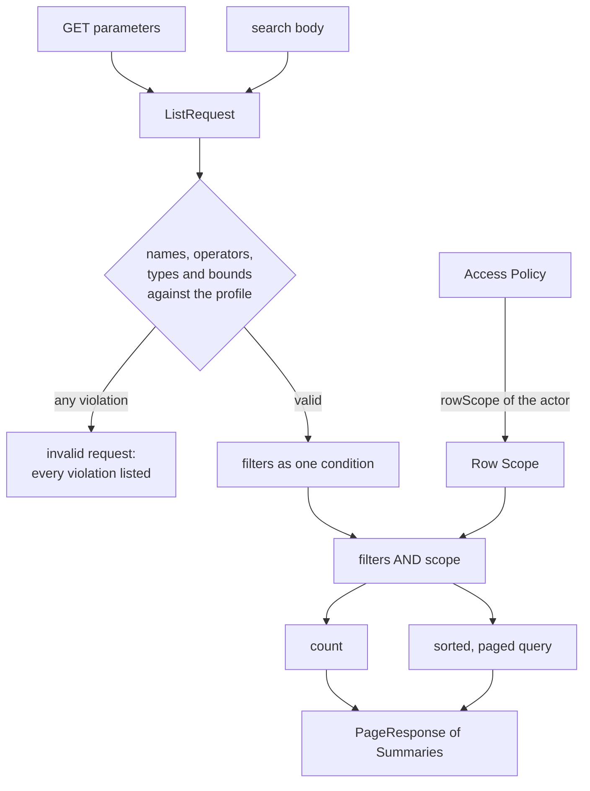
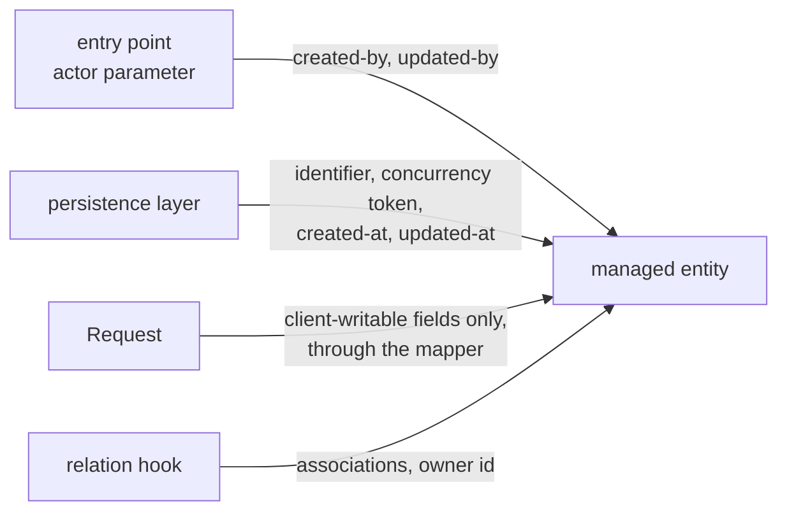
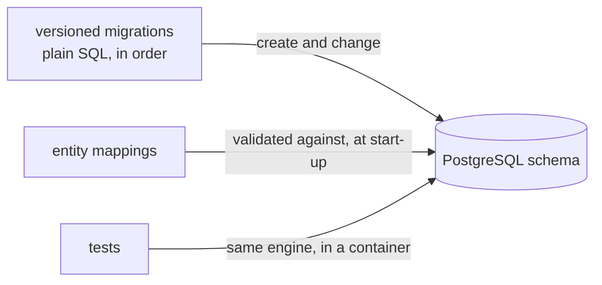
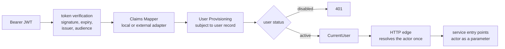
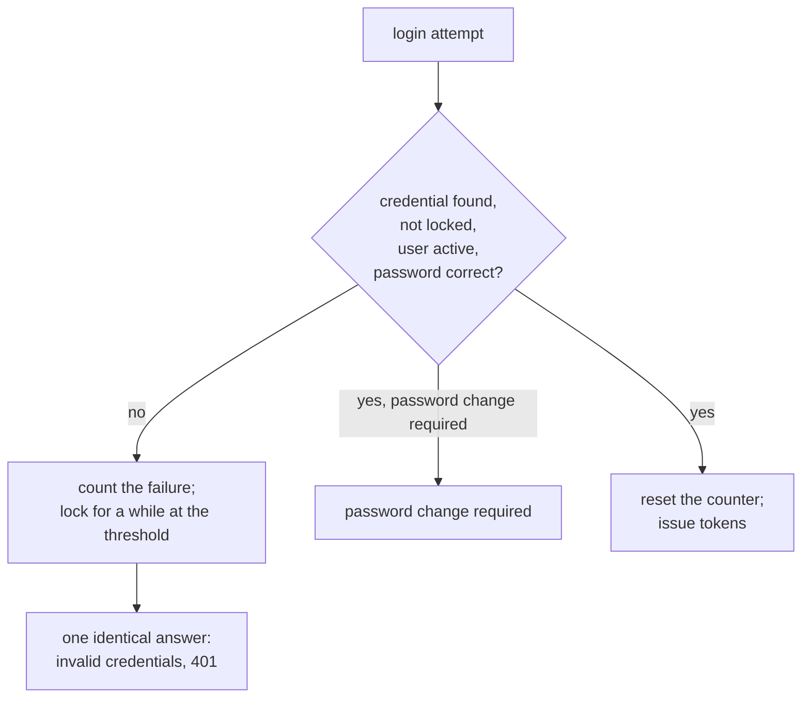
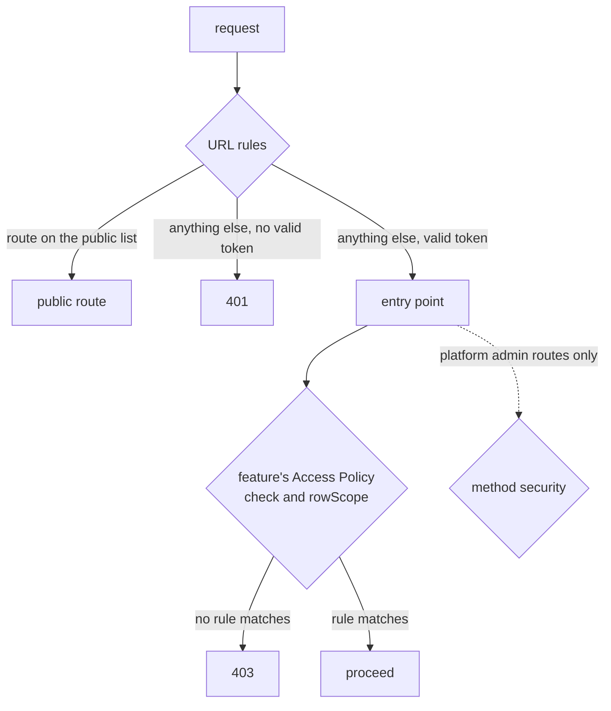
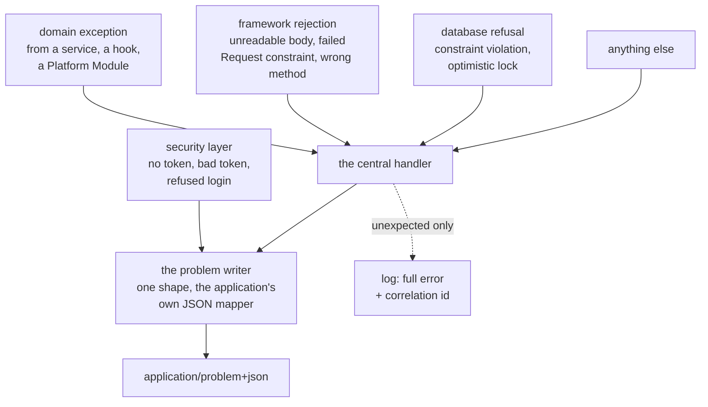

# Task: Guide Documents 06–09 — Query Engine, Domain Model and Persistence, Identity and Access, Errors and Validation

#task #done #high-complexity #parent-spring-boot-architecture-guide-and-base-project

**Parent:** [[Features/to-do/Spring-Boot-Architecture-Guide-and-Base-Project|Spring Boot Architecture Guide, Base Project and Skill]]
**Parent Type:** Feature
**Related Step(s):** Phase 2 — Step 2.3 (Task 4 in the parent's Task Breakdown)
**Estimated Complexity:** High

---

## Goal

Write Guide documents `06-Query-Engine`, `07-Domain-Model-and-Persistence`,
`08-Identity-Authentication-and-Authorization` and `09-Errors-and-Validation` as drafts in the format of
[[Docs/Guide/Guide-Conventions]], with 78 rules (`G06-01` … `G09-14`), each resting on a reference
finding or an ADR, and turn the names of these four documents in documents 02–05 into links. These
documents carry most of the Critical reference findings — no enforced authorization, minted tokens,
literal secrets, no migrations — so their contracts must be right before the contract review (Task 5)
and the Skill (Task 6) build on them.

---

## Parent Context

The parent Feature turns the analysis of the three Reference Projects into a **Guide**, a **Base
Project** and a rewritten **Skill**, and proves them with a **Validation Loop**. Phases execute
**1 → 2 → 4 → 5 → 3 → 6**. This Task is the third Task of Phase 2 and the fourth of 13.

What the parent says about this Task:

- **Step 2.3:** "Write Guide 06–09 (query engine, domain and persistence, identity and access, errors
  and validation)."
- **Reason for grouping:** "High complexity; identity and access alone carry most Critical reference
  findings."
- **Section 3 (the Guide documents)** gives one row of required content per document:

| # | Document | Content the parent requires |
|---|---|---|
| 06 | Query-Engine | Query Profile (field whitelist), `RowScope` (row visibility), request forms (`GET` / `POST /search`), operators, bounds, typing |
| 07 | Domain-Model-and-Persistence | Entities, the server-owned concurrency token, `equals`/`hashCode`, LAZY by default, enums as strings, auditing (`createdBy`/`updatedBy` as string actor labels, the `system` sentinel, filled from the entry-point actor, never an ambient read), constraints, Flyway |
| 08 | Identity-Authentication-and-Authorization | Current User seam, `CurrentUser.system()` and the explicit-actor rule, token verification, local issuer, the `externalSubject` = `sub` invariant, `UserDirectory` lifecycle, the credential-vs-account split, one role writer per mode, provisioning per mode, brute-force protection, CORS, the authorization ownership rule, deny-by-default at three layers, the `@PreAuthorize` ban in features, ownership, the migration runbook |
| 09 | Errors-and-Validation | Exception hierarchy, `ProblemDetail` with one `type` URI per failure shape, validation on requests, security errors in the same shape |

- **Sections 7, 8 and 9** of the parent (query engine, identity and access, errors and validation) and
  the persistence parts of sections 6 and 12 are the design these documents state.
- **The decisions are recorded as ADRs** and are this Task's requirements:
  [[ADRs/ADR-011-list-api-get-paging-and-post-search|ADR-011]] (list API, ten decisions),
  [[ADRs/ADR-010-postgresql-flyway-and-testcontainers|ADR-010]] (persistence baseline),
  [[ADRs/ADR-006-identity-current-user-seam-and-removable-local-issuer|ADR-006]] (identity, eight
  decisions), [[ADRs/ADR-007-single-user-keyed-by-token-subject|ADR-007]] (user model, nine decisions),
  [[ADRs/ADR-008-no-multi-tenancy-in-the-base-project|ADR-008]] (Row Scope as the tenancy extension
  point), [[ADRs/ADR-009-unchecked-domain-exceptions-as-problem-details|ADR-009]] (errors, seven
  decisions), [[ADRs/ADR-005-deepened-crud-base-with-access-policy|ADR-005]] and
  [[ADRs/ADR-018-scoped-load-before-policy-check|ADR-018]] (the base these documents plug into),
  [[ADRs/ADR-003-version-baseline-as-a-support-policy|ADR-003]] (rules are version-neutral) and
  [[ADRs/ADR-016-guide-document-format-and-rule-ids|ADR-016]] (the format).

What this Task enables:

- **Task 5** writes documents 10–16 and runs the blind contract review (`GC-R`). Storage and idempotency
  build on the problem-type registry of document 09 and on the public-route contract of document 08.
- **Task 6** (the Skill) cites these Rule IDs. From the day the Guide passes the contract review a Rule
  ID is never renumbered.

Constraints from the parent and the memory bank:

- Documents are **drafts** (`#draft`): rules, IDs and module contracts are complete and binding; the
  narrative, the "Differs" section and the Version Notes are finalised in Task 12.
- Rule text is behavioural. It names products, standards and the names this convention defines; it never
  names a framework class, method, annotation or property (ADR-003). Those live in Version Notes.
- A Guide document never links a Feature, Task or Bug document. No secret value appears in any new file.
- The three reference projects are read-only. ADRs are immutable once accepted.
- One home per rule (decided in Task 3): a rule that documents 01–05 already state is **cited** here, not
  restated.

### Rules that already have a home in documents 01–05

Documents 06–09 cite these and do not restate them.

| Subject | Home | Cited from |
|---|---|---|
| No method-security annotation in `features` | `G02-05` | 08 |
| The current-user provider stays at the HTTP edge; the actor is a parameter | `G02-06`, `G04-02` | 07, 08 |
| The Token Issuer module is imported by nothing | `G02-04` | 08 |
| Access Policy: single module, deny by default | `G04-07`, `G04-08` | 08 |
| Row Scope in every query, before paging; hidden rows read as not found | `G04-09`, `G04-10` | 06 |
| Order of checks at an entry point | `G04-11` | 06, 09 |
| Conditional write (behaviour and wire) | `G04-12`, `G04-13`, `G05-08` | 07, 09 |
| Per-entry-point transactions; unchecked failures | `G04-15`, `G04-16` | 08, 09 |
| Status meanings; the 400 / 422 / 409 test | `G05-05`, `G05-06` | 09 |
| The page shape | `G05-07` | 06 |
| Zone-less date-times on the wire | `G05-09` | 06 |
| No exported repositories | `G05-10` | 08 |
| Input constraints live on the Request; the Request carries no server-owned field | `G03-05`, `G03-04` | 07, 09 |

### Gaps in the parent that this Task closes

Each row is a contract point the parent and the ADRs leave open and a document of this Task must pin.
The Design Decisions section gives the reasoning. **The user confirms them in Step 1**; the rows marked
★ deserve a deliberate yes, because each becomes a rule whose ID is permanent after the contract review.

| # | Gap | Resolution in this Task |
|---|---|---|
| H1 ★ | `RowScope` has three forms in the parent (`ownedBy`, `all()`, `system()`). A policy "must answer for every actor", but there is no fail-closed answer, and nothing says how scopes compose (ADR-008 names "composition" only) | Four forms — `ownedBy`, `all()`, **`none()`**, `system(actor)` — and **AND-only** composition (`and`). `none()` is what a policy returns for an actor it has no rule for; `system(actor)` cannot be built for another actor (`G06-11`). One sentence of document 04 changes (Step 6). |
| H2 ★ | "Maximum page size, maximum filter count, maximum values per filter" — what happens beyond a bound? | The request is **rejected** (400), never silently cut down (`G06-08`). The list of bounds also gains sort keys, conditions per filter and text length. |
| H3 ★ | "The predicate technology (QueryDSL or JPA Criteria) is an implementation detail … the Guide records the choice in a version note" — the choice is not made | **Jakarta Persistence criteria through Spring Data specifications**, recorded as a `not verified` Version Note: no dependency outside the managed set (`G01-07`) and no second annotation processor beside MapStruct. |
| H4 ★ | The parent says both "`CurrentUser` is the only identity type feature code may import" and "per-type data lives in feature entities that reference `User`" | A feature entity refers to a user **by id** (a column with a foreign key in the migration) and holds no association to the user record (`G07-15`). The convention offers features no user-read operation. |
| H5 ★ | "`createdBy`/`updatedBy` … filled from the entry-point actor, never an ambient read" — who writes them? The framework's auditing reads the auditor from the surroundings | The **CRUD base** stamps the two actor labels from its actor parameter, and a feature-specific operation stamps through the base type's one stamping operation; the persistence layer writes only the two timestamps (`G07-06`). Labels are text, not foreign keys (`G07-07`). |
| H6 ★ | "`User.status` is enforced on every request" — with which status, and are roles then also read per request? | A disabled user, and in local mode an unknown subject, are refused as **401**; the roles in force are those of the mode's role writer at request time (`G08-10`). This costs one user lookup per request — the reference projects removed that lookup on purpose (WP-R01-08). |
| H7 ★ | The parent names `POST /auth/login`, but `G05-01` puts every API route under the versioned prefix. `mustChangePassword` exists but no route lets a user change a password | The issuer's routes are `/api/v1/auth/…`. A fourth route, **password change**, is added; a credential that must change its password cannot log in and gets `password-change-required` (`G08-14`). |
| H8 ★ | "An explicit public-route list" — where, and how does it include the removable module's routes without `platform.access` importing it (`G02-04`)? May a feature add a public route? | One closed list in `platform.access`; a Platform Module contributes through a `PublicRoutes` port; **a Feature Module adds none**, and the convention defines no anonymous actor (`G08-26`). |
| H9 ★ | ADR-009 lists six built-in exception kinds and also says an unknown query field is 400 — no kind has status 400 | A seventh kind, **`InvalidRequest` (400)**, for code that finds a request invalid by itself (the list engine). It applies ADR-009 decision 7; no new ADR is proposed (`G09-01`). |
| H10 ★ | "A stable `type` URI" — its form is not given | `/problems/<name>`: a relative reference, the same in every environment, listed in one registry; **every** problem carries a correlation id, not only the 500 (`G09-02`, `G09-04`). |
| H11 ★ | Where request validation sits relative to authorization (left open by Task 3) | 401 → 400 (invalid by itself) → the entry point's order of checks → a hook's refusal → the database's refusal (`G09-14`). A caller therefore learns that its input is invalid before it learns whether it may act; nothing about any row is revealed. |
| H12 | A Request id that refers to nothing | 422 business rule violation; never dropped in silence (`G09-12`). |
| H13 | Paging without a total order | The engine appends the identifier as the last sort key (`G06-09`). |
| H14 | Where the shared base type of entities lives; whether ids are UUIDs (the parent's "reserved non-UUID literal" suggests it) | In `platform.crud`. One identifier strategy per project, not prescribed; `CurrentUser.userId` is text, so `system` cannot collide with any strategy (`G07-08`, `G08-06`). |
| H15 | The scoped load of `G04-11` needs the same scope-to-query translation as the list | The list engine has a second entry point, `findVisible` (`G06-01`). |
| H16 | The login identifier of a local user (the user record has an e-mail, not a user name) | A unique login name on `LocalCredential`. |
| H17 | Role names are the project's, so which role may use the platform's admin routes? | The project names its administrator role in typed configuration (document 08, "The administrator role"). |
| H18 | May a disabled user keep refreshing? | No: a refresh token of a disabled user is refused (`G08-16`). |

### Inconsistencies in the parent, found while creating this Task

None blocks the Task; each is resolved by a row above and reported so the user can correct the parent if
they wish (the parent is not edited beyond ticking Step 2.3).

1. Section 8 cites the Spring Security **7.0** reference; Spring Boot 4.1.x manages **7.1** (already in
   the memory bank). Document 08 cites 7.1.
2. Section 8 writes the issuer routes without the versioned prefix (H7).
3. Section 8 says `CurrentUser` is the only identity type features import, and that feature entities
   reference `User` (H4).
4. Section 8 gives the local admin "set password / `mustChangePassword`" and limits the surface to
   "exactly this", which leaves a forced password change with no way to perform it (H7).
5. Section 8 calls the system id a "reserved non-UUID literal", while document 05's examples use numeric
   ids (H14).

---

## Preconditions / Dependencies

- **Tasks 1–3 are done.**
  [[Tasks/done/Spring-Boot-Architecture-Guide-and-Base-Project-step-3-guide-structure-crud-api]] wrote
  documents 01–05 (63 rules) and ADR-018.
- **State of the repository at creation (2026-10-04, measured):**
  - `documentation/Docs/Guide/` holds the conventions, the index and documents 01–05; the index reports
    `Draft documents: 5`, `Version Notes not verified: 14`.
  - `python3 scripts/validate-analysis-docs.py guide` exits 0; `python3 -m unittest discover -s
    scripts/tests` runs 104 tests, all passing.
  - Documents 02–05 name documents 06–09 in inline code 17 times (7 further names are of documents
    10–15 and stay for Task 5).
  - `documentation/Tasks/current/` was empty. The working tree holds the uncommitted output of Tasks
    1–3; it is not part of this Task and must not be reverted.
- **The validator is not changed by this Task.**
- **Traps of the `guide` target** (unchanged from Task 3 — read them there if a document is edited):
  every `G<NN>-<MM>`, Finding ID and `ADR-NNN` written anywhere must resolve; a wiki link must resolve
  and never point into `Features/`, `Tasks/` or `Bugs/`; a backticked path that starts with a reference
  project name and continues is a source citation; inside `## Rules` a line that starts with a bold
  label ends the field before it; a Version Note is a `- ` item that starts with a marker; never put a
  full stop or a comma directly after a URL; the index must link every document and report true counts.
- **`base-project/` and `documentation/Docs/Validation/` do not exist.** A `verified` Version Note can
  cite only a reference Finding ID or a version-tagged URL.
- **The version line for Version Notes is Spring Boot 4.1.x**, which manages Spring Security 7.1.x,
  Spring Framework 7.0.x and Spring Data 4.1.x.
- **`rg` is not a binary on the PATH** here. Commands use `grep`. **`obsidian.use_cli` is `false`.**
- **The user must be available** for Step 1 (the gaps), for the glossary terms in Step 8 and for the
  Manual Validation items.

---

## Skills and Documentation Preparation

### Skills Reviewed

- `documentation-management` — **Selected** — Task template, document locations, the "only modify files
  when asked" rule.
- `memory-bank` — **Selected** — project context; Step 9 updates the agent-maintained files.
- `glossary-management` — **Selected** — the documents use the glossary's terms as defined (*Query
  Profile*, *Row Scope*, *Access Policy*, *Current User*, *Claims Mapper*, *Token Issuer*, *User
  Directory*, *Concurrency Token*, *Page Response*, *Entry Point*); Step 8 proposes six new terms.
- `doc-exploration` — **Selected (at creation)** — 18 ADRs checked (005–012, 016 and 018 read in full;
  the decisions of 004, 013 and 014; the rest by title in the index); 11 are cited by the four documents (004–013,
  018).
- `solid-deep-design` — **Selected** — the test applied to every module these documents define (table
  in "Approach").
- `find-docs` — **Selected** — version-matched documentation for every `verified` Version Note (table
  below). The versioned pages were read directly, because Context7's versioned Spring IDs can return
  `main` snippets (memory bank).
- `tdd` — **Selected, adapted** — this Task writes no code. Its public interface is the validator's CLI;
  the expected red state after each step is listed.
- `task-reviewer` — **Selected (at creation)** — reviewed this document.
- `superpowers:verification-before-completion` — **Selected** — run each validation command and read its
  output before ticking a criterion.
- `superpowers:brainstorming`, `interview-me` — **Not needed** — the design was decided in D1–D18 and
  the ADRs; the open points are listed for the user in Step 1.

Exploration at creation was done directly, not through subagents (`Memory/known-issues.md` records that
agent inventories produced wrong leads): every finding a rule cites was read in its review document.

### Documentation Reviewed

All read on 2026-10-04. `docs.spring.io` redirects the versioned address of the current line to the
unversioned one; each page below was reached that way and its header shows the version given. The
Version Notes cite the **versioned** address (memory bank).

| Source | What was checked | Result |
|---|---|---|
| Spring Security reference **7.1** (page shows 7.1.1) — `servlet/oauth2/resource-server/jwt.html` | Decoder construction, issuer and audience validation, authorities | `NimbusJwtDecoder.withPublicKey` / `withJwkSetUri` / `withIssuerLocation`; `JwtValidators.createDefaultWithIssuer`, `JwtClaimValidator`, `DelegatingOAuth2TokenValidator`, `setJwtValidator`; default authorities from `scope` with prefix `SCOPE_`; `oauth2ResourceServer(…jwt…)` with `decoder` and `jwtAuthenticationConverter`. |
| Spring Security reference 7.1 — `servlet/authorization/authorize-http-requests.html` | URL rules | `requestMatchers(…).permitAll()` then `anyRequest().authenticated()`; the authorization filter runs on every dispatch, `ERROR` included. |
| Spring Security reference 7.1 — `servlet/authorization/method-security.html` | The method-security switch | `@EnableMethodSecurity` on a configuration class; not active without it; `securedEnabled`, `jsr250Enabled` are opt-in. |
| Spring Security reference 7.1 — `servlet/integrations/cors.html` | CORS in the chain | `cors(c -> c.configurationSource(…))`; with more than one `CorsConfigurationSource` bean nothing is chosen automatically. |
| Spring Security source at tag `7.1.1` — `UserDetails.java` | The account-flag defaults | The four `is…` methods are `default` and return `true`. |
| Spring Framework reference **7.0** (page shows 7.0.9) — `web/webmvc/mvc-ann-rest-exceptions.html` | RFC 9457 support | `ProblemDetail`, `ErrorResponse`, `ErrorResponseException`, `ResponseEntityExceptionHandler`; `application/problem+json`; extra members through the `properties` map. |
| Spring Data JPA reference **4.1** (page shows 4.1.1) — `auditing.html` | Auditing | `@CreatedDate`, `@LastModifiedDate`, `@CreatedBy`, `@LastModifiedBy`; `AuditorAware.getCurrentAuditor()` takes no parameter — an ambient read (the reason for H5). |
| Spring Data JPA reference 4.1 — `jpa/specifications.html`, `repositories/core-extensions.html` | The two predicate technologies | `JpaSpecificationExecutor`, `Specification`, `PredicateSpecification` (since 4.0), `and` / `or`; `QuerydslPredicateExecutor`. |
| Spring Boot 4.1 application properties | Property names for the persistence, problem-detail and resource-server settings | **The page was too long to read to the needed sections.** Every property name in the documents is therefore in a `not verified` note. |
| The three review sets under `documentation/Docs/<project>/Reviews/` | Every finding cited by a rule | 118 distinct findings are cited by the 78 rules; 81 of them are not cited by documents 01–05. |
| ADR-004 … ADR-013, ADR-018 | The decisions the rules state | See "Parent Context". |

Not looked up, and marked `not verified` in the documents: Flyway 12 (file naming, locations), Hibernate
7.4 (`@Version`, lazy to-one, enumerations by name), Testcontainers 2.0, Jackson 3, the token encoder.

### Related Existing Code

- `documentation/Docs/Guide/Guide-Conventions.md` — the format contract.
- `documentation/Docs/Guide/Guide-Index.md` — four rows, two counts, one changelog line change.
- `documentation/Docs/Guide/02-…`, `03-…`, `04-…`, `05-…` — 17 inline-code names become links; one
  sentence of document 04 gains the `none()` form (Step 6).
- `scripts/validate-analysis-docs.py` — the `guide` target. **Not edited by this Task.**
- `documentation/Docs/<project>/Reviews/NN-*-Review.md` — where a Finding ID resolves.
- `documentation/ADRs/ADR-NNN-*.md` — where an ADR resolves.

---

## Implementation Details

### Approach

**The documents are written here, in full, and were proven before the Task was written** — the method
of Task 3. All four were built in the session scratchpad and run through the real validator against a
copy of the real documentation: the final state exits 0, and the red state after each step was measured.
The executor's work is to settle the open points with the user, write the files, validate after each
one and read the result — not to re-derive 78 rules.

**Contract first.** Each `Design` section states modules by contract — entry points, invariants, error
modes, interactions — with a diagram where there is a flow. Code appears only as short Java-like
sketches that fix names of this convention and no framework syntax.

**Applying `solid-deep-design` to the modules these documents define:**

| Module | Interface | What it hides | Seam / deletion test |
|---|---|---|---|
| List engine (`platform.query`) | two entry points: `run`, `findVisible` | parsing, whitelisting, typing, bounds, scoping, sorting, counting, paging | Deleting it puts all of that — and the scope — into every feature |
| Query Profile (per feature) | a declaration, no behaviour | — | One per feature; checked at start-up |
| Row Scope (`platform.access`) | a value: four forms and `and` | the query technology | Technology-neutral, so a policy never depends on the engine's internals |
| Claims Mapper | one operation | where a provider puts roles | A real seam: local adapter, external adapter, test adapter |
| Token verification | none added | — | The framework's decoder already is the port; a wrapper would be a pass-through (`G01-03`) |
| User Provisioning | one operation | find-or-create, the race, the transaction | Deleting it puts a racy find-or-create at the edge |
| User Directory | three operations | every rule about creating and rebinding users | The single path; the bootstrap and the admin surface compose it |
| `PublicRoutes` port | one operation | which module owns which public route | A real seam: the Token Issuer, storage, a test adapter — and it keeps `G02-04` true |
| Domain exception hierarchy + problem writer | seven kinds; one writer | status, type, body, media type, the JSON mapper | Deleting the writer brings back four ways to build an error |

**Service language and wire language** (kept from Task 3): documents 06–08 state outcomes in the words
of the service ("rejected as invalid", "refused as not authenticated"); document 09 owns the mapping to
status codes and problem types.

**Order and validation.** Documents are written 06 → 09 and the validator runs after each. The four
documents link each other, so the runs after Steps 2–4 fail **only** on links to documents of later
steps (listed in each step). After Step 5 the target exits 0; Step 6 then links documents 02–05.

### What this Task leaves to later documents

| Later document | Left open here, on purpose |
|---|---|
| `10-Object-Storage-and-Uploads` | The download ticket, the redemption route (document 08 only lists it as public by capability), the `ticket-expired` and `content-digest-mismatch` types, deleting stored objects when the owning entity is deleted, the file-type check by content (WP-R08-05) |
| `11-Idempotency` | The `request-in-progress` and `idempotency-fingerprint-mismatch` types |
| `12-Configuration-and-Secrets` | The typed settings these documents name: the identity mode, the signing key, the bootstrap credentials, the CORS origins, the list bounds; secrets never returned by an API (WP-R01-04) |
| `13-Testing-Strategy` | The route × role matrix, the route-coverage test, the login tests `G08-19` requires (BE-R08-01, BE-R08-02) |
| `14-Observability-and-Operations` | The health endpoint on the public list; the correlation id's source; log levels for client errors |
| `16-Traceability-Matrix` | 61 of the 78 in-scope findings have a rule after this Task (lists in Step 7) |
| The contract review (Task 5) | Whether "no anonymous actor" (H8) and "one user lookup per request" (H6) hold up |

### Files to Create/Modify

- [x] `documentation/Docs/Guide/06-Query-Engine.md` — **new**; 16 rules (Step 2)
- [x] `documentation/Docs/Guide/07-Domain-Model-and-Persistence.md` — **new**; 19 rules (Step 3)
- [x] `documentation/Docs/Guide/08-Identity-Authentication-and-Authorization.md` — **new**; 29 rules
  (Step 4)
- [x] `documentation/Docs/Guide/09-Errors-and-Validation.md` — **new**; 14 rules (Step 5)
- [x] `documentation/Docs/Guide/02-Project-Layout-and-Module-Boundaries.md`, `03-Feature-Module-Anatomy.md`,
  `04-CRUD-Base-and-Service-Hooks.md`, `05-API-Contract.md` — the link pass: 17 names become links; one
  sentence of document 04 (Step 6)
- [x] `documentation/Docs/Guide/Guide-Index.md` — four rows become links with state `draft`; the two
  counts; one changelog line (Steps 2–7)
- [x] `documentation/Features/to-do/Spring-Boot-Architecture-Guide-and-Base-Project.md` — tick Step 2.3
  (Step 9)
- [x] `documentation/Glossary/glossary.json`, `documentation/Glossary/Glossary.md` — **through the
  `glossary` CLI only**, and only the terms the user confirms (Step 8)
- [x] `documentation/Memory/context.md`, `progress.md`, `architecture.md`, `known-issues.md` (Step 9)

**Not modified:** `scripts/validate-analysis-docs.py`, both test files, `Guide-Conventions.md`,
`01-Principles-and-Baseline.md`, every ADR, `documentation/Memory/brief.md`, the three reference
projects.

Scratch files (session scratchpad, not committed): `link_pass.py` (Step 6), `rule_evidence.py` (Step 7).

---

## Step-by-Step Implementation

### Step 1: Record the baseline and settle the open points with the user

**Goal:** Nothing is written until the contract choices are confirmed.
**Dependencies:** None. **Needs the user.**

- [x] Run the baseline and keep the output:

```bash
python3 scripts/validate-analysis-docs.py guide; echo "guide exit=$?"
for p in backend BugTracker wpmanager; do python3 scripts/validate-analysis-docs.py "$p" >/dev/null; echo "$p exit=$?"; done
python3 -m unittest discover -s scripts/tests 2>&1 | tail -3
for s in backend bugtracker wpmanager; do sha256sum --quiet -c scripts/.snapshots/$s.sha256 && echo "$s unchanged"; done
sha256sum scripts/validate-analysis-docs.py scripts/tests/*.py documentation/Docs/Guide/Guide-Conventions.md \
  documentation/Docs/Guide/01-Principles-and-Baseline.md documentation/Docs/Analysis-Doc-Conventions.md \
  documentation/ADRs/ADR-0[01][0-9]-*.md > <scratchpad>/frozen.sha256
wc -l < <scratchpad>/frozen.sha256
grep -c -o -E '`0[6-9]-[A-Za-z-]+`' documentation/Docs/Guide/0[2-5]-*.md
```

  Expected: four `exit=0` lines, `Ran 104 tests` and `OK`, three `unchanged` lines, `24` (the validator,
  two test files, two conventions documents, document 01 and eighteen ADRs), and the counts `1`, `4`,
  `7`, `5` for documents 02 to 05 (lines that hold a name; 17 names in all).
- [x] Show the user the table "Gaps in the parent that this Task closes" and ask for confirmation of the
  ★ rows H1–H11. Record each answer.
- [x] Show the user the list "Inconsistencies in the parent" and ask whether the parent should be
  corrected. This Task does not edit the parent beyond ticking Step 2.3 unless the user says so.
- [x] If the user changes a point, change the affected text **before** writing the document (the edge
  cases below say where each point lives).

**Why this step is critical:**
Rule IDs become permanent at the contract review. Eleven of these choices are not in any ADR; a choice
the user would have made differently is cheap to change now and costs a withdrawn rule later.

#### Edge Cases
1. **Case:** the user rejects `none()` (H1) — in document 06 remove the `none()` line of the sketch, its
   table row and its bullet, and reword `G06-11` to three forms; in Step 6 delete the `OLD_SCOPE` /
   `NEW_SCOPE` replacement from `link_pass.py` and write `system()` back as the parent has it.
2. **Case:** the user wants an over-limit page size clamped (H2) — reword `G06-08` ("a page size above
   the bound is reduced to the bound; every other bound rejects") and the sentence under the bounds
   table.
3. **Case:** the user chooses Querydsl (H3) — swap the two `not verified` notes of document 06 on the
   predicate technology; no rule changes (`G06-12` keeps the technology out of every contract).
4. **Case:** the user wants features to hold an association to the user record (H4) — reword `G07-15`
   and the section "References to the user"; `G08-05` then needs the user record as a second identity
   type, which contradicts ADR-006 decision 3: stop and ask.
5. **Case:** the user wants 403 for a disabled user (H6) — change `G08-10`, the diagram label `401` in
   "From a token to the actor", and the `unauthenticated` row of the registry in document 09.
6. **Case:** the user rejects the password route (H7) — remove its table row, the last bullet of the
   issuer section, the "password change required" branch of the login diagram, the words "password
   change" from `G08-14`, "with a password change required" from `G08-23`, the
   `must-change-password` column and the `password-change-required` row of the registry in document 09.
7. **Case:** the user wants features to add public routes (H8) — this needs an anonymous actor, which no
   ADR defines: record the request and propose an ADR; do not write it into `G08-26` unasked.
8. **Case:** the user wants a new ADR for the seventh exception kind (H9) — write a narrow ADR (the
   pattern of ADR-018) before Step 5 and add its number to the evidence of `G09-01`.
9. **Case:** the user wants absolute type URIs (H10) — replace `/problems/` by the chosen base in
   document 09 (the hierarchy table, the JSON example, the registry, `G09-04`). Documents 06 and 08 name
   a type only by its last word and need no change.
10. **Case:** the user is not available — stop here.

---

### Step 2: Write document 06 — Query Engine

**Goal:** The contract of the list engine, the Query Profile and the Row Scope.
**Dependencies:** Step 1.

- [x] Create `documentation/Docs/Guide/06-Query-Engine.md` with the text below.
- [x] In `Guide-Index.md` replace the row of document 06 with the row given in Step 7, and set
  `Draft documents: 6`, `Version Notes not verified: 19`.
- [x] Run `python3 scripts/validate-analysis-docs.py guide`. Expected: exit 1 with **only** these lines,
  each printed twice (one per occurrence): `06-Query-Engine.md: wiki link
  [[Docs/Guide/07-Domain-Model-and-Persistence]] does not resolve to a doc` and the same for
  `[[Docs/Guide/09-Errors-and-Validation]]`.

**Why this step is critical:**
Every list of every feature goes through this contract, and it is where row visibility becomes a query.

#### Implementation

`````markdown
# Query Engine

#doc #guide #api-design #security #persistence #draft

**Guide:** [[Docs/Guide/Guide-Index]] · **Conventions:** [[Docs/Guide/Guide-Conventions]]

## Purpose

The query engine answers every list and every search of the application: it filters, sorts and pages
rows, safely, behind one call. A client may name only the fields a feature declared, may use only the
operators declared for them, and can never see a row outside the actor's Row Scope. This document is the
contract of that engine: the two request forms, the Query Profile, the operators, the bounds, and how the
Row Scope is applied and composed. The one idea to take away: the Query Profile decides which *fields* a
client may query, the Row Scope decides which *rows* the actor may see, and the two never mix.

## Design

### Interface

Design sketch in Java-like notation. It fixes names and shapes of this convention, not framework syntax.

```java
// platform.query
interface ListQuery {
  // filter, sort and page the rows the scope allows
  <E, SUM> PageResponse<SUM> run(QueryProfile<E> profile, RowScope scope,
                                 ListRequest request, Function<E, SUM> toSummary);

  // load one row by id, through the scope; empty when the row is absent or not visible
  <E, ID> Optional<E> findVisible(Class<E> entity, ID id, RowScope scope);
}

// one internal form for both request forms
record ListRequest(Integer page, Integer size, List<SortKey> sort, List<FieldFilter> filters) {}
record SortKey(String field, Direction direction) {}            // asc | desc
record FieldFilter(String field, List<Condition> conditions) {} // conditions are OR-ed
record Condition(Operator op, List<String> values) {}

// platform.access — a value; it carries no persistence type
final class RowScope {
  static RowScope ownedBy(String ownerPath, CurrentUser actor); // rows whose owner is the actor
  static RowScope all();                                        // every row
  static RowScope none();                                       // no row
  static RowScope system(CurrentUser actor);                    // every row; only the system actor may build it
  RowScope and(RowScope other);                                 // the only way to combine two scopes
}
```

- `run` is the list entry point. The CRUD base calls it for `list` and `search`
  ([[Docs/Guide/04-CRUD-Base-and-Service-Hooks]]); a feature that opts out of the base calls it directly.
- `findVisible` is the scoped load of G04-11. It lives here because the engine is the one place that
  turns a Row Scope into a query condition.
- Both take the Row Scope as a required argument. There is no overload without it.
- A feature never builds a query condition itself. It declares a Query Profile and returns a Row Scope;
  the engine does the rest.

### The Query Profile

One per feature that lists rows (`<F>QueryProfile`, G03-08). It declares each queryable field once:

| Part of a field declaration | Meaning |
|---|---|
| name | What the client writes. It is the only thing a client ever sends about a field |
| path | Where the value lives on the entity; it may go through an association (`project.name`) |
| type | text, number, boolean, date, date-time, enumeration, identifier — or a collection of one of them |
| operators | The operators a client may use on this field |
| sortable | Whether a client may sort by it |
| nullable | Whether the field can be empty, which allows the `isNull` operator |

The profile also declares the default sort and the bounds:

| Bound | What it limits |
|---|---|
| maximum page size | `size` |
| default page size | `size` when the client sends none |
| maximum sort keys | entries in `sort` |
| maximum filters | entries in `filters` |
| maximum conditions per filter | entries in one filter's `conditions` |
| maximum values per condition | values of one `in` |
| maximum text length | characters of one text value |

The platform supplies a default for every bound, from typed configuration; a profile may lower or raise a
bound for its feature. A profile is checked when the application starts: every path must exist on the
entity and every operator must fit the field's type. A wrong profile stops the start-up.

### Operators

The vocabulary is closed. A field declares the subset it allows.

| Operator | Meaning | Field types |
|---|---|---|
| `eq`, `ne` | equal, not equal | all |
| `in` | equal to one of the values | all except boolean |
| `gt`, `gte`, `lt`, `lte` | ordering | number, date, date-time |
| `between` | from the first value to the second, both included | number, date, date-time |
| `contains`, `startsWith`, `endsWith` | text match, case-insensitive | text |
| `isNull` | the field is empty (`true`) or not (`false`) | nullable fields |

On a collection field, `eq` and `in` mean "the collection has at least one such element".

`contains` and `endsWith` cannot use an ordinary index. A profile allows them only on fields where a scan
is acceptable or where the migration adds a suitable index
([[Docs/Guide/07-Domain-Model-and-Persistence]]).

### The two request forms

Simple listing, cacheable and bookmarkable:

```
GET /api/v1/notes?page=0&size=20&sort=createdAt,desc&sort=title,asc
```

Rich filters:

```json
POST /api/v1/notes/search
{
  "page": 0,
  "size": 20,
  "sort": [ { "field": "createdAt", "direction": "desc" } ],
  "filters": [
    { "field": "title",  "conditions": [ { "op": "contains", "value": "invoice" },
                                         { "op": "startsWith", "value": "draft" } ] },
    { "field": "status", "conditions": [ { "op": "in", "values": ["OPEN", "REVIEW"] } ] }
  ]
}
```

- The `GET` form carries `page`, `size` and `sort` only. Filters exist only in the search body.
- Every member of the body is optional. `{}` is a valid search: first page, default size, default sort.
- Conditions of one filter are OR-ed. Filters are AND-ed. The example reads: (title contains "invoice"
  OR title starts with "draft") AND status is OPEN or REVIEW.
- A condition carries `value` for one value and `values` for `in` and `between`.
- A field appears in at most one filter.
- Both forms answer with the page shape of [[Docs/Guide/05-API-Contract]] (G05-07).

### What the engine does with a request



1. Both forms are parsed into one `ListRequest`.
2. The request is checked against the profile: every field name, every operator, every value and every
   bound. All violations are reported together, as one invalid request (the `invalid-query` failure of
   [[Docs/Guide/09-Errors-and-Validation]]).
3. Missing parts take the profile's defaults. The engine appends the identifier as the last sort key, so
   the order of rows is total and pages do not overlap.
4. The filters become one condition. The Row Scope is AND-ed onto it. Nothing a client sends can remove,
   replace or widen the scope.
5. The count and the page query use that same condition, so `totalItems` and `totalPages` count only rows
   the actor may see (G04-09).
6. Each row becomes a Summary. The query fetches what the Summary needs; the mapping causes no further
   query.

### The Row Scope

A Row Scope is a value that says which rows an actor may see. The Access Policy returns one for every
actor ([[Docs/Guide/04-CRUD-Base-and-Service-Hooks]]); the engine applies it.

| Value | Rows | Returned for |
|---|---|---|
| `ownedBy(ownerPath, actor)` | rows whose owner is the actor | an ordinary user of a feature with owned rows |
| `all()` | every row | a role that may see everything, such as an administrator |
| `none()` | no row | an actor the feature has no rule for |
| `system(actor)` | every row | the system actor, in a feature that declares system work |

- `ownerPath` names the attribute that holds the owner's user id; it may go through an association
  (`project.ownerId`). The engine compares it with the actor's user id.
- `none()` is the fail-closed answer. A policy that does not know an actor returns it, and every query
  for that actor finds nothing.
- `system(actor)` refuses to be built for any actor that is not the system actor. A policy cannot hand
  "every row" to a user by mistake through it.
- `and` narrows: the result shows a row only when both scopes show it. There is no `or`.

**Multi-tenancy.** The convention implements no tenancy
([[ADRs/ADR-008-no-multi-tenancy-in-the-base-project|ADR-008]]). `and` is its one extension point: a
project that needs tenants adds a tenant scope and returns `tenantScope.and(featureScope)` from every
policy. That project owns the design and the risk.

### Depth

One call hides parsing, whitelisting, typing, bounds, scoping, sorting, counting and paging. Deleting the
engine would put all of that into every feature — and the scope is the part a feature would forget.

## Rules

### G06-01
**Rule:** The list engine has two entry points: run a list (Query Profile, Row Scope, list request,
Summary mapping) and load one row by id through a Row Scope. The Row Scope is a required argument of
both, and a feature never builds a query condition of its own.
**Why:** A list that a feature assembles by hand is the list that forgets the scope, the whitelist or the
bounds.
**Evidence:** WP-R01-03, BT-R01-02, BT-R05-05 · ADR-011, ADR-018
**Differs from references:** The reference engines had no scope argument. BugTracker's plain list route
ignored its filter and returned every row of every tenant.

### G06-02
**Rule:** Simple listing is a `GET` with page, size and sort; rich filtering is a `POST` to the search
route. Both are parsed into one list request and run by the same engine, and the `GET` form carries no
filter.
**Why:** Two engines for two forms drift, and a filter language squeezed into a query string is hard to
parse and hard to bound.
**Evidence:** BE-R06-03, BT-R05-05, BT-R02-09 · ADR-011
**Differs from references:** `backend/` listed only through `POST /list`; BugTracker's plain list route
ignored its filter, and one of its controllers paged through path variables with a contract of its own.

### G06-03
**Rule:** Every filterable or sortable field is declared exactly once in the feature's Query Profile:
name, path, type, operators, sortable, nullable. A field that is not declared cannot be filtered or
sorted; a request that names one is rejected as invalid.
**Why:** Without a whitelist a client can filter and sort by any column, including a password hash, and
read it out one character at a time.
**Evidence:** BT-R05-07, BE-R06-05, BT-R05-03 · ADR-011
**Differs from references:** BugTracker accepted any field name and answered an unknown one with a server
error; `backend/` had a whitelist but wrote each field name three times.

### G06-04
**Rule:** A client names a field only by its declared name. It never sends a path, a column or an
expression; a value on an associated entity is reachable only through a field the profile declares for
it.
**Why:** A path taken from the request lets a client walk associations into data the feature never meant
to expose.
**Evidence:** BT-R05-07, BT-R05-08, BT-R05-04 · ADR-011
**Differs from references:** BugTracker took field names from the request and built association paths
from them at run time; a bad date on such a path ended in a server error.

### G06-05
**Rule:** A value is read according to the declared type of its field, never guessed from how the value
looks. A value that does not parse as that type is rejected as invalid.
**Why:** Guessing turns the text "false" into a string comparison on a boolean column and a date-shaped
name into a date. The query then fails or silently matches nothing.
**Evidence:** BT-R05-02, BT-R05-04, BE-R06-06 · ADR-011
**Differs from references:** BugTracker chose the comparison from the shape of the value; `backend/` read
a date-time without a zone as UTC without saying so.

### G06-06
**Rule:** The operator vocabulary is the closed set of this document, and each field declares the
operators a client may use on it. An operator that is not declared for the field, or that does not fit
its type, is rejected as invalid.
**Why:** An operator a feature never chose — a text scan on a large column — is a cost that any client
can then impose.
**Evidence:** BE-R06-04, BE-R06-01 · ADR-011
**Differs from references:** `backend/` declared operators per field but put no limit on how many
costly text matches one request may carry, and its "is empty" capability was tested yet reachable from
no profile.

### G06-07
**Rule:** In a search, the conditions of one field are combined with OR and the fields with AND; a field
appears in at most one filter; sorting accepts several keys in order. Every part of the search body is
optional.
**Why:** Without one fixed meaning, each client guesses how filters combine, and a missing optional part
becomes a server error.
**Evidence:** BT-R05-06, BT-R05-05 · ADR-011
**Differs from references:** None for the combination rule — it is BugTracker's contract, kept. Differs
in that a body without a sort failed there with a server error.

### G06-08
**Rule:** The Query Profile bounds every list request: page size, number of sort keys, number of filters,
conditions per filter, values per condition and length of a text value. A request beyond a bound is
rejected as invalid — it is never silently cut down to the bound.
**Why:** One request with thousands of conditions or values produces a statement that can exhaust the
database. A value cut down in silence gives the client an answer to a question it did not ask.
**Evidence:** BE-R06-04, BE-R02-03 · ADR-011
**Differs from references:** `backend/` put no upper limit on filters, operations, values or text length.

### G06-09
**Rule:** A request that omits page, size or sort takes the profile's defaults, and the engine always
appends the identifier as the last sort key.
**Why:** Without a total order, a row can appear on two pages or on none, and the result changes between
two identical requests.
**Evidence:** BT-R05-06, BE-R02-03, BT-R02-05 · ADR-011
**Differs from references:** The reference projects returned unordered sets from their get-all routes and
failed on a missing sort.

### G06-10
**Rule:** The engine combines the client's filters and the actor's Row Scope with AND, and uses that one
condition for the count and for the page. No client input can remove, replace or widen the scope.
**Why:** A scope applied to the page but not to the count reveals how many hidden rows exist; a scope a
filter can override is not a scope.
**Evidence:** WP-R01-03, BT-R01-02 · ADR-005, ADR-011
**Differs from references:** The reference engines had no row visibility; a filter was the only thing
that limited what a caller saw.

### G06-11
**Rule:** A Row Scope is a value with four forms — owned by the actor, all rows, no rows, and all rows
for the system actor — and two scopes combine only by AND. The no-rows form is what a policy returns for
an actor it has no rule for, and the system form cannot be built for any other actor.
**Why:** If "all rows" were the easy answer, a forgotten case would show everything. With a no-rows form
and AND-only composition, a mistake hides rows instead of leaking them.
**Evidence:** WP-R01-03, BT-R01-02, BT-R06-01 · ADR-005, ADR-008
**Differs from references:** The reference projects had no such value. BugTracker modelled tenants and
checked their data globally.

### G06-12
**Rule:** The Row Scope and the list request carry no type of the persistence or query technology. The
technology that turns them into a query is an implementation detail of the engine, recorded in a Version
Note.
**Why:** A scope written in the query technology ties every Access Policy to it, and a change of
technology becomes a rewrite of every feature.
**Evidence:** BT-R05-08, BT-R05-09 · ADR-011
**Differs from references:** Reference features wrote query-library predicates themselves; some were
built from the text form of a path and one had no root at all.

### G06-13
**Rule:** The engine keeps no state between calls: nothing about one request is stored on a shared
object.
**Why:** State on a shared object is read by the next request. Two concurrent lists then run with each
other's filters.
**Evidence:** BT-R05-01 · ADR-011
**Differs from references:** BugTracker stored the current filters in fields of a singleton.

### G06-14
**Rule:** Enumeration fields, collection fields and nullable fields are supported kinds of field: an
enumeration is compared by name, a collection matches when one element matches, and a nullable field may
allow the is-empty operator.
**Why:** A kind of field the engine cannot express is filtered in the client instead — over pages it has
not loaded.
**Evidence:** BE-R06-02, BE-R06-01 · ADR-011
**Differs from references:** In `backend/` a list could not be filtered by role, and no profile could ask
for rows where a date was empty.

### G06-15
**Rule:** A list or a search writes nothing, and the number of queries it runs does not grow with the
number of rows on the page. What a Summary shows is fetched by the list query, not row by row.
**Why:** A query per row turns a page of fifty into hundreds of queries, and a list that writes makes
every read a possible lock and a possible lost update.
**Evidence:** BT-R04-02, BT-R04-03, BT-R04-01 · ADR-011
**Differs from references:** BugTracker's list views loaded seven collections per row and wrote
recomputed counters back while listing.

### G06-16
**Rule:** A Query Profile is checked when the application starts: every declared path exists on the
entity, and every declared operator fits the field's type. A profile that fails the check stops the
start-up.
**Why:** A wrong path found at the first request is a server error in production; found at start-up it is
a failed build.
**Evidence:** BE-R06-05, BT-R05-09, BT-R05-03 · ADR-011
**Differs from references:** A mistyped name in a `backend/` profile would surface as a wrong sort or a
wrong error message, and a BugTracker predicate with no root fails only when it is first used.

## Differs From the Reference Projects

- Reads moved from `POST /list` to `GET`, with `POST` kept for search (G06-02; BE-R06-03).
- A field whitelist is mandatory and each field is written once (G06-03, G06-04; BT-R05-07, BE-R06-05).
- Values are typed by declaration, not by their look (G06-05; BT-R05-02).
- Every request is bounded (G06-08; BE-R06-04).
- Row visibility is part of every query and cannot be filtered away (G06-10, G06-11; WP-R01-03,
  BT-R01-02). The reference engines had none.
- The engine holds no request state (G06-13; BT-R05-01).
- Enumerations, collections and empty values can be filtered (G06-14; BE-R06-02, BE-R06-01).
- A list no longer writes and no longer queries per row (G06-15; BT-R04-02, BT-R04-03).
- Kept from the reference projects: BugTracker's filter contract — OR inside a field, AND across fields
  (G06-07) — and the per-field profile of `backend/` with its typed parsing.

## Version Notes

- **verified on 4.1.x** — Spring Data JPA 4.1 runs a condition with paging through
  `JpaSpecificationExecutor` (`findAll` with a specification and a pageable); a condition is a
  `Specification` or, since 4.0, a `PredicateSpecification`, and conditions combine with `and` and `or`.
  Evidence: https://docs.spring.io/spring-data/jpa/reference/4.1/jpa/specifications.html
- **verified on 4.1.x** — Spring Data JPA 4.1 also offers `QuerydslPredicateExecutor` for conditions
  written with Querydsl. Evidence:
  https://docs.spring.io/spring-data/jpa/reference/4.1/repositories/core-extensions.html
- **verified on 3.4.x** — the reference engine was written with Querydsl generated types and declared
  each field three times. Evidence: BE-R06-05
- **not verified** — current-docs lookup at execution time: the predicate technology. The convention's
  choice is the Jakarta Persistence criteria API through Spring Data specifications: it needs no
  dependency outside the managed set (G01-07) and no second annotation processor beside MapStruct. No
  test proves the choice on this line yet.
- **not verified** — current-docs lookup at execution time: whether a Querydsl distribution exists for
  the persistence provider of this line, for a project that prefers it.
- **not verified** — current-docs lookup at execution time: how a path through an association is
  resolved and checked against the entity model at start-up (the persistence metamodel).
- **not verified** — current-docs lookup at execution time: how the list query fetches what a Summary
  needs without a query per row (a fetch join, an entity graph or a projection), and how the count query
  is derived when the page query joins a collection.
- **not verified** — current-docs lookup at execution time: how repeated `sort` parameters of the `GET`
  form are bound, and the framework's own cap on page size
  (`spring.data.web.pageable.max-page-size`), which must not contradict the profile's bound.

## Related Documents

- [[Docs/Guide/03-Feature-Module-Anatomy]] — the Query Profile as one file of a Feature Module.
- [[Docs/Guide/04-CRUD-Base-and-Service-Hooks]] — the Access Policy that returns the Row Scope, and the
  entry points that call the engine.
- [[Docs/Guide/05-API-Contract]] — the routes and the page shape.
- [[Docs/Guide/07-Domain-Model-and-Persistence]] — owner columns, indexes and lazy associations.
- [[Docs/Guide/09-Errors-and-Validation]] — the invalid-query failure.
- [[ADRs/ADR-011-list-api-get-paging-and-post-search|ADR-011]] — the decision this document details.
- [[ADRs/ADR-008-no-multi-tenancy-in-the-base-project|ADR-008]] — Row Scope composition as the tenancy
  extension point.
- [[ADRs/ADR-018-scoped-load-before-policy-check|ADR-018]] — why the scoped load comes first.
`````

#### Edge Cases
1. **Case:** a feature needs an operator that is not in the vocabulary — it is added to the table of
   this document (a change to the Guide), never invented in a profile (`G06-06`).
2. **Case:** a project needs tenants — it composes with `and` (ADR-008); the document says so and
   promises nothing more.
3. **Case:** the JSON fence opens with a request line (`POST /api/v1/notes/search`) — it is an
   illustration, not valid JSON; keep the `json` tag for highlighting or change it to `http`.

---

### Step 3: Write document 07 — Domain Model and Persistence

**Goal:** The shape of an entity and the ownership of the schema.
**Dependencies:** Step 2.

- [x] Create `documentation/Docs/Guide/07-Domain-Model-and-Persistence.md` with the text below.
- [x] In `Guide-Index.md` replace the row of document 07 and set `Draft documents: 7`,
  `Version Notes not verified: 26`.
- [x] Run the validator. Expected: exit 1 with **only** links to documents of later steps, each line
  printed twice: document 06 → `09-Errors-and-Validation`; document 07 →
  `08-Identity-Authentication-and-Authorization` and `09-Errors-and-Validation`.

**Why this step is critical:**
The server-owned fields are what conditional writes and auditing stand on, and the schema rules are what
the Base Project's first migration must follow.

#### Implementation

`````markdown
# Domain Model and Persistence

#doc #guide #persistence #architecture #draft

**Guide:** [[Docs/Guide/Guide-Index]] · **Conventions:** [[Docs/Guide/Guide-Conventions]]

## Purpose

This document says how an entity is shaped and how the schema it lives in is owned. Every entity the
CRUD base manages carries the same server-owned fields — an identifier, a concurrency token and four
audit fields — and no feature code writes any of them. The schema belongs to versioned migrations: the
persistence layer checks it and never changes it, and the engine is PostgreSQL everywhere, tests
included. The one idea to take away: what the database can guarantee is written as a constraint in a
migration, and what the server owns on a row is never left to a feature to remember.

## Design

### The managed entity

Every entity the CRUD base manages extends one shared base type. The base type holds the server-owned
fields and the equality rule, so a feature entity declares only its own state.
The base type lives in `platform.crud`. An entity of a Platform Module that the CRUD base does not manage
— the user record, a credential — does not extend it, and follows the same rules for its identifier, its
equality and its time fields.

| Field | Who writes it | When | Seen by the client as |
|---|---|---|---|
| identifier | the persistence layer | on insert | `id` in the Response and the Summary |
| concurrency token | the persistence layer | on every write | the strong `ETag` (G05-08) |
| created-at | the persistence layer | on insert | a date-time in the Response |
| updated-at | the persistence layer | on every write | a date-time in the Response |
| created-by | the CRUD base, from the actor of the entry point | on create | an actor label |
| updated-by | the CRUD base, from the actor of the entry point | on create and on update | an actor label |

- None of the six is in the Request (G03-04), and the mapper lists them as ignored (G03-06).
- An **actor label** is the actor's user id written as text. For the system actor it is the reserved
  word `system` ([[Docs/Guide/08-Identity-Authentication-and-Authorization]]). It is a label, not a
  foreign key: a row keeps its history when a user is retired.
- The two actor labels come from the actor **parameter** of the entry point (G04-02). They are never
  read from the surroundings, so scheduled work stamps `system` instead of nothing.
- The CRUD base stamps them in `create` and `update`. A feature-specific operation that changes a managed
  entity stamps `updated-by` itself, through the one stamping operation the base type offers
  (`entity.touchedBy(actor)`); the labels have no other way to be assigned.



### Identifiers and equality

- One identifier strategy for the whole project, declared once on the base type. A feature entity never
  declares an identifier of its own.
- Two entities are equal when they are the same type and have the same, non-empty identifier. The hash
  does not change when the identifier is assigned. Both are defined once, on the base type.
- An entity has one way to be constructed, and that way leaves every collection empty-but-present and
  every flag at its declared default.

### Associations

- Every association is loaded lazily, to-one associations included. A use case that needs an association
  says so in its query.
- An entity never leaves the service ([[Docs/Guide/02-Project-Layout-and-Module-Boundaries]], G02-09),
  so no association is loaded while a response is written.
- Removing a row removes only what that row owns inside its own feature. Nothing is removed in another
  feature by cascade; the owning feature's delete hook decides what happens to dependants
  ([[Docs/Guide/04-CRUD-Base-and-Service-Hooks]]).

### References to the user

A feature entity refers to a user by the user's id, in a plain column with a foreign key in the
migration. It does not hold an association to the user record. Ownership is such a column: the relation
hook sets it from the actor on create, and the Row Scope compares it with the actor's user id
([[Docs/Guide/06-Query-Engine]]). Data about a kind of user — a customer profile, an employee record —
is a feature entity of its own that carries the user id.

### The schema



- **Migrations own the schema.** Each change is a new versioned file. A file that has been applied is
  never edited. The persistence layer validates the mappings against the schema at start-up and stops
  when they disagree; it never creates or alters anything.
- **One migration per feature change**, named `V<n>__<feature>_<change>.sql`, in the shared migration
  location. The removable local Token Issuer keeps its migrations in a location of its own, so deleting
  the module removes its tables' history with it.
- **Constraints live in the schema.** Required columns, uniqueness, foreign keys and value checks are
  declared in the migration. A check in code is a courtesy that gives a clear answer early; the
  constraint is what holds when two requests race.
- **Names.** Tables and columns are lower-case snake case; a join column is named after what it refers
  to.
- **Time.** A point in time is stored as an instant with its zone. A calendar date with no time is
  stored as a date.
- **Enumerations** are stored by name.

### What is not stored

A value that can be computed from other rows — a count of children, a total — is computed when it is
read. It is not kept in a column that every writer must remember to update.

### Finders

A repository method that returns one row returns "a row or nothing", explicitly. A yes/no question is
asked as a yes/no query, and "the first one" is asked with an order. No use case loads a table to answer
a question about it.

## Rules

### G07-01
**Rule:** PostgreSQL is the one database engine, in every environment. Tests that touch persistence run
on real PostgreSQL in a container; no in-memory substitute database exists anywhere in the project.
**Why:** A substitute engine has different rules for case, identifiers, constraints and functions. Tests
pass on it and the same code fails in production.
**Evidence:** BE-R03-06, BE-R08-05, BE-R07-03, BT-R08-06 · ADR-010
**Differs from references:** `backend/` tested on an in-memory database set to a third engine's mode;
`backend/` and BugTracker packaged an in-memory database with the application.

### G07-02
**Rule:** The schema is created and changed only by versioned migrations. The persistence layer
validates its mappings against the schema at start-up, stops when they disagree, and never creates or
alters a table.
**Why:** A schema the persistence layer changes at start-up has no history and no review; it never
renames or drops, cannot move data, and drifts between environments unseen.
**Evidence:** BE-R03-04, BT-R03-09, WP-R06-02 · ADR-010
**Differs from references:** All three projects let the persistence layer update the schema at start-up
and had no migration file.

### G07-03
**Rule:** Each schema change is a new migration file; an applied migration is never edited. A feature's
tables are created by that feature's migrations, and a removable module keeps its migrations in a
location of its own.
**Why:** An edited migration makes two databases with the same version differ. Migrations of a removable
module mixed with the others cannot be removed with it.
**Evidence:** BE-R03-04, WP-R06-02 · ADR-010, ADR-006
**Differs from references:** The reference projects had no migrations, so no order and no ownership of
schema changes.

### G07-04
**Rule:** Every entity the CRUD base manages extends one shared base type that holds the identifier, the
concurrency token and the four audit fields. No feature code assigns any of them.
**Why:** A server-owned field that each feature declares is declared differently in each, and one that a
feature may assign is one a request can reach.
**Evidence:** BT-R03-07, BT-R03-04, BT-R02-02 · ADR-005, ADR-012
**Differs from references:** The reference entities had no shared base for these fields: no concurrency
token at all, audit dates on the user entity only, and identifiers a form could set.

### G07-05
**Rule:** The concurrency token is written only by the persistence layer and advances on every write to
the row. It has no public way to be assigned.
**Why:** A token that code can set can be set to "current", which turns every conditional write into an
unconditional one.
**Evidence:** BT-R03-07 · ADR-005
**Differs from references:** None of the reference projects had a concurrency token.

### G07-06
**Rule:** Created-at and updated-at are written by the persistence layer on every insert and every
write. Created-by and updated-by are actor labels taken from the actor parameter of the entry point that
writes the row — by the CRUD base in its own operations, and through the base type's single stamping
operation in a feature-specific one; for system work the label is the reserved word of the system actor.
None of the four is ever empty on a stored row.
**Why:** An audit field that someone must remember to fill stays empty. One read from the surroundings
is empty for every scheduled job.
**Evidence:** BE-R03-02, WP-R06-08, BT-R03-07 · ADR-006
**Differs from references:** `backend/` and wpmanager declared audit dates that no code wrote, then
exposed them and let clients sort by them; BugTracker had no auditing.

### G07-07
**Rule:** An actor label is text, not a foreign key to the user record.
**Why:** A foreign key would stop a user from ever being retired, and it has no value for the system
actor.
**Evidence:** ADR-006, ADR-007
**Differs from references:** The reference projects recorded no actor on a row; BugTracker took authors
from the request body instead.

### G07-08
**Rule:** A project uses one identifier strategy, declared once on the shared base type. A subtype never
declares an identifier of its own, and identifiers are generated by the server.
**Why:** Two strategies in one hierarchy is not valid mapping, and what the persistence layer does with
it depends on its version.
**Evidence:** BT-R03-02, BT-R03-03, BT-R02-02 · ADR-005
**Differs from references:** BugTracker mixed two strategies, and subclasses of its user hierarchy
redeclared the identifier with a different one.

### G07-09
**Rule:** Entity equality is defined once, on the shared base type: same type and same non-empty
identifier, with a hash that does not change when the identifier is assigned. No entity uses generated
all-fields equality.
**Why:** Equality over all fields walks associations and changes when a field changes, so an entity is
lost inside the set that holds it. Equality written by hand per entity is written wrong sooner or later.
**Evidence:** BT-R03-01, BT-R03-04, WP-R06-04, WP-R06-05
**Differs from references:** BugTracker had an equality method that cast to the wrong class and failed
the second insert; wpmanager had four equality styles, one over every field of an entity with a large
collection.

### G07-10
**Rule:** An entity has one construction path, and it leaves every collection present and empty and
every flag at its declared default.
**Why:** A construction path that skips the field defaults produces entities with missing collections
and wrong flags, and the failure appears far from the cause.
**Evidence:** BT-R03-05, BT-R06-03, BT-R01-11
**Differs from references:** BugTracker built entities through a generated builder that dropped the
field initialisers; collections were missing and account flags were stored wrong.

### G07-11
**Rule:** Every association is loaded lazily, to-one associations included. A use case that needs an
association fetches it in its own query.
**Why:** An eagerly loaded association is loaded by every query that touches the entity, and eager
associations chain: one row pulls in a graph.
**Evidence:** BT-R04-01, WP-R06-03
**Differs from references:** BugTracker's tenant root had fifteen eager collections, so one task loaded
the tenant's whole graph; wpmanager eagerly loaded every file of a storage provider.

### G07-12
**Rule:** An enumeration is stored by the name of its constant, never by its position.
**Why:** Stored positions change meaning when a constant is added or moved. For a role, that silently
changes what every user may do.
**Evidence:** BE-R03-03, WP-R06-01, BT-R03-10 · ADR-007
**Differs from references:** `backend/` and wpmanager stored roles by position; BugTracker stored free
text beside an enumeration that nothing used.

### G07-13
**Rule:** Every invariant the database can hold is a constraint in a migration: required, unique,
foreign key, allowed values. A uniqueness rule checked in code is also a unique constraint, with the
same scope as the rule.
**Why:** A check in code does not hold when two requests race, and a check with the wrong scope rejects
valid data or accepts duplicates.
**Evidence:** BT-R01-06, BT-R06-01, WP-R06-07, WP-R08-01 · ADR-010
**Differs from references:** BugTracker checked user names per kind of user and tenant data across all
tenants, with no constraint behind either; wpmanager derived a version's identity from a name that could
change.

### G07-14
**Rule:** The mapping and the schema say the same thing: a required column is a required attribute, and
an optional one is optional in both.
**Why:** When they disagree, the mapping promises something the schema refuses, and the failure arrives
at write time as a server error.
**Evidence:** BT-R03-08, BE-R03-04
**Differs from references:** BugTracker mapped an association as optional on a column declared required.

### G07-15
**Rule:** A feature entity refers to a user by the user's id — a column with a foreign key in the
migration — and holds no association to the user record. Data about a kind of user is a feature entity
that carries the user id.
**Why:** An association to the user record pulls identity types into every feature, and a hierarchy of
user kinds brings conflicting identifiers and deletes that cascade.
**Evidence:** BT-R03-02, BT-R03-11, BE-R09-07 · ADR-007, ADR-006
**Differs from references:** The reference projects modelled each kind of user as a subclass of one user
entity, and features held associations to those subclasses.

### G07-16
**Rule:** A delete removes by cascade only rows the entity owns inside its own feature. A row of another
feature is never removed by cascade; the delete hook of the owning feature decides.
**Why:** A cascade across features deletes data whose owner was never asked, and long chains delete far
more than the caller meant.
**Evidence:** BT-R03-11, WP-R02-05 · ADR-004
**Differs from references:** In BugTracker, deleting one client removed its tenants and everything in
them through cascade chains; wpmanager's inherited delete route removed a row without the clean-up its
owner performs.

### G07-17
**Rule:** A value that can be computed from other rows is computed when it is read. It is not stored in
a column, and a read never writes.
**Why:** A stored copy is stale as soon as one writer forgets it, and the code that repairs it on read
turns every list into a write.
**Evidence:** BT-R04-04, BT-R04-03, WP-R07-06
**Differs from references:** BugTracker stored counters of children on parents; they drifted, several
were computed wrong, and list views rewrote them.

### G07-18
**Rule:** A point in time is stored as an instant with its zone, and a time field of an entity is an
instant.
**Why:** A time stored without a zone means something else on a server in another zone.
**Evidence:** BE-R05-05, BE-R06-06, BE-R03-02
**Differs from references:** `backend/` produced a timestamp without a zone and read zone-less values as
UTC.

### G07-19
**Rule:** A finder for one row returns "a row or nothing" explicitly. Existence is asked with an
existence query and "the first" with an ordered query; no use case loads all rows to answer a question
about them.
**Why:** A finder that may return nothing without saying so is dereferenced sooner or later, and a full
table loaded for a yes/no answer grows with the data.
**Evidence:** BE-R03-05, BT-R04-05, BT-R06-07
**Differs from references:** `backend/` mixed two return styles between features; BugTracker loaded
whole tables to test for emptiness and took "the first row" of an unordered list.

## Differs From the Reference Projects

- The schema has an owner and a history (G07-02, G07-03; BE-R03-04, BT-R03-09, WP-R06-02). The reference
  projects let the persistence layer change it at start-up.
- Tests run on the production engine (G07-01; BE-R03-06, BE-R08-05).
- Server-owned fields sit on one base type and are written by the server only (G07-04, G07-05, G07-06;
  BT-R03-07, BE-R03-02, WP-R06-08).
- Rows record who created and changed them, also for system work (G07-06, G07-07; ADR-006).
- One identifier strategy and one equality rule (G07-08, G07-09; BT-R03-02, BT-R03-01, WP-R06-04).
- Everything is lazy (G07-11; BT-R04-01, WP-R06-03).
- Enumerations are stored by name (G07-12; BE-R03-03, WP-R06-01).
- Invariants moved into the schema (G07-13; BT-R01-06, BT-R06-01).
- The user hierarchy is gone: features carry a user id (G07-15; BT-R03-02).
- No cascade across features and no stored counters (G07-16, G07-17; BT-R03-11, BT-R04-04).

## Version Notes

- **verified on 4.1.x** — Spring Data JPA 4.1 fills creation and modification times through
  `@CreatedDate` and `@LastModifiedDate` with `AuditingEntityListener`, switched on by
  `@EnableJpaAuditing`. Its `@CreatedBy` and `@LastModifiedBy` take their value from an `AuditorAware`,
  whose `getCurrentAuditor()` has no parameter — an ambient read. The actor labels of G07-06 are
  therefore set by the CRUD base from its actor parameter, not through `AuditorAware`.
  Evidence: https://docs.spring.io/spring-data/jpa/reference/4.1/auditing.html
- **verified on 3.4.x** — audit date fields that are declared but have no auditing behind them stay
  empty in production while test fixtures fill them. Evidence: BE-R03-02
- **verified on 3.4.x** — an element collection of an enumeration is stored by position unless the
  mapping asks for the name. Evidence: BE-R03-03
- **not verified** — current-docs lookup at execution time: the concurrency token is a
  persistence-managed version attribute (`@Version`) on a mapped superclass; whether an insert starts it
  at zero.
- **not verified** — current-docs lookup at execution time: the setting that makes the persistence layer
  validate the schema and never change it (`spring.jpa.hibernate.ddl-auto=validate`), and the setting
  that keeps a persistence session from staying open while the response is written
  (`spring.jpa.open-in-view=false`).
- **not verified** — current-docs lookup at execution time: Flyway's file naming, its default location
  (`db/migration`), how a second location is configured for the removable module
  (`spring.flyway.locations`), and the Flyway module PostgreSQL needs on this line.
- **not verified** — current-docs lookup at execution time: the mapping that stores an enumeration by
  name (`@Enumerated(EnumType.STRING)`), also inside an element collection.
- **not verified** — current-docs lookup at execution time: how a lazily loaded to-one association is
  declared (`fetch = FetchType.LAZY`; the default for to-one is eager), and how equality is written so
  that it holds for a lazy proxy.
- **not verified** — current-docs lookup at execution time: how a PostgreSQL container is attached to
  the test context (Testcontainers with a service connection), and which identifier strategies this
  line's persistence provider offers for PostgreSQL.
- **not verified** — current-docs lookup at execution time: how a database constraint violation
  surfaces (`DataIntegrityViolationException`), so that it can be reported as a conflict
  ([[Docs/Guide/09-Errors-and-Validation]]).

## Related Documents

- [[Docs/Guide/03-Feature-Module-Anatomy]] — the entity as one file of a Feature Module; the fields the
  Request must not carry.
- [[Docs/Guide/04-CRUD-Base-and-Service-Hooks]] — conditional writes, which use the concurrency token;
  the hooks that set relations and guard deletes.
- [[Docs/Guide/06-Query-Engine]] — owner paths in the Row Scope; what a list may fetch.
- [[Docs/Guide/08-Identity-Authentication-and-Authorization]] — the user record and the system actor.
- [[Docs/Guide/09-Errors-and-Validation]] — how a constraint violation is reported.
- [[ADRs/ADR-010-postgresql-flyway-and-testcontainers|ADR-010]] — the persistence baseline.
- [[ADRs/ADR-007-single-user-keyed-by-token-subject|ADR-007]] — one user record; roles by name.
- [[ADRs/ADR-005-deepened-crud-base-with-access-policy|ADR-005]] — the concurrency token.
`````

#### Edge Cases
1. **Case:** an entity is not managed by the CRUD base (an opt-out feature, a platform entity) — it does
   not extend the base type; the Design section says which rules it still follows.
2. **Case:** a feature needs a user's name for display — the convention gives it no user-read operation
   (H4); the feature owns that data in a profile entity. If the user finds this too strict, it is a
   contract-review topic, not an ad-hoc change.

---

### Step 4: Write document 08 — Identity, Authentication and Authorization

**Goal:** Who the caller is, and who owns each authorization decision.
**Dependencies:** Step 3.

- [x] Create `documentation/Docs/Guide/08-Identity-Authentication-and-Authorization.md` with the text
  below.
- [x] In `Guide-Index.md` replace the row of document 08 and set `Draft documents: 8`,
  `Version Notes not verified: 33`.
- [x] Run the validator. Expected: exit 1 with **only** `wiki link
  [[Docs/Guide/09-Errors-and-Validation]] does not resolve to a doc` for documents 06, 07 and 08, each
  line printed twice.

**Why this step is critical:**
This document answers the three Critical findings every reference project shares — no enforced
authorization, exported repositories, literal secrets — and it is the contract the reviewer calibration
of Task 7 is measured against.

#### Implementation

`````markdown
# Identity, Authentication and Authorization

#doc #guide #security #architecture #draft

**Guide:** [[Docs/Guide/Guide-Index]] · **Conventions:** [[Docs/Guide/Guide-Conventions]]

## Purpose

This document says how the application learns who is calling and who decides what the caller may do.
Every request is authenticated by validating a JWT, whoever issued it, and the caller reaches business
code as one small value: the `CurrentUser`. The application can issue its own tokens today and hand
login to an external identity provider later, by removing one module and changing configuration. Each
authorization decision has exactly one owner. The one idea to take away: business code never knows how a
token was issued, and it cannot run without naming the actor it runs for.

## Design

### From a token to the actor



| Module | Responsibility | Interface |
|---|---|---|
| Token verification | Prove the token is genuine and meant for this application | The framework's own resource-server decoder — the convention adds no port around it (G01-03) |
| Claims Mapper | Turn a verified token into provider-neutral claims | `IdentityClaims map(token)` — subject, e-mail, display name, roles (possibly none) |
| User Provisioning | Find the user record of a subject; create it where the mode allows | `User resolve(IdentityClaims)` |
| User Directory | Create and change user records | `create`, `setStatus`, `rebindSubject` |
| Current-user provider | Give the HTTP edge the actor of the request | `CurrentUser current()` — used only at the edge and in adapters (G02-06) |

All of them live in `platform.identity`. Features see none of them: they receive a `CurrentUser`.

### The two identity modes

One setting, `app.identity.mode`, chooses how tokens are verified. Nothing else in the application
changes with it.

| | `local` | `external` |
|---|---|---|
| Who issues tokens | The application's own Token Issuer | An identity provider (for example Clerk or WorkOS) |
| Verification key | The issuer's public key, from configuration | The provider's published key set |
| Issuer and audience | Validated | Validated |
| Token subject | The user's id | The provider's id for the user |
| Claims Mapper adapter | Local: reads the claims this application writes | External: reads the provider's claims; the role claim path is configuration |
| Unknown subject | Refused (401) — a local user exists before its first login | The user record is created on the first request |
| Where roles come from | The user record — written by the local admin surface | The token's claims — the record keeps a read-only mirror |
| Who manages users | The local admin surface of the Token Issuer | The provider's console |

### The user record

`User` is provider-neutral. It holds account state and no credential.

| Field | Meaning |
|---|---|
| id | The identifier every other table refers to. It never changes |
| external subject | Unique. Always equal to the token subject — in both modes |
| e-mail, display name | Contact data; in `external` mode User Provisioning updates them when the claims differ |
| roles | Role names from the project's closed set of roles, stored by name |
| status | `ACTIVE` or `DISABLED` — the application's own ban, checked on every request |

- There is one user record type and no hierarchy of user kinds. Data about a kind of user is a feature
  entity that carries the user id ([[Docs/Guide/07-Domain-Model-and-Persistence]], G07-15).
- Passwords, lock state, failed-attempt counters and refresh tokens are not on `User`. They belong to
  the Token Issuer module and disappear with it.
- **User Provisioning** resolves a user by subject, and by nothing else. In `external` mode it creates
  the record on the first request. That write is safe against two first requests arriving together (the
  unique subject decides; the loser reads the winner's row), and it runs in a transaction of its own,
  never inside the caller's read-only one.
- **User Directory** is the only path that creates or changes a user record. The first-administrator
  bootstrap and the local admin surface both go through it.

| User Directory operation | Does | Refuses |
|---|---|---|
| `create` | Creates a user record with a subject, contact data and roles | A subject that is already bound — conflict |
| `setStatus` | Enables or disables a user | — |
| `rebindSubject` | Binds an existing user to another subject; the id, the roles and every row that refers to the user stay | A subject that is already bound — conflict. It never links two records because their e-mail matches |

`rebindSubject` is a privileged operation: a wrong binding hands one person's account to another. It is
available to administrators only, and every call is recorded with the actor, the user and both subjects.

### CurrentUser and the system actor

```java
// platform.identity — the only identity type service and feature code uses
record CurrentUser(String userId, String subject, Set<String> roles) {
  static CurrentUser system();   // userId = "system", no subject, no role
  boolean isSystem();
}
```

- The HTTP edge — a controller, a request interceptor — resolves the actor **once** and passes it down
  as a parameter (G04-02).
- A scheduled trigger, a worker and the start-up bootstrap pass `CurrentUser.system()`. An operator who
  starts the same work by hand passes their own actor.
- `system` is a reserved word. It can never be the id of a user record, and no token can produce the
  system actor.
- The system actor is an ordinary actor, not a superuser. It goes through the same Access Policy: a
  feature with system work writes a narrow rule for it, and a feature with none denies it
  ([[Docs/Guide/04-CRUD-Base-and-Service-Hooks]]).
- There is no "run as system" and no way to switch the actor for a block of code.
- **Platform housekeeping** — the clean-up of expired idempotency records, of expired refresh tokens —
  touches only tables of `platform` modules. It is outside every Access Policy by the layout rules, and
  it never writes a feature's rows.

### The local Token Issuer

`platform.identity.local` is the module that can be deleted (G02-04). While it exists, it owns login.

| Route | Does | Success |
|---|---|---|
| `POST /api/v1/auth/login` | Checks a login name and a password; issues an access token and a refresh token | 200 |
| `POST /api/v1/auth/refresh` | Exchanges a refresh token for a new access token and a new refresh token | 200 |
| `POST /api/v1/auth/logout` | Revokes a refresh token | 204 |
| `POST /api/v1/auth/password` | Replaces a password, given the login name and the current password | 204 |
| `/api/v1/auth/users/…` (administrators) | Create a user, disable or enable it, assign roles, set a password, require a password change | 201, 200 or 204 |

It owns two tables, created by its own migrations (G07-03):

| Table | Holds |
|---|---|
| `LocalCredential` | user id, login name (unique), password hash, failed-attempt counter, locked-until, must-change-password |
| `RefreshToken` | user id, token hash, expiry, revoked-at |

- **Access tokens** are short-lived and signed with the private half of an asymmetric key pair that comes
  from configuration. Subject = user id; issuer and audience are set. The key has one purpose.
- **Refresh tokens** are opaque random values. Only their hash is stored. Each use replaces the token; a
  used, revoked or expired token is refused, and so is the token of a user who has been disabled.
- **Passwords** are stored as the output of an adaptive one-way encoder that can be upgraded without
  resetting passwords. A password is never derived from other data.
- **Creating a local user** writes the user record (through the User Directory) and its credential in
  one transaction that the operation declares (G04-15).
- **The first administrator** is created once, at start-up, through the User Directory, from credentials
  supplied by configuration, with a password change required. If no administrator exists and the
  configuration supplies none, the application does not start.
- A credential that must change its password cannot log in; the password route is its way forward.

#### Login failures



Brute-force protection is three contracts, each with one owner:

| Contract | Owner | What it does |
|---|---|---|
| Credential failure policy | `LocalCredential` | Counts failed attempts; after the configured threshold the credential is locked for the configured time; a success resets the counter |
| One answer for every credential failure | The error contract ([[Docs/Guide/09-Errors-and-Validation]]) | An unknown login name, a wrong password, a locked credential and a disabled user get the same response |
| Request throttling per client address | **The deployment layer** — a gateway or a firewall in front of the application | Limits how fast one address may try |

The third is not part of the application. A counter per address kept inside the application is wrong as
soon as two instances run. The convention therefore states the assumption and names what is left
uncovered when no such layer exists: **password spraying** — a few common passwords tried against many
login names — is not stopped by a per-credential lockout.

### Authorization: one owner per decision



| Decision | Owner | Never decided by |
|---|---|---|
| Is this route public or authenticated? | The URL rules in `platform.access`: one explicit public list, and "everything else is authenticated" as the last rule | A feature; an annotation |
| May this actor do this action, to this row? | The feature's Access Policy (G04-07) | URL rules; method-security annotations (G02-05) |
| Which rows may this actor see? | The Access Policy's Row Scope ([[Docs/Guide/06-Query-Engine]]) | A filter the client sends |
| May this actor use a platform admin route? | Method security, switched on once on the security configuration | A feature |

**The public list** is closed and written in one place. It contains:

- the Token Issuer's login, refresh, logout and password routes (while the module exists);
- the download redemption route — **public by capability**: the ticket is the credential
  (`10-Object-Storage-and-Uploads`);
- the health endpoint the deployment needs (`14-Observability-and-Operations`).

Whether the API description (G05-13) is public is a project decision, recorded where the list is.

**The administrator role.** Role names belong to the project, so the platform cannot know which one
administers users. The project names its administrator role in typed configuration, and the platform's
admin routes — the administration of local users, `rebindSubject` — require that role.

A platform module adds its routes to the list through a small contribution contract in `platform.access`
— a `PublicRoutes` port with one adapter per contributing module — so `platform.access` never depends on
`platform.identity.local` (G02-04). A feature does not contribute to the list. The convention defines no
anonymous actor: a feature that must serve callers with no token is outside this contract, and the
project records that decision as an ADR of its own.

**Deny by default holds at three layers:** the URL rules end with "authenticated"; an Access Policy with
no matching rule denies (G04-08); and the CRUD base cannot be constructed without a policy (G04-01).

**Sessions.** The application keeps no server-side session. A token travels in the `Authorization`
header and nowhere else.

### CORS

Allowed origins come from typed configuration ([[Docs/Guide/01-Principles-and-Baseline]], G01-05). The
security chain uses the one configured source of CORS settings — it does not build a second one. The
application refuses to start when the origins are a wildcard and credentials are allowed. The developer
origin exists only in the `local` profile; the default is no cross-origin access.

### Moving login to an external provider

A runbook, not a rewrite:

1. Export users and roles.
2. Create the accounts at the provider; configure the role claim.
3. For each user, `rebindSubject(userId, providerSubject)`.
4. Disable every user that was not rebound.
5. Delete `platform.identity.local` and its migrations' tables.
6. Set `app.identity.mode=external` with the provider's issuer, audience and key-set location.

No feature changes: every foreign key points at the user id, which did not move.

## Rules

### G08-01
**Rule:** Every request to a route that is not public is authenticated by validating a JWT as an OAuth 2
resource server, with the token verification the framework provides. The project writes no token filter
of its own and adds no port around the verification.
**Why:** Hand-written token handling is where the reference defects live: a missing header became a
server error, the filter ran twice, and claims were trusted with no check.
**Evidence:** BE-R01-07, WP-R01-08, BT-R01-08, BT-R01-09, BE-R01-09, WP-R01-14 · ADR-006
**Differs from references:** All three projects parsed tokens in a filter of their own and registered
it twice; in BugTracker a request with no token ended in a server error.

### G08-02
**Rule:** Token verification checks the signature, the expiry, the issuer and the audience, in both
identity modes. One setting chooses the mode — the application's own public key, or the key set an
external provider publishes — and nothing else in the application depends on it.
**Why:** A token that is not checked for issuer and audience is accepted from any party that can sign
with a known key, and for any application.
**Evidence:** BE-R01-07, WP-R01-08, BT-R01-10 · ADR-006
**Differs from references:** None of the reference projects checked the issuer; there was no audience.

### G08-03
**Rule:** A verified token is turned into provider-neutral claims — subject, e-mail, display name, roles
— by the Claims Mapper, a port with one adapter per token source. A token with no roles is valid input.
**Why:** Providers put roles in different claims, or in none. Without one mapping point, that difference
reaches every place that reads a role.
**Evidence:** BE-R01-07, WP-R01-08 · ADR-006
**Differs from references:** The reference filters read their own claim names straight from the token and
built the caller's authorities from them.

### G08-04
**Rule:** The external subject of a user record always equals the token subject, in both identity modes;
in local mode the subject is the user's id, with no prefix. A user is found by subject and by nothing
else.
**Why:** A subject that does not identify the user forces a second lookup key, and a second key — a
user name, an e-mail — is one that two users can share.
**Evidence:** BE-R01-07, BT-R01-10, BT-R01-06 · ADR-007
**Differs from references:** Every reference token carried the same constant subject and named the user
in a custom claim; BugTracker's login picked an arbitrary match when two users shared a name.

### G08-05
**Rule:** `CurrentUser` — user id, subject, roles — is the only identity type that service code and
feature code use. They never see a token, a claim, a credential or the user record.
**Why:** Code that reads the token or the user record depends on how login works today, and breaks when
login moves.
**Evidence:** BE-R09-07 · ADR-006
**Differs from references:** A shared tool in `backend/` looked the caller up in the admin and client
repositories and had one method per kind of user.

### G08-06
**Rule:** The system actor is a `CurrentUser` whose user id is the reserved word `system`. That word can
never be the id of a user record, no token can produce the system actor, and it carries no role.
**Why:** If a token or a user record could yield the system actor, every narrow system rule would be a
door for a caller.
**Evidence:** ADR-006, ADR-005
**Differs from references:** The reference projects had no system actor: scheduled work ran with no
identity at all.

### G08-07
**Rule:** There is no way to switch the actor for a block of code. Housekeeping that belongs to a
Platform Module touches only that module's own tables and never writes a row of a feature.
**Why:** An ambient switch is a superuser that any code path can reach; housekeeping that writes feature
rows would bypass the feature's Access Policy and its audit fields.
**Evidence:** ADR-006, ADR-004
**Differs from references:** None of the reference projects named an actor for work that runs outside
a request, so nothing separated housekeeping from business writes.

### G08-08
**Rule:** There is one user record type, provider-neutral: id, external subject (unique), e-mail, display
name, roles, status. There is no hierarchy of user kinds.
**Why:** A hierarchy of user kinds makes a name unique only inside one kind, gives subtypes conflicting
identifiers and turns the deletion of a user into a cascade.
**Evidence:** BT-R01-06, BT-R03-02, BT-R03-11 · ADR-007
**Differs from references:** All three projects modelled each kind of user as a subclass of a base user
entity.

### G08-09
**Rule:** The user record holds no credential. Password hashes, lock state, failed-attempt counters and
refresh tokens belong to the local Token Issuer module, in tables its own migrations create.
**Why:** A credential column on the user record stays behind, empty and misleading, when login moves to
a provider — and it travels with every query that loads a user.
**Evidence:** BE-R01-03, WP-R01-05 · ADR-007, ADR-006
**Differs from references:** The reference user entity carried the password hash and the account flags,
and a repository-export library was set to publish that entity.

### G08-10
**Rule:** The status of the user record is checked on every request, in both identity modes. A disabled
user is refused as not authenticated, even with a token that is still valid, and the roles in force are
the ones of the mode's role writer at the time of the request.
**Why:** With trust in claims only, a disabled or demoted user keeps full access until the token
expires.
**Evidence:** BE-R01-07, WP-R01-08, BT-R01-10, BE-R01-08 · ADR-007
**Differs from references:** The reference filters rebuilt the caller from the token's claims and never
looked at the user again: a deleted or demoted user kept access for a day, or for ten.

### G08-11
**Rule:** A user record is created on first request only in external mode; in local mode an unknown
subject is refused. The creation is safe when two first requests arrive together and runs in a
transaction of its own, never in the caller's.
**Why:** Without the unique subject as the arbiter, two first requests create two users for one person;
inside the caller's read-only transaction the write fails or is lost.
**Evidence:** BT-R01-06 · ADR-007
**Differs from references:** The reference projects had no external identity: every user was created by
an administrator or by a seed.

### G08-12
**Rule:** The User Directory — create, set status, rebind subject — is the only path that creates or
changes a user record. Rebinding is for administrators only, is recorded with its actor, fails with a
conflict when the subject is already bound, and never links two records because their e-mail matches.
**Why:** A second creation path skips the rules of the first, and an automatic link by e-mail gives an
account to whoever controls that address at the provider.
**Evidence:** BE-R01-04, BE-R03-01, BT-R01-04 · ADR-007
**Differs from references:** The reference seed created its administrator beside the service that held
the creation rules; BugTracker created users from a form that carried their roles.

### G08-13
**Rule:** Role names are a closed set the project defines, and each identity mode has exactly one writer
of a user's roles: the local admin surface in local mode, the token's claims in external mode. No request
grants its own caller a role, and a role that is not in the set is rejected.
**Why:** Two writers of one fact disagree. A role taken from the body of a request is a role the caller
chose.
**Evidence:** BT-R01-04, BT-R03-10, BE-R03-03 · ADR-007
**Differs from references:** BugTracker accepted roles in the user form from any authenticated caller and
stored them as free text.

### G08-14
**Rule:** The local Token Issuer offers login, refresh, logout, password change and the administration
of local users, and owns its credential and refresh-token tables through its own migrations. Its routes
sit under the versioned API prefix.
**Why:** A login surface that grows — sessions, policies, second factors — cannot be deleted when login
moves to a provider. Tables it does not own are left behind.
**Evidence:** BE-R01-07, BT-R01-10 · ADR-006, ADR-010
**Differs from references:** The reference projects had login only: no refresh, no logout, and the token
code could not be separated from the token checking.

### G08-15
**Rule:** An access token is short-lived and is signed with an asymmetric key pair read from
configuration. The key has no literal value and no fallback anywhere, the application does not start
without it, and it is used for nothing else.
**Why:** A fallback key in the source is a key everyone has. One key for two purposes means rotating one
breaks the other.
**Evidence:** BE-R01-05, BE-R01-11, WP-R01-07, BT-R01-03, BT-R01-10 · ADR-006
**Differs from references:** The reference tokens lived for one day or ten and were signed with a
symmetric secret — a literal in BugTracker, a literal fallback in wpmanager. `backend/` used its signing
secret to derive passwords as well.

### G08-16
**Rule:** A refresh token is an opaque random value of which only a hash is stored. Each use replaces it
with a new one; a token that was used, revoked by logout or expired is refused, and so is any refresh
token of a disabled user.
**Why:** Without refresh and revocation the only way to end a session is to wait for the access token to
expire — so access tokens are made long-lived, and a stolen one works for days.
**Evidence:** BE-R01-07, WP-R01-08, BT-R01-10 · ADR-006
**Differs from references:** None of the reference projects had a refresh token, a logout or any
revocation.

### G08-17
**Rule:** A password is stored only as the output of an adaptive one-way encoder that can be upgraded
without a reset. A password is never derived from other data and never appears in a response or a log.
**Why:** A password computed from an e-mail and a server secret can be computed by anyone who holds the
secret, for every user at once, and cannot be changed for one user.
**Evidence:** BE-R01-06, WP-R01-10 · ADR-006, ADR-007
**Differs from references:** `backend/` and wpmanager derived each client's password from the client's
e-mail and a shared secret.

### G08-18
**Rule:** A token is issued only to a caller who has just proved the credential of that same user. No
route issues a token for another user.
**Why:** A route that hands out a token for a named user is impersonation with one request.
**Evidence:** BE-R01-02, WP-R01-10 · ADR-006
**Differs from references:** `backend/` returned a signed token for any client whose user name the caller
knew.

### G08-19
**Rule:** A login is refused when the credential is locked or the user is disabled, and a test proves
both. The component that exposes a credential to the framework's login must report those two states
itself — it never relies on a default.
**Why:** The framework's defaults say "not locked" and "enabled". An adapter that does not answer the
question compiles, and every lock and every ban is ignored.
**Evidence:** BE-R01-08, WP-R01-09, BT-R01-11 · ADR-006
**Differs from references:** All three projects stored account flags and ignored them at login.

### G08-20
**Rule:** Failed logins are counted per credential. After a configured number of failures the credential
is locked for a configured time, and a successful login resets the count.
**Why:** Without a failure policy a password can be guessed at the speed of the network.
**Evidence:** BE-R01-08, BT-R01-11 · ADR-006
**Differs from references:** The reference projects had no failure policy; BugTracker had no way to lock
an account at all.

### G08-21
**Rule:** An unknown login name, a wrong password, a locked credential and a disabled user receive one
identical response.
**Why:** A different answer for "no such user" or "locked" tells an attacker which names exist and which
are worth trying again later.
**Evidence:** BT-R01-12 · ADR-006, ADR-009
**Differs from references:** BugTracker raised a different internal failure for an unknown user name.

### G08-22
**Rule:** Throttling requests per client address is a responsibility of the deployment layer, and the
application implements none. The project's own documentation states that assumption and names password
spraying as the risk that remains without it.
**Why:** A per-address counter inside the application is wrong with two instances. A protection that is
assumed and never written down is a protection nobody checks.
**Evidence:** ADR-006
**Differs from references:** The reference projects had no throttling and did not say so.

### G08-23
**Rule:** The first administrator is created once, at start-up, through the User Directory, from
credentials that configuration supplies, with a password change required. When no administrator exists
and none is supplied, the application does not start.
**Why:** A seeded administrator with a password in the source is a known account on every deployment.
**Evidence:** BE-R01-04, WP-R01-07, BT-R01-03 · ADR-006
**Differs from references:** All three projects seeded an administrator with a literal password.

### G08-24
**Rule:** CORS allowed origins come from typed configuration and never from a literal. The security
chain uses the single configured CORS source; the application does not start with wildcard origins
together with credentials; the developer origin exists only in the local profile.
**Why:** An origin in the source needs a rebuild per environment, and a second CORS source built beside
the configured one silently wins.
**Evidence:** BE-R01-10, WP-R01-13 · ADR-006
**Differs from references:** `backend/` and wpmanager hard-coded one developer origin and called their
own factory method instead of using the source they were given.

### G08-25
**Rule:** URL rules decide one thing: whether a route is public or authenticated. They consist of one
explicit list of public routes followed by "every other request is authenticated", and they carry no
role rule.
**Why:** With no rule every route is anonymous; with role rules in the URL layer, authorization has two
homes and the two drift.
**Evidence:** BE-R01-01, WP-R01-01, BT-R01-01 · ADR-006
**Differs from references:** `backend/` and wpmanager had no URL rule at all, so every route without an
annotation was anonymous; BugTracker required a login and nothing more.

### G08-26
**Rule:** The public list is closed and written in one place: the Token Issuer's routes, the download
redemption route, and the operational endpoints the project names. A Platform Module adds its routes
through the contribution contract of the access module; a Feature Module adds none.
**Why:** A route that becomes public because its author forgot something is found by an attacker before
it is found by a review.
**Evidence:** WP-R01-02, WP-R01-01, BE-R01-01 · ADR-006, ADR-013
**Differs from references:** wpmanager shipped a diagnostic controller through which anonymous callers
could upload, overwrite, delete and download stored objects.

### G08-27
**Rule:** Method security is switched on exactly once, on the security configuration, and guards
Platform Module routes only — the administration of local users. It is never the way a feature states
who may do what.
**Why:** A switch that sits on a service disappears with that service, and every annotation in the
project stops working without one failing test.
**Evidence:** WP-R01-11, BE-R01-01, WP-R01-15 · ADR-006, ADR-005
**Differs from references:** wpmanager switched method security on from three services; `backend/` lost
the switch when it deleted them, and its annotations became inert.

### G08-28
**Rule:** The application keeps no server-side session, and a token is accepted only in the
authorization header as a bearer token.
**Why:** A token accepted in more than one form is checked by more than one code path, and state on the
server ties a caller to one instance.
**Evidence:** BE-R01-07, BT-R01-08 · ADR-006
**Differs from references:** `backend/` accepted a token with or without the bearer prefix; BugTracker
parsed a basic-authentication header as a token on any route but login.

### G08-29
**Rule:** Moving login to an external provider changes configuration and subject bindings only: rebind
each user, disable the users that were not rebound, delete the local Token Issuer, set the mode. No
Feature Module changes, and no row that refers to a user is rewritten.
**Why:** If the move re-created users, every foreign key to a user would point at a record that no
longer logs in.
**Evidence:** ADR-006, ADR-007
**Differs from references:** The reference projects could not move: issuing, checking and the user model
were one package.

## Differs From the Reference Projects

- Token checking is the framework's, with issuer and audience (G08-01, G08-02; BE-R01-07, WP-R01-08,
  BT-R01-10). The reference projects parsed tokens by hand.
- The subject identifies the user (G08-04; BE-R01-07).
- The user's status and roles are read on every request (G08-10; BE-R01-07, WP-R01-08).
- One user record, no hierarchy, no credential on it (G08-08, G08-09; BT-R01-06, BT-R03-02).
- Roles have one writer and a closed set of names (G08-13; BT-R01-04, BT-R03-10).
- Login can be removed (G08-14, G08-29; ADR-006), tokens are short-lived with refresh and logout
  (G08-15, G08-16; BT-R01-10), and passwords are real passwords (G08-17; BE-R01-06).
- Account flags are honoured and failures are counted (G08-19, G08-20; BE-R01-08, WP-R01-09, BT-R01-11).
- No literal secret, key or seed password (G08-15, G08-23; BE-R01-04, WP-R01-07, BT-R01-03).
- Routes are authenticated unless listed (G08-25, G08-26; BE-R01-01, WP-R01-01, WP-R01-02).
- Method security has one switch and one narrow use (G08-27; WP-R01-11).
- CORS is configuration (G08-24; BE-R01-10, WP-R01-13).
- New, with no counterpart in the reference projects: the system actor (G08-06), the Claims Mapper
  (G08-03), provisioning on first request (G08-11) and the declared deployment-layer throttle (G08-22).

## Version Notes

- **verified on 4.1.x** — Spring Security 7.1 builds a resource-server decoder from a public key with
  `NimbusJwtDecoder.withPublicKey` and from a key set with `NimbusJwtDecoder.withJwkSetUri`; issuer and
  audience checks are `OAuth2TokenValidator` instances (`JwtValidators.createDefaultWithIssuer`,
  `JwtClaimValidator`) combined with `DelegatingOAuth2TokenValidator` and set with `setJwtValidator`;
  the chain is configured with `oauth2ResourceServer` and its `jwt` customizer, which accepts a decoder
  and a `jwtAuthenticationConverter`. Evidence:
  https://docs.spring.io/spring-security/reference/7.1/servlet/oauth2/resource-server/jwt.html
- **verified on 4.1.x** — in Spring Security 7.1 the default authorities of a JWT come from the `scope`
  claim with the prefix `SCOPE_`; another claim is read with a `JwtGrantedAuthoritiesConverter`. The
  Claims Mapper replaces that default. Evidence:
  https://docs.spring.io/spring-security/reference/7.1/servlet/oauth2/resource-server/jwt.html
- **verified on 4.1.x** — the URL rules are written with `authorizeHttpRequests`:
  `requestMatchers(…).permitAll()` for the public list and `anyRequest().authenticated()` as the last
  rule; the authorization filter runs on every dispatch, error dispatches included. Evidence:
  https://docs.spring.io/spring-security/reference/7.1/servlet/authorization/authorize-http-requests.html
- **verified on 4.1.x** — method security is switched on with `@EnableMethodSecurity` on a configuration
  class and is not active without it; `@Secured` and the JSR-250 annotations need `securedEnabled` and
  `jsr250Enabled`. Evidence:
  https://docs.spring.io/spring-security/reference/7.1/servlet/authorization/method-security.html
- **verified on 4.1.x** — the chain takes its CORS settings from a `CorsConfigurationSource` given to
  `cors(…)`; with more than one such bean nothing is chosen automatically. Evidence:
  https://docs.spring.io/spring-security/reference/7.1/servlet/integrations/cors.html
- **verified on 4.1.x** — `isAccountNonLocked()`, `isEnabled()`, `isAccountNonExpired()` and
  `isCredentialsNonExpired()` of `UserDetails` are `default` methods that return `true`. Evidence:
  https://github.com/spring-projects/spring-security/blob/7.1.1/core/src/main/java/org/springframework/security/core/userdetails/UserDetails.java
- **verified on 3.4.x** — an adapter that defines `getEnabled()` instead of overriding `isEnabled()`
  compiles and ignores the flag. Evidence: BE-R01-08
- **verified on 3.4.x** — method security switched on from a service class works for the whole
  application and stops when that class is deleted. Evidence: WP-R01-11
- **not verified** — current-docs lookup at execution time: the properties of the resource-server
  auto-configuration (`spring.security.oauth2.resourceserver.jwt.*`) and whether the project uses them
  or declares its decoder itself to bind the two modes to `app.identity.mode`.
- **not verified** — current-docs lookup at execution time: where the per-request user lookup and status
  check hook into the chain (a converter from the verified token to the authentication), and how a
  refusal there is reported as 401.
- **not verified** — current-docs lookup at execution time: how an access token is signed with a private
  key on this line (an encoder for the same token library the decoder uses).
- **not verified** — current-docs lookup at execution time: the delegating password encoder and its
  default algorithm.
- **not verified** — current-docs lookup at execution time: that a wildcard origin with credentials is
  rejected by the framework's own CORS configuration check, in addition to the application's start-up
  check.
- **not verified** — current-docs lookup at execution time: that a servlet filter declared as a bean is
  also registered with the container, which is how a token filter came to run twice in the reference
  projects.
- **not verified** — current-docs lookup at execution time: how the session policy is set to stateless
  and whether request-forgery protection is then switched off for a bearer-token API.

## Related Documents

- [[Docs/Guide/02-Project-Layout-and-Module-Boundaries]] — `platform.identity`, `platform.identity.local`
  and `platform.access`; the rules that keep the Token Issuer removable (G02-04) and annotations out of
  features (G02-05).
- [[Docs/Guide/04-CRUD-Base-and-Service-Hooks]] — the Access Policy, which owns all feature
  authorization, and the actor parameter.
- [[Docs/Guide/05-API-Contract]] — the versioned prefix; no exported repositories (G05-10).
- [[Docs/Guide/06-Query-Engine]] — the Row Scope.
- [[Docs/Guide/07-Domain-Model-and-Persistence]] — references to a user by id; actor labels.
- [[Docs/Guide/09-Errors-and-Validation]] — the 401 and 403 responses and the one answer for credential
  failures.
- `10-Object-Storage-and-Uploads` — planned: the download redemption route.
- `12-Configuration-and-Secrets` — planned: the signing key, the bootstrap credentials and the CORS
  origins as typed configuration.
- `13-Testing-Strategy` — planned: the route × role matrix and the route-coverage test.
- [[ADRs/ADR-006-identity-current-user-seam-and-removable-local-issuer|ADR-006]] — the identity seam.
- [[ADRs/ADR-007-single-user-keyed-by-token-subject|ADR-007]] — the user model and the User Directory.
- [[ADRs/ADR-005-deepened-crud-base-with-access-policy|ADR-005]] — the Access Policy.
- [[ADRs/ADR-008-no-multi-tenancy-in-the-base-project|ADR-008]] — ownership only.
`````

#### Edge Cases
1. **Case:** a provider delivers roles through organisation membership, not a flat claim — the Claims
   Mapper accepts "no roles" (`G08-03`); how the external adapter then finds roles is that adapter's
   configuration and is not specified here.
2. **Case:** the planned documents named in inline code (`10-…`, `12-…`, `13-…`, `14-…`) — Task 5 turns
   them into links.
3. **Case:** `rebindSubject` "is recorded with its actor" — where the record goes (a log line, an audit
   table) is left to document 14; the rule only requires that it exists.

---

### Step 5: Write document 09 — Errors and Validation

**Goal:** One failure model from the broken rule to the wire.
**Dependencies:** Step 4.

- [x] Create `documentation/Docs/Guide/09-Errors-and-Validation.md` with the text below.
- [x] In `Guide-Index.md` replace the row of document 09 and set `Draft documents: 9`,
  `Version Notes not verified: 38`.
- [x] Run the validator. Expected: **no output, exit 0**.

**Why this step is critical:**
The registry of problem types is what every later document adds to, and the order of failures is the
last open point Task 3 left.

#### Implementation

`````markdown
# Errors and Validation

#doc #guide #error-handling #api-design #draft

**Guide:** [[Docs/Guide/Guide-Index]] · **Conventions:** [[Docs/Guide/Guide-Conventions]]

## Purpose

This document is the application's one failure model, from the place a rule is broken to the bytes a
client reads. Code reports a failure by raising an unchecked domain exception that knows its own status
and its own problem type. One handler turns every failure — a domain exception, a rejected input, a
refused login, an unexpected crash — into one response shape, the RFC 9457 problem detail. The one idea
to take away: a client switches on the `type` of a problem, never on its text, and every `type` means
exactly one thing.

## Design

### The exception hierarchy

Design sketch in Java-like notation. It fixes names and shapes of this convention, not framework syntax.

```java
// platform.errors
abstract class DomainException extends RuntimeException {
  ErrorCode code();                 // status + problem type + title — fixed per kind
}
record ErrorCode(int status, String type, String title) {}
```

| Kind | Status | Problem type | Raised when |
|---|---|---|---|
| `InvalidRequest` | 400 | `/problems/invalid-request` | Code — not the framework — finds the request invalid by itself |
| `NotFound` | 404 | `/problems/not-found` | The row does not exist or is outside the actor's Row Scope |
| `Forbidden` | 403 | `/problems/forbidden` | No Access Policy rule allows the action |
| `Conflict` | 409 | `/problems/conflict` | The request conflicts with the state of the resource |
| `PreconditionFailed` | 412 | `/problems/precondition-failed` | The write precondition names a version that is not current |
| `PreconditionRequired` | 428 | `/problems/precondition-required` | A write that needs a precondition came without one |
| `BusinessRuleViolation` | 422 | `/problems/business-rule-violation` | The request is valid in itself and a rule of the domain refuses it |

- Every kind is unchecked, so a transaction rolls back when one is raised (G04-16).
- A Platform Module or a feature may declare a **subtype** of a kind with its own problem type, when a
  client must react differently. The status is always the kind's. The subtypes the platform declares
  are in the registry below.
- A domain exception carries a message for the `detail` field and, when useful, named values (the field
  in question, the id that was not found). It carries no status of its own and no response object.

### The problem detail

Every error response has this body and the media type `application/problem+json`:

```json
{
  "type": "/problems/validation-failed",
  "title": "The request is not valid",
  "status": 400,
  "detail": "2 fields are not valid.",
  "instance": "/api/v1/notes",
  "correlationId": "0f8c2c1e-6c1b-4a5e-9d0e-0d0f3a5b7c11",
  "errors": [
    { "field": "title",   "message": "must not be blank" },
    { "field": "dueDate", "message": "must be a date in the future" }
  ]
}
```

| Member | Meaning | Stable? |
|---|---|---|
| `type` | Identifies the failure. The value a client switches on | Yes — never changes once published |
| `title` | A short name of the type, the same for every occurrence | Yes |
| `status` | The HTTP status, repeated | Yes |
| `detail` | What went wrong this time, for a person | No — wording may change |
| `instance` | The path of the request | — |
| `correlationId` | The id under which the server logged this failure | — |
| `errors` | Only for the two input types below: one entry per violation, each with `field` and `message` | The member is stable; messages are not |

`detail` and `errors` never contain a secret, an internal message, a class name, a statement or data of
another user.

### The registry of problem types

One table for the whole application. A type is the path `/problems/<name>`; it is an identifier and is
the same in every environment.

| Type | Status | Meaning | Declared by |
|---|---|---|---|
| `about:blank` | 405, 406, 415 and other protocol errors | A failure the framework answers before a controller is reached; the status says it all | the framework |
| `/problems/invalid-request` | 400 | Unreadable body, wrong type, missing required parameter or header, a date-time without a zone | `platform.errors` |
| `/problems/validation-failed` | 400 | One or more Request constraints failed; `errors` lists them all | `platform.errors` |
| `/problems/invalid-query` | 400 | A list or search request names an unknown field or operator, a value of the wrong type, or exceeds a bound; `errors` lists them all | `platform.query` |
| `/problems/unauthenticated` | 401 | No token, an invalid or expired token, or a disabled user | `platform.access` |
| `/problems/invalid-credentials` | 401 | A login or a refresh that failed — one answer for every cause | `platform.identity.local` |
| `/problems/password-change-required` | 401 | The credential is correct and must be replaced before a token is issued | `platform.identity.local` |
| `/problems/forbidden` | 403 | No Access Policy rule allows the action | `platform.errors` |
| `/problems/not-found` | 404 | No such resource, or not visible to the caller; also an unknown, tampered or orphaned download ticket | `platform.errors` |
| `/problems/conflict` | 409 | A conflict with the state of the resource: a duplicate of a unique value, an already-bound subject, a delete that dependants prevent | `platform.errors` |
| `/problems/request-in-progress` | 409 | The same idempotency key is being processed right now | `platform.idempotency` |
| `/problems/ticket-expired` | 410 | An expired download ticket | `platform.storage` |
| `/problems/precondition-failed` | 412 | A stale write precondition, or a concurrent write refused at flush | `platform.errors` |
| `/problems/business-rule-violation` | 422 | A rule of the domain refuses a request that is valid in itself; also a reference to something that does not exist | `platform.errors` |
| `/problems/idempotency-fingerprint-mismatch` | 422 | The idempotency key was used before with a different request | `platform.idempotency` |
| `/problems/content-digest-mismatch` | 422 | The declared digest is not the digest of the bytes received | `platform.storage` |
| `/problems/precondition-required` | 428 | A conditional write without its precondition | `platform.errors` |
| `/problems/internal-error` | 500 | An unexpected failure; `detail` is generic | `platform.errors` |

The rows declared by `platform.storage` and `platform.idempotency` are specified in
`10-Object-Storage-and-Uploads` and `11-Idempotency`. A feature that needs a type of its own adds a row
to its project's registry and declares a subtype; the statuses stay those of
[[Docs/Guide/05-API-Contract]] (G05-05).

### One handler, one writer



- **The central handler** is the only place that turns an exception into a response. It maps a domain
  exception by its error code, the framework's own request exceptions to the input types, a database
  constraint violation to `conflict`, a refused optimistic lock to `precondition-failed` (G04-13), and
  everything else to `internal-error`.
- **The problem writer** is the only code that builds an error body. The handler uses it, and so does
  the security layer, which answers before any controller exists for the request. It uses the
  application's configured JSON mapper.
- **The catch-all** logs the full error with the correlation id and answers with a generic detail. The
  log has the cause; the client has the id.
- No general-purpose exception type — an illegal argument, an illegal state, a null dereference — is
  mapped to a client error. Such an exception is a defect of the server and is answered as one.

### Validation

Validation happens in three places, each with one job.

| Where | What it checks | Needs server state? | Failure |
|---|---|---|---|
| The HTTP edge, before the service is called | The Request by itself: required, length, format, range — the constraints declared on the Request (G03-05) | No | 400 `validation-failed`, every violation in one answer |
| The service hooks | The Request against the data: a business rule, a reference that must exist | Yes | 422 `business-rule-violation`, or 409 `conflict` for a duplicate |
| The database | What must hold even when two requests race: uniqueness, foreign keys ([[Docs/Guide/07-Domain-Model-and-Persistence]], G07-13) | Yes | 409 `conflict` |

- A constraint says what a value must be — its length, its format, its range. Input is never checked
  against a list of forbidden words. Queries are parameterised, which is what keeps input from becoming a
  statement.
- A Request refers to another resource by id. An id that does not resolve is a failed rule (422); it is
  never skipped in silence.
- The same rule gives the same answer wherever it is broken: a duplicate is `conflict` on create and on
  update.

### The order of failures

When several failures apply to one request, the client sees the first of this list:

1. **401** — the request is not authenticated ([[Docs/Guide/08-Identity-Authentication-and-Authorization]]).
2. **400** — the request is invalid by itself: unreadable, or a Request constraint failed.
3. **404, 403, 428, 412** — the order of checks of the entry point (G04-11).
4. **422, 409** — a hook refuses the change.
5. **409, 412** — the database refuses the write.

Step 2 comes before step 3 because the framework validates the Request before the service is called. It
reveals nothing about any row: the answer depends on the request alone.

### Which failure the CRUD base raises

| Situation in the base ([[Docs/Guide/04-CRUD-Base-and-Service-Hooks]]) | Kind |
|---|---|
| Scoped load finds no row | `NotFound` |
| The Access Policy has no rule | `Forbidden` |
| No write precondition | `PreconditionRequired` |
| The precondition names an older token; or the flush is refused | `PreconditionFailed` |
| A hook refuses | `BusinessRuleViolation` or `Conflict`, as the hook decides |
| A unique or foreign-key constraint fails at flush | `Conflict` |
| The list engine rejects the request ([[Docs/Guide/06-Query-Engine]]) | `InvalidRequest`, type `invalid-query` |

## Rules

### G09-01
**Rule:** Every failure a service, a hook or a Platform Module reports is an unchecked domain exception
of one hierarchy. Each kind carries its error code — status, problem type, title — and the kinds are:
invalid request, not found, forbidden, conflict, precondition failed, precondition required, business
rule violation.
**Why:** Exceptions with no common base need a handler each and a rollback entry each; one forgotten
entry commits a transaction that failed.
**Evidence:** BE-R05-01, BT-R07-04, BT-R07-02, BE-R02-07 · ADR-009
**Differs from references:** `backend/` had five checked exceptions with no common base; BugTracker's
checked exceptions committed partial work when thrown.

### G09-02
**Rule:** Every error response is an RFC 9457 problem detail with the members of this document — type,
title, status, detail, instance and a correlation id — served as the problem media type. The API has no
other error body.
**Why:** A home-made error body cannot be read by standard tooling, and a second body for unexpected
failures means every client needs two parsers.
**Evidence:** BE-R05-06, BT-R07-05, WP-R08-06, BE-R05-03 · ADR-009
**Differs from references:** All three projects returned a body of their own design; unexpected failures
left it and used the framework's default body.

### G09-03
**Rule:** Each failure shape has its own problem type, and a type has exactly one meaning and one
status. A client switches on the type; the detail text is for people and may change.
**Why:** When two failures share an answer, a client reads the message to tell them apart, and the next
rewording breaks it.
**Evidence:** BE-R04-05, WP-R04-01, BT-R07-01 · ADR-009
**Differs from references:** The reference bodies had no type. One conflict returned 409 on create and
400 on update; every failure inside an upload returned 500.

### G09-04
**Rule:** The problem types of an application are listed in one registry. A type is a stable identifier
of the form `/problems/<name>` that is the same in every environment and is never renamed or reused
once published; a new failure shape gets a new entry.
**Why:** A type that changes with the environment or with a release is a type no client can switch on.
**Evidence:** WP-R08-06, BE-R05-06 · ADR-009
**Differs from references:** None of the reference projects had an identifier for a kind of error.

### G09-05
**Rule:** One central handler turns every failure into a response: a domain exception by its error code,
the framework's request exceptions as invalid input, and anything else as an internal error. No
controller, service or filter builds an error response of its own.
**Why:** Each missing mapping is a failure that leaves the contract — a 500 for a user's mistake, or
another body.
**Evidence:** BE-R05-03, WP-R08-01, BT-R07-01, BT-R01-13 · ADR-009
**Differs from references:** BugTracker mapped one exception and answered 500 for the rest;
`backend/` and wpmanager handled a fixed list and nothing the framework itself raises.

### G09-06
**Rule:** An unexpected failure answers 500 with a generic detail and a correlation id. The full error
is logged under that id, and no message, class name, statement or vendor name from the failure reaches
the client.
**Why:** Internal messages tell a caller how the server is built, and sometimes whose data it holds.
**Evidence:** BE-R05-04, WP-R08-02, BT-R01-13 · ADR-009
**Differs from references:** `backend/` and wpmanager returned the exception's own message on a 500;
in wpmanager that included the storage vendor's diagnostics.

### G09-07
**Rule:** Only a domain exception or a framework request exception produces a client error. A
general-purpose exception type is never mapped to one.
**Why:** A blanket mapping reports the server's own defects — and those of its libraries — to the client
as the client's mistake.
**Evidence:** BE-R05-04, WP-R08-02, BT-R06-13
**Differs from references:** `backend/` and wpmanager answered 400 for any illegal-argument exception,
whoever raised it.

### G09-08
**Rule:** Authentication and authorization failures are written by the same problem writer as every
other failure, with the application's configured JSON mapper. A request with a missing or malformed
token answers 401, never 500.
**Why:** The security layer answers before a controller exists for the request, so it is where a second
error format is born.
**Evidence:** BE-R05-02, WP-R08-07, BE-R09-08, BT-R01-08 · ADR-009
**Differs from references:** The reference projects built the error body in three or four places, the
security ones with a JSON mapper made by hand; in BugTracker a request with no token ended in a 500.

### G09-09
**Rule:** The constraints declared on a Request are checked at the HTTP edge, before the service is
called. A failure answers 400 with every violation in one response, each naming its field.
**Why:** A constraint checked only when the row is written arrives as a server error, and one violation
per round trip makes a form unusable.
**Evidence:** BE-R03-07, WP-R08-03, BT-R07-03, BE-R04-02, WP-R07-08 · ADR-009
**Differs from references:** The reference forms carried almost no constraints; a missing field surfaced
as a null dereference or as a constraint failure at flush, and clients were not told which field.

### G09-10
**Rule:** A failure is classified by one test: invalid by itself is 400; valid in itself and refused
against server state or content is 422; a conflict with the state of the resource is 409. The same rule
gives the same answer at every entry point.
**Why:** Without one test, each service picks a status, and the same mistake is answered two ways.
**Evidence:** BE-R04-05, BT-R06-08 · ADR-009
**Differs from references:** `backend/` answered one duplicate with 409 or 400 depending on the
operation; BugTracker raised "already exists" for a missing reference.

### G09-11
**Rule:** A database constraint violation is reported as a conflict, and a refused optimistic lock as a
failed precondition. Neither is ever a 500.
**Why:** The constraint is what catches two requests that race. If it answers 500, the race looks like
an outage.
**Evidence:** WP-R08-01, BT-R07-01 · ADR-009, ADR-010
**Differs from references:** wpmanager had no handler for a data-integrity failure, so a unique-key race
answered 500.

### G09-12
**Rule:** An id in a Request that refers to nothing is a failure of the request, reported as a business
rule violation. It is never ignored, and never replaced by another row.
**Why:** A reference dropped in silence produces a row the client did not ask for and no error to
explain it.
**Evidence:** WP-R07-10, BT-R06-06, BT-R06-08
**Differs from references:** wpmanager kept the category ids it found and ignored the rest; a BugTracker
update fell back to another client when the one named was missing.

### G09-13
**Rule:** Input is validated by what it must be — length, format, range — and never against a list of
forbidden words or characters.
**Why:** A blacklist rejects real names and stops nothing: parameterised queries are what prevents
injection.
**Evidence:** WP-R08-04
**Differs from references:** wpmanager rejected any text that contained an SQL keyword or a quote, real
author names included.

### G09-14
**Rule:** When several failures apply to one request the client sees, in this order: not authenticated;
invalid by itself; the entry point's own order of checks; a hook's refusal; the database's refusal.
**Why:** With no fixed order the same request gets different answers on different routes, and a
precondition answered before the scope reveals a hidden row.
**Evidence:** BT-R01-08 · ADR-009, ADR-018
**Differs from references:** The reference projects had no order: which failure a caller saw depended on
which line of a service ran first.

## Differs From the Reference Projects

- Failures are unchecked and share one base (G09-01; BE-R05-01, BT-R07-04).
- The error body is the standard one, with a type (G09-02, G09-03, G09-04; BE-R05-06, BT-R07-05,
  WP-R08-06).
- Nothing leaves the contract: there is a catch-all, and the framework's own failures are mapped
  (G09-05; BE-R05-03, WP-R08-01, BT-R07-01).
- A 500 says nothing about the inside (G09-06; BE-R05-04, WP-R08-02).
- The security layer writes the same body with the same mapper (G09-08; BE-R05-02, WP-R08-07,
  BE-R09-08).
- Input is validated at the edge, all at once (G09-09; BE-R03-07, WP-R08-03, BT-R07-03).
- One conflict, one answer (G09-10, G09-11; BE-R04-05).
- The keyword blacklist is gone (G09-13; WP-R08-04).

## Version Notes

- **verified on 4.1.x** — Spring Framework 7.0 represents an RFC 9457 body with `ProblemDetail`; an
  exception exposes its response through `ErrorResponse`, with `ErrorResponseException` as a base class;
  `ResponseEntityExceptionHandler` is the base class of an advice that handles every Spring MVC
  exception; extra members go in the `properties` map of `ProblemDetail` and are written as top-level
  JSON members; the media type is `application/problem+json`. Evidence:
  https://docs.spring.io/spring-framework/reference/7.0/web/webmvc/mvc-ann-rest-exceptions.html
- **verified on 3.4.x** — an advice that does not extend the framework's base handler leaves the
  framework's own exceptions and every unexpected one to the default error body. Evidence: BE-R05-03
- **verified on 3.4.x** — a JSON mapper created by hand ignores the application's JSON configuration.
  Evidence: BE-R09-08
- **not verified** — current-docs lookup at execution time: the JSON mapper type of this line (Jackson 3,
  `tools.jackson`) that the problem writer injects, and how the security layer's entry point and
  access-denied handler are given the writer.
- **not verified** — current-docs lookup at execution time: which exception a failed Request constraint
  raises on this line (`MethodArgumentNotValidException`, and `HandlerMethodValidationException` for
  method validation) and that both answer 400 by default.
- **not verified** — current-docs lookup at execution time: the property that switches the framework's
  own problem-detail responses on (`spring.mvc.problemdetails.enabled`) and whether it is needed once
  the advice extends the base handler.
- **not verified** — current-docs lookup at execution time: how a constraint violation
  (`DataIntegrityViolationException`) and a refused optimistic lock surface when the flush happens at
  commit, after the service method has returned.
- **not verified** — current-docs lookup at execution time: where the correlation id comes from (a
  request header, the tracing context) and how it reaches the log.

## Related Documents

- [[Docs/Guide/03-Feature-Module-Anatomy]] — constraints live on the Request (G03-05).
- [[Docs/Guide/04-CRUD-Base-and-Service-Hooks]] — the order of checks (G04-11) and the unchecked-failure
  rule (G04-16).
- [[Docs/Guide/05-API-Contract]] — the status table and the 400 / 422 / 409 test (G05-05, G05-06).
- [[Docs/Guide/06-Query-Engine]] — what makes a list request invalid.
- [[Docs/Guide/07-Domain-Model-and-Persistence]] — constraints in the schema.
- [[Docs/Guide/08-Identity-Authentication-and-Authorization]] — the 401 cases and the one answer for
  credential failures.
- `10-Object-Storage-and-Uploads` — planned: the ticket and digest types.
- `11-Idempotency` — planned: the in-progress and fingerprint types.
- `14-Observability-and-Operations` — planned: logging and the correlation id.
- [[ADRs/ADR-009-unchecked-domain-exceptions-as-problem-details|ADR-009]] — the decision this document
  details.
- [[ADRs/ADR-018-scoped-load-before-policy-check|ADR-018]] — the order of checks at a row entry point.
`````

#### Edge Cases
1. **Case:** a later document needs a status that is not in document 05's status table — it is added
   there (under `G05-05`) and to the registry here, never used ad hoc.
2. **Case:** the registry lists types of `platform.storage` and `platform.idempotency` before documents
   10 and 11 exist — ADR-009 decision 3 already pins them; documents 10 and 11 specify when each is
   raised and must not rename them.

---

### Step 6: Link pass over documents 02–05

**Goal:** Documents 02–05 link the four documents that now exist, and document 04 names the four forms
of the Row Scope.
**Dependencies:** Steps 2–5.

- [x] Save `link_pass.py` (below) in the scratchpad and run `python3 <scratchpad>/link_pass.py .` from
  the repository root. Expected output:

```text
02-Project-Layout-and-Module-Boundaries.md: 1 replacement(s)
03-Feature-Module-Anatomy.md: 4 replacement(s)
04-CRUD-Base-and-Service-Hooks.md: 8 replacement(s)
05-API-Contract.md: 5 replacement(s)
total 18; inline-code names of documents 06-09 left in 01-05: 0
```

  (17 names plus the Row Scope sentence of document 04.)
- [x] Run the validator. Expected: no output, exit 0.
- [x] Read the eighteen changed places (`git diff` does not show them — `Docs/Guide/` is untracked; use
  `grep -n -E '\[\[Docs/Guide/0[6-9]-' documentation/Docs/Guide/0[2-5]-*.md`). Two lines grow past the
  usual width; re-wrap them by hand if wanted.

**Why this step is critical:**
A planned name in inline code is a promise; once the document exists the promise is a link the validator
checks.

#### Implementation

`````python
"""Turn the inline-code names of Guide documents 06-09 in documents 02-05 into wiki links, and add the
no-rows form to the Row Scope sentence of document 04.

    python3 link_pass.py [repository root]      # default: the current directory; safe to run twice
"""
import pathlib, re, sys

root = pathlib.Path(sys.argv[1] if len(sys.argv) > 1 else ".")
guide = root / "documentation" / "Docs" / "Guide"
NAME = r"(0[6-9]-[A-Za-z-]+)"
LINK = r"[[Docs/Guide/\1]]"
PATTERNS = [
    (re.compile(rf"^- `{NAME}` — planned: ", re.M), rf"- {LINK} — "),   # Related Documents items
    (re.compile(rf"\(`{NAME}`, planned\)"), rf"({LINK})"),              # "(`09-…`, planned)"
    (re.compile(rf"`{NAME}`(\s+)\(planned\)"), rf"{LINK}"),             # "`06-…` (planned)", also across a line break
]
OLD_SCOPE = "`ownedBy(ownerPath, actor)`, `all()` or `system()`. It is"
NEW_SCOPE = "`ownedBy(ownerPath, actor)`, `all()`, `none()` or `system(actor)`. It is"

total = 0
for doc in sorted(guide.glob("0[2-5]-*.md")):
    text = doc.read_text(encoding="utf-8")
    count = 0
    for pattern, replacement in PATTERNS:
        text, n = pattern.subn(replacement, text)
        count += n
    if OLD_SCOPE in text:
        text = text.replace(OLD_SCOPE, NEW_SCOPE)
        count += 1
    doc.write_text(text, encoding="utf-8")
    print(f"{doc.name}: {count} replacement(s)")
    total += count
left = sum(len(re.findall(rf"`{NAME}`", d.read_text(encoding="utf-8"))) for d in guide.glob("0[1-5]-*.md"))
print(f"total {total}; inline-code names of documents 06-09 left in 01-05: {left}")
`````

#### Edge Cases
1. **Case:** the script reports fewer replacements — a name was already linked or reworded; the last
   line still must say `left in 01-05: 0`.
2. **Case:** the user rejected `none()` (H1) — remove the `OLD_SCOPE` / `NEW_SCOPE` lines and the block
   that uses them before running; the total is then 17.
3. **Case:** names of documents 10–16 (7 occurrences in documents 02, 03 and 05, plus those in document
   08 and 09) stay in inline code for Task 5.

---

### Step 7: Close the index and run the whole validation

**Goal:** The index is true, every check is green, and the user has a reading aid for the review.
**Dependencies:** Steps 2–6.

- [x] Check that the four rows of `Guide-Index.md` read exactly as below, that the `## Status` section
  reads as below, and add the changelog line (with the date of execution) as the first item under
  `## Changelog`.
- [x] Save `rule_evidence.py` in the scratchpad — the script is in
  [[Tasks/done/Spring-Boot-Architecture-Guide-and-Base-Project-step-3-guide-structure-crud-api]], Step 8,
  unchanged — and run `python3 <scratchpad>/rule_evidence.py | tail -1`. Expected:
  `141 rules; rule texts that contain '@': 0`.
- [x] Run every command of "Automatic Validation" and read the output.

#### Implementation

The four rows (the State column is the last cell):

```markdown
| 06 | [[Docs/Guide/06-Query-Engine\|06-Query-Engine]] | Query Profile, Row Scope, request forms, operators, bounds | draft |
| 07 | [[Docs/Guide/07-Domain-Model-and-Persistence\|07-Domain-Model-and-Persistence]] | Entities, concurrency token, auditing, constraints, migrations | draft |
| 08 | [[Docs/Guide/08-Identity-Authentication-and-Authorization\|08-Identity-Authentication-and-Authorization]] | Current User, token verification, local Token Issuer, User Directory, authorization ownership | draft |
| 09 | [[Docs/Guide/09-Errors-and-Validation\|09-Errors-and-Validation]] | Exception hierarchy, problem details, validation | draft |
```

The status section and the changelog line:

```markdown
- **Draft documents:** 9
- **Version Notes not verified:** 38
```

```markdown
- **<date>** — Documents 06–09 written as drafts: 78 rules (G06-01 to G06-16, G07-01 to G07-19,
  G08-01 to G08-29, G09-01 to G09-14). Their names in documents 02–05 became links.
```

For Task 5 (the traceability matrix; scope 78, measured with the validator's own `traceability_scope`):

- **In-scope findings that gain a rule in documents 06–09 (35):** BE-R01-02, BE-R01-04, BE-R01-05,
  BE-R01-06, BE-R01-07, BE-R01-08, BE-R01-09, BE-R01-10, BE-R01-11, BE-R03-03, BE-R03-04, BT-R01-03,
  BT-R01-06, BT-R01-08, BT-R01-09, BT-R01-10, BT-R01-11, BT-R01-12, BT-R01-13, BT-R03-01, BT-R03-05,
  BT-R03-09, BT-R04-01, BT-R05-01, BT-R06-01, BT-R06-03, WP-R01-07, WP-R01-08, WP-R01-09, WP-R01-10,
  WP-R01-13, WP-R01-14, WP-R06-01, WP-R06-02, WP-R06-03.
- **Still without a rule after this Task (17):** BE-R08-01, BE-R08-02, BT-R06-04, BT-R09-01, BT-R09-02,
  WP-R01-04, WP-R01-06, WP-R01-12, WP-R03-01, WP-R03-03, WP-R04-02, WP-R05-01, WP-R05-02, WP-R07-01,
  WP-R07-02, WP-R10-01, WP-R10-02 — testing, storage, idempotency and secrets, the subjects of documents
  10–14; BT-R06-04, WP-R07-01 and WP-R07-02 are feature-level defects that will most likely map to
  `N/A — <reason>` or to `G04-05`.

#### Edge Cases
1. **Case:** the index reports a wrong count — the validator names the label and the number it computed;
   the documents are the authority.
2. **Case:** a rule was removed or added in Step 1 — the totals (78, 141 and the per-document counts)
   change by the same number; write the true numbers in the changelog line.

---

### Step 8: Propose the glossary terms

**Goal:** The words these documents introduce have one definition (user story 52).
**Dependencies:** Step 7. **Needs the user.**

- [x] Show the user the six proposals below and ask which to accept.
- [x] For each accepted term, run its `glossary add` command from the repository root, then
  `glossary search "<term>"` — the term is returned.

#### Implementation

```bash
glossary add --term "System Actor" --category "Platform Modules" \
  --definition "The Current User that stands for work with no caller: CurrentUser.system(), whose user id is the reserved word system. Scheduled triggers, workers and the start-up bootstrap pass it explicitly. It is an ordinary actor: it goes through the same Access Policy, carries no role, and no token or user record can produce it." \
  --examples "A nightly clean-up calls noteService.delete(id, precondition, CurrentUser.system()); NoteAccessPolicy has a narrow rule that allows it." \
  --synonyms "CurrentUser.system(), system sentinel" \
  --related "Current User, Access Policy, Row Scope, Actor Label"

glossary add --term "Actor Label" --category "Platform Modules" \
  --definition "The text stored in the created-by and updated-by fields of a managed entity: the user id of the entry point's actor, or the word system for the System Actor. It is a label, not a foreign key, and the CRUD base writes it from the actor parameter, never from an ambient read." \
  --examples "A note created by user 42 has createdBy = 42; one created by a scheduled import has createdBy = system." \
  --synonyms "createdBy, updatedBy" \
  --related "System Actor, Current User, Entry Point"

glossary add --term "Identity Mode" --category "Platform Modules" \
  --definition "The single setting (app.identity.mode) that chooses how tokens are verified: local, with the public key of the application's own Token Issuer, or external, with the key set an identity provider publishes. It also decides who writes roles and whether a user record is created on first request." \
  --examples "Moving login to an external provider ends with app.identity.mode=external." \
  --synonyms "app.identity.mode, local mode, external mode" \
  --related "Token Issuer, Claims Mapper, User Provisioning, User Directory"

glossary add --term "User Provisioning" --category "Platform Modules" \
  --definition "The operation that finds the user record of a verified token by its subject and, in external Identity Mode only, creates it on the first request. The creation is safe against two simultaneous first requests and runs in its own transaction." \
  --examples "The first request of a new provider user creates the user record; in local mode an unknown subject is refused." \
  --synonyms "UserProvisioning, provisioning on first request" \
  --related "User Directory, Claims Mapper, Identity Mode, Current User"

glossary add --term "Domain Exception" --category "Platform Modules" \
  --definition "An unchecked exception of the convention's single hierarchy, raised by a service, a hook or a Platform Module to report a failure. Each kind carries its error code: status, Problem Type and title. The kinds are invalid request, not found, forbidden, conflict, precondition failed, precondition required and business rule violation." \
  --examples "A delete hook raises Conflict when an order still has payments; the client receives 409 with type /problems/conflict." \
  --synonyms "DomainException" \
  --related "Problem Type, Service Hook, Entry Point"

glossary add --term "Problem Type" --category "Platform Modules" \
  --definition "The stable identifier of one failure shape, of the form /problems/<name>, carried in the type member of an RFC 9457 problem detail. Every type has one meaning and one status and is listed in the application's registry; clients switch on it, never on the detail text." \
  --examples "/problems/validation-failed (400), /problems/precondition-failed (412), /problems/content-digest-mismatch (422)." \
  --synonyms "problem type URI, type URI" \
  --related "Domain Exception, Conditional Write"
```

#### Edge Cases
1. **Case:** `glossary add` exits 2 — the term exists. Show the user the existing term and ask whether to
   update it.
2. **Case:** the user declines a term — do not add it; say so in the final report.
3. **Case:** the user changed H7 or H10 in Step 1 — adjust *Problem Type* (the URI form) before adding.
4. **Case:** the *Row Scope* term says "(ownedBy, all, system)". If H1 was accepted, propose
   `glossary update --term "Row Scope" --definition "…(ownedBy, all, none, system)…"` and run it only on
   the user's yes.

---

### Step 9: Update the memory bank, tick the parent and close

**Goal:** The next session knows documents 06–09 exist, which choices the user made, and what Task 5
starts from.
**Dependencies:** Steps 1–8.

- [x] `documentation/Memory/context.md` — current focus: Task 4 done; next: Task 5 (Guide 10–16 and the
  contract review). Keep it short.
- [x] `documentation/Memory/progress.md` — prepend `## <date> (Task 4 — Guide 06–09)`: the four
  documents and their rule counts, the user's answers to H1–H11, the glossary terms accepted, the
  traceability coverage (61 of 78), and a link to this Task.
- [x] `documentation/Memory/architecture.md` — in the `documentation/Docs/Guide/` row: documents 01–09
  exist as drafts (141 rules); 10–16 are planned.
- [x] `documentation/Memory/known-issues.md` — under "Framework / Library behaviors": (a) Spring Data's
  `AuditorAware.getCurrentAuditor()` takes no parameter, so the convention's actor labels are stamped by
  the CRUD base; (b) the Spring Boot application-properties page is too long for one fetch — look a
  property up in the section page of its module.
- [x] `documentation/Memory/tech.md`, `product.md`, `brief.md` — read; no change is expected; `brief.md`
  is never edited.
- [x] In the parent Feature, change `- [ ] **Step 2.3:**` to `- [x] **Step 2.3:**`.
- [x] Run every command of "Automatic Validation" one last time and read the output.
- [x] Tick this Task's completion criteria. Moving the Task to `Tasks/done/` happens when the user asks.

**Why this step is critical:**
Task 5 writes the storage and idempotency documents against the registry and the public-route contract
defined here, and it starts from the memory bank.

#### Edge Cases
1. **Case:** the user changed a gap in Step 1 — the progress entry records the final rule, not this
   Task's proposal.
2. **Case:** the Task is moved to `Tasks/done/` later — update the link in the parent's Task Breakdown
   and in `Memory/progress.md`.

---

## Design Decisions

**Decision 1:** The Task carries the full text of the four documents, proven by the validator at
creation.
- **Why:** As in Task 3: 78 rule blocks with 118 finding citations cannot be described more briefly than
  they can be written, and the wording is the part that becomes permanent.
- **Alternatives considered:** an outline per document; writing the documents directly without a Task
  (skips the user's review of eleven contract choices).

**Decision 2 (H1):** The Row Scope gains `none()` and AND-only composition.
- **Why:** `G01-04` — a safety property is not left to a remembered step. Without `none()`, the only
  honest answer of a policy for an unknown actor is an exception or `all()`; with it, a forgotten case
  hides rows. AND-only composition means a composed scope can only narrow, which is exactly what tenancy
  needs (ADR-008) and what makes "a filter cannot widen the scope" true by construction.
- **Alternatives considered:** three forms as in the parent (the fail-closed answer is missing); an `or`
  combinator (a composed scope could then widen — the unsafe direction).
- **Trade-off:** one sentence of an already-approved document (04) changes.

**Decision 3 (H2):** A request beyond a bound is rejected, not clamped.
- **Why:** One behaviour for every bound, and `G05-06`'s test applies cleanly: the request is invalid by
  itself. A clamped page size answers a question the client did not ask and hides a client bug.
- **Alternatives considered:** clamp the page size only (the common framework default; two behaviours to
  explain).

**Decision 4 (H3):** The Jakarta Persistence criteria API through Spring Data specifications, as a
`not verified` choice.
- **Why:** It is in the managed set of the line; Querydsl's JPA distribution for this persistence
  provider is not something the documentation read today proves, and it would add a second annotation
  processor beside MapStruct (the processor-order risk document 03 already notes). `G06-12` keeps the
  choice out of every contract, so changing it later costs the engine only.
- **Alternatives considered:** Querydsl — what `backend/` used, type-safe paths; rejected as the default
  for the two reasons above, kept as a documented option.

**Decision 5 (H4, H5):** Features refer to a user by id; the CRUD base stamps actor labels.
- **Why:** ADR-006 decision 3 makes `CurrentUser` the whole identity interface of feature code; an
  association to the user record would import a second identity type into every feature. For the
  labels: Spring Data's auditor is an ambient read (verified today), which ADR-006 forbids for exactly
  the job case, so the base writes them from its parameter.
- **Alternatives considered:** an association to `User` (the reference shape, with its cascades,
  BT-R03-11); the framework's auditor fed from a request-scoped holder (works for requests, is empty for
  jobs — the defect F17 removed).
- **Trade-off:** a feature that wants to show another user's name must own that data.

**Decision 6 (H6):** Status and roles are read on every request; a refused user gets 401.
- **Why:** ADR-007 decision 6 requires the status check per request; reading the roles at the same time
  costs nothing more and closes "a demoted user keeps access until expiry" (BE-R01-07, WP-R01-08). 401,
  not 403: the caller is not accepted as authenticated, and one answer avoids telling a disabled user
  from a bad token.
- **Alternatives considered:** trust the token's roles in local mode (the reference behaviour); a token
  version on the user (a second mechanism for the same lookup).
- **Trade-off:** one indexed lookup per request. Caching it is an implementation choice for Task 10.

**Decision 7 (H7):** The issuer routes sit under the prefix, and a password route is added.
- **Why:** `G05-01` has no exception. A must-change flag with no change route cannot be honoured; the
  route takes the login name and the current password, so no half-authenticated token state exists.
- **Alternatives considered:** drop the flag (the first administrator would then keep the bootstrap
  password, BE-R01-04's recommendation is the flag); a limited-scope token for the change (a second
  token kind in the module that must stay small).

**Decision 8 (H8):** The public list is closed; Platform Modules contribute through a port; features do
not.
- **Why:** The list must include the removable module's routes without `platform.access` importing it
  (`G02-04`), and it must stay reviewable in one place (WP-R01-02 is what an unlisted public route looks
  like). The port has three adapters, so it is a real seam (`G01-03`).
- **Alternatives considered:** a hard-coded list in `platform.access` (breaks `G02-04` or goes stale when
  the module is deleted); contributions from features (needs an anonymous actor, which no ADR defines —
  left to a project ADR and flagged for the contract review).

**Decision 9 (H9, H10, H11):** A seventh exception kind; `/problems/<name>`; 400 before the entry point's
checks.
- **Why:** ADR-009 decision 7 defines 400 cases that code must raise (an unknown query field), so a kind
  for them applies the ADR. A relative type reference is the same in every environment and needs no
  setting; RFC 9457 allows it and recommends absolute URIs — a deliberate trade for stability, put to
  the user. The order follows from where the framework validates a Request (before the service), and
  stating it removes the last "which failure wins" question.
- **Alternatives considered:** `ErrorCode`s raised without a kind (a status with no home in the
  hierarchy); a configured absolute base (types would differ per environment unless every environment
  shares one base); validation after authorization (needs the framework's validation switched off and
  re-run in the service).

**Decision 10:** Document 09 carries the whole registry, including the types of documents 10 and 11.
- **Why:** ADR-009 decision 3 pins those meanings already, and "one registry" (`G09-04`) is not true if
  the first version of it is known to be incomplete.
- **Alternatives considered:** add the rows in Task 5 (the registry would change shape one Task after it
  is approved).

**Decision 11:** Deliberately not in this Task.
- Everything in "What this Task leaves to later documents"; any change to the validator, to an ADR or to
  the parent's text beyond the tick; the Skill's wording of these rules (Task 6).

---

## Testing Considerations

This Task writes documents. The `tdd` principle still holds: verify behaviour through the public
interface — here the validator's CLI. The expected red state after each step is listed in the step;
green is `exit=0` after Step 5 and again after Step 6.

What the validator cannot judge — whether a rule is right, whether its evidence supports it, whether
rule text names a framework API — is covered by `rule_evidence.py` (an aid) and by the user's review.

### Automatic Validation

- [x] Run `python3 scripts/validate-analysis-docs.py guide; echo "exit=$?"` — expect no error line and
  `exit=0`
- [x] Run `grep -c '^### G' documentation/Docs/Guide/0[6-9]-*.md` — expect `16`, `19`, `29` and `14` for
  documents 06 to 09
- [x] Run `grep -c '| draft |' documentation/Docs/Guide/Guide-Index.md` — expect `9`; run
  `grep -c '| planned |' documentation/Docs/Guide/Guide-Index.md` — expect `7`
- [x] Run `grep -E '^- \*\*(Draft documents|Version Notes not verified):' documentation/Docs/Guide/Guide-Index.md`
  — expect `- **Draft documents:** 9` and `- **Version Notes not verified:** 38`
- [x] Run `python3 <scratchpad>/rule_evidence.py | tail -1` — expect
  `141 rules; rule texts that contain '@': 0`
- [x] Run `python3 <scratchpad>/rule_evidence.py | grep -c 'DOES NOT RESOLVE'` — expect `0`
- [x] Run ``grep -c -E '`0[6-9]-[A-Za-z-]+`' documentation/Docs/Guide/0[1-9]-*.md | grep -v ':0$'`` —
  expect no output (no inline-code name of a written document is left)
- [x] Run `grep -n -o -E '\[\[Docs/Guide/1[0-6]-' documentation/Docs/Guide/0[1-9]-*.md` — expect no
  output (no link to a document that does not exist)
- [x] Run `grep -n -E '\[\[(Features|Tasks|Bugs)/' documentation/Docs/Guide/0[6-9]-*.md` — expect no
  output
- [x] Run `grep -rn -i -E "password\s*[:=]|secret\s*[:=]\s*\S|AKIA[0-9A-Z]{12}" documentation/Docs/Guide`
  — expect no output
- [x] Run `python3 -m unittest discover -s scripts/tests 2>&1 | tail -3` — expect `Ran 104 tests` and
  `OK`
- [x] Run `for p in backend BugTracker wpmanager; do python3 scripts/validate-analysis-docs.py "$p" >/dev/null; echo "$p exit=$?"; done`
  — expect exit 0 three times
- [x] Run `sha256sum --quiet -c <scratchpad>/frozen.sha256 && echo "frozen files unchanged"` — expect
  `frozen files unchanged`
- [x] Run `for s in backend bugtracker wpmanager; do sha256sum --quiet -c scripts/.snapshots/$s.sha256 && echo "$s unchanged"; done`
  — expect three `unchanged` lines

### Manual Validation

- [x] **(User)** Confirm or change the ★ gaps H1–H11 (Step 1).
- [x] **(User)** Say whether the five inconsistencies in the parent should be corrected there (Step 1).
- [x] **(User)** Read the four documents and approve the rules, or ask for changes. The Rule IDs become
  permanent at the contract review, so this is the cheap moment to move, merge or reword a rule. The
  output of `rule_evidence.py` shows each rule beside the findings it rests on.
- [x] **(User)** Open the four documents in Obsidian: the tags appear, the links to the other Guide
  documents and to the ADRs open, the tables render, and the seven Mermaid diagrams render (one in
  document 06, two in 07, three in 08, one in 09). Open documents 02–05 and check that the new links
  open.
- [x] **(User)** Glossary: accept or decline *System Actor*, *Actor Label*, *Identity Mode*, *User
  Provisioning*, *Domain Exception* and *Problem Type*, and the update of *Row Scope* (Step 8).

**Rule:** Run automatic checks when possible. If validation requires manual testing, document the steps here
for the user and do not attempt to execute those manual tests yourself.

---

## Related Code Explanations

No code-explanation documents exist (`documentation/Code/` is not used in this workspace). Related
documents and code:

- [[Features/to-do/Spring-Boot-Architecture-Guide-and-Base-Project]] — section 3 (the sixteen
  documents), sections 7–9 (the design these documents state), Testing Decisions (what the Base Project
  will test of it).
- [[Docs/Guide/Guide-Conventions]] — the format; [[Docs/Guide/Guide-Index]] — the front page.
- [[Docs/Guide/04-CRUD-Base-and-Service-Hooks]], [[Docs/Guide/05-API-Contract]] — the contracts these
  documents plug into.
- [[ADRs/ADR-006-identity-current-user-seam-and-removable-local-issuer|ADR-006]],
  [[ADRs/ADR-007-single-user-keyed-by-token-subject|ADR-007]],
  [[ADRs/ADR-009-unchecked-domain-exceptions-as-problem-details|ADR-009]],
  [[ADRs/ADR-010-postgresql-flyway-and-testcontainers|ADR-010]],
  [[ADRs/ADR-011-list-api-get-paging-and-post-search|ADR-011]] — the decisions documents 06–09 state as
  rules.
- [[Docs/backend/Reviews/01-Security-Review]],
  [[Docs/BugTracker/Reviews/01-Security-and-Multi-Tenancy-Review]],
  [[Docs/wpmanager/Reviews/01-Security-Review]] — the main evidence for document 08.
- [[Docs/backend/Reviews/06-Query-Engine-Review]], [[Docs/BugTracker/Reviews/05-Filter-Engine-Review]] —
  the main evidence for document 06.
- [[Tasks/done/Spring-Boot-Architecture-Guide-and-Base-Project-step-3-guide-structure-crud-api]] — the
  method this Task follows, the validator traps in full and `rule_evidence.py`.
- `scripts/validate-analysis-docs.py:345-444` — rule blocks, Version Notes and ID resolution.

---

## Review Notes (at creation)

Reviewed with `task-reviewer` on 2026-10-05, after the four documents had been validated. Six findings
were patched in the embedded documents and in this Task, and the whole was re-validated and rebuilt from
the Task text alone afterwards (exit 0; 78 rules; counts unchanged):

- A feature-specific operation that changes a managed entity had no way to record its actor — the labels
  were stamped by the CRUD base only. `G07-06` and document 07's Design now name the base type's single
  stamping operation (H5).
- A disabled user could keep refreshing. `G08-16` now refuses it (H18).
- Nothing said which role guards the platform's admin routes. Document 08 gained "The administrator
  role" (H17).
- "Contact data, refreshed from the claims" did not say when; it now names User Provisioning in external
  mode.
- The automatic check for leftover inline-code names used a code span that Markdown would break; it is
  written with double backticks.
- The skills table overstated how the ADRs were read; it now says which were read in full.

---

## Post-Review Notes (execution, 2026-10-05)

Autonomous review after implementation found **no defects** in the written documents:

- The four documents were extracted byte-exact from this Task's embedded text (`diff` = 0 for all four),
  so the pre-validated wording — including the six `task-reviewer` patches recorded above — is what
  shipped.
- All 78 rules carry `Rule`, `Why`, `Evidence` and `Differs from references`; rule text names no
  framework class, method, annotation or property (`rule_evidence.py`: 141 rules, 0 `'@'`, 0 unresolved
  IDs).
- All eleven ★ decisions verified in place (H1–H11) and the unstarred H12–H18 as well; the registry in
  document 09 lists the same problem types documents 06 and 08 name; 7 Mermaid diagrams (1/2/3/1).
- The link pass made 18 replacements (17 names + the Row Scope sentence); the two over-long lines were
  re-wrapped by hand; the two-layer URL check is clean.
- The two lines of document 04 and 03 that grew were re-wrapped; the `json` fence of document 06 that
  opens with a request line was left as the Task's edge case allows.

Unresolved (by design — the user's manual validation):

1. **(User)** Read the four documents and approve the rules (Rule IDs become permanent at the contract
   review — Task 5). — resolved 2026-10-05: the user approved the rules as written.
2. **(User)** Open the four documents and documents 02–05 in Obsidian and check rendering. — resolved
   2026-10-05: rendering confirmed.
3. The five parent inconsistencies are **not** corrected in the parent (user's choice, Step 1); they are
   reported in this Task's execution report.
4. No technology stack was supplied to the executor; the Task is docs-only and proceeded as such
   (user's choice).

**Status: DONE (2026-10-05).** All automatic completion criteria are met and the user confirmed the
Manual Validation items: the four documents' rules are approved and documents 06–09 and 02–05 render
correctly in Obsidian. The Task is moved to `Tasks/done/` at the user's request.

---

## Completion Criteria

- [x] Parent document reviewed and reflected accurately in this task
- [x] Relevant skills reviewed and selected for this task
- [x] Up-to-date documentation reviewed for the affected technologies (Spring Security 7.1, Spring
  Framework 7.0, Spring Data JPA 4.1 — the versions Spring Boot 4.1.x manages)
- [x] The user confirmed or changed the ★ gaps H1–H11, and the documents reflect the answers
- [x] The four Guide documents exist under `documentation/Docs/Guide/`, each tagged
  `#doc #guide … #draft`, with the six required headings
- [x] 78 rules exist (16, 19, 29, 14) — or the number that follows from the user's changes in Step 1 —
  each with `Rule`, `Why`, `Evidence` and `Differs from references`
- [x] No rule text names a framework class, method, annotation or property
- [x] `python3 scripts/validate-analysis-docs.py guide` exits 0
- [x] Documents 02–05 link documents 06–09 (no inline-code name of them is left), and document 04 names
  the Row Scope forms the user approved
- [x] `Guide-Index.md` links the four documents with state `draft`, reports `Draft documents: 9` and
  `Version Notes not verified: 38`, and has the changelog line
- [x] The user approved the rules of the four documents, or the requested changes were applied and
  validated — done (2026-10-05): the user approved the rules as written
- [x] Glossary proposals handled as the user decided
- [x] Memory bank updated (`context`, `progress`, `architecture`, `known-issues`); `brief.md` untouched
- [x] The validator, its tests, `Guide-Conventions.md`, document 01 and every ADR are unchanged by this
  Task (checksum check against the Step 1 baseline)
- [x] The reference projects are unchanged (three snapshot checks)
- [x] All implementation steps checked off
- [x] Automatic validation passes
- [x] Manual validation steps documented for the user when needed
- [x] Code explanation files updated (if new files created) — not applicable: `documentation/Code/` is
  not used
- [x] Parent Feature Step 2.3 marked complete
